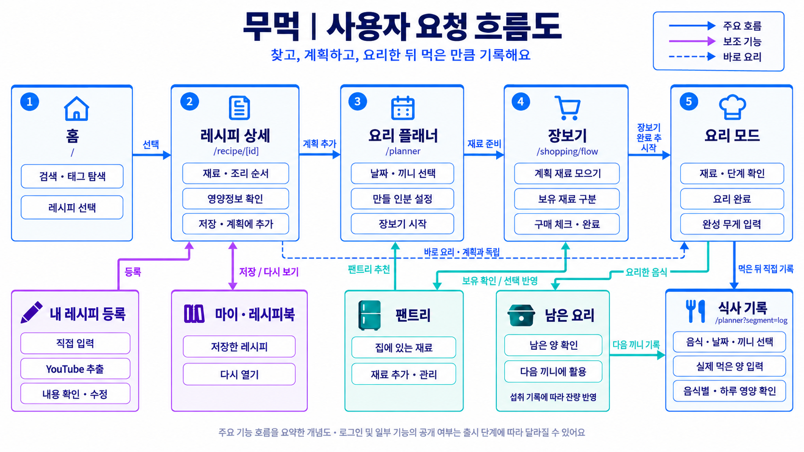
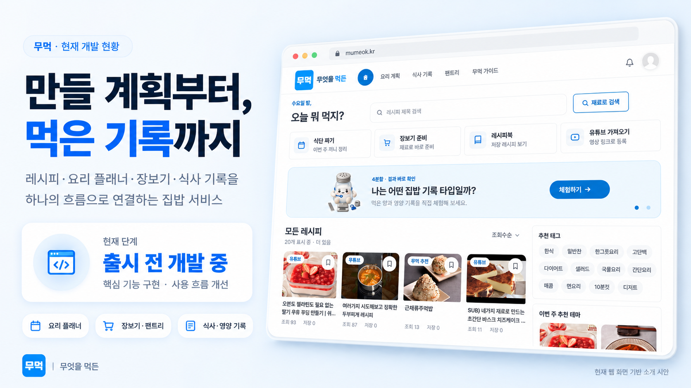
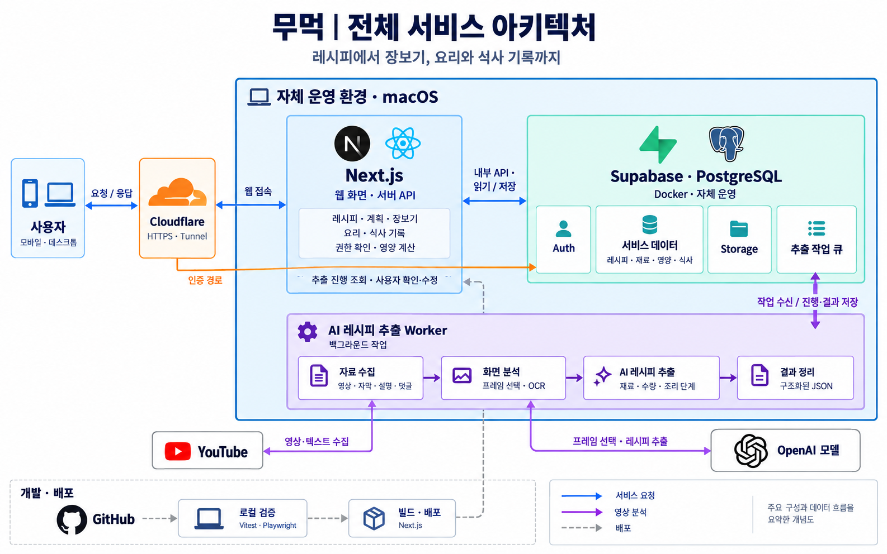

# 무먹 — 무엇을 먹든

**만들 계획부터, 먹은 기록까지.**

무먹은 집에서 요리하는 사람을 위해 **레시피 → 요리 계획 → 장보기 → 요리 → 식사 기록**을 연결하는 서비스입니다. 한 번 만든 음식을 여러 끼에 나눠 먹을 때도, 실제 먹은 양에 따른 영양정보를 확인할 수 있도록 개발하고 있습니다.

> **[작성 필요]** 서비스 체험 주소와 1분 시연 영상 링크를 넣어 주세요. 로그인 없이 이용할 수 있는 범위도 한 줄로 안내해 주세요.
>
> **[이미지 추가]** 이 자리에 ‘요리 계획·장보기·식사 기록’ 실제 모바일 화면 3장을 넣어 주세요. 예시 데이터라면 표시해 주세요.

## 해결하려는 문제

집밥을 준비하려면 레시피에서 재료를 찾아 장보기 목록에 옮기고, 집에 있는 재료를 따로 확인해야 합니다. 요리한 뒤에는 먹은 양을 다시 기록해야 합니다. 특히 여러 끼를 한 번에 만들면 **만든 양과 먹은 양이 달라 기록이 번거로워집니다.**

무먹은 이 과정의 반복 입력을 줄이고, 준비부터 섭취 기록까지 이어지는 경험을 만들고자 합니다. 초기 고객 가설은 직접 요리하면서 식사량과 영양도 관리하고 싶은 사람입니다.

> **[작성 필요]** 이 문제를 직접 겪은 계기와 첫 고객으로 생각하는 사람을 2~3문장으로 적어 주세요.

## 이렇게 사용합니다

김치볶음밥을 넉넉히 만들어 오늘과 내일 나눠 먹는 상황을 예로 들면 다음과 같습니다.

1. **레시피 선택:** 재료와 조리 순서를 확인합니다.
2. **요리 계획:** 만들 날짜·끼니·인분을 정합니다.
3. **장보기:** 필요한 재료를 모으고 집에 있는 재료를 구분합니다.
4. **요리 완료:** 완성된 음식의 전체 무게를 남깁니다.
5. **식사 기록:** 오늘 먹은 양을 입력하고, 다음 끼니에도 같은 요리를 이어서 기록합니다.

영양정보는 재료·수량과 연결된 식품 영양 데이터를 바탕으로 계산합니다. 완성 무게가 있는 요리는 먹은 무게의 비율을 반영하며, 정보가 부족하면 계산 가능한 범위만 표시합니다.

## 핵심 차별점

- **준비와 기록의 연결:** 레시피에서 정리한 정보를 계획·장보기·식사 기록에 재사용합니다.
- **만든 양과 먹은 양의 구분:** 여러 인분을 요리해도 실제 섭취량을 따로 기록하고 남은 음식을 이어 먹을 수 있습니다.
- **영상 레시피 활용:** YouTube 영상의 텍스트와 화면에서 재료·수량·조리 단계를 추출하고, 사용자가 확인·수정해 활용하는 기능을 개발하고 있습니다.

## 현재 개발 현황

출시 전 개발 단계이며, 저장소에는 다음 기능의 구현이 포함되어 있습니다.

| 영역 | 구현 범위 |
| --- | --- |
| 레시피 | 탐색·저장, YouTube 추출 처리 |
| 집밥 준비 | 날짜별 요리 계획, 장보기, 보유 재료 관리 |
| 요리와 기록 | 완성 무게·남은 양 관리, 섭취량과 영양 기록 |
| 수요 검증 | 설문·체험·베타 알림 신청 페이지 |

> **[확인 필요]** 제출 시점의 공개 기능·개발 중 기능을 구분하고, 실제 시연한 범위와 확인 날짜를 적어 주세요. 코드 구현 여부가 공개 이용 가능 여부를 의미하지는 않습니다.

## 고객 검증과 다음 목표

‘집에서 만든 음식의 섭취량 기록’과 ‘집밥 준비 과정의 연결’이라는 두 가치에 대한 반응을 확인하기 위해 설문·체험 흐름을 준비했습니다.

> **[작성 필요]** 실제 검증 기간, 참여자 수, 베타 신청 수, 고객 의견과 이를 반영해 바꾼 점을 적어 주세요. 미집계 항목은 생략하고, 알림 신청자와 실제 이용자는 구분해 주세요.

다음 목표는 고객이 계획부터 식사 기록까지 완료하는지, 다음 주에도 다시 사용하는지 확인하는 것입니다.

> **[작성 필요]** 지원을 통해 검증할 고객·목표·일정을 2~3문장으로 적어 주세요. 수익모델은 정해진 경우에만 쓰고, 아직 검증 전이라면 가설로 표시해 주세요.

## 기술과 개발자

- **화면·서버:** Next.js, React, TypeScript
- **데이터·인증:** PostgreSQL, 자체 운영 Supabase
- **검증 도구:** Vitest, Testing Library, Playwright

구현 시 개인 데이터의 소유권, 요리와 식사 기록의 상태 구분, 영양정보의 계산 근거를 중요하게 다룹니다.

> **[작성 필요]** 개발자 이름·담당 역할·공개 연락처와 대표 기능의 실제 검증 결과를 짧게 적어 주세요.

<!-- 제출 전 안내 문구를 채우거나 삭제하고, 지원서와 내용이 일치하는지 확인해 주세요. -->
