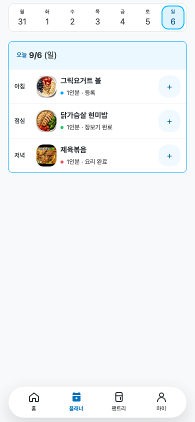
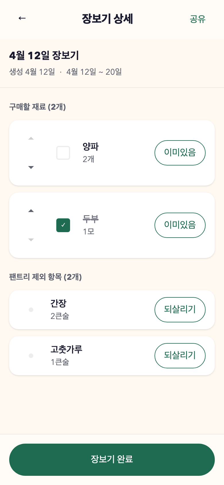
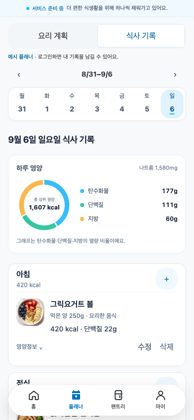

# 무먹 — 무엇을 먹든

**만들 계획부터, 먹은 기록까지.**

무먹은 집에서 요리하는 사람을 위해 **레시피 → 요리 계획 → 장보기 → 요리 → 식사 기록**을 연결하는 서비스입니다. 한 번 만든 음식을 여러 끼에 나눠 먹을 때도, 실제 먹은 양에 따른 영양정보를 확인할 수 있도록 개발하고 있습니다.

[서비스 둘러보기](https://app.mumeok.kr/about) · [소개·시연 영상](https://youtu.be/zBjyXvjKGik)

로그인 없이 서비스 소개와 예시 화면을 둘러볼 수 있습니다. 개인 계획·식사 기록 저장에는 로그인이 필요하며, 정식 베타 이용은 준비 중입니다.

| 요리 계획 | 장보기 | 식사 기록 |
| --- | --- | --- |
|  |  |  |

*개발 과정에서 캡처한 화면이며 예시 데이터가 포함되어 있습니다. 현재 화면과 일부 다를 수 있습니다.*

## 해결하려는 문제

집밥을 준비하려면 레시피에서 재료를 찾아 장보기 목록에 옮기고, 집에 있는 재료를 따로 확인해야 합니다. 요리한 뒤에는 먹은 양을 다시 기록해야 합니다. 특히 여러 끼를 한 번에 만들면 **만든 양과 먹은 양이 달라 기록이 번거로워집니다.**

무먹은 이 과정의 반복 입력을 줄이고, 준비부터 섭취 기록까지 이어지는 경험을 만들고자 합니다. 초기 고객 가설은 직접 요리하면서 식사량과 영양도 관리하고 싶은 사람입니다.

저희 부부는 함께 요리하고 칼로리를 기록하면서, 같은 재료와 양을 장보기 메모와 식단 앱에 반복 입력하는 불편을 겪었습니다. 첫 고객은 집에서 주기적으로 요리하며 영양을 기록하는 사람으로 가정하고, 계획·장보기에 불편을 느끼는 사람과도 반응을 비교하려 합니다.

## 이렇게 사용합니다

김치볶음밥을 넉넉히 만들어 오늘과 내일 나눠 먹는 상황을 예로 들면 다음과 같습니다.

1. **레시피 선택:** 재료와 조리 순서를 확인합니다.
2. **요리 계획:** 만들 날짜·끼니·인분을 정합니다.
3. **장보기:** 필요한 재료를 모으고 집에 있는 재료를 구분합니다.
4. **요리 완료:** 완성된 음식의 전체 무게를 남깁니다.
5. **식사 기록:** 오늘 먹은 양을 입력하고, 다음 끼니에도 같은 요리를 이어서 기록합니다.

영양정보는 재료·수량과 연결된 식품 영양 데이터를 바탕으로 계산합니다. 완성 무게가 있는 요리는 먹은 무게의 비율을 반영하며, 정보가 부족하면 계산 가능한 범위만 표시합니다.

## 핵심 차별점

- **준비와 기록의 연결:** 레시피에서 정리한 정보를 계획·장보기·식사 기록에 재사용합니다.
- **만든 양과 먹은 양의 구분:** 여러 인분을 요리해도 실제 섭취량을 따로 기록하고 남은 음식을 이어 먹을 수 있습니다.
- **영상 레시피 활용:** YouTube 영상의 텍스트와 화면에서 재료·수량·조리 단계를 추출하고, 사용자가 확인·수정해 활용하는 기능을 개발하고 있습니다.

## 현재 개발 현황

출시 전 개발 단계이며, 저장소에는 다음 기능의 구현이 포함되어 있습니다.

| 영역 | 구현 범위 |
| --- | --- |
| 레시피 | 탐색·저장, YouTube 추출 처리 |
| 집밥 준비 | 날짜별 요리 계획, 장보기, 보유 재료 관리 |
| 요리와 기록 | 완성 무게·남은 양 관리, 섭취량과 영양 기록 |
| 수요 검증 | 설문·체험·베타 알림 신청 페이지 |

2026-09-17 최종 지원서 기준, 위 핵심 흐름은 상당 부분 구현했고 베타 전 데이터·단위·입력 화면·로그인과 권한을 점검하고 있습니다. 공개된 서비스 소개·예시 화면과 개인 데이터를 저장하는 실제 이용은 구분합니다. **가족·룸메이트 공유와 팬트리 수량·중량 관리는 아직 미구현**입니다.

## 고객 검증과 다음 목표

‘집에서 만든 음식의 섭취량 기록’과 ‘집밥 준비 과정의 연결’이라는 두 가치에 대한 반응을 확인하기 위해 두 차례 광고·수요조사를 진행했습니다.

| 조사 | 유입 | 설문 완료 | 서비스 체험 | 베타 알림 신청 |
| --- | ---: | ---: | ---: | ---: |
| 집밥 식단 기록 | 136명 | 38명 | 26명 | 9건 · 유입 대비 6.6% |
| 집밥 준비 흐름 | 106명 | 24명 | 14명 | 6건 · 유입 대비 5.7% |

별도 기록형 광고의 1건을 더해 **알림 신청은 총 16건**이며, 실제 베타 이용자 수는 아닙니다. 기록 조사 응답자 38명 중 35명(92.1%)이 불편을 경험했고, 흐름 조사 신청 6건 중 5건은 계획·장보기 불편 집단에서 나왔습니다. 이를 바탕으로 다음 검증에서 기록 편의와 계획·장보기 연결을 비교하기로 했습니다. 소규모 표본이므로 반복 사용과 지불 의사는 후속 검증합니다.

다음 목표는 고객이 계획부터 식사 기록까지 완료하는지, 이후 다른 식사에서도 다시 사용하는지 확인하는 것입니다.

집밥을 주기적으로 요리·기록하는 고객을 초대해 첫 사용 완료, 재입력 횟수, 요리 빈도를 고려한 반복 사용을 확인하겠습니다. **핵심 기능 안정화 → 클로즈드 베타 → 공개 베타·유료 실험 → 정식 출시** 순서로 진행하되 결과에 따라 범위와 시점을 조정합니다. 수익모델은 YouTube 레시피 추출 한도를 늘리는 월 구독과 추가 이용 포인트를 가설로 검증하며, 가격은 아직 미정입니다.

## 기술과 개발자

- **화면·서버:** Next.js, React, TypeScript
- **데이터·인증:** PostgreSQL, 자체 운영 Supabase
- **검증 도구:** Vitest, Testing Library, Playwright

구현 시 개인 데이터의 소유권, 요리와 식사 기록의 상태 구분, 영양정보의 계산 근거를 중요하게 다룹니다.

- **공동 기획·개발:** [netsus](https://github.com/netsus) · 손현주. 부부가 약 6개월간 핵심 흐름을 함께 개발했습니다.
- **기술 검증:** [요리·식사 기록 통합 검증 기록](docs/workpacks/cooking-meal-log-cross-slice-release-qa/evidence/2026-08-25-stage6-frontend-closeout-result.json)에서 관련 테스트 42건 통과(2026-08-25 기준).
- **공개 문의:** [GitHub Issues](https://github.com/netsus/homecook/issues).
