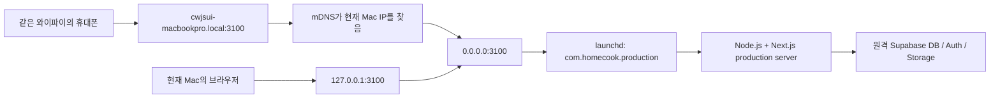

# 현재 Mac production 운영 계획

상태: **운영 중 (신뢰하는 LAN production)**
최종 갱신: 2026-07-31 KST
서비스: `homecook` Next.js 앱
현재 휴대폰 접속 주소: `http://cwjsui-macbookpro.local:3100`
서버 바인딩: `0.0.0.0:3100`
자동 실행: macOS `launchd`의 `com.homecook.production`

## 딱 한 줄 요약

현재 Mac에서 production build가 `launchd`로 상시 실행 중이며, 같은 와이파이의 휴대폰에서 소셜 로그인까지 사용할 수 있다.

> `0.0.0.0`은 서버가 Mac의 모든 네트워크 연결에서 요청을 받는다는 설정값이다. 브라우저에는 `0.0.0.0`이나 숫자 IP를 직접 입력하지 말고, 소셜 로그인이 가능한 고정 `.local` 주소를 사용한다.

## 지금 바로 확인하는 방법

Mac과 휴대폰을 같은 와이파이에 연결한 뒤, 휴대폰 브라우저에서 아래 주소를 연다.

```text
http://cwjsui-macbookpro.local:3100
```

`.local` 주소는 같은 와이파이에서 Mac 이름을 찾아 주는 mDNS(로컬 네트워크 이름 찾기) 주소다. 공유기가 Mac의 숫자 IP를 바꿔도 접속 주소와 로그인 callback을 다시 만들 필요가 없다. 브라우저 요청은 이 Mac의 앱 서버가 받고, 현재 로그인·DB·Storage의 실제 데이터 권한은 원격 Supabase를 사용한다.

현재 숫자 IP가 꼭 필요한 기기에서는 `http://192-168-0-11.sslip.io:3100`도 사용할 수 있다. 이 보조 주소는 Mac의 IP가 바뀌면 함께 바뀌므로, 평소에는 `.local` 주소를 사용한다.

Mac 자체 브라우저에서는 `http://127.0.0.1:3100`도 상태 확인용으로 사용할 수 있다. 소셜 로그인을 시험할 때는 휴대폰과 같은 `.local` 주소를 사용한다. 서비스 상태를 확인하려면 다음 명령을 실행한다.

```bash
./scripts/run-local-mac-production.sh status
```

정상 예시:

```text
loaded: yes
running: yes
state: running
pid: 29719
```

`pid`는 실행 중인 프로그램 번호라서 재시작할 때마다 바뀌는 것이 정상이다.

## 현재 운영 상태

| 항목 | 현재 값 | 초보자용 설명 |
| --- | --- | --- |
| 실행 모드 | production build | 개발용 서버가 아니라 최적화된 운영 build다. |
| 서버 바인딩 | `0.0.0.0` | Mac의 모든 네트워크 연결에서 요청을 받는다. |
| 접속 범위 | 신뢰하는 같은 LAN | 현재 같은 와이파이의 휴대폰에서 접속할 수 있다. |
| 브라우저 주소 | `cwjsui-macbookpro.local:3100` | Mac의 숫자 IP가 바뀌어도 유지되는 LAN 이름이며 Supabase가 허용한다. |
| 포트 | `3100` | 기존 개발 서버의 `3000`과 충돌하지 않는다. |
| 프로세스 관리자 | `launchd` | Mac 로그인 시 켜고, 비정상 종료 시 다시 시작한다. |
| 서비스 이름 | `com.homecook.production` | `launchd`가 서비스를 구분하는 이름이다. |
| 배포 커밋 | `61361b5a` | 실제 운영 build를 만든 코드 버전이다. |
| build ID | `m1iMdqs3EFa6gICnLiS9P` | Next.js가 운영 build를 구분하는 번호다. |
| 현재 Data 권한 | `remote` | Auth뿐 아니라 DB·Storage도 아직 원격 Supabase가 실제 데이터를 처리한다. |
| 로컬 DB/Storage | 설치·healthy, 전환 전 | PostgreSQL과 Storage는 켜져 있지만 gateway가 꺼져 있어 앱 데이터가 로컬로 잘못 전환되지 않게 막혀 있다. |
| 환경 파일 | `.env.production.local` | 허용된 production 키만 들어가며 권한은 `600`이다. |
| 표준 오류 로그 | `~/.homecook/logs/homecook-production.err.log` | 서버 오류를 확인하는 파일이다. |
| 잠자기 방지 | Amphetamine 꺼짐 | Mac이 잠들면 휴대폰 접속도 중단된다. |

## production이란 무엇인가

| 구분 | 명령 | 용도 |
| --- | --- | --- |
| 개발 서버 | `pnpm dev` | 코드를 고치면서 빠르게 확인한다. |
| production build | `./scripts/run-local-mac-production.sh build` | 현재 Mac에서 Node 경로를 자동으로 찾아 운영용 코드로 컴파일하고 최적화한다. |
| production server | `pnpm start` | build 결과물을 실행한다. |
| 현재 운영 방식 | 운영 래퍼의 `build` 후 `install` | 새 build를 만든 뒤 품질 검사, `launchd` 등록, HTTP 확인을 수행한다. |

`pnpm dev`가 연습용 주방이라면, production build는 손님에게 내기 전에 같은 레시피를 실제 운영 주방에서 다시 만드는 과정이다.

## 구성도



## 해결한 근본 원인

### 1. 원격 DB가 코드보다 뒤처져 있었다

증상:

- 홈의 레시피 API가 PostgreSQL `42703` 오류로 실패했다.
- 원격 DB에 `recipes.visibility`를 포함한 공식 schema가 없었다.
- 로컬 build는 성공해도 실제 데이터 요청은 실패했다.

해결:

- 적용 전 schema와 데이터를 각각 SQL dump로 백업했다.
- 원격에서 빠진 공식 migration 33개를 순서대로 적용했다.
- 이번 작업에서 발견한 보안·호환성 migration도 추가 적용했다.
- 마지막 migration 목록에서 로컬과 원격이 일치함을 확인했다.

백업:

```text
/tmp/homecook-pre-migration-20260729.sql
/tmp/homecook-pre-migration-data-20260729.sql
```

### 2. recipe visibility guard가 `public` schema를 읽지 못했다

증상:

- guard 함수 소유자는 필요한 테이블 `SELECT` 권한이 있었지만 `public` schema `USAGE` 권한이 없었다.
- 함수가 schema 안의 테이블 이름을 해석하지 못했다.

해결:

- `USAGE`만 허용하고 `CREATE`는 계속 금지하는 migration을 추가했다.
- guard 소유자는 로그인, superuser, RLS 우회, DB 생성 권한이 모두 없다.
- 익명·로그인 역할은 함수 실행만 가능하고 `service_role`은 직접 실행할 수 없다.

### 3. Supabase hosted PostgreSQL에서 검색 함수 생성이 거부됐다

증상:

- 검색 함수가 `pg_trgm.word_similarity_threshold`를 함수 안에서 바꾸려 했다.
- Supabase hosted 환경은 이 설정 변경을 허용하지 않아 migration이 `42501`로 실패했다.

해결:

- 제한된 설정 변경과 `<%` 연산자 의존을 제거했다.
- 기존 short-ngram GIN index로 후보를 먼저 줄인 뒤 `word_similarity(...) > 0.3`을 명시적으로 계산한다.
- 검색 의미는 유지하면서 index를 사용하도록 만들었다.

검증 결과:

```text
Recall@20: 1.0000
Precision@20: 0.9211
DB p95: 43.30ms
Route p95: 16.79ms
```

### 4. Supabase 기본 권한과 보안 검증기의 가정이 달랐다

증상:

- 익명·로그인 역할에 레시피 관련 직접 쓰기 권한이 넓게 남아 있었다.
- `tags`는 의도적으로 일부 열만 읽게 했는데 검증기는 전체 테이블 `SELECT`가 없다고 오판했다.
- PostgreSQL 17의 제한형 guard 관리 멤버십을 일반 멤버십 누수로 오판했다.

해결:

- 레시피·단계·재료·태그 관련 익명/로그인 직접 쓰기 권한을 table과 column 수준에서 모두 회수했다.
- `service_role`의 `recipe_tags` 직접 쓰기도 회수하고 공식 함수만 사용하게 했다.
- `tags`는 공개 허용 열 7개를 각각 검사하도록 검증기를 수정했다.
- Supabase의 guard 관리 멤버십은 `INHERIT=false`, `SET=false`, 안전한 grantor인 경우 1개만 허용한다.
- 기존 공개 이미지 업로드 호환성은 한 릴리스 동안 유지하되, 비공개 bucket 쓰기 policy는 0개임을 검증한다.

원격 read-only 검증 결과:

```text
schema_ready: true
role_matrix_ok: true
reader_missing_select_count: 0
reader_table_mutation_count: 0
reader_column_mutation_count: 0
service_role_tag_table_mutation_count: 0
service_role_tag_column_mutation_count: 0
guard_unsafe_membership_count: 0
storage_mutation_policy_count: 3
unallowlisted_storage_mutation_policy_count: 0
remote_writes: 0
```

### 5. 최신 pnpm 설정 위치와 Mac의 Node 경로가 달랐다

증상:

- 최신 pnpm은 project 설정을 `pnpm-workspace.yaml`에서 읽는다.
- 현재 작업 셸에는 시스템 `node`가 없어 설치 스크립트와 관리 명령이 실패했다.
- 검토되지 않은 build script는 pnpm이 fail-closed 방식으로 차단했다.

해결:

- 보안 override와 patch 설정을 `pnpm-workspace.yaml`로 옮겼다.
- build script는 `esbuild@0.28.1`, `unrs-resolver@1.11.1` 두 정확한 버전만 허용했다.
- production 관리 래퍼가 시스템 Node를 먼저 찾고, 없으면 현재 Mac의 Codex Node를 찾는다.
- 운영 래퍼의 `build`, `status`, `restart`, `install`, `uninstall`이 Node나 pnpm 경로를 직접 입력하지 않아도 동작한다.

### 6. LAN에서는 CSS와 JavaScript가 HTTPS로 잘못 바뀌었다

증상:

- LAN 홈 문서 자체는 HTTP `200`이었지만 화면은 기본 HTML처럼 깨져 보였다.
- production CSP의 `upgrade-insecure-requests`가 CSS, JavaScript, 이미지 주소를 `https://192.168.0.36:3100`으로 바꿨다.
- 현재 LAN 서버에는 HTTPS 인증서가 없어서 모든 핵심 자산이 `ERR_SSL_PROTOCOL_ERROR`로 실패했다.

해결:

- `HOMECOOK_PRODUCTION_EXPOSURE=lan`과 `local-only`에서는 HTTPS 강제 업그레이드를 제외했다.
- 실제 public production에서는 기존 `upgrade-insecure-requests` 보호를 유지한다.
- 세 모드의 경계를 Vitest로 고정하고 production을 새로 빌드·재설치했다.
- Playwright에서 LAN 모바일 홈이 정상 loopback 기준과 픽셀 단위로 완전히 같음을 확인했다.

### 7. 소셜 로그인 후 Vercel 또는 `0.0.0.0`으로 이동했다

증상:

- LAN IP에서 Google, 네이버, 카카오 로그인을 시작하면 완료 후 Vercel로 이동했다.
- Supabase 허용 목록에 `192.168.0.36` 콜백을 넣어도 현상이 계속됐다.
- Supabase를 통과한 뒤 앱이 서버 바인드 주소인 `0.0.0.0`으로 이동하는 경우도 있었다.
- 이후 공유기가 Mac IP를 `192.168.0.36`에서 `192.168.0.11`로 바꾸면서 기존 `sslip.io` 주소가 응답하지 않았다.

근본 원인:

- Supabase Auth는 보안상 IP 주소 리디렉션을 루프백 주소에만 허용한다. `192.168.x.x` 같은 사설 IP는 허용 목록에 있어도 거부하고 Site URL인 Vercel로 되돌린다.
- Next.js route handler의 `request.url`에는 외부 주소 대신 서버 바인드 주소 `0.0.0.0`이 들어올 수 있었다.
- `sslip.io` 주소에는 숫자 IP가 포함되므로 DHCP(공유기가 IP를 자동 배정하는 기능)가 새 IP를 주면 예전 주소도 끊긴다.

해결:

- 운영 기준 주소를 IP와 분리된 `http://cwjsui-macbookpro.local:3100`으로 고정했다.
- Supabase의 기본 `Site URL`도 같은 `.local` 주소로 바꿔 `redirectTo` 누락이나 허용 목록 불일치 때 Vercel로 되돌아가는 재발 경로를 막았다.
- Supabase Redirect URLs에 `http://cwjsui-macbookpro.local:3100/**`와 현재 IP용 `http://192-168-0-11.sslip.io:3100/**`를 등록했다.
- `.env.production.local`의 `NEXT_PUBLIC_APP_URL`과 `NEXT_PUBLIC_SITE_URL`도 고정 `.local` 주소로 맞춘 뒤 production을 다시 빌드하고 재시작했다.
- 네이버 개발자센터 HomeCook 앱의 서비스 URL도 고정 `.local` 주소로 변경하고, 공급자 callback은 원격 Supabase 주소로 유지했다.
- Google과 네이버의 공급자 callback, 그리고 카카오가 실제 사용하는 callback은 모두 Supabase의 `https://vfubnhtawezmheylfhsv.supabase.co/auth/v1/callback`과 일치한다.
- 앱의 로그인 callback, 계정연결 callback, 로그아웃은 신뢰하는 `NEXT_PUBLIC_APP_URL`을 사용하도록 수정했다.
- 2026-07-30 Chrome에서 로그아웃 후 `조해피` Google 계정으로 다시 로그인해 Vercel이 아닌 `http://cwjsui-macbookpro.local:3100/mypage`로 돌아오는 것을 확인했다.
- 네이버도 실제 로그인해 같은 `.local` 마이페이지로 복귀했다.
- 카카오는 등록 오류 없이 카카오 로그인 화면까지 진입했고, OAuth 요청의 `redirect_to`는 `.local` 앱 callback, `redirect_uri`는 원격 Supabase callback임을 확인했다. Chrome에 카카오 로그인 세션이 없어 비밀번호 입력 이후의 최종 왕복은 이번 재검증에서 수행하지 않았다.

### 8. YouTube 추출은 분석 후 초안 저장에서 실패했고, 재시도도 멈췄다

증상:

- 실제 영상 분석은 끝났지만 `추출 세션을 저장하지 못했어요.`가 표시됐다.
- 분석기 준비가 한 번 실패한 뒤 `다시 시도`를 누르면 화면만 분석 중으로 바뀌고 API는 다시 호출되지 않았다.

근본 원인:

- 원격 RLS(행 단위 권한)는 사용자가 자기 추출 세션을 읽는 것은 허용하지만 서버 분석 파이프라인의 새 초안 `INSERT`는 허용하지 않는다.
- 기존의 넓은 service-role fallback을 제거하면서 필요한 서버 쓰기 권한도 함께 사라졌다.
- 재시도 효과는 화면 단계가 바뀔 때만 실행됐는데, 오류 화면과 재시도 화면이 모두 같은 `extracting` 단계여서 두 번째 요청을 감지하지 못했다.

해결:

- 사용자 인증과 부모 세션 소유권 검사는 계속 사용자 RLS client로 수행한다.
- 검사가 끝난 뒤 YouTube 추출에 필요한 정확한 테이블만 허용하는 scoped internal client를 사용한다.
- `youtube_extraction_sessions`는 `select/insert`만 허용하고 `update/upsert/delete`와 gateway `PATCH`는 코드와 테스트로 차단했다.
- 재시도 횟수를 별도 상태로 관리해 같은 화면 단계에서도 실제 API 요청이 다시 실행되게 했다.
- 후보 production build에서 `FNhCQKrey6Y`를 실제 분석해 `대패 삼겹살 감자탕`, 재료 15개, 조리 8단계가 검토 화면에 표시되는 것을 확인했다.
- 새 DB 초안은 `youtube-i031-direct-v1`, `status=draft`, `session_kind=single`로 저장됐다.

## 완료한 실행 계획

1. [x] 공식 문서와 저장소 운영 규칙 확인
2. [x] 별도 worktree와 작업 branch로 사용자 변경 보호
3. [x] 원격 DB schema/data 백업
4. [x] 원격 pending migration 적용
5. [x] hosted PostgreSQL 검색 호환성 수정
6. [x] recipe visibility 권한과 guard 경계 수정
7. [x] production 전용 환경 파일 생성 및 `600` 권한 적용
8. [x] dependency install, lint, typecheck, 전체 test, production build
9. [x] production 데이터 품질 게이트 통과
10. [x] `launchd` 설치 및 HTTP readiness 확인
11. [x] 데스크톱·모바일 홈과 레시피 상세 확인
12. [x] `launchd` 재시작 후 새 PID와 HTTP/API `200` 확인
13. [x] 서버를 `0.0.0.0`으로 바인딩하고 LAN 주소 응답 확인
14. [x] LAN CSP 자산 로딩 수정과 Playwright 반응형 검증
15. [x] Supabase와 공급자 callback 설정 수정
16. [x] Google·네이버·카카오 실제 로그인 왕복 검증
17. [x] Mac IP 변경 후 `.local` 기준 주소 전환, Google·네이버 실제 재로그인, 카카오 callback 계약 검증
18. [x] YouTube 추출 권한 최소화, 재시도 무한 대기 수정, 실제 영상 추출·초안 저장 확인
19. [x] 검증된 `61361b5a` build를 롤백 가능하게 원자 배포
20. [ ] 실제 Mac 재부팅 확인

실제 재부팅은 현재 사용자 세션을 강제로 끊기 때문에 수행하지 않았다. 대신 같은 `launchd` 경로의 강제 재시작과 자동 HTTP 준비 검사를 통과했다.

## 최종 검증 결과

| 검증 | 결과 |
| --- | --- |
| `pnpm install --frozen-lockfile` | 통과 |
| `pnpm lint` | 통과 |
| `pnpm typecheck` | 통과 |
| 전체 Vitest | 467 files passed, 4,769 tests passed |
| recipe visibility 실제 PostgreSQL | 75 tests passed |
| prepared food 실제 PostgreSQL | 32 tests passed |
| `pnpm build` | 74 static pages 생성, build 통과 |
| production 데이터 품질 | 통과 |
| 원격 검색 검증 | 통과, remote writes 0 |
| 원격 recipe 권한 검증 | 통과, remote writes 0 |
| 홈 화면 | desktop/mobile 통과 |
| 레시피 상세 | desktop/mobile 통과 |
| 깨진 이미지 | 0 |
| 가로 화면 넘침 | 0 |
| 브라우저 warning/error | 0 |
| 재시작 후 홈/API | HTTP `200` |
| LAN 바인딩 | `TCP *:3100` |
| LAN IP 직접 상태 확인 | 현재 IP `192.168.0.11`, `TCP *:3100` 응답 확인 |
| 기본 휴대폰 주소 | `http://cwjsui-macbookpro.local:3100`에서 HTTP `200` |
| 현재 IP 보조 주소 | `http://192-168-0-11.sslip.io:3100`에서 HTTP `200` |
| 예전 IP 보조 주소 | `http://192-168-0-36.sslip.io:3100` 연결 시간 초과; 현재 Mac IP가 아니므로 정상 |
| 운영 build | commit `61361b5a`, build ID `m1iMdqs3EFa6gICnLiS9P`, PID `41038`, `TCP *:3100` |
| Google 로그인 | 로그아웃 후 `조해피` 계정 로그인, `.local` 마이페이지 복귀, Vercel 이동 없음 |
| 네이버 로그인 | 실제 로그인 후 `.local` 마이페이지 복귀 |
| 카카오 로그인 | 카카오 로그인 화면 진입, `.local` 앱 복귀 주소와 원격 Supabase callback 확인; 현재 주소의 최종 로그인 왕복은 미실행 |
| CSP 회귀 테스트 | LAN·local-only는 HTTPS 강제 없음, public은 유지 |
| Playwright 주요 경로 | guest 9개 경로, HTTP `200`, 실제 실패 요청·console/page error `0` |
| Playwright 화면 폭 | 모바일 `320/390px`, 데스크톱 `1440px`, 가로 넘침·깨진 이미지 `0` |
| 모바일 픽셀 비교 | LAN과 정상 loopback 기준 차이 `0/45,383,520 bytes` |
| YouTube 실제 추출 | 후보 production에서 `FNhCQKrey6Y` 분석, `대패 삼겹살 감자탕`·재료 15개·조리 8단계 검토 화면 및 DB 초안 저장 확인 |
| YouTube 권한 | 사용자 RLS 소유권 확인 후 exact scoped internal client 사용, session `PATCH/update/upsert/delete` 차단 |
| YouTube 재시도 | 수정 전 두 번째 API 호출 0회 재현, 수정 후 2회 호출과 검토 화면 전환 회귀 테스트 통과 |
| 현재 Data authority | `remote`; 로컬 PostgreSQL·Storage는 healthy지만 gateway는 OFF/blocked라 아직 앱 데이터 권한으로 사용하지 않음 |

## 운영 명령

### 상태 확인

서비스가 켜져 있는지 확인한다.

```bash
./scripts/run-local-mac-production.sh status
```

### 재시작

새 build를 반영하거나 일시 오류를 복구한다.

```bash
./scripts/run-local-mac-production.sh restart
```

### 오류 로그 확인

서버가 켜지지 않거나 화면에서 `500`이 보일 때 확인한다.

```bash
tail -n 100 ~/.homecook/logs/homecook-production.err.log
```

### 다시 설치

코드로 새 build를 만든 뒤, 품질 검사를 거쳐 `launchd`에 등록한다.

```bash
./scripts/run-local-mac-production.sh build
./scripts/run-local-mac-production.sh install
```

### 운영 중지와 등록 해제

현재 Mac에서 더 이상 자동 실행하지 않을 때 사용한다.

```bash
./scripts/run-local-mac-production.sh uninstall
```

## 장애 확인 순서

1. 브라우저에서 `http://127.0.0.1:3100`을 다시 연다.
2. `./scripts/run-local-mac-production.sh status`에서 `running: yes`인지 본다.
3. `./scripts/run-local-mac-production.sh restart`를 실행한다.
4. 오류가 계속되면 `~/.homecook/logs/homecook-production.err.log`의 마지막 100줄을 본다.
5. 코드를 바꿨다면 운영 래퍼의 `build` 후 `install`을 실행한다.
6. 환경 변수만 바꿨다면 운영 래퍼의 `install`을 다시 실행한다.

HTTP만 빠르게 확인하려면 다음 명령을 쓴다.

```bash
curl -I http://127.0.0.1:3100
curl -I http://cwjsui-macbookpro.local:3100
curl -I http://192-168-0-11.sslip.io:3100
curl -I http://127.0.0.1:3100/manifest.webmanifest
curl -I 'http://127.0.0.1:3100/api/v1/recipes?limit=1'
```

## 안전선

- `.env.production.local`과 secret 값은 Git에 올리지 않는다.
- `SUPABASE_SERVICE_ROLE_KEY`에 `NEXT_PUBLIC_` 접두사를 붙이지 않는다.
- 공유기에서 포트 `3100`을 포트 포워딩하지 않는다.
- 신뢰할 수 없는 공용 와이파이에서는 production 서비스를 실행하지 않는다.
- 평소에는 IP가 바뀌어도 유지되는 `cwjsui-macbookpro.local`을 사용한다.
- `.local` 이름 찾기를 지원하지 않는 기기에서만 현재 IP 기반 `sslip.io` 보조 주소를 사용하고, IP가 바뀌면 이 보조 주소와 Supabase 허용 목록만 갱신한다.
- `HOMECOOK_DATA_AUTHORITY=remote`를 유지한다. 로컬 gateway가 준비되지 않은 상태에서 임의로 `local`로 바꾸지 않는다.
- public internet 공개 전에는 HTTPS, 도메인, OAuth callback, 방화벽, 법률 문서 검토가 필요하다.
- Mac이 꺼지거나 잠들면 서비스도 멈춘다. 현재 Amphetamine은 꺼져 있다.
- 원격 migration 전 백업 파일은 검증이 끝날 때까지 삭제하지 않는다.

## 이번 범위 밖

다음 항목은 현재 LAN production과 별도 계획이 필요하다.

- 인터넷 사용자가 접속하는 public 배포
- 도메인과 HTTPS 인증서
- reverse proxy 또는 tunnel
- 24시간 장애 감시와 외부 알림
- 실제 Mac 재부팅 smoke test
- 원격 Auth + 로컬 DB/Storage의 최종 Data authority 전환

## 다음 단계

LAN production, 소셜 로그인, YouTube 추출 복구는 완료됐다. 로컬 DB/Storage 전환 또는 외부 사용자 공개는 다음 순서로 별도 작업한다.

1. 공개 범위와 예상 사용자를 결정한다.
2. 도메인과 HTTPS 방식을 정한다.
3. OAuth callback과 보안 헤더를 공개 주소 기준으로 갱신한다.
4. 외부 heartbeat와 장애 알림을 붙인다.
5. LAN 또는 public exposure 전용 보안 검토를 통과한다.

## 참고한 공식 문서

- [Supabase database migrations](https://supabase.com/docs/guides/deployment/database-migrations)
- [Supabase custom Postgres configuration](https://supabase.com/docs/guides/database/custom-postgres-config)
- [Supabase Auth redirect URLs](https://supabase.com/docs/guides/auth/redirect-urls)
- [Supabase Google login](https://supabase.com/docs/guides/auth/social-login/auth-google)
- [Supabase Kakao login](https://supabase.com/docs/guides/auth/social-login/auth-kakao)
- [Supabase custom OAuth providers](https://supabase.com/docs/guides/auth/custom-oauth-providers)
- [PostgreSQL pg_trgm](https://www.postgresql.org/docs/current/pgtrgm.html)
- [pnpm project settings](https://pnpm.io/settings)
