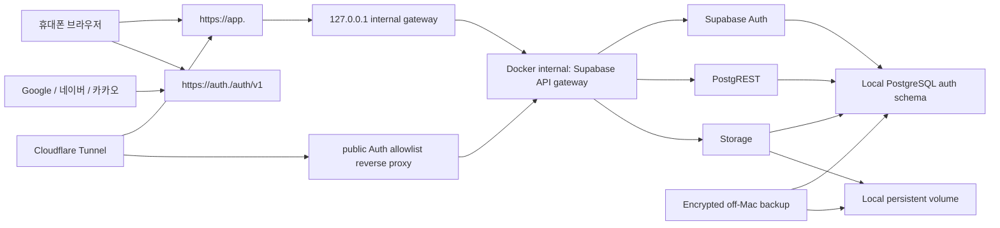

# 전체 로컬 Supabase Auth + DB + Storage production 전환 계획

상태: **Stage -1 계약 산출물 작성 및 독립 검토 PASS / docs PR 병합 완료 / 구현하지 않음**
작성일: **2026-07-31 KST**
최종 갱신: **2026-08-01 KST**
대상 서비스: `homecook`
목표 구조: **현재 Mac의 self-hosted Supabase Auth + DB + Storage + 기존 RLS**
현재 운영 구조: **원격 Supabase Auth + 원격 DB/Storage, Mac Next.js `0.0.0.0:3100`**
선행 계획: `docs/engineering/hybrid-supabase-production-plan.md`

## 딱 한 줄 요약

Google·네이버·카카오 자체 로그인 화면을 새로 만들지 않고, 검증된 Supabase Auth를 현재 Mac에 self-hosting하여 로그인·세션·DB·이미지를 한 로컬 Supabase에 모으되, 도메인·HTTPS·백업·보안 업데이트·실제 OAuth 검증이 끝날 때까지 원격 Supabase를 현재 운영 권위로 유지한다.

> 비유: 지금은 신분증 발급소는 원격 Supabase, 개인 보관함은 Mac으로 나누려는 공사 중이다. 새 계획은 신분증 발급소와 보관함을 같은 Mac 건물에 두되, 신분증 발급 프로그램 자체는 직접 만들지 않고 검증된 Supabase Auth를 설치하는 것이다.

## 1. 결정 요약

### 선택

- 원격 Supabase Auth를 장기 운영 권위로 유지하지 않는다.
- OAuth·세션 서버를 Homecook 코드로 직접 구현하지 않는다.
- Supabase의 self-hosted Auth 서비스(GoTrue)를 현재 Mac의 Docker runtime에 추가한다.
- Google·Kakao는 self-hosted Supabase Auth provider로, Naver는 기존 식별자 `custom:naver`를 유지할 수 있는 Custom OAuth/OIDC provider로 격리 검증한다.
- Auth가 발급한 로컬 JWT의 `sub`를 기존 `auth.uid()` RLS에 그대로 사용한다.
- 브라우저는 공개 Auth endpoint만 호출한다. DB, PostgREST, Storage, Studio, PostgreSQL은 인터넷과 LAN에 직접 공개하지 않는다.
- 첫 로컬 운영 Auth state mutation 전까지 현재 원격 Supabase가 유일한 production authority다.

### 아직 하지 않는 것

- 이 문서 작성만으로 환경변수, Docker, OAuth provider console을 변경하지 않는다.
- 현재 실행 중인 원격 Supabase 프로젝트나 데이터를 삭제하지 않는다.
- 현재 19 MB 로컬 검증 DB를 운영 원본으로 승격하지 않는다.
- `HOMECOOK_DATA_AUTHORITY=local`만 단독으로 변경하지 않는다.
- Google·네이버·카카오 OAuth 또는 세션 프로토콜을 직접 구현하지 않는다.

## 2. 왜 하이브리드 계획을 바꾸는가

현재 공식 계약은 원격 Auth와 로컬 Data를 연결하기 위해 다음 경계를 요구한다.

- 원격 issuer/JWKS 고정: `lib/supabase/auth-env.ts:41-97`
- 원격 Auth를 Data authority와 별도로 선택: `lib/supabase/data-env.ts:18-85`
- 원격 `/auth/v1/user` liveness, HMAC attestation, identity epoch 검증: `lib/server/hybrid-auth/gateway.ts:129-227`
- callback 뒤 local mirror/session authority 기록: `app/auth/callback/route.ts:231-262`
- 원격 identity mirror: `supabase/migrations/20260730090000_hybrid_auth_remote_identity_epoch_mirror.sql:10-96`
- 과거 hybrid 계약의 local `auth.users=0` invariant: `docs/db설계-v1.3.30.md`
- Docker gateway가 remote Auth와 local PostgREST/Storage를 연결: `infra/hybrid-supabase/docker-compose.production.yml:136-180`

이 장치들은 원격 Auth와 로컬 DB가 서로 다른 시스템이기 때문에 필요하다. Auth까지 같은 local Supabase로 이동하면 remote JWKS sync, remote identity mirror, two-system barrier, remote liveness outage 경계를 제거할 수 있다. 다만 Supabase sign-out 뒤 access token은 `exp`까지 서명상 유효할 수 있으므로, callback/refresh 때 결합하고 logout/delete/quarantine/identity replacement 때 즉시 revoke하는 **app-owned local session authority binding**은 최소 14일 안정화까지 유지한다.

단, local Auth가 자동으로 안전해지는 것은 아니다. Supabase 공식 문서에 따라 self-hosting 운영자는 보안 패치, 서버 유지관리, 백업, 재난 복구, 모니터링과 uptime을 직접 책임진다.

## 3. 현재 확인된 사실

| 항목 | 현재 확인값 | 계획에 미치는 영향 |
| --- | --- | --- |
| production 앱 | launchd `com.homecook.production`, `0.0.0.0:3100` | 앱 프로세스는 계속 재사용한다. |
| 현재 Data authority | `HOMECOOK_DATA_AUTHORITY=remote` | 아직 local write가 없어 아키텍처 변경 시점이 안전하다. |
| 현재 Auth | 원격 hosted Supabase project(식별자는 repo 밖 운영 evidence에만 보관) | migration source와 rollback source로 유지한다. |
| local runtime | PostgreSQL/PostgREST/Storage 실행, gateway `BLOCKED/DEGRADED` | 운영 연결 전 검증 기반으로 재사용할 수 있다. |
| local 검증 DB | 약 19 MB, `public.users=5`, `recipes=44`, `storage.objects=1`, `auth.users=0` | 완전한 운영 원본이 아니므로 fresh restore 대상이다. |
| browser Auth | Auth-only facade | 직접 DB/Storage 브라우저 접근을 계속 차단할 수 있다. |
| OAuth callback | code 교환, provider/email 검증, account lifecycle 처리 | route shape는 재사용하고 hybrid bootstrap만 교체한다. |
| provider linking | `linkIdentity()`와 별도 callback 존재 | Google/Naver/Kakao 조합 회귀 테스트가 필수다. |

코드 근거:

- browser Auth-only facade: `lib/supabase/browser.ts:1-69`
- callback code exchange: `app/auth/callback/route.ts:159-189`
- provider/email 검증: `app/auth/callback/route.ts:191-229`
- provider linking: `components/auth/linked-auth-providers.tsx:51-63`
- 현재 hybrid runtime service: `infra/hybrid-supabase/docker-compose.production.yml:3-195`

## 4. 요구사항

### 기능 요구사항

1. Google·네이버·카카오 로그인과 계정 연결 UX를 유지한다.
2. 로그인 후 기존 public API, response wrapper와 error shape를 바꾸지 않는다.
3. 사용자 UUID를 보존해 기존 레시피·플래너·장보기·레시피북 소유권이 바뀌지 않게 한다.
4. 모든 기존 RLS에서 `auth.uid()` 의미를 유지한다.
5. 로그아웃, 탈퇴, 재가입, identity replacement 뒤 이전 세션은 개인 DB와 Storage를 쓸 수 없어야 한다.
6. 기존 원격 session cookie와 JWT는 cutover에서 명시적으로 폐기하고 사용자가 한 번 다시 로그인하게 한다.

### 보안 요구사항

1. production에서는 소셜 로그인만 허용하고 email/password, OTP, anonymous signup은 비활성화한다. local 개발 로그인은 production flag로 계속 차단한다.
2. OAuth provider secret, JWT signing private key, Supabase secret key, refresh token을 Git·HTML·로그에 남기지 않는다.
3. Auth signing은 ES256 asymmetric key를 사용하고 PostgREST와 Storage는 public JWKS로 검증한다.
4. browser user path에서 service-role fallback을 금지한다.
5. public internet에는 allowlisted `/auth/v1/*`만 노출한다. `/rest/v1`, `/storage/v1`, PostgreSQL, Studio, Docker socket은 외부에서 차단한다.
6. Cloudflare와 reverse proxy에서 Auth response를 캐시하지 않는다.
7. 로그인·token endpoint에 rate limit을 적용하고 원래 client IP가 Auth까지 안전하게 전달되는지 검증한다.
8. Auth 이미지와 설정은 exact version/digest로 pin하고 보안 업데이트 적용 절차를 문서화한다.

### 운영 요구사항

1. Mac 재부팅 후 PostgreSQL → Auth → PostgREST/Storage → gateway → Next.js 순서로 복구한다.
2. DB의 `auth`, `public`, `storage` schema와 Storage payload를 함께 암호화 백업한다.
3. JWT signing key와 API key는 데이터 백업과 별도 암호화 경로에 보관한다.
4. RPO 최대 24시간, RTO 4시간 목표를 유지한다.
5. Mac 밖 backup restore를 실제로 통과하기 전 cutover하지 않는다.
6. 첫 local production session 발급·identity link·user-scoped write 중 하나라도 성공한 뒤에는 단순 env rollback을 금지한다.

## 5. RALPLAN-DR 결정 기록

### 원칙

1. 검증된 Auth 엔진을 사용하고 OAuth/session을 직접 구현하지 않는다.
2. 사용자별 권한은 JWT 서명 검증과 DB RLS 두 겹으로 유지한다.
3. 외부 공개 면적을 Auth endpoint로 제한한다.
4. 데이터 이전은 count가 아니라 count+digest+owner semantic 검증으로 승인한다.
5. 첫 local Auth state mutation 전후의 rollback 규칙을 다르게 적용한다.

### 상위 결정 요인

1. 원격 Supabase에 identity/session을 계속 보관하지 않으려는 데이터 통제 목표
2. 현재 hybrid의 remote JWKS·identity mirror·two-system barrier 복잡도 제거
3. 기존 Supabase client, UUID, `auth.uid()` RLS와 계정 lifecycle 계약 보존

### 선택지 비교

| 선택지 | 장점 | 단점 | 판정 |
| --- | --- | --- | --- |
| A. 원격 Auth + 로컬 DB/Storage | Auth 패치·가용성을 Supabase가 관리 | 두 시스템 trust bridge와 identity mirror가 계속 필요 | 기존 계획, 대체 |
| B. self-hosted Supabase Auth + DB/Storage | 하나의 issuer/DB, 기존 SDK·RLS 재사용, identity까지 local | Mac 보안·패치·백업·uptime 책임 증가 | **선택** |
| C. Next.js에서 OAuth/session 직접 구현 | Supabase Auth 의존 제거 | PKCE, refresh rotation, linking, revoke, MFA/abuse 방어를 직접 책임 | **기각** |

### 대립 관점

관리형 Supabase Auth는 SOC 2 통제와 운영 전문성을 제공하므로 초보 운영자가 관리하는 Mac보다 일반적으로 운영 보안이 강할 수 있다. 이 계획은 “self-hosting이 자동으로 더 안전하다”고 주장하지 않는다. 선택 이유는 identity 데이터 통제와 하이브리드 복잡도 제거이며, 아래 보안·백업·업데이트 gate를 운영자가 지속해서 수행할 수 있을 때만 유효하다.

## 6. 목표 아키텍처



### 외부 주소

실제 도메인을 소유하기 전에는 placeholder를 사용한다.

| 용도 | 계획 주소 | 연결 대상 |
| --- | --- | --- |
| Homecook 앱 | `https://app.<owned-domain>` | Next.js `127.0.0.1:3100` |
| 공개 Auth API | `https://auth.<owned-domain>/auth/v1/*` | public allowlist reverse proxy → Supabase API gateway |
| provider callback | `https://auth.<owned-domain>/auth/v1/callback` | Supabase Auth callback |
| 앱 callback | `https://app.<owned-domain>/auth/callback` | Next.js code exchange route |
| local Data/Storage | `http://127.0.0.1:<local-gateway-port>` | Next.js server only |

### 네트워크 경계

| 출발지 → 목적지 | 허용 | 금지 |
| --- | --- | --- |
| 브라우저 → public Auth | OAuth 시작, callback, session refresh, logout, user 조회 | `/rest/v1`, `/storage/v1`, admin API |
| 브라우저 → Homecook | 페이지와 기존 `/api/v1/*` | local Supabase port 직접 호출 |
| Next.js → local gateway | Auth/Data/Storage user path, scoped internal path | Docker socket, raw PostgreSQL user path |
| 운영자 → local runtime | Mac 내부 status, backup, restore | Studio·PostgreSQL 인터넷 공개 |
| Cloudflare → Mac | 두 hostname의 allowlisted origin | 임의 Mac port 전달 |

## 7. 핵심 인증 흐름

### 신규 로그인

1. 브라우저가 same-origin `POST /auth/flow/start`를 호출한다.
2. 서버가 CSRF/provider/flow/link-session을 검증하고 private ledger insert와 signed HttpOnly cookie 발급을 완료한다.
3. 성공 응답을 받은 브라우저만 local Supabase Auth의 `signInWithOAuth()` 또는 `linkIdentity()`를 호출한다.
4. local Auth가 Google·네이버·카카오로 redirect한다.
5. provider가 `https://auth.<owned-domain>/auth/v1/callback`으로 돌려보낸다.
6. local Auth가 provider code를 교환하고 local `auth.users`, `auth.identities`, `auth.sessions`를 갱신한다.
7. local Auth가 브라우저를 `https://app.<owned-domain>/auth/callback` 또는 `/auth/link/callback`으로 돌려보낸다.
8. 기존 Next.js callback이 signed cookie/ledger의 provider·flow·authority·epoch를 sole authority로 검증한 뒤 code를 session으로 교환하고 provider/email/account lifecycle을 확인한다.
9. hybrid identity mirror bootstrap 대신 local `auth.users`와 account-generation bootstrap을 확인한다.
10. verified `session_id`를 HMAC 처리한 app-owned local session authority binding을 멱등 생성하고 flow를 terminal 처리한 뒤 cookie를 제거한다.
11. OAuth SDK가 redirect 전에 실패하면 브라우저는 `POST /auth/flow/cancel`을 호출해 ledger를 `cancelled` terminal로 닫고 cookie를 제거한다. 요청이 도착하지 않으면 900초 expiry가 닫는다.

### 사용자 데이터 요청

1. Next.js가 local Auth session cookie에서 access token을 읽는다.
2. local Auth의 `getUser(access_token)`으로 session liveness를 확인한다.
3. local gateway가 token의 issuer, audience, `sub`, `session_id`, expiry를 검사한다.
4. PostgREST pre-request가 local `auth.users`, app-owned local session authority binding과 account generation을 확인한다.
5. PostgreSQL이 `sub`를 `auth.uid()`로 읽고 기존 RLS를 적용한다.

### 로그아웃

1. app-owned local session authority binding을 먼저 revoke한다.
2. local Auth session을 revoke한다.
3. Homecook cookie를 만료한다.
4. 같은 JWT를 재사용한 DB/Storage 요청이 access-token expiry 전에도 거부되는지 검증한다.
5. remote-only `revoke_hybrid_remote_session_authority` RPC는 local issuer/user/session binding을 받는 scoped RPC로 대체한다.

### 계정 연결

- 현재 `components/auth/linked-auth-providers.tsx:51-63`과 `app/auth/link/callback/route.ts:120-219`의 UX·충돌 처리 계약을 유지한다.
- local Auth에서 Google/Kakao built-in provider와 `custom:naver` linking을 각각 실검증한다.
- 한 provider identity가 두 Homecook owner에 연결될 수 없고, conflict는 기존 UI error로 귀결되어야 한다.

### 계정 삭제와 재가입

- local owner write fence → application data/Storage cleanup → exact local Auth identity epoch 확인 → Auth Admin delete → terminal readback 순서를 유지한다.
- 같은 email 또는 provider로 재가입해도 새 identity epoch/session이 이전 개인 데이터를 접근하지 못해야 한다.
- GoTrue API와 application DB write는 별도 transaction이므로 “같은 PostgreSQL”을 이유로 원자적이라고 가정하지 않는다. 기존 idempotency, receipt, terminal readback을 유지한다.

## 8. 환경변수 계획

정확한 secret 값은 문서와 Git에 넣지 않는다. 아래 이름은 계획안이며 implementation contract PR에서 확정한다.

```dotenv
# public application/auth origins
NEXT_PUBLIC_APP_URL=https://app.<owned-domain>
NEXT_PUBLIC_SITE_URL=https://app.<owned-domain>
NEXT_PUBLIC_SUPABASE_URL=https://auth.<owned-domain>
NEXT_PUBLIC_SUPABASE_PUBLISHABLE_KEY=<local publishable key>

# same-host internal Supabase
LOCAL_SUPABASE_INTERNAL_URL=http://127.0.0.1:<local-gateway-port>
LOCAL_SUPABASE_SECRET_KEY=<entrypoint가 /run/secrets에서 runtime process에만 주입>

# self-hosted Auth
SUPABASE_PUBLIC_URL=https://auth.<owned-domain>
API_EXTERNAL_URL=https://auth.<owned-domain>/auth/v1
GOTRUE_SITE_URL=https://app.<owned-domain>
GOTRUE_URI_ALLOW_LIST=https://app.<owned-domain>/auth/callback,https://app.<owned-domain>/auth/link/callback
GOTRUE_JWT_EXP=3600
GOTRUE_JWT_KEYS=<entrypoint가 /run/secrets에서 runtime process에만 주입>

# server-issued auth-flow cookie/ledger
AUTH_FLOW_COOKIE_NAME=__Host-homecook-auth-flow
AUTH_FLOW_TTL_SECONDS=900
AUTH_FLOW_HMAC_KEY=<entrypoint가 /run/secrets에서 Next.js runtime process에만 주입>

# internal-only Storage S3 protocol endpoint
REGION=homecook-local-1
S3_PROTOCOL_ACCESS_KEY_ID=<entrypoint가 /run/secrets에서 Storage runtime process에만 주입>
S3_PROTOCOL_ACCESS_KEY_SECRET=<entrypoint가 /run/secrets에서 Storage runtime process에만 주입>

# production auth surface policy
HOMECOOK_AUTH_AUTHORITY=local
HOMECOOK_DATA_AUTHORITY=local
```

고정 URL 계약:

- `SUPABASE_PUBLIC_URL=https://auth.<owned-domain>`
- `API_EXTERNAL_URL=https://auth.<owned-domain>/auth/v1`
- provider callback은 정확히 `${API_EXTERNAL_URL}/callback`, 즉 `https://auth.<owned-domain>/auth/v1/callback`
- `GOTRUE_SITE_URL=https://app.<owned-domain>`

`GOTRUE_DISABLE_SIGNUP`은 소셜 신규 가입 정책과 함께 결정해야 하므로 무조건 `true`로 고정하지 않는다. 대신 email/password, OTP와 anonymous provider를 production에서 비활성화하고, Google/Naver/Kakao 신규 가입만 기존 제품 정책에 맞게 허용한다.

### secret 전달 계약

Docker Compose의 `environment`나 `.env`에 secret 값을 직접 넣지 않는다. self-hosted 서비스가 환경변수를 요구하는 경우 다음 방식으로 전달한다.

1. source secret은 macOS Keychain에 저장한다.
2. launchd installer가 runtime 시작 직전에 repo 밖 `~/.homecook/secrets/local-supabase/`에 필요한 값만 materialize한다. 디렉터리는 `0700`, 파일은 `0600`으로 고정한다.
3. Compose는 파일을 `/run/secrets/<name>`에 read-only mount한다.
4. pinned `infra/local-supabase/entrypoints/export-secrets-and-exec.sh`가 `set -x` 없이 파일을 읽고, 서비스가 요구하는 변수로 runtime process에만 export한 뒤 즉시 `exec`한다.
5. PostgreSQL password, provider client secret, JWT private signing material/`GOTRUE_JWT_KEYS`, auth-flow HMAC key, local secret/service key와 local S3 protocol key는 이 경로를 쓴다. 공개 URL, region, publishable key와 public JWKS만 일반 env/config에 둘 수 있다.
6. backup encryption key는 장기 실행 container에 주입하지 않고 backup/restore 명령이 실행되는 짧은 시간에만 별도 file descriptor 또는 read-only secret file로 전달한다.

이 방식은 secret을 Docker `Config.Env`와 Compose 파일에서 숨기지만, Mac 관리자나 container 내부 root가 실행 중인 process 환경을 읽는 것까지 막는 절대 보안은 아니다. 따라서 최소 관리자 권한, FileVault, screen lock, Docker socket 비공개를 함께 적용한다. 검증 script는 Keychain 원문을 출력하지 않고 raw/base64/URL-encoded 값의 hash를 비교해 `docker inspect`, Git, build output, browser bundle과 log에 일치값이 0인지 검사한다.

## 9. 파일 영향 계획

### 재사용

| 파일/영역 | 재사용 내용 |
| --- | --- |
| `app/auth/callback/route.ts` | code exchange, provider/email 검증, return-to-action, 기존 error mapping |
| `app/auth/link/callback/route.ts` | identity linking conflict와 original session 복구 |
| `components/auth/social-login-buttons.tsx` | 기존 버튼과 provider 선택 UX |
| `components/auth/linked-auth-providers.tsx` | 계정 연결 UX |
| `lib/supabase/browser.ts` | Auth-only browser facade |
| `lib/supabase/server.ts` | SSR cookie/session client와 Data client factory 형태 |
| `infra/hybrid-supabase`의 Postgres/PostgREST/Storage | pinned image, internal network, volume, healthcheck 기반 |
| hybrid backup/restore runtime | encrypted complete backup, manifest, destructive restore guard |

### 추가·변경

| 계획 파일/영역 | 변경 책임 |
| --- | --- |
| 공식 5종 문서 + `CURRENT_SOURCE_OF_TRUTH.md` | remote Auth 계약을 full-local Auth 계약으로 대체 |
| 신규 workpack `full-local-supabase-production` | acceptance, automation, manual gates 고정 |
| `infra/local-supabase/` | Auth/API gateway 포함 production Compose와 public Auth allowlist reverse proxy |
| `infra/local-supabase/entrypoints/export-secrets-and-exec.sh` | read-only secret file을 runtime process env로만 전달 |
| `scripts/local-supabase-secrets-materialize.mjs` | Keychain → repo 밖 mode `0600` runtime file 생성과 검증 |
| `scripts/local-supabase-storage-copy.mjs` | ephemeral rclone config로 hosted S3 → loopback local S3 copy와 검증 |
| `app/auth/flow/start/route.ts` | nonce/ledger row/HttpOnly cookie를 발급한 뒤 OAuth 시작 허용 |
| `app/auth/flow/cancel/route.ts` | provider 시작 실패를 terminal 처리하고 flow cookie 제거 |
| `lib/server/auth-flow-ledger.ts` | HMAC, ledger RPC, outstanding/terminal/cutover epoch 계약의 단일 구현 |
| `lib/supabase/auth-env.ts` | remote-only URL/JWKS 가정을 local public/internal origin으로 교체 |
| `lib/supabase/data-env.ts` | migration 완료 후 remote/local-shadow 분기 축소 |
| `lib/supabase/server.ts` | remote refresh/mirror bootstrap 제거, local session guard 연결 |
| Auth callback/link/logout/delete | hybrid binding을 local Auth lifecycle 검증으로 대체 |
| local DB migration | `auth.users=0` 해제, exact owner/session/generation guard와 local session authority binding 도입 |
| runtime commands | install/status/backup/restore/recover에 Auth 포함 |

### 즉시 삭제하지 않고 폐기 대기

- `private.remote_auth_identity_epochs`
- remote issuer/identity mirror에 결합된 hybrid binding field와 RPC
- remote JWKS sync/cache artifact
- `lib/server/hybrid-auth/*`
- `scripts/hybrid-remote-auth-mirror.mjs`
- remote-liveness gateway branch

위 항목은 local Auth cutover와 14일 안정화가 끝날 때까지 dormant 상태로 둔다. `user_session_generation_bindings`의 핵심 목적은 local issuer/session용으로 재정의해 유지하고, remote mirror/JWKS 전용 field와 RPC만 dependency inventory가 0인 별도 cleanup migration/PR에서 제거한다. app-owned binding 자체를 제거하려면 logout/revoke pre-expiry 차단 동등성을 별도 contract와 테스트로 먼저 증명해야 한다. 과거 migration 파일은 수정하지 않고 새 additive/cleanup migration으로 처리한다.

## 10. 단계별 실행 계획

### Stage -1. 공식 계약 변경

현재 상태: **산출물 작성 완료, 독립 Codex contract review PASS, docs PR 병합 완료**

새 공식 문서 묶음:

- `docs/요구사항기준선-v1.7.28.md`
- `docs/화면정의서-v1.5.32.md`
- `docs/유저flow맵-v1.3.30.md`
- `docs/db설계-v1.3.30.md`
- `docs/api문서-v1.2.33.md`
- `docs/workpacks/full-local-supabase-production/`

작업:

1. 요구사항, 화면정의서, 유저 Flow, DB, API 공식 문서에서 remote Auth 전제를 full-local Auth로 바꾼다.
2. `docs/sync/CURRENT_SOURCE_OF_TRUTH.md`에 새 contract-evolution을 추가한다.
3. `docs/workpacks/full-local-supabase-production/`에 `README.md`, `acceptance.md`, `automation-spec.json`을 만든다.
4. private `auth_flow_attempts` ledger, `POST /auth/flow/start`, `POST /auth/flow/cancel`, `AUTH_FLOW_TTL_SECONDS=900`, cutover epoch와 terminal 규칙을 DB/API 내부 계약에 추가한다.
5. `account-session-generation-foundation`을 포함해 `auth.users`, identity epoch, session binding, delete/recreate 전제를 잠근 기존 workpack을 inventory하고 영향받은 acceptance를 재잠근다.
6. 현재 hybrid contract를 역사 기록으로 유지하되 “대체됨”을 명시한다.
7. 별도 Codex architecture/security review를 통과한다.

통과 기준:

- `auth.users=0`, remote JWKS, identity mirror, two-system barrier를 active 계약으로 참조하는 공식 문구가 0이다.
- public endpoint·field·status·error shape 변경이 없거나 승인된 변경만 공식 API 문서에 먼저 기록된다.
- 구현 PR은 이 docs contract가 main에 merge된 후에만 시작한다.

### Stage 0. 현재 authority와 migration inventory 고정

작업:

1. production commit SHA, remote project ref, DB version, Auth provider 설정 digest를 기록한다.
2. remote `auth.*` relation/column inventory를 먼저 만들고 `auth.users`, `auth.identities`, `auth.sessions`, `auth.refresh_tokens`, `auth.flow_state`와 version-gap table의 include/exclude/classification을 기록한다.
3. owner UUID별 private row와 image reference를 inventory한다.
4. 현재 로컬 검증 volume은 운영 승격하지 않고 격리 표시한다.
5. off-Mac encrypted backup 경로와 Keychain backup key를 준비한다.

통과 기준:

- remote full backup과 manifest가 암호화되어 Mac 밖에 존재한다.
- `auth.users` ↔ `public.users` ↔ owner private row의 orphan/missing 분류가 완료된다.
- 승인되지 않은 remote/local write는 0이다.

### Stage 1. 격리된 self-hosted Auth runtime 추가

작업:

1. 현재 Docker engine architecture에 맞는 공식 Supabase Auth image digest를 pin한다.
2. fresh isolated project에 Auth, PostgreSQL, PostgREST, Storage, internal gateway를 기동한다.
3. 공식 Supabase API gateway를 Auth/PostgREST/Storage 앞에 두고 Auth DB migration과 healthcheck를 ordered startup에 추가한다.
4. ES256 signing key/JWKS와 local publishable/secret key를 생성한다.
5. Keychain source → repo 밖 `0700` directory/`0600` file → read-only `/run/secrets` mount → pinned entrypoint runtime export 경로를 구현한다.
6. Storage에 `REGION=homecook-local-1`, `S3_PROTOCOL_ACCESS_KEY_ID`, `S3_PROTOCOL_ACCESS_KEY_SECRET`를 같은 secret 경로로 주입해 internal S3 protocol endpoint를 활성화한다. Storage backend는 기존 local filesystem을 유지한다.
7. internal API gateway가 `http://127.0.0.1:<local-gateway-port>/storage/v1/s3`를 Mac loopback에서만 전달하도록 하고 public Auth proxy는 해당 path를 403/404로 차단한다.
8. email/password, OTP, anonymous login을 production config에서 비활성화한다.

통과 기준:

- fresh volume에서 Auth `/health`와 JWKS가 정상이다.
- ES256 access token을 PostgREST와 Storage가 검증한다.
- Supabase API gateway의 publishable/secret key header 변환과 Auth route가 공식 self-hosted 계약대로 동작한다.
- PostgreSQL/provider/JWT/private API secret의 raw/base64/URL-encoded 값이 Compose spec, Docker `Config.Env`, browser bundle, repo, build output, log에 0건이다.
- `/run/secrets` mount가 read-only이고 source directory/file mode가 각각 `0700`/`0600`이며 서비스 재시작 뒤에도 정상 주입된다.
- 실행 중 process 환경은 관리자 경계 안의 잔여 위험으로 기록되고 Docker socket·container shell은 외부에 공개되지 않는다.
- PostgreSQL/PostgREST/Storage/Studio는 host public port가 0이다.
- pinned rclone이 loopback gateway의 `/storage/v1/s3`에서 test bucket을 list/write/read/delete하고 같은 path의 외부 요청은 차단된다.

### Stage 2. Google·Naver·Kakao provider 격리 검증

작업:

1. `auth.<owned-domain>` 또는 staging 전용 HTTPS hostname을 준비한다.
2. Google과 Kakao built-in provider를 local Auth에 설정한다.
3. Naver를 `custom:naver` OAuth2 provider로 설정하고 기존 frontend identifier를 유지한다.
4. provider secret은 Keychain에 저장한다.
5. callback URI와 allowed redirect URI를 exact allowlist로 제한한다.
6. provider가 여러 callback URI를 지원하면 remote callback을 유지한 채 local URI를 추가한다. 지원하지 않으면 maintenance cutover/rollback 순서를 별도로 기록한다.

통과 기준:

- 각 provider가 local Auth callback까지 왕복하고 test user UUID/provider/email evidence를 반환한다.
- Naver `custom:naver`의 login과 linking이 실제 self-hosted 버전에서 통과한다.
- unlisted redirect URI, altered state, replayed code가 거부된다.
- 이 단계에서는 production app/data write가 0이다.

### Stage 3. 앱 client를 full-local feature-off로 추가

작업:

1. local public Auth origin과 same-host internal origin을 분리한다.
2. `HOMECOOK_AUTH_AUTHORITY=remote|local` feature flag를 추가하고 기본값을 `remote`로 둔다.
3. callback/link/logout/account deletion의 remote-only hybrid bootstrap을 adapter 뒤로 격리한다.
4. `POST /auth/flow/start` server route를 추가한다. same-origin/CSRF, provider allowlist와 login/link 권한을 검증한 뒤 nonce 생성 → private ledger insert → signed HttpOnly cookie set을 한 응답에서 완료한다.
5. browser는 start route의 `{ success, data, error }` 성공 응답을 받은 뒤에만 기존 `signInWithOAuth()` 또는 `linkIdentity()`를 호출한다.
6. provider SDK 호출이 redirect 전에 실패하면 `POST /auth/flow/cancel`을 호출해 현재 cookie의 row를 `cancelled` terminal로 닫고 cookie를 제거한다. 브라우저가 닫혀 cancel 요청이 없으면 900초 expiry가 닫는다.
7. callback/link callback은 signed cookie → HMAC ledger lookup으로 expected provider/flow/authority/epoch를 가져와 실제 Auth identity와 비교하고, 성공·실패를 terminal 처리한 뒤 cookie를 제거한다.
8. 기존 client-side `attemptedProvider`/link-provider cookie 발급은 제거한다. query의 provider 값은 화면 표시용 untrusted hint로만 허용하고 인증 판단은 ledger 값만 사용한다.
9. local mode는 local Auth `getUser`, local session, local `auth.users`를 사용한다.
10. browser Auth-only facade와 browser direct Storage/Data 금지 gate를 유지한다.
11. hybrid와 local 코드 경로의 public response/error shape가 같은지 contract test를 추가한다.

통과 기준:

- `remote` 기본값에서 기존 test/build와 실제 운영 동작이 바뀌지 않는다.
- local mode 누락 env, HTTP public Auth URL, non-loopback internal URL은 fail closed한다.
- local user path service-role fallback이 0이다.
- OAuth SDK가 start route 성공 전에 호출된 횟수 0, client-side auth-flow cookie write 0.
- link start는 현재 로그인 사용자만 성공하고 cross-site POST, invalid provider/flow, replayed start/cancel은 거부된다.

auth-flow ledger 내부 계약:

- table: `private.auth_flow_attempts`; browser와 public API에서 직접 접근할 수 없고 server-only RPC로만 insert/read/terminal/outstanding 작업을 수행한다.
- primary key: `(attempt_hash, flow_kind)`. `attempt_hash`는 cookie nonce의 HMAC-SHA256이며 raw nonce는 DB에 저장하지 않는다.
- columns: `flow_kind(login|link)`, `provider`, `authority(remote|local)`, `cutover_epoch`, `issued_at`, `expires_at`, `terminal_at`, `terminal_reason(success|error|cancelled|expired|cutover_rejected)`.
- cookie: random nonce, flow kind, authority, cutover epoch, expiry만 서명해 `HttpOnly; Secure; SameSite=Lax`로 저장한다. OAuth code, token, email, UUID는 cookie/ledger에 넣지 않는다.
- TTL: `AUTH_FLOW_TTL_SECONDS=900`(15분). callback 성공·실패·취소는 즉시 terminal 처리하고, callback 없이 떠난 흐름은 expiry worker가 `expired`로 닫는다.
- outstanding 계산: `authority='remote' AND issued_at <= cutover_started_at AND terminal_at IS NULL AND expires_at > now()`인 row 수다.
- cutover barrier: 신규 flow 생성 차단 → 최대 `960초`(TTL 900초 + clock skew 60초) drain → expired terminal 처리 → outstanding `0` 확인 → cutover epoch/HMAC cookie version 회전 순서다.
- local callback은 `authority=local`이고 현재 `cutover_epoch`인 cookie만 받는다. 이전 epoch/remote cookie는 `cutover_rejected`로 닫고, old remote code는 local issuer·PKCE verifier와 교환하지 않는다.
- cookie 이름은 production에서 `__Host-homecook-auth-flow`로 고정하며 `Path=/`, host-only(no `Domain`), `HttpOnly`, `Secure`, `SameSite=Lax`, `Max-Age=900`을 사용한다.
- ledger insert/read/terminal/outstanding RPC만 별도 `AuthFlowLedgerStore`가 server-only internal credential로 호출한다. read는 signed cookie nonce HMAC의 exact `(attempt_hash, flow_kind)` 한 행에서 provider·authority·cutover epoch·expiry·terminal 상태만 반환한다. 이 credential은 사용자 데이터 query fallback에 사용할 수 없고 table/RPC는 `anon`, `authenticated`에게 revoke한다.

### Stage 4. Auth/DB/Storage restore rehearsal

Source-of-record: hybrid final cutover와 첫 local application write는 실행되지 않았다. 원격 Supabase Auth·application DB·Storage가 같은 maintenance attempt의 유일한 migration source이며 기존 local rehearsal data는 폐기하고 병합하지 않는다.

작업:

1. remote dump에서 roles, pre-data, classified `auth`, `public`, `storage`, post-data를 순서대로 fresh local volume에 restore한다.
2. remote와 동일한 privacy/config의 bucket을 local Storage에 먼저 만든다.
3. Supabase 공식 platform→self-hosted 절차에 따라 source `https://<project-ref>.supabase.co/storage/v1/s3`와 destination `http://127.0.0.1:<local-gateway-port>/storage/v1/s3`를 pinned `rclone`의 `provider=Other` remote로 구성해 S3-to-S3 copy한다. hosted Storage를 Docker volume이나 파일 경로로 직접 복사하지 않는다.
4. canonical object path, object count, bytes, MIME, streamed SHA-256와 DB reference를 검증한다.
5. hosted-only schema/object는 공식 restore 문서에 따라 allowlist로 분류한다.
6. restore manifest에 `auth.users`, `auth.identities`, `auth.sessions`, `auth.refresh_tokens`, `auth.flow_state`와 discovered version-gap relation/column의 exact include/exclude/classification SQL evidence를 남긴다.
7. local Auth migration을 적용하고 existing identity/provider metadata를 확인한다.
8. 새 local signing key를 사용하므로 `auth.sessions`, refresh token, flow state처럼 기존 원격 세션을 살리는 transient row는 promote 대상에서 제외하고 local count 0을 검증한다.
9. hosted S3 key와 local `S3_PROTOCOL_ACCESS_KEY_*`는 Keychain에서 repo 밖 ephemeral `rclone.conf` mode `0600`으로 materialize한다. command line에는 key를 넣지 않고 migration script의 `trap`이 성공·실패 모두 config를 삭제한다.
10. hosted temporary S3 key는 copy 완료 직후 provider dashboard에서 revoke한다. local S3 key는 copy 뒤 rotate하고 backup 전용 Keychain secret으로 보관하며 endpoint는 계속 loopback-only로 둔다.
11. 같은 절차를 clean volume에서 두 번 반복한다.

통과 기준:

- application table row count와 stable digest mismatch 0.
- `auth.users`, `auth.identities` count와 stable identity mapping mismatch 0.
- transient remote session/refresh/flow-state row가 local production promote에 남은 수 0.
- version-gap Auth table/column이 모두 `include|exclude|transform` 중 하나로 분류되고 미분류 항목 0.
- owner UUID별 private data semantic mismatch 0.
- Storage count, bytes, MIME, SHA-256, DB reference mismatch 0.
- direct hosted file/Docker volume copy 사용 0, temporary S3 credential 잔존 0.
- orphan/missing/deleted classification의 미승인 delete 0.
- restore replay 2회가 같은 manifest를 만든다.

### Stage 5. session/RLS/lifecycle 보안 검증

작업:

1. local session JWT `sub`와 `auth.uid()` exact 일치를 검증한다.
2. callback과 refresh rotation마다 verified `session_id`를 app-owned local session authority binding에 멱등 결합한다.
3. pre-request guard가 local issuer/user epoch와 active binding을 같은 transaction에서 확인하도록 구현·검증한다.
4. logout/revoke/delete/quarantine/identity replacement가 binding을 즉시 revoke/delete하고, 아직 exp가 남은 JWT를 DB와 Storage가 거부하는지 확인한다.
5. User A/B cross-owner read/write와 service-role fallback negative test를 실행한다.
6. link conflict, account deletion, same provider 재가입, same UUID identity replacement fixture를 실행한다.
7. Auth down, DB down, Storage down, stale key, rate limit 초과를 fault injection한다.

통과 기준:

- User A token으로 User B private row/object read/write 0.
- expired, malformed, wrong issuer/audience, revoked session token 모두 거부.
- logout 전 token의 logout 후 mutation 0.
- callback, refresh rotation, logout, delete, recreate, link conflict 각각에서 pre-expiry stale token의 DB/Storage mutation 0.
- deleted/recreated identity의 이전 token과 이전 owner write 0.
- 모든 failure에서 partial application write 0.

### Stage 6. Cloudflare public boundary 검증

작업:

1. Cloudflare Tunnel에 app hostname과 Auth hostname을 분리 등록한다.
2. Auth hostname은 Supabase API gateway 앞의 public Auth allowlist reverse proxy로만 연결한다.
3. reverse proxy가 trusted Cloudflare hop만 받아 `X-Forwarded-For`, `X-Forwarded-Proto`, `X-Forwarded-Host`를 정규화해 API gateway/Auth까지 전달한다.
4. `SUPABASE_PUBLIC_URL=https://auth.<owned-domain>`, `API_EXTERNAL_URL=https://auth.<owned-domain>/auth/v1`, `GOTRUE_SITE_URL=https://app.<owned-domain>`과 `provider callback == ${API_EXTERNAL_URL}/callback`을 exact 검증한다.
5. Auth response cache bypass, HTTPS only, HSTS, body/header limit과 rate limit을 설정한다.
6. OAuth callback path에는 Cloudflare Access interactive challenge를 적용하지 않는다.
7. `/rest/v1`, `/storage/v1`, Studio, PostgreSQL, arbitrary path의 외부 접근을 점검한다.

통과 기준:

- LTE/5G에서 app과 3 provider login이 HTTPS로 동작한다.
- public Auth hostname의 허용되지 않은 path는 origin 도달 전 404/403이다.
- direct origin IP/port 접근은 불가능하다.
- cookie는 production HTTPS 정책을 만족한다.
- Auth가 기록하는 client IP가 tunnel/reverse-proxy 공용 IP가 아니라 검증된 원래 client IP다.
- rate limit key가 tunnel IP 하나로 합쳐지지 않고 서로 다른 test client를 구분한다.
- 세 URL 고정값과 `provider callback == ${API_EXTERNAL_URL}/callback`의 mismatch 0.

### Stage 7. production cutover rehearsal

작업:

1. production과 동일한 exact commit/image/config로 isolated rehearsal을 수행한다.
2. write freeze → final dump/copy → manifest compare → local promote 순서를 처음부터 실행한다.
3. 신규 login/link 시작을 닫고 private ledger의 remote outstanding 식이 0이 될 때까지 최대 960초 drain한다.
4. expired row를 terminal 처리하고 cutover epoch/HMAC cookie version을 회전한 뒤, pre-cutover attempt cookie와 old remote auth code가 local cutover 뒤 거부되는지 확인한다.
5. old remote cookie를 제거하고 local login을 강제한다.
6. Google/Naver/Kakao 각각 login → private CRUD → image lifecycle → logout → relogin을 수행한다.
7. pre-floor rollback과 post-floor rollback을 별도 rehearsal한다.

통과 기준:

- pre-floor rollback은 remote authority로 복구하고 데이터 mismatch 0.
- post-floor rollback은 local Auth/session/identity/application/Storage delta export와 remote restore 또는 forward-fix runbook으로 검증된다.
- outstanding callback/link attempt 0, pre-cutover attempt cookie acceptance 0, old remote code exchange 성공 0.
- 전체 outage/maintenance window 예상 시간이 측정되어 기록된다.
- 운영자 승인 전 production write 0.

### Stage 8. final cutover

Source-of-record: 같은 maintenance fence와 cut line에서 만든 원격 Auth·application DB·Storage final snapshot 하나만 사용한다. 기존 local rehearsal volume/object는 final source가 아니며 fresh production restore 전에 교체한다.

순서:

1. exact commit/image digest를 고정한다.
2. 신규 login/link 시작과 application mutation을 maintenance 상태로 닫는다.
3. 신규 flow를 닫고 최대 960초 drain → expired terminal 처리 → remote outstanding 0 확인 → cutover epoch/HMAC cookie version 회전 순서로 pre-cutover attempt cookie를 무효화한다.
4. remote final Auth/DB/Storage backup과 manifest를 만든다.
5. fresh local production volume에 final DB restore를 수행하고, local bucket precreate 뒤 source hosted S3 endpoint에서 loopback local gateway의 `/storage/v1/s3`로 pinned `rclone` S3-to-S3 copy를 수행한다.
6. count/digest/owner/Storage path·bytes·MIME·SHA-256·reference mismatch 0을 확인하고 temporary hosted S3 credential을 revoke한다.
7. Google/Naver/Kakao provider console callback을 local Auth hostname으로 활성화한다.
8. local Auth/Data env로 build하고 ordered runtime을 시작한다.
9. local Auth state mutation 전 health/JWKS/RLS/manifest smoke를 수행한다. 이 시점까지가 pre-floor rollback 구간이다.
10. old remote Auth cookie를 만료하고 사용자 재로그인을 요구한다.
11. 첫 local session 발급 직전 post-floor rollback runbook과 operator 승인을 다시 확인한다.
12. 세 provider login, private CRUD, image upload/read/delete, linking, logout을 확인한다.
13. 첫 local session이 발급되는 순간부터 모든 Auth/application/Storage delta를 기록한다.
14. 운영자 별도 승인 뒤 일반 사용자 login과 local application write를 연다.

통과 기준:

- remote Auth user UUID와 local Auth user UUID의 mismatch 0.
- outstanding callback/link attempt 0, pre-cutover attempt cookie acceptance 0.
- 세 provider가 모두 local callback 뒤 app으로 복귀한다.
- existing user가 재로그인 후 기존 private data를 그대로 본다.
- remote application DB/Storage/Auth에 신규 Homecook write 0.
- production log의 raw JWT, refresh token, provider secret, email, UUID 노출 0.

### Stage 9. 14일 안정화

- 원격 Supabase 프로젝트는 삭제하지 않고 recovery source로 보존한다.
- local Auth login/refresh/logout failure, 401/409/429/5xx, callback latency, DB/Storage health, disk, backup age를 모니터링한다.
- Mac reboot, Docker restart, Cloudflare reconnect, signing-key load, off-Mac restore를 각각 최소 1회 검증한다.
- dormant hybrid schema/code는 사용량과 dependency를 계속 측정한다.

통과 기준:

- 14일 동안 owner leakage 0, 데이터 mismatch 0, 미복구 backup failure 0.
- daily encrypted backup 14개와 주간 restore evidence가 존재한다.
- 운영 중단 사고와 수동 secret 노출 사고 0.

### Stage 10. hybrid/remote 정리

별도 승인과 별도 cleanup PR에서만 수행한다.

1. hybrid runtime, remote JWKS sync, identity mirror, remote liveness code dependency 0을 증명한다.
2. 과거 migration은 보존하고 additive cleanup migration으로 dormant table/function을 제거한다.
3. remote Supabase 최종 encrypted archive와 manifest를 off-Mac에 보관한다.
4. remote project 삭제 또는 장기 보존은 운영자가 별도로 결정한다.

## 11. 데이터 이전 상세 순서

```text
remote roles dump
→ remote schema pre-data
→ local Auth-compatible schema bootstrap
→ auth.users / auth.identities / supported Auth data
→ public application data
→ storage metadata
→ schema post-data / RLS / triggers / grants
→ local bucket privacy/config precreate
→ https://&lt;project-ref&gt;.supabase.co/storage/v1/s3
→ pinned rclone provider=Other
→ http://127.0.0.1:&lt;local-gateway-port&gt;/storage/v1/s3
→ path + count + bytes + MIME + SHA-256 + DB reference 검증
→ temporary hosted S3 credential revoke
→ DB count + digest + owner semantic verification
→ new local signing keys
→ all users re-login
```

중요:

- hosted 프로젝트의 기존 JWT signing secret/private key를 복사한다고 가정하지 않는다.
- local Auth는 새 ES256 key로 새 session을 발급한다.
- 기존 session을 억지로 유지하지 않고 모든 사용자를 한 번 로그아웃한다.
- `auth.users.id` UUID는 유지해 application owner FK/RLS 의미를 보존한다.
- 현재 local 검증 volume에 덮어쓰지 않고 fresh named volume에서 restore한다.
- hosted Storage payload는 공식 S3-compatible protocol/rclone 경로로만 옮긴다. hosted 내부 파일이나 Docker volume을 직접 복사한다고 가정하지 않는다.
- S3 credential은 Keychain에서 copy process에만 전달하고 command line, log, manifest에 남기지 않으며 완료 직후 revoke한다.
- local Storage는 `REGION=homecook-local-1`과 Keychain에서 주입한 `S3_PROTOCOL_ACCESS_KEY_ID/SECRET`로 S3 protocol endpoint를 활성화한다. Storage backend는 local filesystem을 유지한다.
- rclone은 public Auth proxy나 직접 Storage container port가 아니라 Mac loopback internal API gateway만 호출한다.
- ephemeral rclone config는 repo 밖 mode `0600`으로 만들고 성공·실패 모두 삭제한다. hosted key는 즉시 revoke하고 local key는 rotate해 backup 전용으로 보관한다.

## 12. Rollback 규칙

| 시점 | 허용 rollback | 금지 |
| --- | --- | --- |
| Stage 0~7 | app/Auth authority를 remote로 유지, local volume 폐기/재생성 | remote 삭제 |
| Stage 8 첫 local Auth mutation 전 | provider callback/app env를 remote로 복구 | mismatch 상태에서 login/write 개방 |
| 첫 local Auth state mutation 전 | remote authority로 즉시 복귀 가능 | 검증 생략 |
| 첫 local Auth state mutation 후 | login/write freeze → local Auth/application/Storage delta export → remote restore 검증 또는 forward-fix | env만 remote로 되돌리기 |
| remote 폐기 후 | off-Mac complete backup restore | backup 없는 초기화 |

rollback floor는 **첫 successful local production Auth state mutation**이다. local session 발급, provider identity link, local user-scoped application/Storage write 중 가장 먼저 성공한 시점부터 post-floor로 본다. 이 뒤에는 Auth/session/identity와 application/Storage delta를 함께 다루며 단순 env rollback을 금지한다.

## 13. Expanded test plan

### Unit

- local Auth public/internal URL normalization과 production HTTPS/loopback guard
- provider allowlist `google|kakao|custom:naver`
- issuer/audience/sub/session_id/exp validation
- remote/local adapter가 같은 public error shape를 반환
- secret redaction과 env missing fail-closed
- old remote cookie expiration
- auth-flow cookie signature, TTL 900초, authority/cutover epoch rejection
- outstanding SQL predicate와 terminal reason transition
- start route의 nonce/ledger/cookie atomic outcome과 SDK-before-start 차단
- cancel route, callback success/error, no-callback expiry terminal transition

### Integration

- self-hosted Auth code exchange와 refresh rotation
- callback/refresh마다 app-owned local session authority binding 생성·갱신
- local JWT → PostgREST `auth.uid()` exact match
- local JWT → Storage owner policy
- revoked session pre-expiry rejection
- User A/B cross-owner negative test
- linking conflict와 identity uniqueness
- account deletion/recreate/stale token
- DB/Auth/Storage backup restore와 key restore
- bucket precreate → pinned rclone S3 copy → path/count/bytes/MIME/SHA-256/reference 검증
- loopback `/storage/v1/s3` list/write/read/delete와 같은 path 외부 차단
- Cloudflare forwarded client IP와 rate limit 429
- `SUPABASE_PUBLIC_URL`, `/auth/v1`이 포함된 `API_EXTERNAL_URL`, `GOTRUE_SITE_URL`과 `${API_EXTERNAL_URL}/callback` exact 일치

### E2E / Playwright

- Google login → 기존 user data → private CRUD → logout → relogin
- Naver login → 기존 user data → private CRUD → logout → relogin
- Kakao login → 기존 user data → private CRUD → logout → relogin
- provider linking 성공·취소·충돌
- start route 성공 뒤에만 OAuth SDK 호출, client-side auth-flow cookie write 0
- private ledger remote outstanding 0, 960초 drain ceiling, epoch 회전과 pre-cutover cookie/code rejection
- recipe image upload/read/cancel/delete
- old remote cookie를 가진 브라우저의 재로그인 안내
- Auth down/DB down/Storage down UI error와 partial write 0
- desktop, 390px, 320px

### Security

- external port scan에서 80/443 Cloudflare 경로 외 origin service 노출 0
- public Auth hostname에서 `/rest/v1`, `/storage/v1`, Studio 차단
- public `/storage/v1/s3` 차단과 loopback gateway S3 protocol credential 검증
- wrong origin/redirect/state/code replay 차단
- refresh token과 cookie가 URL/log에 남지 않음
- browser bundle의 secret/service key 0
- Compose spec/Docker `Config.Env`의 raw/base64/URL-encoded secret 일치값 0과 read-only `/run/secrets` 검증
- temporary hosted S3 credential의 command/log/manifest 잔존 0
- dependency/image vulnerability scan과 pinned digest 확인

### Observability

- Auth health, callback success/failure by provider
- login/refresh/logout 2xx/4xx/429/5xx rate
- callback p95 latency
- active Docker service health/restart count
- DB connection, disk free, Storage volume bytes
- backup last success age와 restore last success age
- raw token/PII log scanner finding 0

## 14. Acceptance criteria

- [ ] 공식 5종 문서가 full-local Auth authority를 단일 기준으로 고정한다.
- [ ] production public endpoint/response/error contract가 기존과 호환된다.
- [ ] Google/Naver/Kakao 실제 OAuth login이 local Auth에서 통과한다.
- [ ] 기존 사용자의 UUID와 private data ownership mismatch가 0이다.
- [ ] 모든 사용자가 cutover 뒤 local Auth로 한 번 재로그인한다.
- [ ] old remote session/cookie로 local 개인 DB/Storage mutation이 0이다.
- [ ] User A token으로 User B row/object read/write가 0이다.
- [ ] logout/revoke 뒤 unexpired JWT mutation이 0이다.
- [ ] callback/refresh마다 local session authority binding이 갱신되고 logout/delete/quarantine/identity replacement 즉시 revoke된다.
- [ ] account deletion/recreate 뒤 old session과 old owner 접근이 0이다.
- [ ] callback cutover 전 outstanding login/link attempt가 0이고 pre-cutover cookie/code acceptance가 0이다.
- [ ] `auth_flow_attempts`가 HMAC attempt hash만 보관하고 TTL 900초, terminal reason, authority/cutover epoch 계약을 지킨다.
- [ ] `POST /auth/flow/start`가 ledger insert와 HttpOnly `__Host-homecook-auth-flow` cookie를 발급한 뒤에만 OAuth SDK가 호출되고 client-side cookie write는 0이다.
- [ ] callback/link callback은 ledger provider/flow를 sole authority로 사용하고 query provider는 인증 판단에 사용하지 않는다.
- [ ] public internet에서 Auth allowlist 외 Supabase endpoint 노출이 0이다.
- [ ] trusted `X-Forwarded-*`와 verified client IP가 Auth까지 전달되고 rate limit이 tunnel IP 하나로 합쳐지지 않는다.
- [ ] Auth restore manifest의 relation/column 미분류 항목과 transient session promote row가 0이다.
- [ ] local bucket precreate와 official S3/rclone copy 뒤 Storage path/count/bytes/MIME/SHA-256/reference mismatch가 0이다.
- [ ] destination은 loopback gateway의 `/storage/v1/s3`이며 public proxy와 direct Storage container port를 사용한 copy는 0이다.
- [ ] hosted Storage direct file/Docker volume copy와 temporary S3 credential 잔존이 0이다.
- [ ] Compose/Docker `Config.Env`에 secret이 없고 read-only secret mount와 mode `0700`/`0600`이 검증된다.
- [ ] off-Mac encrypted backup restore가 통과한다.
- [ ] Mac reboot와 Docker ordered recovery가 통과한다.
- [ ] pre-floor와 post-floor rollback rehearsal이 모두 통과한다.
- [ ] 첫 local production Auth state mutation은 운영자 별도 승인 뒤에만 열린다.

## 15. Pre-mortem

### 실패 1. OAuth callback을 바꾼 뒤 세 provider 중 하나가 로그인 불가

- 탐지: provider별 callback smoke, provider console screenshot/config digest
- 예방: isolated HTTPS hostname 선검증, multiple redirect 병행 등록, exact rollback URL 보존
- 복구: write 전 provider callback과 app Auth env를 remote로 복구

### 실패 2. Auth UUID는 이전됐지만 owner data가 다른 사용자에게 연결

- 탐지: `auth.users.id` ↔ `public.users.id` ↔ owner table/object semantic digest
- 예방: fresh restore, owner별 negative query, User A/B RLS test
- 복구: write 미개방 상태에서 local volume 폐기 후 restore 재실행

### 실패 3. Mac 또는 Docker 장애로 로그인과 데이터가 동시에 중단

- 탐지: health/restart/Cloudflare/backup-age alert
- 예방: wired network, sleep 방지, UPS 검토, ordered recovery, off-Mac backup
- 복구: 새 local runtime에 complete backup restore 후 DNS/Tunnel 재연결

### 실패 4. signing key, provider secret 또는 temporary S3 credential이 유출

- 탐지: secret scanner, access log audit, unexpected session/provider activity
- 예방: Keychain, repo 밖 `0700`/`0600` file, read-only mount, runtime entrypoint injection, Docker `Config.Env`/log scanner, 최소 관리자 계정
- 복구: key rotation, 전체 session invalidate, provider secret rotate, incident review

### 실패 5. self-hosted Auth 업데이트가 schema/session 동작을 깨뜨림

- 탐지: pinned-version staging restore, migration diff, login/refresh/logout regression
- 예방: exact image digest, changelog review, backup before update, isolated upgrade rehearsal
- 복구: previous image+compatible DB restore 또는 forward migration; production에서 즉시 latest tag 사용 금지

## 16. 운영 체크리스트

- [ ] 실제 소유 도메인과 `app`/`auth` hostname 확정
- [ ] Cloudflare named tunnel과 HTTPS 준비
- [ ] Auth image exact digest와 Apple Silicon 호환 확인
- [ ] Keychain secret inventory와 off-Mac encrypted key backup 준비
- [ ] repo 밖 secret directory/file mode `0700`/`0600`, read-only mount, runtime entrypoint와 Docker `Config.Env` scanner 통과
- [ ] email/password, OTP, anonymous login production 비활성화
- [ ] Google built-in provider 설정
- [ ] Kakao built-in provider 설정
- [ ] Naver `custom:naver` self-hosted 실검증
- [ ] server-issued auth-flow cookie와 start/cancel/callback/expiry terminal test 통과
- [ ] local bucket precreate + official S3/rclone copy를 포함한 Auth/Data/Storage fresh restore rehearsal 2회
- [ ] temporary hosted S3 credential revoke와 command/log/manifest 잔존 0 확인
- [ ] owner UUID semantic mismatch 0
- [ ] User A/B RLS negative test 통과
- [ ] logout/revoke pre-expiry negative test 통과
- [ ] account delete/recreate test 통과
- [ ] public Auth path allowlist와 rate limit 통과
- [ ] off-Mac complete restore 통과
- [ ] Mac reboot/ordered recovery 통과
- [ ] 세 provider production E2E 통과
- [ ] first local Auth state mutation 별도 승인

## 17. 구현 작업 분리 권장

이 작업은 Auth, DB migration, 운영 인프라, OAuth manual gate가 서로 영향을 주는 critical-risk 변경이다. 한 작업이 자기 변경을 최종 승인하지 않는다.

| 역할 | 권장 수 | 책임 |
| --- | ---: | --- |
| architect | 1 | trust boundary, public Auth exposure, rollback floor 검토 |
| security-reviewer | 1 | JWT/session/link/delete/secret/rate-limit 위협 검토 |
| executor | 2 | Auth runtime lane, app/client migration lane 분리 |
| test-engineer | 1 | unit/integration/E2E/fault injection 설계 |
| verifier | 1 | exact commit의 data/backup/OAuth/manual evidence 확인 |

권장 실행 순서:

1. 별도 docs-governance 작업이 Stage -1 공식 계약을 작성한다.
2. 독립 architecture/security 작업이 exact docs commit을 승인한다.
3. implementation은 infra와 app lane을 분리하되 DB migration 파일 owner는 한 명만 둔다.
4. final cutover는 자동화 작업이 아니라 운영자 승인형 manual gate로 남긴다.

## 18. ADR

- **Decision:** 현재 Mac에서 Supabase Auth, PostgreSQL, PostgREST와 Storage를 함께 self-hosting하고 Google/Kakao built-in provider 및 Naver `custom:naver`를 사용한다.
- **Drivers:** identity 데이터 통제, hybrid trust bridge 제거, 기존 Supabase SDK와 RLS 보존.
- **Alternatives considered:** 원격 Auth 유지, OAuth/session 직접 구현.
- **Why chosen:** 직접 Auth 구현 위험을 피하면서 remote JWKS·identity mirror·remote liveness·two-system barrier를 제거할 수 있다. pre-expiry revoke 보장을 위해 app-owned local session binding은 유지한다.
- **Consequences:** Mac의 security patch, uptime, provider secret, signing key, backup/restore를 운영자가 책임진다. cutover 때 모든 사용자가 재로그인한다.
- **Follow-ups:** Stage -1 독립 검토와 병합, isolated runtime, provider별 live smoke, complete backup restore, manual final cutover.

## 19. 공식 참고자료

- [Supabase Self-Hosting](https://supabase.com/docs/guides/self-hosting)
- [Self-Hosting with Docker](https://supabase.com/docs/guides/self-hosting/docker)
- [Self-hosted Social Login](https://supabase.com/docs/guides/self-hosting/self-hosted-oauth)
- [Self-hosted Reverse Proxy and HTTPS](https://supabase.com/docs/guides/self-hosting/self-hosted-proxy-https)
- [Custom OAuth/OIDC Providers](https://supabase.com/docs/guides/auth/custom-oauth-providers)
- [Self-hosted Auth Configuration](https://supabase.com/docs/guides/self-hosting/auth/config)
- [Self-hosted Auth Keys and ES256](https://supabase.com/docs/guides/self-hosting/self-hosted-auth-keys)
- [Restore Platform Project to Self-Hosted](https://supabase.com/docs/guides/self-hosting/restore-from-platform)
- [Copy Storage from Platform with the S3 Protocol](https://supabase.com/docs/guides/self-hosting/copy-from-platform-s3)
- [Configure the Self-hosted Storage S3 Endpoint](https://supabase.com/docs/guides/self-hosting/self-hosted-s3)
- [Supabase User Sessions](https://supabase.com/docs/guides/auth/sessions)
- [OWASP OAuth2 Cheat Sheet](https://cheatsheetseries.owasp.org/cheatsheets/OAuth2_Cheat_Sheet.html)

## 20. 아키텍처 검토 반영 이력

2026-07-31 독립 architecture review의 `REVISE` findings를 다음과 같이 반영했다.

- rollback floor를 첫 application write에서 첫 local production Auth state mutation으로 앞당겼다.
- app-owned local session authority binding을 callback/refresh/revoke 경계에 유지했다.
- normal/link callback attempt ledger와 cutover drain barrier를 추가했다.
- reverse proxy → Supabase API gateway → Auth 구조와 trusted `X-Forwarded-*` 검증을 추가했다.
- Auth restore manifest를 relation/column include/exclude/transform classification으로 확장했다.
- `account-session-generation-foundation` 등 선행 workpack acceptance 재잠금을 Stage -1에 추가했다.

2026-07-31 독립 critic review의 `REVISE` findings를 다음과 같이 반영했다.

- `API_EXTERNAL_URL`을 `/auth/v1`까지 포함하도록 수정하고 provider callback을 `${API_EXTERNAL_URL}/callback`으로 고정했다.
- Storage payload를 official S3-compatible endpoint와 pinned `rclone`로 복사하도록 바꾸고 direct file/Docker volume copy를 금지했다.
- Keychain source → repo 밖 mode 제한 file → read-only mount → runtime entrypoint secret 전달 계약과 inspect/log 검증을 구체화했다.
- private `auth_flow_attempts` 스키마, 900초 TTL, 960초 drain ceiling, terminal/outstanding/epoch rejection 규칙을 고정했다.

2026-07-31 2차 critic review의 `REVISE` findings를 다음과 같이 반영했다.

- `POST /auth/flow/start`와 `cancel` server route가 ledger row와 HttpOnly cookie를 발급·종료한 뒤에만 client OAuth SDK를 호출하도록 시작 경로를 고정했다.
- 기존 JavaScript provider cookie는 제거하고 ledger provider/flow를 callback의 sole authority로 정했다.
- local Storage S3 protocol에 필요한 `REGION`, access key/secret 주입과 정확한 loopback `/storage/v1/s3` endpoint를 고정했다.
- ephemeral rclone config 생성·삭제, hosted key revoke, local key rotate와 public S3 path 차단을 추가했다.

2026-07-31 최종 critic re-review 결과: **PASS**. auth-flow 시작 경로, Storage S3 migration, secret 전달, cutover/rollback을 포함한 대표 작업 시뮬레이션에서 실행 차단 모순이 발견되지 않았다.

2026-08-01 Stage -1 exact working tree 독립 `code-reviewer`는 source-of-record, OAuth 시작 순서, logout revoke 계약 3건을 지적했다. 원격 Auth·application DB·Storage의 단일 migration cut line과 local rehearsal 병합 금지, `/auth/flow/start` 선행과 cancel, binding revoke → local sign-out → cookie 만료를 공식 문서·workpack·계획에 반영한 뒤 재검토 결과 **PASS**, unresolved/blocking finding 0을 확인했다.

## 21. 최종 판단

기술적 feasibility는 **가능**하다. 현재 hybrid local Data runtime, backup/restore 기반, Auth-only browser facade와 기존 RLS를 상당 부분 재사용할 수 있다.

다만 현재 상태는 다음과 같다.

- 방향 결정: **완료**
- 계획 문서: **완료**
- 공식 contract-evolution 산출물: **작성 완료, 독립 검토 PASS, docs PR 병합 완료**
- self-hosted Auth runtime: **미착수**
- Google/Naver/Kakao local Auth 실검증: **미착수**
- Auth/DB/Storage final migration: **미착수**
- first local production Auth state mutation: **금지 상태**

이 계획의 다음 단계는 **Stage 0 현재 authority와 migration inventory 고정**이다. 구현은 별도 work branch에서 시작하고 첫 local production Auth mutation 전 Manual Only gate를 모두 유지한다.
