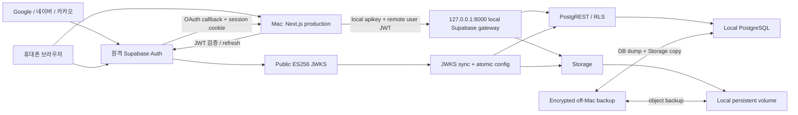

# 원격 Auth + 로컬 DB/Storage production 전환 계획

> **HISTORICAL / FORBIDDEN N/A (2026-08-13):** 이 계획의 remote Auth, linked DB, credential, migration/cutover 절차는 감사 기록이며 실행 경로가 아니다. 현재 authority는 `docs/engineering/supabase-local-only-operations.md`다.

상태: **Stage 1 doc gate PASS / 문서 PR merge 대기 / local write 미개방**
작성일: **2026-07-30 KST**
대상 서비스: `homecook`
목표 구조: **원격 Supabase Auth + 현재 Mac의 self-hosted Supabase DB/Storage + 기존 RLS 유지**
현재 production: `http://192-168-0-36.sslip.io:3100`

## 딱 한 줄 요약

Google·네이버·카카오 로그인과 세션 발급은 기존 원격 Supabase가 계속 담당하고, 레시피·장보기·사용자 설정·이미지는 현재 Mac의 self-hosted Supabase에 저장하되, 원격 Auth가 발급한 사용자 JWT를 로컬 Supabase가 검증해 기존 `auth.uid()` RLS를 그대로 적용한다.

> 비유: 원격 Supabase Auth는 신분증을 발급하는 기관이고, Mac의 로컬 Supabase는 신분증을 확인한 뒤 개인 보관함을 열어 주는 집이다. 집은 신분증을 만들지 않고, 발급 기관의 공개 서명만 확인한다.

검토 증거:

- 계약 작성 Codex task: `019faf10-2d5b-7240-91e5-12d616cd3e89`
- 독립 architecture/security 검토 Codex task: `019faf26-2c9d-7d00-b632-12da47d3fad4`
- 1차 architecture/security 검토 결론: Stage -1 통합 계약 `PASS`
- Stage 1 docs-gate 검토 Codex task: `019faf4f-1c1d-7af1-84e2-97e3c694265a`
- docs-gate 결론: 1차 `REQUEST_CHANGES` 7건을 모두 수리했고, 정확한 커밋 `e83524ecce73a99e211c73cfad9f43d323106e1f` 재검토에서 필수 finding 0건으로 `PASS`했다.
- session-liveness 추가 반증 검토: 최신 Supabase Auth의 `/auth/v1/user`가 JWT `session_id`의 원격 session 존재를 확인하는 코드·회귀 테스트까지 검증했다. Stage 2에서는 실제 hosted Auth logout/revoke 뒤 만료 전 JWT 거부와 local mutation 0건을 negative canary로 다시 증명한다.

## 1. 이 문서가 결정하는 것

### 목표

- Google·네이버·카카오 OAuth, `auth.users`, `auth.identities`, 세션과 refresh token은 원격 Supabase Auth에 남긴다.
- `public` schema의 애플리케이션 데이터와 `recipe-images` Storage 객체는 로컬 self-hosted Supabase를 권위 저장소로 바꾼다.
- 사용자 요청은 원격 JWT의 `sub`를 로컬 `auth.uid()`로 전달해 기존 RLS를 유지한다.
- 사용자 범위 요청에 `service_role`을 사용해 RLS를 우회하지 않는다.
- 원격 DB와 Storage를 삭제하지 않은 상태에서 단계적으로 전환하고 검증한다.

### 목표가 아닌 것

- Supabase CLI의 `supabase start`를 production 서버로 노출하지 않는다.
- Google·네이버·카카오 개발자 센터의 provider callback을 self-hosted Auth로 옮기지 않는다.
- 로컬 PostgreSQL `5432`, Supabase Studio, Docker socket을 LAN이나 인터넷에 공개하지 않는다.
- remote/local DB에 동시에 사용자 write를 보내는 dual-write를 만들지 않는다.
- 기존 public API endpoint, response wrapper, error shape를 이 계획에서 바꾸지 않는다.
- 원격 Auth의 사용자 이메일, provider identity, session까지 로컬 전용 데이터라고 주장하지 않는다.

## 2. 현재 확인된 사실

### 실행 환경

| 항목 | 확인값 | 판정 |
| --- | --- | --- |
| Mac | MacBook Pro `MacBookPro18,1`, Apple M1 Pro 10 cores, RAM 32 GB | CPU/RAM은 소규모 self-hosting 가능 |
| Docker 할당 | 5 CPU, 약 8.2 GB RAM | 공식 권장선의 하단. 운영 전 10~12 GB 검토 |
| 루트 디스크 여유 | 약 120 GiB | 현재 DB+Storage 약 4 MiB 기준 capacity gate 통과, final 직전 재검증 |
| 원격 PostgreSQL | `17.6.1.121` | 로컬 이미지/restore 호환성 검증 필요 |
| 원격 Auth JWKS | key 1개, `EC` / `ES256` | 공개키 기반 로컬 검증 가능 |
| account-generation capability | `legacy`, revision `1` | hybrid 전환은 `legacy`를 유지한 상태에서만 시작 |
| 원격 Supabase | `vfubnhtawezmheylfhsv.supabase.co` | 전환 뒤 Auth authority로만 사용 |

실행 시점에 위 값을 다시 확인한다. 특히 JWKS 알고리즘, account-generation capability, DB 버전, 디스크 여유가 달라지면 계획을 중단하고 재검토한다.

### 코드 결합 상태

- 현재 공개 URL, anon key, service role key가 하나의 `getSupabaseEnv()`로 묶여 있다: `lib/supabase/env.ts:1`.
- 서버 client 하나가 `auth.getUser()`, `.from()`, `.rpc()`, Storage를 모두 같은 Supabase URL에 보낸다: `lib/supabase/server.ts:8`.
- 브라우저 client도 Auth와 Storage를 같은 URL로 보낸다: `lib/supabase/browser.ts:9`.
- OAuth 시작은 현재 브라우저 공용 client의 `auth.signInWithOAuth()`를 사용한다: `components/auth/social-login-buttons.tsx:95`.
- 브라우저에서 `recipe-images`를 직접 삭제하는 경로가 남아 있다: `components/recipe/manual-recipe-create-screen.tsx:759`.
- 서버의 이미지 upload/read/signed URL도 현재 공용 client에 의존한다: `lib/server/recipe-image-managed-storage.ts:235`.
- account-generation JWT issuer가 현재 `NEXT_PUBLIC_SUPABASE_URL` 하나에서 계산된다: `lib/server/account-generation/session-authority.ts:69`.
- account-generation DB 함수는 로컬 DB 안의 `auth.users` row와 exact `created_at`을 직접 authority로 사용한다: `supabase/migrations/20260723140000_account_session_generation_foundation.sql:2933`.
- account cutover digest와 일부 FK도 `auth.users`를 직접 읽는다: `supabase/migrations/20260723140000_account_session_generation_foundation.sql:265`, `supabase/migrations/20260723140000_account_session_generation_foundation.sql:1065`.
- 기존 공식 workpack은 Auth와 application DB가 같은 PostgreSQL transaction과 lock 안에 있다는 전제를 가진다: `docs/workpacks/account-session-generation-foundation/README.md:106`.

따라서 이 전환은 환경변수 교체가 아니라 **인증 authority와 데이터 authority 분리**이며, 구현 전에 공식 DB/Auth 계약 변경이 필요하다.

## 3. 목표 구성도



### 네트워크 경계

| 경계 | 허용 | 금지 |
| --- | --- | --- |
| 브라우저 → 원격 Supabase | `/auth/v1/*`, OAuth, session refresh | 원격 `public` DB와 원격 Storage write |
| 브라우저 → Homecook | 기존 앱 페이지와 `/api/v1/*` | 로컬 DB/Studio 직접 접속 |
| Homecook → 로컬 Supabase | loopback Data API와 Storage API | LAN의 `5432`, Docker socket |
| Homecook → 원격 Supabase | Auth user/session 검증, Auth Admin maintenance | 애플리케이션 데이터 write |
| 운영자 → 로컬 Supabase | Mac 내부 관리 명령, backup/restore | 외부 인터넷에서 Studio 접속 |

로컬 Supabase gateway는 기본적으로 `127.0.0.1`에만 bind한다. 브라우저에서 직접 local Data API를 호출하지 않고 Next.js Route Handler가 remote JWT를 전달한다. 이렇게 하면 local Data API, Studio, Storage 관리 endpoint를 LAN에 추가 공개하지 않아도 된다.

## 4. 핵심 인증 흐름

### 로그인

1. 브라우저가 원격 Supabase Auth에서 Google·네이버·카카오 로그인을 시작한다.
2. 기존 `/auth/callback`이 원격 Auth의 code를 session으로 교환한다.
3. 서버가 원격 Auth의 `getUser(access_token)`으로 token과 user를 확인한다.
4. 서버가 검증된 최소 identity snapshot을 로컬 DB mirror에 멱등 upsert한다.
5. 로컬 DB bootstrap RPC가 local user/profile/lifecycle을 확인한다.
6. 브라우저에는 기존 session cookie와 기존 return-to-action 동작을 유지한다.

### 사용자 데이터 요청

1. Next.js가 원격 Auth session cookie에서 access token을 읽는다.
2. remote `/auth/v1/user`로 token/user를 검증하고 issuer, audience, expiry, `sub`, `session_id`, `user.created_at`을 확인한다.
3. local data client를 request마다 만들고 다음 두 값을 분리해 보낸다.
   - `apikey`: 로컬 Supabase publishable key
   - `Authorization: Bearer <remote user JWT>`
4. session-authority gateway가 verified `(iss, sub, session_id, user.created_at)`를 current active mirror epoch와 local session-liveness HMAC binding에 결합한다.
5. Storage loopback gateway와 PostgREST DB pre-request가 exact issuer/audience/role/sub/session/time/alg/kid, active binding TTL, method/path attestation을 확인한다.
6. 로컬 PostgREST/Storage가 remote JWKS 공개키로 JWT 서명을 확인한다.
7. PostgreSQL이 JWT의 `sub`를 `auth.uid()`로 읽어 기존 RLS를 적용한다.

### 세션 갱신

- refresh token은 원격 Supabase Auth에만 보낸다.
- local data client는 session을 저장하거나 refresh하지 않는다.
- 원격 Auth가 중단되면 user-scoped local DB/Storage request는 fail closed한다. 아직 만료되지 않은 access token의 로컬 서명 검증만으로 logout/revocation/liveness를 증명하지 않으며 remote outage 중 binding TTL 연장, 신규 binding 생성, mutation allow-until-exp는 금지한다.

## 5. JWT/JWKS 신뢰 설계

### 구성 원칙

- 원격 private signing key는 Mac에 복사하지 않는다.
- 원격 공개 JWKS만 허용한다.
- 로컬 PostgREST, Storage, 필요 시 Realtime이 같은 trust bundle을 사용한다.
- trust bundle에는 다음 키가 함께 들어간다.
  - 로컬 publishable/secret key 처리에 필요한 local self-hosted key
  - 원격 사용자 JWT를 검증하기 위한 remote ES256 public key
- 허용 알고리즘은 현재 코드와 맞춰 `ES256` 또는 `RS256`만 사용한다.
- `kid`는 비어 있거나 중복이면 fail closed한다.
- 예상 issuer는 정확히 `https://vfubnhtawezmheylfhsv.supabase.co/auth/v1`로 고정한다.
- audience는 `authenticated`, role은 `authenticated`, `sub`는 UUID여야 한다.
- user token의 `session_id`도 UUID여야 한다.
- PostgREST에는 `PGRST_JWT_AUD=authenticated`와 DB pre-request를 설정한다. JWKS 서명 검증만으로 issuer/session claim을 모두 확인했다고 간주하지 않는다.
- Storage user traffic은 exact claim을 검증하는 loopback gateway만 통과하며 upstream port는 Docker internal network에만 둔다.

### 키 동기화

신규 `scripts/sync-remote-auth-jwks.mjs`를 계획한다.

1. exact HTTPS JWKS endpoint만 요청한다.
2. 최대 body 1 MiB, timeout 3초, `EC/RSA`, `ES256/RS256`, unique `kid`, verify-only key를 검사한다.
3. 현재 active bundle과 hash가 같으면 아무 작업도 하지 않는다.
4. 바뀌면 새 bundle을 임시 파일에 쓰고 검증한 뒤 atomic rename한다.
5. local PostgREST/Storage를 순서대로 reload 또는 recreate한다.
6. canary token으로 RLS read를 확인한 뒤 성공 상태를 기록한다.
7. 실패하면 이전 bundle을 유지하고 알림을 보낸다.

기본 운영값:

- poll: 5분
- `last_success` 경고: 15분 초과
- hard blocker: 새 `kid` token을 로컬이 거부하거나 JWKS가 30분 이상 stale

## 6. 로컬 identity mirror와 `auth.users` 분리

### 왜 필요한가

원격 Supabase Auth에서 생성된 사용자는 로컬 Supabase의 `auth.users`에 자동 생성되지 않는다. `auth.uid()`는 JWT만으로 동작하지만, 현재 Homecook의 account-generation 함수와 일부 FK/digest는 실제 `auth.users` row를 직접 읽는다. 이 의존을 그대로 두면 신규 로그인, 탈퇴, 같은 UUID identity epoch 검증이 실패한다.

### 선택안

로컬의 비노출 schema에 `remote_auth_identity_epochs` authority를 추가한다. 정확한 schema/table 이름과 컬럼은 contract-evolution에서 확정한다.

확정 보관값:

| 값 | 목적 |
| --- | --- |
| `owner_uuid` | remote JWT `sub`와 local owner 연결 |
| `identity_created_at` | 동일 UUID의 identity epoch 구분 |
| `issuer` | 다른 Supabase project token 혼입 차단 |
| `active_epoch` | issuer+owner current epoch 1개 보장 |
| `remote_revision` / `remote_identity_digest` | remote control-plane과 CAS 비교 |
| `verified_at` / `deleted_terminal_at` / `deleted_terminal_reason` | 검증·삭제 terminal 상태와 이유 |
| `evidence_revision` | callback/Admin read evidence 추적 |
| `created_at` / `updated_at` | mirror row 생성·갱신 시각 |

원본 access token, refresh token, raw/hash email, raw/hash provider subject, profile metadata, raw provider payload, OAuth secret은 저장하지 않는다. email/provider subject는 hash도 PII로 간주해 장기 mirror에 저장하지 않는다. profile bootstrap은 검증된 remote 결과의 exact allowlist를 일회성 internal RPC로만 전달한다.

### write authority

- 일반 browser, `anon`, `authenticated`: mirror read/write 모두 금지
- local service maintenance principal: 검증 RPC만 실행
- callback: 원격 `getUser(access_token)` 성공 결과만 전달
- reconciler: 원격 Auth Admin API의 read-only pagination 결과만 전달
- client body의 UUID, provider, email은 authority로 사용하지 않는다.

### 기존 account-generation 계약 처리

1. hybrid cutover 전 production capability는 반드시 `legacy`, revision `1`, canonical generation row `0`이어야 한다.
2. 기존 `auth.users` 직접 참조 inventory를 완성한다.
3. `auth.users` read/FK/digest/lock을 mirror, remote control-plane ack, nullable historical audit snapshot으로 바꾸는 additive migration과 regression test를 먼저 만든다.
4. remote Auth의 Before User Created Hook와 local DB cutover fence는 한 transaction이 될 수 없으므로, hybrid 전용 two-system maintenance barrier를 공식 문서에 추가한다.
5. `generation_active`는 새 barrier, mirror digest, deletion outbox, Storage owner signal이 모두 검증되기 전까지 활성화하지 않는다.
6. 기존 official contract보다 안전성이 낮아지는 경우 hybrid cutover를 중단한다.
7. 모든 authenticated DB/Storage request는 remote verified session tuple과 active epoch를 결합한다. missing/stale/deleted/replaced binding과 old `iat` token은 fail closed한다.
   - remote verified session tuple과 active epoch만으로는 logout/revocation authority가 아니다.
   - callback/refresh 성공 시 session-liveness HMAC binding을 만들고 logout/deletion/quarantine/identity replacement/maintenance abort에서 revoke/delete한다.
   - 모든 request에서 remote liveness와 binding TTL을 재검증하며 remote outage는 user-scoped Data/Storage fail-closed다.
8. provider linking은 local owner authority가 아니며 remote freeze를 주장하지 않는다. barrier 전후 population/revision digest CAS가 달라지면 cutover attempt를 abort/restart한다.
9. deletion은 local owner fence/cleanup → remote Admin exact epoch delete → terminal readback → mirror terminal → lifecycle complete의 멱등 saga로 처리한다.

## 7. Supabase client 분리 계획

### 계획 환경변수

```dotenv
# 원격 Auth 전용
NEXT_PUBLIC_AUTH_SUPABASE_URL=https://vfubnhtawezmheylfhsv.supabase.co
NEXT_PUBLIC_AUTH_SUPABASE_PUBLISHABLE_KEY=...
AUTH_SUPABASE_SECRET_KEY=...

# 로컬 Data/Storage 전용. server-only URL은 loopback이다.
DATA_SUPABASE_URL=http://127.0.0.1:8000
DATA_SUPABASE_PUBLISHABLE_KEY=...
DATA_SUPABASE_SECRET_KEY=...

# 검증 authority
AUTH_SUPABASE_EXPECTED_ISSUER=https://vfubnhtawezmheylfhsv.supabase.co/auth/v1
AUTH_SUPABASE_JWKS_URL=https://vfubnhtawezmheylfhsv.supabase.co/auth/v1/.well-known/jwks.json
```

실제 키는 문서, git, 로그, HTML에 넣지 않는다.

### 계획 파일

| 계획 파일 | 책임 |
| --- | --- |
| `lib/supabase/auth-env.ts` | remote Auth URL/key/issuer 검증 |
| `lib/supabase/data-env.ts` | local Data URL/key 검증, loopback production guard |
| `lib/supabase/auth-browser.ts` | OAuth, session, auth state |
| `lib/supabase/auth-server.ts` | callback, logout, linking, verified user/session |
| `lib/supabase/data-server.ts` | remote access token을 넣은 local user-scoped client |
| `lib/supabase/data-admin.ts` | local maintenance 전용 secret client |
| `lib/server/auth/verified-remote-session.ts` | issuer/aud/sub/session_id/exp 검증 |
| `scripts/sync-remote-auth-jwks.mjs` | remote public key 동기화 |
| `scripts/verify-hybrid-supabase.mjs` | Auth/Data 분리 및 RLS negative smoke |
| `infra/supabase-self-hosted/` | pinned Docker Compose와 local-only override |

### call-site 분류

- Auth로 유지: `/auth/callback`, `/auth/link/callback`, `/auth/logout`, provider linking, auth state listeners.
- Data로 전환: 모든 `.from()`, `.rpc()`, public data read, local service maintenance.
- Storage로 전환: `recipe-images` upload, remove, signed URL, cleanup/outbox.
- 혼합 Route: 먼저 remote Auth를 검증하고, 같은 request의 access token으로 local data client를 만든다.
- `NEXT_PUBLIC_SUPABASE_URL`에서 issuer를 계산하는 코드는 Auth URL을 사용하도록 바꾼다.

## 8. 단계별 실행 계획

### Stage -1. 공식 계약과 workpack 잠금

변경 전 필수 산출물:

- 공식 5종 문서의 Auth authority / Data authority / identity mirror / account deletion 영향 갱신
- `docs/sync/CURRENT_SOURCE_OF_TRUTH.md` 동기화
- 신규 workpack `hybrid-auth-local-data-production`
- `README.md`, `acceptance.md`, `automation-spec.json`
- security review와 independent architecture review

진입 조건:

- 사용자가 hybrid contract-evolution을 명시적으로 승인
- public API shape 변경 없음 또는 변경 항목이 공식 API 문서에 먼저 반영

중단 조건:

- `auth.users` transaction/Hook 안전성을 대체할 수 없음
- account-generation safeguard가 약해짐

### Stage 0. 용량·데이터·권한 inventory

작업:

1. remote DB roles/schema/data를 각각 dump한다.
2. DB 크기, table별 row count와 digest를 기록한다.
3. Storage bucket, object count, byte sum, MIME, hash, owner path를 기록한다.
4. `auth.users` 참조 함수/FK/trigger/Hook를 전수 inventory한다.
5. remote DB에서 Auth 이외 table에 어떤 background write가 있는지 확인한다.
6. 현재 Mac의 sleep, FileVault, power recovery, Docker startup을 확인한다.

통과 기준:

- 사용 가능한 storage가 `max(80 GiB, DB+Storage 실사용량의 3배)` 이상
- backup은 Mac 내부와 별도의 장치/원격 위치에 각각 1개 이상
- remote dump restore rehearsal이 isolated DB에서 성공
- PostgreSQL 17 호환 self-hosted image가 검증됨

현재 상태:

- gitignored 실험 cache 정리 뒤 약 120 GiB free이며 현재 data 약 4 MiB 기준 capacity gate는 통과했다.
- off-Mac encrypted backup과 restore drill은 아직 final cutover blocker다.

### Stage 1. self-hosted Supabase 기반 설치

작업:

1. Supabase 공식 Docker Compose release를 `infra/supabase-self-hosted/`에 pin한다.
2. Postgres, PostgREST, Storage, Kong만 필요한 범위로 구성한다.
3. local Auth는 외부 login authority로 사용하지 않는다.
4. gateway/Studio/Postgres를 loopback 또는 Docker internal network에 제한한다.
5. macOS Storage는 공식 권고에 따라 named Docker volume을 사용하고 별도 backup 경로를 둔다.
6. `.env` 권한을 `600`으로 제한하고 기본 secret을 모두 교체한다.
7. container healthcheck와 `restart: unless-stopped`를 설정한다.
8. Next.js `launchd`가 local Supabase health를 기다린 뒤 시작하도록 한다.

통과 기준:

- 모든 required container가 healthy
- Mac 재부팅 뒤 DB → Storage → Next.js 순서로 복구
- LAN에서 `5432`, Studio, Docker API 접근 불가
- local admin secret이 browser bundle과 로그에 없음

### Stage 2. JWKS trust bridge

작업:

1. remote JWKS를 local combined trust bundle에 추가한다.
2. PostgREST에 combined JWKS, `PGRST_JWT_AUD=authenticated`, DB pre-request guard를 설정한다.
3. Storage에 `JWT_JWKS`를 설정하고 exact claim gateway를 단일 user 진입점으로 둔다.
4. remote user token을 local Data API/Storage에 전달하는 isolated smoke client를 만든다.
5. key sync, atomic reload, rollback, stale alert를 구현한다.

통과 기준:

- valid 조해피 remote token으로 `auth.uid()`가 exact remote `sub`와 같음
- anonymous token은 private row `0` 또는 `401/403`
- User A token으로 User B row read/write `0`
- expired, wrong-project, wrong-audience, wrong-role, malformed/missing session, local Auth user token, remote service-role token 모두 거부
- PostgREST/Storage upstream bypass 접근 `0`
- remote private signing key가 local 파일과 container env에 없음

### Stage 3. dual client를 feature-off로 추가

작업:

1. Auth/Data env와 client factory를 분리한다.
2. 기존 함수 이름은 compatibility adapter로 remote-only 동작을 유지한다.
3. login/link/logout/callback을 explicit Auth client로 옮긴다.
4. data client는 request-scoped remote access token만 받게 한다.
5. 사용자 범위 Data client에 secret/service key 전달을 금지한다.
6. feature flag `HOMECOOK_DATA_AUTHORITY=remote|local-shadow|local`을 추가한다.
7. user/public/admin/internal call-site inventory와 exact internal service-role allowlist를 만들고 AST/static CI gate로 user route service-role 사용과 browser direct Storage를 차단한다.

통과 기준:

- 기본값 `remote`에서 기존 전체 test와 세 provider login이 그대로 통과
- `local-shadow`는 local read 비교만 하고 사용자 response/write는 remote가 담당
- production에서 env 누락 또는 local URL이 loopback이 아니면 fail closed

### Stage 4. identity mirror와 lifecycle authority

작업:

1. private mirror schema/table과 internal RPC를 additive migration으로 추가한다.
2. 기존 `auth.users` dependency inventory를 mirror authority로 전환한다.
3. callback verified user → mirror upsert를 멱등화한다.
4. 기존 remote Auth 사용자 전체를 mirror로 backfill한다.
5. periodic reconciler로 remote/local count+digest를 비교한다.
6. remote delete/recreate, provider linking, email verification, account deletion outbox를 검증한다.
7. hybrid maintenance barrier를 remote Auth control-plane과 local capability에 연결한다.

통과 기준:

- remote Auth active user와 local mirror의 owner UUID/identity epoch count+digest 일치
- callback replay가 local user를 중복 생성하지 않음
- same email/different user와 provider conflict가 기존 규칙대로 차단
- stale session과 deleted/recreated identity가 이전 개인 data를 쓸 수 없음
- capability는 계속 `legacy`; 별도 승인 없이 `generation_active` 전환 금지

### Stage 5. DB/Storage 이전 rehearsal

작업:

1. pre-data schema를 새 local isolated instance로 restore한다.
2. hybrid compatibility migration으로 `auth.users` FK/function/digest/lock을 대체한다.
3. application data를 restore하고 post-data constraints를 validate한다.
4. `pg_constraint`/`pg_depend`/`pg_proc`/policy의 application-owned `auth.users` dependency 0과 local `auth.users=0`을 확인한다.
5. `recipe-images` 객체를 local Storage로 복사한다.
6. signed URL 자체가 아니라 canonical object path를 기준으로 검증한다.
7. object count, byte sum, MIME, hash와 DB registry reference를 비교한다.
8. 같은 절차를 처음부터 다시 실행해 replay/idempotency를 확인한다.

통과 기준:

- 모든 application table row count 일치
- owner별 핵심 table digest 일치
- migration history와 required extension 일치
- known `public.users=5/admin missing=1/audit missing=99` fixture가 교정 전 fail, 교정 후 semantic gate pass
- owner/admin/personal universe와 active mirror epoch anti-join `0`
- Storage object count/byte/hash mismatch `0`
- orphan, missing target, owner-path mismatch가 모두 분류되고 미승인 delete `0`

### Stage 6. shadow read와 실제 브라우저 검증

작업:

1. production response는 remote data에서 유지한다.
2. 안전한 GET 요청만 local에도 보내 response digest를 비교한다.
3. 개인 row, public catalog, 검색, planner, shopping, recipebook, images를 표본 검증한다.
4. Google·네이버·카카오 로그인 뒤 local shadow 결과를 Playwright로 확인한다.
5. local DB/Storage restart와 remote Auth 일시 장애를 주입한다.

통과 기준:

- 24시간 shadow 동안 권한 mismatch `0`
- 핵심 GET response semantic mismatch `0`
- User A/User B RLS leakage `0`
- local restart 뒤 데이터 손실 `0`
- JWKS stale, backup stale, disk pressure alert가 실제 발생

### Stage 7. final cutover

순서:

1. 새 배포와 migration을 멈추고 exact commit SHA를 고정한다.
2. remote Auth control-plane에서 신규 identity gate를 닫고 fencing ack를 기록한다. Homecook linking UI를 닫되 remote link freeze를 주장하지 않는다.
3. 앱 사용자 mutation을 maintenance response로 막는다.
4. remote application DB와 Storage의 final inventory/dump와 off-Mac encrypted cut-line backup을 만든다.
5. final delta를 local에 restore/copy한다.
6. row/object count+digest를 다시 비교한다.
7. `HOMECOOK_DATA_AUTHORITY=local`로 build/install한다.
8. 최초 15분은 local read-only smoke만 수행한다.
9. 세 provider login, private CRUD, image upload/read/delete, logout/re-login을 검증한다.
10. 검증 통과 후 local write를 연다.
11. callback reconcile과 barrier 후 remote identity digest CAS, local mirror ack를 확인한 뒤 remote Auth 신규 identity gate를 다시 연다.

통과 기준:

- Google·네이버·카카오 모두 LAN 앱으로 복귀
- remote Auth user ID와 local `auth.uid()` 일치
- recipe/planner/pantry/shopping/recipebook CRUD 통과
- private `recipe-images` upload, signed read, cleanup 통과
- remote application table과 Storage에 신규 app write `0`
- production error log에 raw JWT, key, email, user UUID 노출 `0`

### Stage 8. 안정화와 원격 data 폐기 보류

- remote application DB/Storage는 최소 14일 read-only 복구본으로 유지한다.
- local write가 시작된 뒤에는 단순 env toggle로 remote data에 되돌아가지 않는다.
- 14일 동안 backup restore, Mac reboot, Docker restart, JWKS rotation rehearsal을 각각 1회 통과한다.
- 폐기 전 최종 encrypted dump와 Storage manifest를 off-Mac에 보관한다.
- 원격 Auth schema/control-plane은 계속 유지한다.

## 9. 롤백 규칙

| 시점 | 허용 롤백 | 금지 |
| --- | --- | --- |
| Stage 0~6 | feature flag를 `remote`로 유지/복귀 | remote data 삭제 |
| Stage 7 local read-only | `remote`로 즉시 복귀 후 원인 조사 | local mismatch 상태에서 write 개방 |
| local write 개방 전 | remote data authority 복귀 가능 | digest 미확인 상태 전환 |
| local write 개방 후 | write freeze → local delta export → remote restore 검증 후 복귀, 또는 forward-fix | env만 바꿔 remote로 되돌리기 |
| remote data 폐기 후 | off-Mac backup에서 restore | backup 없는 초기화 |

rollback floor는 **첫 local user write**다. 이 시점 뒤에는 local에만 존재하는 데이터가 생기므로 단순 URL 변경은 데이터 손실을 만든다.

## 10. 검증 계획

### Unit

- Auth/Data env 이름과 server/public 노출 경계
- issuer/audience/sub/session/expiry validation
- remote access token 전달과 local apikey 분리
- JWKS parser, size/time/algorithm/kid 제한
- identity mirror payload allowlist와 idempotency
- feature flag default remote/fail-closed

### Integration

- 실제 local PostgREST에서 remote JWT → `auth.uid()`
- anon/authenticated/service role exact role matrix
- User A/B cross-owner read/write negative test
- local Storage owner path RLS
- exact claim gateway와 PostgREST pre-request negative token matrix
- user route service-role import/call 0 및 exact internal allowlist static check
- browser direct local Storage SDK call 0
- account-generation mirror epoch와 stale session
- DB dump/restore fresh, existing, replay
- JWKS old/new key overlap과 atomic reload

### E2E / Playwright

- Google 로그인 → private CRUD → logout → 재로그인
- 네이버 로그인 → private CRUD → logout → 재로그인
- 카카오 로그인 → private CRUD → logout → 재로그인
- 계정 linking과 provider 전환
- recipe image upload/read/cancel/delete
- Mac desktop, 390px mobile, 320px mobile
- local DB/Storage down 상태의 fail-closed error와 복구

### Data migration

- table별 count와 stable digest
- owner별 private row count
- migration/extension/RLS/trigger/grant inventory
- Storage object count, bytes, MIME, hash, DB reference
- remote application write count cutover 후 `0`

### 운영

- `pnpm lint`
- `pnpm typecheck`
- `pnpm test`
- `pnpm build`
- `pnpm verify:security-functions`
- hybrid 전용 PostgreSQL integration
- hybrid 전용 Data API negative smoke
- `pnpm mac-production:install`
- Mac 재부팅과 Docker/Next ordered recovery

## 11. 운영·백업 기본값

아래는 구현 승인 시 공식 운영 정책으로 다시 잠글 기본값이다.

| 항목 | 기본값 |
| --- | --- |
| DB logical backup | 매일 1회, roles/schema/data 분리 |
| Storage backup | 매일 증분 + 주 1회 full manifest |
| 보관 | daily 14개 + weekly 8개 |
| backup 위치 | Mac 외부 저장장치 1개 + off-site encrypted copy 1개 |
| restore drill | 주 1회 isolated restore |
| 목표 RPO | 최대 24시간 데이터 손실 |
| 목표 RTO | 4시간 안에 복구 |
| JWKS poll | 5분 |
| JWKS stale warning | 15분 |
| DB/Storage health | 1분 간격 |
| disk warning | free 20% 미만 |
| disk write-stop 검토 | free 10% 미만 |

UPS와 자동 전원 복구가 없으면 정전 뒤 수동 복구가 필요하다. FileVault가 켜진 Mac은 재부팅 뒤 사용자 로그인이 필요할 수 있으므로 “Mac 상시 켜짐”만으로 무인 복구가 보장되지 않는다.

## 12. 선택지 비교와 ADR

### 원칙

1. 로그인 authority와 data authority를 코드와 환경변수에서 명확히 분리한다.
2. 사용자 데이터 접근은 remote JWT와 local RLS로 이중 검증한다.
3. cross-system 상태는 원자적이라고 가정하지 않고 fail closed한다.
4. cutover 전에는 언제든 remote data로 안전하게 복귀할 수 있어야 한다.
5. secret, raw token, provider payload를 문서·로그·mirror에 남기지 않는다.

### 주요 결정 요인

1. 기존 `auth.uid()` RLS와 account-generation 보안 유지
2. 원격 OAuth 안정성을 그대로 사용
3. 초보 운영자가 복구 가능한 단순한 data path

### 선택지

| 선택지 | 장점 | 단점 | 판정 |
| --- | --- | --- | --- |
| A. remote JWT를 local Data API가 직접 검증 | 기존 `auth.uid()` 유지, 별도 user token 발급 없음, provider callback 유지 | JWKS rotation과 identity mirror 필요 | **선택** |
| B. Next.js가 remote JWT 확인 후 local JWT 재발급 | local Supabase는 자체 key만 신뢰 | token 2개, refresh/revoke/session binding이 복잡하고 새 보안 경계 추가 | 기각 |
| C. 모든 요청을 local service role로 처리 | 구현이 가장 단순해 보임 | RLS 우회, route 한 곳의 권한 실수가 전체 사용자 데이터 노출로 이어짐 | 금지 |
| D. Auth까지 전체 self-hosting | 한 DB transaction, 운영 구조 단순 | 사용자 요구와 다르고 OAuth/provider callback/uptime 책임 증가 | 이번 범위 제외 |

### ADR

- **Decision:** remote Auth의 ES256 JWT를 local PostgREST/Storage가 검증하고, Next.js가 user-scoped token을 request마다 전달한다.
- **Drivers:** 기존 RLS 유지, OAuth 설정 유지, service role 우회 방지.
- **Why chosen:** 사용자 session token을 다시 만들지 않고 현재 `sub`, `session_id`, `auth.uid()` 의미를 가장 적게 바꾼다.
- **Consequences:** JWKS sync, identity mirror, two-system maintenance barrier, backup/monitoring이 새 운영 책임이 된다.
- **Follow-ups:** hybrid contract-evolution, workpack, isolated rehearsal, security review, 24시간 shadow, manual cutover 승인.

## 13. 사전 실패 분석

### 실패 1: 원격 signing key가 바뀌어 모든 local request가 `401`

- 탐지: unknown `kid`, JWKS stale, local RLS canary 실패
- 예방: 5분 poll, old/new key overlap, atomic trust bundle, canary 후 reload
- 복구: 이전 bundle 유지, local write close, remote data authority로 pre-write rollback

### 실패 2: remote Auth와 local identity mirror가 어긋남

- 탐지: count/digest mismatch, callback bootstrap failure, identity epoch mismatch
- 예방: callback upsert + periodic full reconciliation + maintenance barrier
- 복구: 개인 mutation fail closed, owner quarantine, remote Auth를 authority로 mirror repair

### 실패 3: Mac 디스크/전원 장애로 DB와 이미지가 함께 중단

- 탐지: disk/volume/health/backup-age alert
- 예방: 전용 SSD, UPS, restart policy, off-Mac encrypted backup
- 복구: 새 local instance에 DB+Storage restore 후 digest 검증, DNS/app 재연결

### 실패 4: final cutover 뒤 remote/local 데이터가 서로 달라짐

- 탐지: table/object digest mismatch, shadow response mismatch
- 예방: maintenance write freeze, final delta, read-only smoke
- 복구: local write 전에는 remote 복귀, local write 후에는 delta 역이전 또는 forward-fix

## 14. 구현 시작 전 체크리스트

- [x] 사용자가 hybrid contract-evolution을 명시 승인했다.
- [ ] 공식 5종 문서와 `CURRENT_SOURCE_OF_TRUTH.md`는 독립 재검토 `PASS`를 받았고 PR merge만 남았다.
- [x] 신규 workpack과 acceptance가 docs-gate `PASS`를 받았다.
- [x] production capability가 `legacy`, canonical generation row가 `0`이다.
- [x] remote JWKS가 asymmetric key를 제공한다.
- [x] 디스크 여유가 최소 gate를 만족한다.
- [ ] off-Mac encrypted backup 위치가 준비됐다.
- [ ] PostgreSQL 17 restore rehearsal이 통과했다.
- [ ] Auth/Data client 분리 테스트가 RED부터 준비됐다.
- [ ] identity mirror, session-liveness binding과 `auth.users` dependency 대체안이 최종 security review를 통과했다.
- [ ] User A/B RLS negative test가 통과했다.
- [ ] Storage object manifest mismatch가 `0`이다.
- [ ] Google·네이버·카카오 E2E가 모두 통과했다.
- [ ] 24시간 shadow mismatch가 `0`이다.
- [ ] local write 전/후 rollback 절차가 각각 rehearsal됐다.
- [ ] 이 사용자 지시가 승인한 cutover window 안에서 final evidence와 fencing revision이 고정됐다.

## 15. 공식 참고자료

- [Supabase Self-Hosting](https://supabase.com/docs/guides/self-hosting)
- [Self-Hosting with Docker](https://supabase.com/docs/guides/self-hosting/docker)
- [Supabase JWT](https://supabase.com/docs/guides/auth/jwts)
- [JWT Signing Keys](https://supabase.com/docs/guides/auth/signing-keys)
- [Self-hosted Auth Keys and JWKS](https://supabase.com/docs/guides/self-hosting/self-hosted-auth-keys)
- [Third-party Auth](https://supabase.com/docs/guides/auth/third-party/overview)
- [Restore Platform Project to Self-Hosted](https://supabase.com/docs/guides/self-hosting/restore-from-platform)
- [Storage Self-hosting Configuration](https://supabase.com/docs/guides/self-hosting/storage/config)

## 16. 문서 영향과 현재 결론

이 계획은 public UI/API 기능 추가가 아니라 production architecture 변경이지만, `auth.users`, account-generation, account deletion, Storage ownership authority를 바꾸므로 공식 요구사항·유저 flow·DB·API 문서에 영향이 있다. 따라서 이 문서만으로 구현을 시작하지 않는다.

현재 결론:

- 기술적 feasibility: **가능**
- 현재 원격 JWT 조건: **충족 (`ES256`)**
- 현재 account-generation 진입 조건: **충족 (`legacy`, revision `1`)**
- 현재 Mac CPU/RAM: **충족**
- 현재 disk gate: **충족 (약 120 GiB free, final 직전 재검증)**
- Stage 1 설계 blocker: **없음 - docs-gate PASS, 문서 PR merge만 대기**
- 남은 final cutover blocker: **실제 구현 검증, 24시간 shadow, off-Mac encrypted restore와 post-write rollback rehearsal**
- 구현 상태: **Stage 1 문서 PR merge 전, local write 미개방**
