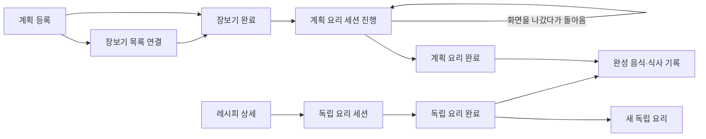

# 계획·장보기·요리·식사 기록의 단위와 상태

2026-09-27 사용자 피드백 묶음. 구현·선택 검증만 수행하며 운영 DB 변경·머지·배포는 보류한다.

## 무엇을 한 건으로 관리하는가

| 단위 | 식별과 역할 | 바뀌지 않아야 하는 연결 |
|---|---|---|
| 레시피 원본 | recipe ID와 revision. 현재 제목·재료·단계·공개 여부 | 원본 수정·삭제가 기존 계획의 내용을 바꾸지 않는다. |
| 내용 고정본 | recipe content snapshot ID. 특정 시점의 제목·기준 인분·재료·단계 | 계획과 요리는 자신이 선택한 고정본을 사용한다. |
| 계획 식사 | meal ID. 날짜·끼니·계획 인분·고정본·진행 상태 | 같은 레시피라도 다른 meal은 서로 다른 계획이다. |
| 장보기 목록 | shopping list ID. 여러 계획과 필요한 재료를 묶음 | 한 계획은 중복 목록에 들어가지 않는다. 완료 목록은 읽기 전용이다. |
| 요리 세션 | session ID. 계획 요리/독립 요리, 내용 고정본·실제 요리 인분 | 진행 중인 동일 작업은 재개하고 완료·취소된 세션은 재사용하지 않는다. |
| 완성 음식 | cooked batch ID. 요리 결과·총량·잔량·무게 출처 | 독립 요리 결과와 계획의 상태 전이를 혼동하지 않는다. |
| 식사 기록 | meal log entry ID. 실제 먹은 음식·양·그때의 영양 정보 | 원본 레시피 수정이나 나중 무게 측정으로 과거 섭취 기록을 다시 쓰지 않는다. |

## 계획 1건의 진행

| 사용자에게 보이는 단계 | 저장된 상태 | 가능한 다음 동작 |
|---|---|---|
| 계획 등록 | `registered`, 장보기 연결 없음 | 장보기 목록에 포함하거나 기존 장보기 완료 경로 진행 |
| 장보기 진행 | `registered`, 장보기 연결 있음 | 연결된 목록 열기. 다른 목록에 중복 포함 금지 |
| 장보기 완료 | `shopping_done` | 계획 요리 시작 |
| 요리 중 | meal은 `shopping_done`, 별도 active session 존재 | 그 계획·내용·인분의 요리 세션 이어가기 |
| 요리 완료 | `cook_done`, 연결 세션 완료 | 완성 음식·섭취 기록 확인. 같은 계획을 중복 완료하지 않음 |

독립 요리는 같은 레시피의 계획이 존재하더라도 그 meal 상태를 변경하지 않는다. 레시피 ID가 같다는 이유만으로 다른 계획·다른 인분·다른 고정본의 세션을 합치지 않는다.

## 이번 오류와 변경

- 다른 주 끼니 상세의 뒤로가기 기본값이 날짜 없는 `/planner`였다. 선택 날짜를 returnTo와 fallback에 넣어 같은 주·날짜로 돌아간다.
- 운영 읽기 확인에서 정상 `registered`/미연결 5건 중 미삭제 원본 2건과 삭제된 개인 원본 3건이 있었다. 기존 source-delete 검사는 2/5만 허용하지만 준비된 고정본 검사로는 5/5가 유효하다. 실제 요청 로그와 동일 요청임을 단정하지 않으며, 같은 404 조건을 격리 환경에서 재현·검증한다.
- 원본이 삭제돼도 본인 계획의 유효한 고정본이 있으면 장보기와 계획 요리 시작·재개·조회를 계속할 수 있다. 삭제 전 계획·고정본이라는 시간 조건과 recipe/owner 일치를 확인하고, 삭제된 원본에서 새 독립 요리를 만들지는 않는다. pin 누락·불일치·소유자 위반은 전체 쓰기 없이 거부한다.
- 계획 요리를 다시 시작하면 정확한 meal 집합·고정본의 기존 본인 active 세션을 반환한다. 독립 요리는 동일 owner·recipe·고정본·인분·revision의 active 세션만 재개한다. 완료·취소 이후 새 요리는 새 ID를 사용한다.
- 화면의 시작 중 latch는 응답 후 해제하며 기존 세션으로 돌아갈 수 있게 한다. 단순 404/500 또는 세션 오류를 legacy 생성으로 우회하지 않고, 명시적인 생성 기능 비활성 코드에서만 기존 대체 경로를 사용한다. 모든 조리 단계를 한 번에 보여주는 현재 요리 화면에는 별도 현재 단계 저장이 없다.
- 요리 화면의 알림 종은 숨긴다. 이미 적용한 헤더 route 제한으로 충족되는 곳은 중복 구현하지 않는다.
- 작은 화면의 고정 footer·하단 탭·안전 영역 여백을 중복 계산하지 않는다. 실제 긴 내용의 스크롤과 마지막 버튼 접근성은 유지한다.

## 간단한 요리 완료와 추정 무게

완료 화면은 팬트리 사용 항목 체크와 완료 저장만 남긴다. 반복 설명과 완성 음식 무게 입력을 제거한다. 이름을 그룹 제목과 행에 중복 표시하지 않고, 다른 팬트리 항목은 ID를 유지하며 제품·브랜드 등 필요한 차이만 보여준다. 전체 선택·전체 해제와 부분 선택 상태를 제공한다.

- 자동 추정: 선택한 세션의 재료 무게 합 × **0.75**.
- 실제 요리 인분을 적용하고 `scalable=false` 고정 수량은 늘리지 않는다.
- g/kg 및 승인된 부피·개수 환산을 사용한다. 정량 재료의 중량 근거가 누락되면 부분합을 전체 무게처럼 저장하지 않고 미확인으로 둔다. 비정량 적당량은 기존 계산 계약대로 제외한다.
- 추정과 실측을 `weight_source`로 구분한다. 기존 known/missing/unrecoverable 상태 의미와 권한·중복 완료 보호를 유지한다.
- 아직 소비하지 않은 추정 음식은 나중에 전체 실측 중량으로 고친다. 이미 소비한 음식은 기존 남은 양 조정 경로를 사용하며 과거 섭취 기록을 변경하지 않는다.

## 검증 원칙

5개 혼합 계획 장보기, 기존 요리 재개·완료 후 재시작, 팬트리 항목별 선택·전체 선택, 추정 계산과 실측 수정의 관련 회귀만 실행한다. DB 검증은 폐기 가능한 격리 환경을 사용한다. 실제 iPhone 키보드·운영 반영 확인은 이번 로컬 검증과 구분한다.

세션 재개와 삭제된 본인 계획의 조회 보호에 대한 SQL 경계는 [요리 세션 재진입 기록](cooking-session-resume-20260927.md)을 함께 따른다.

## 확인 결과

- 5개 혼합 계획(미삭제 원본 2·삭제 원본 3)을 한 장보기 목록으로 생성하고, 잘못된 pin이 있으면 전체 쓰기를 거부하는 격리 회귀 통과.
- 모바일·데스크톱의 다른 날짜 직접 진입 및 날짜 없는 과거 returnTo 링크에서 선택 날짜 복귀 확인. 데스크톱에서 전역 breadcrumb 숨김 규칙에 가려졌던 뒤로 버튼은 국소 표시로 복구.
- 기존/신규 요리모드의 종 숨김, 375px·짧은 화면·데스크톱 단일 내용 스크롤과 마지막 버튼 접근성 확인.
- 완료 UI 선택·전체 선택·항목 정체성·오류 복구 및 추정 실측 진입 24개 선택 회귀, 계획/독립 375px·데스크톱 4개 브라우저 흐름 통과.
- 무게 helper·API·응답 계약 50개 회귀 통과. 정확한 pin/인분/고정 수량, 환산 불가, 다른 사용자 경계를 확인.
- 실제 PostgreSQL에서 start→동일 세션 재개→75g 추정 완료→추정값이 달라진 동일 요청 재생→새 독립 요리→100g 실측 보정→소비 후 총량 변경 거부와 잔량 조정까지 확인. 음식 기록과 팬트리 처리는 한 번뿐이며 과거 소비 원장을 보존했다.
- 삭제된 본인 원본의 기존 계획도 시작·재개·조회·완료로 연결되는 것을 확인했다. 운영 DB·서비스는 변경하지 않았다.
