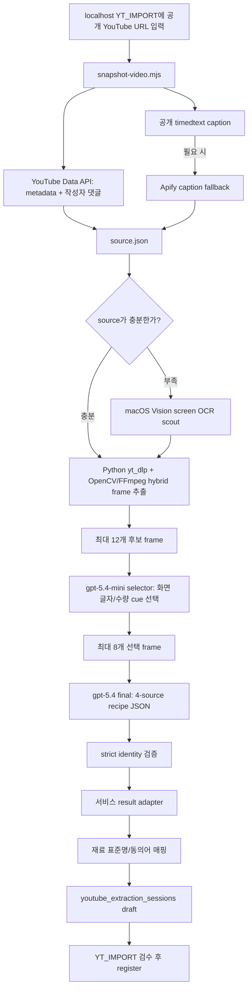

# YouTube `cv-goal-i031-ocr` Strict Parity Integration Plan

작성일: 2026-07-26

상태: exact localhost 구현 완료, 최종 검증·PR merge 진행 중

대상 서비스 저장소: 이 문서가 포함된 `homecook` repository root

실험/평가 근거 저장소: `/Users/cwj/01_vibe_coding/homecook-codex-vision-loop`

## 한 줄 결론

현재 완료·검증된 Train+Validation 후보 중 가장 좋은 후보는 `cv-goal-i031-ocr`이다. 당시 extractor bytes와 실행 옵션을 복구해 fingerprint를 exact match했고, fresh Validation promotion도 PASS했다. 완전 동일한 localhost 흐름은 Gemini를 쓰지 않지만, 당시 `source.json` 수집 방식까지 같게 하려면 `YOUTUBE_API_KEY`와 경우에 따라 `APIFY_TOKEN`이 필요하다.

## 이번 계획의 정정 사항

이 문서는 기존 계획의 아래 가정을 정정한다.

| 기존 가정 | 근거로 확인한 실제 `i031` 방식 |
| --- | --- |
| Gemini가 OCR/구조화를 담당한다 | Gemini는 `i031` 실행 identity에 없다 |
| macOS Vision OCR을 항상 실행하거나 전혀 사용하지 않는다 | `i031`은 `screenOcrMode=auto`다. source가 충분하면 local scout를 건너뛰고, 부족하면 macOS Vision OCR을 실행한다. selector 모델은 두 경우 모두 후보 프레임의 화면 글자를 직접 읽는다 |
| 임의 URL도 provider key 없이 100% 동일하게 수집할 수 있다 | 당시 `snapshot-video.mjs`는 `YOUTUBE_API_KEY`를 필수 검사했고, Train 9/9와 Validation 5/8 source의 caption provider가 `apify`였다 |
| 현재 experiment repo의 최신 runner를 호출하면 동일하다 | 현재 client/prompt는 `i031` 이후 크게 바뀌어, 최신 코드를 호출하면 다른 실험이 된다 |
| candidate lock의 commit만 checkout하면 동일하다 | lock의 commit에 있는 client identity와 실제 결과 identity가 달라, commit만으로는 100% 복구되지 않는다 |

`cv-goal-i031-ocr`의 화면 글자 처리는 두 겹이다. `screenOcrMode=auto`가 source 부족 시 macOS Vision helper로 화면 글자 변화 후보를 보강하고, 선택 모델 `gpt-5.4-mini`가 최대 12개 후보 프레임을 직접 보고 `onscreenText`와 `quantityCues`를 뽑는다. 뒤이어 `gpt-5.4`가 선택된 프레임과 설명란·작성자 댓글·caption/transcript를 함께 읽어 레시피 JSON을 만든다.

## 읽은 기준 문서

서비스 저장소:

- `AGENTS.md`
- `docs/sync/CURRENT_SOURCE_OF_TRUTH.md`
- `docs/workpacks/README.md`
- `docs/engineering/agent-workflow-overview.md`
- `docs/engineering/slice-workflow.md`
- `docs/engineering/git-workflow.md`
- `docs/engineering/qa-system.md`
- `docs/요구사항기준선-v1.7.28.md`
- `docs/화면정의서-v1.5.32.md`
- `docs/유저flow맵-v1.3.30.md`
- `docs/db설계-v1.3.30.md`
- `docs/api문서-v1.2.34.md`
- YouTube 관련 workpack `20`, `29`, `32`

실험 저장소:

- `AGENTS.md`
- `scripts/recipe-loop/snapshot-video.mjs`
- `scripts/recipe-loop/run-extraction.mjs`
- `scripts/recipe-loop/extract-video-frames.py`
- `scripts/recipe-loop/lib/codex-vision-keyframes-client.mjs`
- `notebooks/recipe_loop_data/*/_grade_summary*.json`
- `notebooks/recipe_loop_data/*/_semantic_summary*.json`
- `notebooks/recipe_loop_data/*/_promotion_summary*.json`
- `notebooks/recipe_loop_data/*/_candidate_lock*.json`
- `notebooks/recipe_loop_data/*/_pi_freeze*.json`
- `cv-goal-i031-ocr` 각 case의 `result.json`, `run-progress.json`, `file-access-manifest.json`

## 현재 가장 좋은 iter 확정

선정 범위는 Train과 Validation promotion을 모두 통과하고, expected count가 모두 채워졌으며, Validation candidate lock 검증과 누수 검사를 통과한 후보로 제한했다. 최신 번호라는 이유만으로 고르지 않았고, 실패·미완료·사전 gate 탈락 후보는 제외했다.

### 완료 후보 비교

Train deterministic:

| 후보 | Promotion | Recipe count | Ingredient F1 | Amount match | Amount coverage | Step coverage | Semantic avg | 시간 p50 / p95 |
| --- | --- | ---: | ---: | ---: | ---: | ---: | ---: | ---: |
| `cv-goal-i001` | PASS | `1.000` | `.952` | `.593` | `.653` | `.692` | `4.056` | `67.275s / 98.4s` |
| `cv-goal-i023` | PASS | `1.000` | `.963` | `.596` | `.685` | `.747` | `4.111` | `53.319s / 79.6s` |
| `cv-goal-i031-ocr` | PASS | `1.000` | `.961` | `.603` | `.676` | `.678` | `4.222` | `56.28s / 77.1s` |
| `iter27` | PASS | `1.000` | `.947` | `.600` | `.656` | `.685` | `4.111` | `68.64s / 83.7s` |

Validation deterministic:

| 후보 | Promotion | Recipe count | Ingredient F1 | Amount match | Amount coverage | Step coverage | Semantic avg | 시간 p50 / p95 | Lock / leak |
| --- | --- | ---: | ---: | ---: | ---: | ---: | ---: | ---: | --- |
| `cv-goal-i001` | PASS | `1.000` | `.886` | `.729` | `.791` | `.517` | `3.750` | `77.7s / 192s` | verified / clean |
| `cv-goal-i023` | PASS | `1.000` | `.901` | `.768` | `.801` | `.540` | `3.625` | `58s / 64.2s` | verified / clean |
| `cv-goal-i031-ocr` | PASS | `1.000` | `.925` | `.747` | `.788` | `.548` | `3.875` | `65s / 95.5s` | verified / clean |
| `iter27` | PASS | `1.000` | `.903` | `.750` | `.812` | `.534` | `3.625` | `60.2s / 73.2s` | verified / clean |

`cv-goal-i031-ocr`을 고른 이유:

1. Validation Ingredient F1 `.925`로 완료 후보 중 가장 높다.
2. Validation Semantic average `3.875`로 완료 후보 중 가장 높다.
3. Validation Step coverage `.548`도 완료 후보 중 가장 높다.
4. Amount match `.747`은 `iter27`의 `.750`보다 `.003` 낮고, Amount coverage `.788`은 `iter27`보다 `.024` 낮다. 이 약점은 공개하되, 재료·단계·semantic의 우위가 더 크다고 판단한다.
5. Train/Validation 모두 promotion PASS, failed attempt `0`, 최대 model call `2`, Validation candidate lock verified `true`, canary leak `clean`이다.

제외 예:

- `cv-goal-i068`: Validation promotion FAIL. deterministic execution/amount coverage와 screen OCR gate가 실패했다.
- `cv-goal-i083`: Train 사전 gate 실패로 완료 후보가 아니다.
- `cv-goal-i092`: benchmark 실패 후 cold Train 전에 revert되어 검증 후보가 아니다.
- 이후 v3 challenge PASS 결과: 해당 v3 lock과 dataset에 묶인 별도 후보이며 `i031` Train/Validation lock의 대체 근거로 섞지 않는다.

## Holdout과 데이터 누수

`cv-goal-i031-ocr` 자체에 연결된 fresh sealed Holdout PASS 근거는 없다. 현재 확인 가능한 기존 Holdout은 `iter27` lock 기반이며 실패했다.

| Holdout | 연결 candidate | 결과 | Ingredient F1 | Amount match / coverage | Step coverage | Semantic avg | Leak |
| --- | --- | --- | ---: | ---: | ---: | ---: | --- |
| `cv-goal-i027-holdout-cold` | `iter27` | FAIL | `.778` | `.659 / .677` | `.687` | `3.4` | `not_covered` |
| `cv-goal-i027-holdout-report` | `iter27` 결과 재보고 | FAIL | `.778` | `.659 / .677` | `.687` | `3.5` | `not_covered` |

따라서 `i031`은 **현재 가장 좋은 통합 후보**이지 **바로 전체 배포 가능한 후보**는 아니다. Production rollout 전 `i031` freeze를 복구한 뒤 fresh sealed Holdout을 한 번만 열어 PASS해야 한다.

Train/Validation freeze 근거:

- Train `caseCount=9`, `completedCount=9`, `forbiddenReadCount=0`
- Validation `caseCount=8`, `completedCount=8`, `forbiddenReadCount=0`
- Validation canary leak `clean`, hit count `0`
- model read boundary `clean`, enforcement `macos-sandbox-exec`

## `i031` 실행 identity

아래 값이 모두 같아야 “같은 방식”으로 인정한다.

| 항목 | 고정값 |
| --- | --- |
| provider | `codex-vision-keyframes` |
| final model | `gpt-5.4` |
| selector model | `gpt-5.4-mini` |
| prompt version | `single-recipe-four-source-v2` |
| selector prompt | `keyframe-selector-v6-single-compact-json` |
| final prompt | `keyframe-final-v44-explicit-action-clause` |
| client version | `codex-vision-keyframes-client-v19-onscreen-amount-recovery` |
| execution signature | `704359dfb34df5ac1d070078` |
| code fingerprint | `17f475ae308ca3fa514b0388f93701907e94b439410764f3b1d2e5f8ca65cc53` |
| candidate lock SHA-256 | `aa550e812181847b4567711f58f0cea57e5ac6320bf471adf745d8e9b6f5ea2b` |
| dataset manifest SHA-256 | `9a587a879ba2ffbcd0a521587c460d2d42adff7b25951a143fa0c442890fae77` |
| frame mode | `hybrid` |
| interval | `4s` |
| hybrid anchor budget | `36` |
| selector candidate limit | `12` |
| keyframe total limit | `8` |
| keyframes per recipe | `8` |
| screen OCR mode | `auto`: source 충분 시 skip, 부족 시 macOS Vision scout |
| recipe mode | `singleRecipeOnly=true` |
| run type | `cold`, `--no-cache` |
| model call upper bound | `2` (`selector 1 + final 1`) |

`result.json`과 candidate lock에 별도 field로 없던 값은 session artifact에서 복구했다. selector/final reasoning effort는 모두 `low`, client timeout은 `20분`, 실행 CLI는 `@openai/codex 0.144.0-alpha.4`다.

### Exact runtime 복구와 fresh 재검증 결과

Candidate lock의 `commitSha`는 `f7775f68cf7afa12079032b20f39039abaad4ba8`이다. 그러나 그 commit의 tracked client는 `codex-vision-keyframes-client-v4-single-fast12`, final prompt는 `keyframe-final-v32-single-four-source`다. 실제 `i031` 결과에는 각각 `v19-onscreen-amount-recovery`, `v44-explicit-action-clause`가 기록되어 있다.

즉, 실험 결과를 만든 중간 extractor bytes가 해당 commit에는 그대로 보존되지 않았다. 최신 experiment client는 이미 `v45`/`v59` 계열이므로 최신 코드를 호출하는 것도 동일 실행이 아니다. 이번 작업에서는 Codex session history에서 당시 49개 파일과 실행 command를 복구했다.

완료한 재현 gate:

1. `v19` extractor, `v44` prompt, 당시 command와 runtime option을 복구했다.
2. 49-file bundle fingerprint `17f475...`, manifest `9a587...`, execution signature `704359...`가 exact match했다.
3. exact CLI `@openai/codex 0.144.0-alpha.4`로 cold/no-cache Train 9건과 Validation 8건을 다시 실행했다.
4. Fresh Validation은 ingredient F1 `.935`, amount `.730`, amount coverage `.783`, step `.573`, semantic average `3.875`로 promotion PASS했다.
5. Fresh Train deterministic은 ingredient F1 `.958`, amount `.600`, amount coverage `.669`, step `.655`였고 step threshold `.675`에 미달해 FAIL했다.
6. 누수 canary는 clean이었다.

Exact identity는 복구됐지만 fresh Train 품질 drift가 있으므로 localhost 통합과 production 승인을 분리한다. 이번 구현은 localhost 임의 URL 검증까지 진행하고, preview/production enablement와 Holdout은 별도 승인 전 차단한다.

모델 서비스의 비결정성 때문에 같은 환경이어도 recipe 문장이 byte-for-byte 같다는 보장은 없다. 여기서 100%는 i031이 실제 호출하는 `source-text/single/global` 코드·프롬프트·모델·옵션·source 수집 경계를 동일하게 고정한다는 뜻이다. 원본 monolithic file의 비활성 public-source/segmented recipe-specific 분기는 누수 계약 때문에 service bundle에서 제거하며, 결과 품질은 promotion gate와 live smoke로 다시 확인한다.

## 키와 로컬 의존성

완전 동일 모드의 요구사항:

| 항목 | 필요 여부 | 이유 |
| --- | --- | --- |
| `GEMINI_API_KEY` | 불필요, strict mode에서 읽지 않음 | `i031` identity에 Gemini가 없다 |
| `YOUTUBE_API_KEY` | 필수 | 당시 `snapshot-video.mjs`가 metadata와 작성자 댓글을 가져오기 전에 키를 필수 검사한다 |
| `APIFY_TOKEN` | 조건부지만 parity dataset 재현에는 사실상 필요 | Train 9/9, Validation 5/8 source의 caption provider가 `apify`였다 |
| Codex CLI 로그인 상태 | 필수 | selector `gpt-5.4-mini`와 final `gpt-5.4`를 `codex exec`로 호출한다 |
| Supabase local/dev env | 서비스 연결 시 필수 | 로그인, extraction session, 재료 매핑과 등록 검증에 사용한다 |
| Python 3 + `yt_dlp` + OpenCV/FFmpeg | 필수 | 영상을 내려받고 hybrid frame을 만든다 |
| macOS | strict local parity 기준 필수 | 당시 model read boundary가 `macos-sandbox-exec`였다 |

`yt-dlp`로 metadata·caption·댓글을 모두 대체하면 API key를 줄일 수 있지만, 그것은 source provider와 fallback 동작이 바뀌므로 **100% strict parity가 아니다**. 나중에 별도 `compatible` 모드로 평가할 수는 있으나 이번 구현 범위에서는 제외한다.

## 목표와 비목표

목표:

- localhost의 기존 `YT_IMPORT` 화면에서 임의의 공개 단일 레시피 URL을 입력한다.
- 서비스 저장소에 포함된 exact i031 production runtime이 당시와 같은 source snapshot과 extractor identity로 결과를 만든다.
- 서비스 adapter가 결과를 기존 draft/session/재료 검수 계약으로 변환한다.
- Gemini visual/structured extractor로 조용히 우회하지 않는다.
- 결과가 불완전하면 기존 review-required 규칙으로 사용자 확인을 요구한다.

비목표:

- 최신 experiment harness를 `i031`이라고 부르는 것
- exact `screenOcrMode=auto`를 항상 실행하거나 항상 끄는 다른 정책으로 바꾸는 것
- YouTube Data API/Apify를 key 없는 수집기로 교체하는 것
- multi-recipe extraction 지원
- `i031` 결과를 특정 video ID별 fixture로 하드코딩하는 것
- fresh sealed Holdout 전 전체 사용자 rollout

## 추출 흐름



네 가지 source는 다음 우선순위를 유지한다.

1. 설명란의 명시 정보
2. 작성자 top-level 댓글
3. caption/transcript 발화
4. selector가 실제 frame에서 읽은 화면 글자와 시각 근거

수량 근거 우선순위는 `설명란/작성자 댓글 명시값 > 발화 자막 > 화면 자막 > 시각 추정`이다. 추정값은 자동 등록하지 않는다.

## 서비스 모듈 경계

실험 harness 전체를 서비스에 복사하지 않는다. 복구된 bundle에서 source 수집, frame 추출, selector/final 호출에 필요한 server-only production subset만 옮긴다. 원본 monolithic file의 비활성 `public-source` 제목 복구와 `segmented` 제목별 bridge는 production bundle에서 inert 처리한다. strict i031의 `source-text/single/global` 활성 경로는 유지하되 service manifest를 별도로 고정한다. grader, golden, dataset profile, promotion, review 파일은 포함하지 않는다.

구현된 경계:

- `app/api/v1/recipes/youtube/extract/route.ts`
  - 인증, feature flag, request wrapper 유지
  - parity 알고리즘을 직접 넣지 않음
- `lib/server/youtube-import.ts`
  - 기존 session/ingredient/register orchestration 유지
  - 현재 `youtube_ocr_extraction`이 Gemini provider를 여는 alias인 동작 제거
- `lib/server/youtube-i031-runtime.ts`
  - exact mode, preflight, manifest, timeout, 취소, 동시 실행 1개, JSON schema/identity와 safe metadata 관리
  - shell 문자열 조합 대신 `spawn` argument array를 사용하고 child env를 allowlist로 제한
- `lib/server/youtube-i031-runtime/bundle/`
  - exact `snapshot-video`, frame extractor, macOS Vision helper, v19 client, v44 prompt와 최소 transitive dependency만 포함
  - bundle/file manifest hash를 test와 runtime preflight에서 검증
  - golden/grade/review/holdout, dataset ID, batch harness 파일은 포함하지 않음
- `scripts/setup-youtube-i031-runtime.mjs`
  - 격리된 `.youtube-i031-tools`에 exact Codex CLI `0.144.0-alpha.4`를 설치하고 version을 검증

서비스와 worker의 최소 JSON contract:

```json
{
  "video_id": "11-character-id"
}
```

```json
{
  "schemaVersion": 1,
  "identity": {
    "executionConfigSignature": "704359dfb34df5ac1d070078",
    "clientVersion": "codex-vision-keyframes-client-v19-onscreen-amount-recovery",
    "finalPromptVersion": "keyframe-final-v44-explicit-action-clause"
  },
  "recipe": {},
  "meta": {}
}
```

Identity가 다르면 adapter는 결과를 저장하지 않고 내부 `I031_IDENTITY_MISMATCH`로 fail closed한다. Public API는 새 error code를 추가하지 않고 기존 `EXTRACTION_FAILED` wrapper를 유지한다.

## API와 비동기 작업

### Localhost 첫 완료선

기존 `POST /api/v1/recipes/youtube/extract`를 유지하되, 개발 환경에서만 i031 runtime completion을 기다린다. 전체 timeout은 exact client 기본값과 같은 최대 20분으로 두고, 사용자가 취소하거나 브라우저 연결이 끊기면 child process group에 종료 신호를 보낸다.

이 단계는 localhost 검증용이며 serverless production timeout에는 적합하지 않다.

### Production 완료선

Production은 queue 기반 비동기 job으로 분리한다.

1. `POST /recipes/youtube/extract`가 job을 만든다.
2. macOS i031 worker가 서비스 저장소의 안전한 exact-active-path runtime으로 source snapshot과 extraction을 수행한다.
3. 완료 후 service adapter가 draft/session을 원자적으로 저장한다.
4. UI는 `queued / collecting_source / extracting_frames / selecting_frames / extracting_recipe / mapping / completed / failed` 상태를 polling 또는 server event로 받는다.

새 status와 polling endpoint는 현재 공식 API에 없으므로 contract-evolution 전 구현하지 않는다. 모든 응답은 기존 `{ success, data, error }` wrapper를 유지한다.

## Timeout, 재시도, 실패 처리

Strict parity에서는 결과를 바꾸는 자동 fallback을 넣지 않는다.

| 단계 | 정책 |
| --- | --- |
| YouTube metadata/comments | 당시 collector 정책과 동일하게 실행, 일시적 network 오류만 1회 재시도 |
| public caption | 공개 timedtext 먼저, 당시 조건에 맞을 때 Apify 1회 fallback |
| frame extraction | 실험 옵션 그대로, 실패 시 전체 strict run 실패 |
| selector | 1회 호출, 자동 model 변경/추가 retry 금지 |
| final | 1회 호출, Gemini fallback/다른 model fallback 금지 |
| identity validation | 불일치 시 fail closed |
| 서비스 mapping | DB 일시 오류만 멱등 idempotency key로 재시도 |

사용자에게는 원인을 구분해 보여준다.

- source 수집 실패
- 영상 접근 제한
- caption fallback 실패
- frame extraction 실패
- Codex 로그인/모델 호출 실패
- strict identity mismatch
- 재료 매핑 검수 필요

Strict run이 실패했을 때 기존 text/Gemini 경로를 자동 실행하지 않는다. 사용자가 별도의 “기존 추출 방식으로 다시 시도”를 선택할 때만 모드를 바꾼다.

## 단계별 시간 근거

아래 시간은 `result.json.meta`의 cold/no-cache extraction 시간이다. source snapshot 생성 시간은 별도로 기록되지 않아 end-to-end 총시간에 포함할 수 없다.

| Split | N | Frame extract avg / p50 | Sampler avg | Selector avg / p50 | Final avg / p50 | Total avg | Promotion p50 / p95 |
| --- | ---: | ---: | ---: | ---: | ---: | ---: | ---: |
| Train | 9 | `9.770s / 8.111s` | `0.001s` | `23.655s / 22.688s` | `25.251s / 22.508s` | `59.306s` | `56.28s / 77.1s` |
| Validation | 8 | `9.642s / 9.806s` | `<0.001s` | `24.496s / 26.298s` | `35.358s / 34.535s` | `71.465s` | `65s / 95.5s` |

주의:

- local screen OCR이 실행되면 `ocr_total_ms`로 기록하고, selector가 frame을 직접 읽는 시간은 selector call 안에 포함된다.
- localhost end-to-end는 metadata/comments/caption 수집과 queue 대기 시간이 추가되므로 위 p95보다 길다.
- source 수집 시간 계측을 추가하되 extractor 입력과 실행 순서는 바꾸지 않는다.

## 재료 DB 표준명 매핑

Extractor 결과는 먼저 원문 그대로 보존하고, 그 다음 서비스 adapter에서 표준명 매핑을 수행한다.

1. `ingredients.standard_name` exact match
2. `ingredient_synonyms` normalized match
3. 하나의 높은 신뢰 후보만 있을 때 `needs_review`
4. 후보가 없거나 여러 개면 `unresolved`

새 재료 자동 INSERT는 금지한다. 사용자가 검수 화면에서 확인한 뒤 기존 `register_youtube_ingredient(...)` RPC를 사용한다. `draft_ingredient_id`, `quantity_review_required`, `quantity_confirmation_status` 서버 검증은 유지한다.

## 보안과 비밀값

- `YOUTUBE_API_KEY`, `APIFY_TOKEN`, Codex auth token은 server/worker env로만 주입한다.
- secret을 command argument, stdout, event payload, DB, browser response에 넣지 않는다.
- child process env는 allowlist로 만들고 전체 `process.env`를 그대로 전달하지 않는다.
- worker 임시 폴더는 request별 UUID와 mode `0700`을 사용한다.
- raw video/frame/source/provider response는 임시 작업 폴더에만 두고 성공/실패 후 정리한다.
- 보존이 필요한 것은 sanitized recipe result, identity, stage timing, reason code뿐이다.
- URL 전체 대신 `youtube_video_id` 또는 salted hash를 관측성 key로 사용한다.
- golden, grade, semantic review, holdout label 경로를 worker sandbox에 mount하지 않는다.

## 비용과 속도 제한

- 1 strict request는 YouTube Data API, 필요 시 Apify, Codex selector 1회, Codex final 1회를 사용한다.
- localhost 기본 동시 실행은 `1`이고, 두 번째 동시 요청은 `I031_BUSY` 내부 오류로 즉시 실패한다. Public API는 기존 `EXTRACTION_FAILED` wrapper를 유지한다.
- 사용자/일일 quota와 전역 concurrency gate를 둔다.
- strict acceptance test는 `--no-cache`를 유지한다.
- Production rollout 뒤 sanitized result cache를 추가할 수 있지만, cache hit는 strict cold parity 측정에서 제외한다.
- model, effort, frame 수를 비용 때문에 자동 축소하지 않는다. 변경하려면 새 iteration으로 다시 평가한다.

정확한 비용은 evidence에 token/cost aggregate가 없어 이 계획에서 추정하지 않는다. 구현 시 selector/final input/output token과 실제 청구 비용을 분리 계측한다.

## 로그와 관측성

필수 stage event:

- `parity_job_queued`
- `source_snapshot_started/completed/failed`
- `frame_extraction_started/completed/failed`
- `selector_started/completed/failed`
- `final_started/completed/failed`
- `identity_verified/mismatch`
- `ingredient_mapping_completed`
- `draft_created`
- `parity_job_cancelled/timed_out`

기록 값:

- parity bundle SHA-256
- client/prompt/execution signature
- stage elapsed ms
- frame/candidate/selected count
- model call count
- source availability boolean
- ingredient/step/unresolved/review-required count
- sanitized error code

기록 금지:

- raw description/comment/transcript
- raw frame와 provider response
- API key/token/cookie
- golden/review/grade data

## 데이터 누수와 하드코딩 방지

- worker 입력은 URL과 공개 source뿐이며 golden을 읽지 못하는 sandbox를 유지한다.
- Train/Validation replay는 extraction freeze가 끝난 뒤에만 grade를 실행한다.
- production bundle에는 dataset video ID 목록도 넣지 않는다.
- `videoId === ...`, 제목/채널별 recipe branch, 특정 재료 답안 목록을 금지한다.
- source snapshot/result cache를 production code fixture로 복사하지 않는다.
- source-only test fixture와 expected shape fixture를 분리한다.
- CI source scan으로 known Train/Validation/Holdout video ID와 recipe title literal을 검사한다.
- 원본 monolithic file에서 i031이 호출하지 않는 `public-source`/`segmented` recipe-specific 분기도 service bundle에서는 inert 처리한다.
- test-only allowlist는 profile Train/Validation/Holdout/excluded ID `32`개와 title `51`개를 포함하며 production `.mjs` 전체를 검사한다.

## 공식 문서 변경과 선행 승인

이 Stage 1 변경의 공식 API §6-2와 관련 기준 문서는 기존 `legacy` 모드와 localhost 전용 `i031_codex_vision` strict 모드를 함께 정의한다. strict 모드는 기존 endpoint/error wrapper를 유지하고, 안전한 JSON metadata만 저장하며, Gemini/legacy/visual fallback을 금지한다.

localhost 구현 전에 필요한 순서와 현재 상태:

1. 사용자의 “실험환경 100% 동일” 결정을 contract-evolution 승인 근거로 기록한다. **완료**
2. 이 PR에서 workpack의 `README.md`, `acceptance.md`, `automation-spec.json`, workflow item을 작성한다. **완료**
3. 이 PR에서 strict mode, 기존 error wrapper, 안전한 metadata 범위, localhost-only 경계를 공식 API/DB/User Flow 문서와 `CURRENT_SOURCE_OF_TRUTH.md`에 반영한다. **완료**
4. 독립 native Codex critic의 internal 1.5 검토를 통과한다. **완료**
5. Stage 1 contract-evolution PR `#1107`을 `master`에 merge한다. **완료**
6. 별도 implementation branch에서 service runtime과 기존 import 연결을 구현한다. **완료, 최종 merge gate 진행 중**

이 PR 자체가 localhost 구현에 필요한 contract-evolution이다. 비동기 job/status/polling과 production worker 운영은 승인 범위가 아니며, 필요해질 때 별도 contract-evolution을 거친다.

## 구현 순서와 예상 기간

기간은 1명 기준이며, Stage 0 복구 성공 이후의 범위다.

| 단계 | 작업 | 예상 |
| --- | --- | ---: |
| 0 | v19/v44 exact runtime 복구, fingerprint/identity 검증 | **완료** |
| 1 | Train 9 + Validation 8 cold replay, promotion 재검증 | **완료**, Validation PASS / Train threshold FAIL |
| 2 | Stage 1 workpack + localhost contract-evolution 문서 | **완료**, PR `#1107` merge |
| 3 | service runner/adapter/identity fail-closed TDD | **완료** |
| 4 | localhost YT_IMPORT 연결, 공개 URL runtime smoke | **완료**, 사용자 로그인 Manual Only 제외 |
| 5 | async worker, 보안/관측성/비용 gate | `1~2일` |
| 6 | fresh sealed Holdout, 제한 rollout/rollback 검증 | `0.5~1일` |

Stage 0~4의 자동 검증 범위는 완료됐다. Production worker·Holdout·단계적 출시는 이번 승인 범위 밖의 후속 `1.5~3일` 이상 작업이다.

## 테스트 계획

### Parity bundle

- code fingerprint `17f475...` exact
- execution signature `704359...` exact
- client/prompt/model/frame options exact
- Train 9/9, Validation 8/8 completed
- forbidden read `0`
- max model call `2`
- historical Train/Validation promotion PASS
- fresh exact Validation PASS, fresh exact Train step threshold FAIL

### Backend

- strict mode에서 Gemini factory가 호출되지 않음
- `YOUTUBE_API_KEY` 누락 시 source 단계에서 명시적 설정 오류
- Apify fallback 조건과 provider 기록
- child process argument injection 방지
- timeout/cancel 시 process group 종료
- identity mismatch 결과 저장 금지
- 실패 시 Gemini/text path 자동 fallback 금지
- result adapter가 unresolved/review-required를 보존
- cross-user/expired/consumed session 보호
- raw source/frame/secret 로그 금지

### Localhost 실제 링크

구현 PR에서 production TypeScript runner로 평가 dataset과 무관한 공개 단일 레시피 영상 1건을 실행했다.

- 결과: 제목·재료 6개·단계 6개
- 실행: model call `2`, frames `36`, selected frames `8`
- 단계 시간: frame `2.391s`, selector `23.744s`, final `13.199s`, exact extraction total `39.344s`
- production runner 전체 시간: 최초 `42.41s`, hardening 후 `51.03s`
- 누수 제거 후 재검증: `52.78s`, model call `2`, frames `36`, selected frames `8`, 임시 폴더 `0`
- source가 충분해 `screenOcrStatus=skipped`; 이것은 exact `auto` 분기의 정상 결과다
- 실행 후 request temp directory `0`

추가 수동 확인용 공개 단일 레시피 링크 유형:

1. 설명란이 풍부하고 public caption이 있는 영상
2. public caption이 막혀 Apify fallback이 필요한 영상
3. 설명란이 빈약해 macOS Vision screen OCR scout가 실행되는 영상

Negative case:

- 비공개/삭제/연령 제한 영상
- 댓글 비활성
- caption 없음
- 잘못된 YouTube key
- Apify quota/timeout
- Codex 로그아웃
- selector/final timeout
- parity identity 강제 mismatch

### 회귀 명령

구현 단계에서 다음을 기본 gate로 사용한다.

```bash
pnpm test -- tests/youtube-import.backend.test.ts tests/youtube-visual-quantity-eval.test.ts tests/youtube-corpus.test.ts
pnpm verify:backend
```

새 parity runner/adapter 전용 test 파일을 위 targeted set에 추가한다.

## Localhost 실행 계획

완성 후 개발자가 따를 흐름:

1. `pnpm youtube:i031:setup`으로 격리된 exact Codex CLI를 설치·검증한다.
2. `codex login status` 또는 동등한 방법으로 Codex CLI 로그인 상태를 확인한다.
3. Python 3, `yt_dlp`, OpenCV/FFmpeg 의존성을 검증한다.
4. `.env.local`에 Supabase 값, `YOUTUBE_API_KEY`, 조건부 `APIFY_TOKEN`, strict extractor mode를 넣는다.
5. `pnpm dev`로 서비스를 실행한다.
6. `http://localhost:3000/menu/add/youtube`에 접속한다.
7. 임의의 공개 단일 레시피 URL을 입력한다.
8. 기존 loading 화면에서 완료를 기다린다. 현재 public API는 중간 stage를 노출하지 않는다.
9. 검수 화면에서 제목, 재료, 수량, 단계, unresolved/review-required를 확인한다.
10. DB의 safe `i031_extractor.identity`와 timing이 고정값과 일치하는지 확인한다.

예시 env 이름은 Stage 1에서 확정한다.

```dotenv
YOUTUBE_RECIPE_EXTRACTOR_MODE=i031_codex_vision
YOUTUBE_API_KEY=server-only
APIFY_TOKEN=server-only
```

`GEMINI_API_KEY`는 strict mode 완료 조건에 포함하지 않는다.

## 정확도와 사용자 경험 영향

예상 정확도:

- 근거 기준 Validation Ingredient F1 `.925`, Amount match `.747`, Amount coverage `.788`, Step coverage `.548`, Semantic average `3.875`
- 새 임의 링크에 같은 수치를 보장할 수는 없다. dataset 밖 일반화는 fresh Holdout과 localhost real-link smoke로 확인한다.
- 화면 글자가 중요한 영상에서 text-only보다 수량·재료 회수 가능성이 높지만, OCR 오독과 선택 frame 누락은 남는다.

예상 시간:

- extraction 자체 Validation p50 `65s`, p95 `95.5s`
- source snapshot 시간이 추가되므로 실제 localhost는 보통 이보다 느리다.
- 이번 공개 영상 smoke는 source 수집을 포함해 세 번 `42.41s`, `51.03s`, `52.78s`였다.
- 현재 localhost 첫 완료선은 기존 loading/error/retry UI를 재사용한다. 단계별 진행률과 polling은 후속 contract-evolution 범위다.

## 출시와 롤백

1. localhost developer only
2. 내부 allowlist
3. fresh sealed Holdout PASS
4. beta `5%`
5. p95, failure rate, unresolved rate, register completion rate 확인
6. `25%`
7. 전체 rollout

롤백:

- strict feature flag off
- 새 job 접수 중단, 진행 중 job 취소
- 기존 YouTube text/Gemini 경로는 별도 모드로 유지
- additive DB field/table은 읽기 무시가 가능해야 함
- parity bundle SHA를 이전 승인 버전으로 되돌림

Strict mode가 실패했다고 자동으로 기존 모드 결과를 섞지 않는다. 롤백은 사용자에게 모드 전환을 분명히 보여준다.

## 완료 기준

- [x] v19/v44 활성 경로 복구와 비활성 recipe-specific 분기 제거
- [x] code fingerprint `17f475...` exact
- [x] execution signature `704359...` exact
- [x] Train/Validation cold replay 완료: Validation PASS, Train threshold FAIL 공개
- [x] 공식 문서와 Stage 1 workpack merge
- [x] strict mode에서 Gemini 호출 `0`
- [x] production TypeScript runner로 평가 외 공개 링크 1개 완료
- [x] safe frame/selector/final/total timing과 source/OCR 상태 저장
- [x] identity mismatch fail closed
- [x] secret/raw source/raw frame 로그 `0`
- [x] 재료 표준명 매핑과 review-required 통합 검증 통과
- [x] targeted tests와 `pnpm verify:backend` PASS
- [ ] fresh sealed Holdout PASS
- [x] env를 기본 `legacy`로 유지하는 rollback 경계 검증

Localhost 직접 실행 완료는 exact runtime identity와 공개 URL smoke를 기준으로 판단한다. Preview/production rollout 완료는 fresh sealed Holdout까지 통과하기 전 보고하지 않는다.

## 핵심 근거 파일

실험 성능:

- `notebooks/recipe_loop_data/train/_grade_summary.cv-goal-i031-ocr-train-cold.json`
- `notebooks/recipe_loop_data/train/_semantic_summary.cv-goal-i031-ocr-train-cold.json`
- `notebooks/recipe_loop_data/train/_promotion_summary.cv-goal-i031-ocr-train-cold.json`
- `notebooks/recipe_loop_data/validation/_grade_summary.cv-goal-i031-ocr-validation-cold.json`
- `notebooks/recipe_loop_data/validation/_semantic_summary.cv-goal-i031-ocr-validation-cold.json`
- `notebooks/recipe_loop_data/validation/_promotion_summary.cv-goal-i031-ocr-validation-cold.json`

고정 identity와 누수:

- `notebooks/recipe_loop_data/train/_candidate_lock.cv-goal-i031-ocr-train-cold.json`
- `notebooks/recipe_loop_data/train/_pi_freeze.cv-goal-i031-ocr-train-cold.json`
- `notebooks/recipe_loop_data/validation/_pi_freeze.cv-goal-i031-ocr-validation-cold.json`
- `notebooks/recipe_loop_data/train/YUdJBeOdrMY/runs/cv-goal-i031-ocr-train-cold/result.json`
- `notebooks/recipe_loop_data/train/YUdJBeOdrMY/runs/cv-goal-i031-ocr-train-cold/file-access-manifest.json`

source 수집과 실행:

- `scripts/recipe-loop/snapshot-video.mjs`
- `scripts/recipe-loop/run-extraction.mjs`
- `scripts/recipe-loop/extract-video-frames.py`
- `scripts/recipe-loop/lib/codex-vision-keyframes-client.mjs`

Holdout 제한:

- `notebooks/recipe_loop_data/holdout/_grade_summary.cv-goal-i027-holdout-cold.json`
- `notebooks/recipe_loop_data/holdout/_semantic_summary.cv-goal-i027-holdout-cold.json`
- `notebooks/recipe_loop_data/holdout/_promotion_summary.cv-goal-i027-holdout-cold.json`
