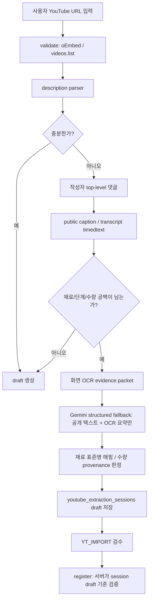

# YouTube Codex Vision OCR Production Integration Plan

작성일: 2026-07-25  
상태: 계획 전용, 구현 금지  
대상 서비스 저장소: `/Users/cwj/01_vibe_coding/homecook`  
실험/평가 근거 저장소: `/Users/cwj/01_vibe_coding/homecook-codex-vision-loop`

## 결론

현재 production 통합 후보는 `cv-goal-i031-ocr`이다. 최신 번호를 고른 것이 아니라, 미완료·실패·검증 전 실행을 제외하고 Train과 Validation promotion을 모두 통과한 후보 중 Validation 품질이 가장 균형적이기 때문에 선택한다.

단, Holdout은 이 후보에 대해 아직 통과 근거가 없다. `cv-goal-i027-holdout-*`는 `iter27` candidate lock 기반 Holdout에서 실패했고, v3 Holdout challenge 통과 결과들은 Train/Validation lock과 직접 연결된 production 승격 근거로 보기 어렵다. 따라서 구현 전 선행 조건은 `cv-goal-i031-ocr` 계열 또는 그 production용 재현 후보를 fresh sealed Holdout에서 1회 검증하는 것이다.

## 읽은 기준 문서

서비스 저장소:

- `AGENTS.md`
- `docs/sync/CURRENT_SOURCE_OF_TRUTH.md`
- `docs/workpacks/README.md`
- `docs/engineering/agent-workflow-overview.md`
- `docs/engineering/slice-workflow.md`
- `docs/engineering/git-workflow.md`
- `docs/engineering/qa-system.md`
- `docs/engineering/workflow-v2/README.md`
- `docs/api문서-v1.2.27.md`
- `docs/db설계-v1.3.23.md`
- `docs/유저flow맵-v1.3.25.md`
- YouTube 관련 workpack: `20`, `21`, `22`, `27`, `29`, `30`, `32`

실험 저장소:

- `AGENTS.md`
- `notebooks/recipe_loop_data/README.md`
- `notebooks/recipe_loop_data/BASELINE.md`
- `notebooks/recipe_loop_data/REVIEW_train.md`
- `notebooks/recipe_loop_data/REVIEW_validation.md`
- `notebooks/recipe_loop_data/REVIEW_holdout.md`
- `notebooks/recipe_loop_data/*/_grade_summary*.json`
- `notebooks/recipe_loop_data/*/_semantic_summary*.json`
- `notebooks/recipe_loop_data/*/_promotion_summary*.json`
- `.omx/plans/goal-single-recipe-generalization-iteration-031.md` 계열 근거는 요약 JSON으로 대체 확인
- `.omx/plans/goal-single-recipe-generalization-iteration-068.md`
- `.omx/plans/goal-single-recipe-generalization-iteration-083.md`
- `.omx/plans/goal-single-recipe-generalization-iteration-092.md`

## 후보 비교

Train+Validation을 모두 통과한 후보만 아래 표에 포함했다. `i068`은 Train은 통과했지만 Validation promotion이 실패했다. `i083`은 Train amount coverage `.692`가 사전 gate `>.693`에 미달해 실패했다. `i092`는 OCR 이미지 1.5x 실험이 benchmark에서 실패해 cold Train 전에 revert되었다.

| 후보 | Train promotion | Validation promotion | Train F1 / amount / step | Validation F1 / amount / step | Semantic Train / Validation | 시간 p50 / p95 | 누수 상태 |
| --- | --- | --- | --- | --- | --- | --- | --- |
| `cv-goal-i001` | PASS | PASS | `.952 / .593 / .692` | `.886 / .729 / .517` | `4.056 / 3.750` | Train `67.275 / 98.4`, Validation `77.7 / 192` | Train `not_applicable`, Validation `clean` |
| `cv-goal-i023` | PASS | PASS | `.963 / .596 / .747` | `.901 / .768 / .540` | `4.111 / 3.625` | Train `53.319 / 79.6`, Validation `58 / 64.2` | Train `not_applicable`, Validation `clean` |
| `cv-goal-i031-ocr` | PASS | PASS | `.961 / .603 / .678` | `.925 / .747 / .548` | `4.222 / 3.875` | Train `56.28 / 77.1`, Validation `65 / 95.5` | Train `not_applicable`, Validation `clean` |
| `iter27` | PASS | PASS | `.947 / .600 / .685` | `.903 / .750 / .534` | `4.111 / 3.625` | Train `68.64 / 83.7`, Validation `60.2 / 73.2` | Train `not_applicable`, Validation `clean` |

선택 근거:

1. `cv-goal-i031-ocr`은 Validation 재료 F1 `.925`로 통과 후보 중 가장 높다.
2. Validation semantic average `3.875`도 통과 후보 중 가장 높다.
3. amountMatchRate `.747`는 `iter27`의 `.750`보다 낮지만 차이가 `.003`뿐이고, 재료 F1·semantic 우위를 뒤집을 정도가 아니다.
4. Train p50 `56.28s`, p95 `77.1s`는 `iter27`보다 빠르고 `cv-goal-i023`보다 약간 느리지만 production 후보로 감당 가능한 범위다.
5. Validation candidate lock verified가 `true`이고 canary leak status가 `clean`이다.

Holdout 비교:

| Holdout 실행 | 연결성 | 결과 | 핵심 수치 | 판단 |
| --- | --- | --- | --- | --- |
| `cv-goal-i027-holdout-report` | `iter27` candidate lock 기반 | FAIL | F1 `.778`, amount `.659`, amountCoverage `.677`, step `.687`, semantic avg `3.5` | production 승격 근거로 사용 불가 |
| `cv-v3-r40-stacked-quantity-card-b69-cold` | v3 Holdout challenge 단건/특수 | PASS | F1 `.941`, amount `1`, amountCoverage `1`, step `.444`, semantic avg `4` | Train/Validation lock 연결 부족 |
| `cv-v3-r47-bounded-ocr-cooking-text-challenge8-cold` | v3 exposed OCR challenge | PASS | F1 `.912`, amount `.776`, amountCoverage `.915`, step `.582`, semantic avg `4` | OCR 방향성 참고 가능, 직접 승격 근거 아님 |
| `cv-v3-r53-480p-exposed-challenge8-cold` | v3 exposed OCR challenge | PASS | F1 `.898`, amount `.815`, amountCoverage `.872`, step `.474`, semantic avg `4` | OCR 방향성 참고 가능, 직접 승격 근거 아님 |

## Production 통합 목표

`cv-goal-i031-ocr`의 “설명란 + 작성자 댓글 + transcript/caption + 화면 OCR” 조합을 서비스의 YouTube 추출 흐름에 안전하게 넣는다. 실험 harness를 복사하지 않고, 서비스의 기존 경계인 `POST /api/v1/recipes/youtube/extract`, `youtube_extraction_sessions`, `youtube_llm_extraction_cache/events`, `youtube_visual_extraction_cache/events`, `YT_IMPORT` 검수 화면을 확장한다.

개발 완료 후에는 개발자가 로컬에서 서비스를 켜고, `http://localhost:3000/menu/add/youtube` 또는 `http://localhost:3000/recipes/new/youtube`에 임의의 공개 YouTube 레시피 링크를 입력해 새 OCR 통합 경로로 추출 결과를 확인할 수 있어야 한다. 이 로컬 수동 확인은 “계획 문서만 존재하는 상태”가 아니라, backend 구현·UI 연결·feature flag 설정·provider env 설정·DB migration 적용까지 끝난 뒤의 완료 기준이다.

## 공식 문서 변경과 선행 승인

구현 전 `contract-evolution` 또는 Stage 1 workpack이 필요하다.

- API 문서: `POST /api/v1/recipes/youtube/extract`에 OCR evidence packet, async job status, timeout/fallback metadata를 additive로 정의해야 한다.
- DB 문서: `youtube_visual_extraction_cache/events`가 현재 visual quantity 중심이므로 화면 OCR 전체 패킷 저장 범위를 명확히 해야 한다. 새 테이블을 만들지 재사용할지는 Stage 1에서 결정한다.
- 유저플로우: 기존 flow는 공개 텍스트 뒤 visual quantity enrichment만 설명한다. 화면 OCR이 단계/재료 보강에도 쓰이는 흐름을 추가해야 한다.
- Workpack: 새 product slice이므로 Claude Stage 1이 `docs/workpacks/<slice>/README.md`, `acceptance.md`, `automation-spec.json`, `.workflow-v2` work item을 먼저 작성하고 main에 merge해야 한다.
- 사용자 승인: 화면 OCR이 provider 비용과 처리 시간을 늘리며, public contract와 DB metadata를 넓히므로 구현 전 승인 필요.

## 서비스 모듈 경계

권장 경계:

- `app/api/v1/recipes/youtube/extract/route.ts`: 지금처럼 `handleYoutubeExtract`만 호출한다.
- `lib/server/youtube-import.ts`: orchestration만 담당한다. source 수집, fallback 판단, 세션 저장, 응답 조립을 연결한다.
- `lib/server/youtube-description-parser.ts`: description/comment/caption 텍스트 parser는 유지한다.
- 신규 서버 모듈 후보:
  - `lib/server/youtube-ocr-evidence.ts`: 화면 OCR evidence packet 생성, 필터링, 정규화.
  - `lib/server/youtube-extraction-pipeline.ts`: description/comment/caption/OCR/LLM fallback 단계 상태를 한 곳에서 조립.
  - `lib/server/youtube-extraction-observability.ts`: event log, timing, 비용, provider status 기록.
- `components/recipe/youtube-import-screen.tsx`: 기존 검수 화면에 evidence badge, review-required 수량/단계 표시만 추가한다. 추출 로직을 클라이언트로 옮기지 않는다.

## 추출 흐름

핵심 원칙:

- `extraction_methods`는 계속 `description | comment | caption`만 기록한다.
- OCR과 Gemini는 source가 아니라 `source_providers`와 `extraction_meta_json`에 보조 처리로 기록한다.
- 화면 OCR로 얻은 수량은 `visual_explicit` 또는 review-required로 내려간다.
- `recipe_inferred`는 사용자 확인 없이 자동 등록 금지다.

## API와 비동기 작업 흐름

1. 1단계 구현은 기존 sync `POST /extract` 안에서 전체 timeout을 지켜 실행한다.
2. OCR/vision이 1회 요청 timeout을 넘기기 쉬우면 `extraction_job_id` 기반 async job을 contract-evolution으로 먼저 정의한다.
3. async가 필요하면 `POST /extract`는 `202 accepted`가 아니라 기존 wrapper `{ success, data, error }` 정책을 유지하는 새 응답 shape를 문서화해야 한다.
4. polling endpoint를 추가한다면 새 endpoint이므로 API 문서와 workpack 승인 전 구현 금지다.

로컬 개발 테스트 모드는 다음 조건을 만족해야 한다.

- `pnpm dev`로 실행한 localhost에서 기존 `YT_IMPORT` 화면을 그대로 사용한다.
- `.env.local`에는 YouTube provider key, Gemini key, Supabase local/dev 연결값, `youtube_import=true`와 `youtube_ocr_extraction=true` feature flag가 설정되어야 한다. 구현은 운영용 `YOUTUBE_RECIPE_VISUAL_QUANTITY_ENABLED`/`YOUTUBE_RECIPE_VISUAL_RECIPE_ENABLED`도 계속 지원한다.
- OCR 통합 경로가 켜져 있으면 `youtube_extraction_sessions.extraction_meta_json`과 visual extraction event/cache row에서 `attempted`, `cache_hit`, `status`, `source_provider` 요약을 확인할 수 있어야 한다. API 응답 shape를 새로 늘리는 일은 별도 contract-evolution 전에는 하지 않는다.
- OCR 통합 경로가 꺼져 있으면 기존 public-text-only 추출 결과로 fallback되어야 한다.
- 임의 링크 테스트는 공개 영상만 대상으로 하며, 로그인 전용 caption, 비공개 영상, age-restricted 영상은 실패/skip 처리를 확인하는 negative case로만 쓴다.

권장 timeout:

- public text fetch/parser: 5~8초
- author comment fetch: 3~5초, page cap 1 유지
- caption/transcript timedtext: 5~8초
- OCR evidence packet: 20~30초 hard cap
- Gemini structured fallback: 25~35초 hard cap
- 전체 `POST /extract`: sync 유지 시 60~75초 hard cap

## 재시도와 실패 처리

- provider 429/quota: 즉시 fallback 또는 검수 화면에서 public-text-only draft 제공, `error_code=QUOTA_DENIED` event 기록.
- provider 5xx/network: 1회 짧은 jitter retry만 허용, 같은 요청 안 무한 retry 금지.
- OCR 실패: draft 생성을 막지 않고 `quantity_review_required=true` 또는 step warning으로 보수 처리.
- Gemini JSON parse 실패: raw response 저장 금지, sanitized error만 event에 기록.
- 세션 만료: 기존 `410` 정책 유지.
- consumed 재등록: 기존 `409` 정책 유지.
- cross-user 접근: 기존 `404` 정책 유지.

## 재료 DB 표준명 매핑

- `ingredients.standard_name`과 `ingredient_synonyms`를 우선 사용한다.
- 새 재료 자동 INSERT 금지. 미등록/애매한 재료는 `unresolved` 또는 `needs_review`로 내려서 YT_IMPORT에서 사용자 확인을 받는다.
- 외부 공공/상용 데이터는 raw import → normalization → review → approved seed 이후에만 production dictionary가 된다.
- v1 canonical 8종 category label은 유지하고, v2 `category_code`는 optional additive로만 사용한다.
- 동의어는 confidence만으로 자동 확정하지 않고, 기존 `register_youtube_ingredient(...)` RPC 경로를 따른다.

## 보안과 비밀값

- YouTube URL, raw source text, transcript, raw OCR frame, provider raw response, API key는 `operational_events`에 저장하지 않는다.
- cache에는 sanitized structured result만 저장한다.
- provider key는 서버 env에서만 읽고 클라이언트로 내려주지 않는다.
- service-role insert/update는 route handler 내부로 제한한다.
- 사용자별 rate limit은 events table 기준으로 계산한다.

## 비용과 속도 제한

- 캐시 키는 `youtube_video_id + source_hash + schema_version + model/provider`로 둔다.
- 같은 사용자 반복 요청은 cache hit를 우선한다.
- OCR/vision은 text-only 결과가 registration-ready이면 skip한다.
- source-rich 영상은 OCR을 건너뛰거나 수량 gap이 있는 row만 target한다.
- p50 목표는 Validation 기준 65초 이하, p95 목표는 95.5초 이하를 초기 기준으로 둔다.
- model call 상한은 실험 근거처럼 최대 2회를 기본으로 유지한다.

## 로그와 관측성

필수 event:

- `text_sources_collected`
- `author_comment_attempted/skipped/used`
- `caption_attempted/skipped/used`
- `ocr_attempted/cache_hit/success/error`
- `llm_structured_attempted/cache_hit/success/error`
- `draft_created`
- `register_blocked_by_review_required`

기록할 수 있는 값:

- provider, model, status, reason code
- input/output token 수와 추정 비용
- 단계별 elapsed ms
- draft ingredient count, step count, unresolved count
- sanitized provenance summary

기록 금지:

- YouTube URL 전체
- raw source text
- transcript 전문
- OCR 원본 frame
- provider raw response
- API key, cookie, OAuth token

## 단계적 출시와 롤백

1. `youtube_ocr_extraction` feature flag를 추가한다.
2. 내부/개발 환경에서 fixture와 real smoke만 허용한다.
3. beta 사용자 5% 또는 admin allowlist로 제한한다.
4. p95, quota error, unresolved rate, register completion rate를 본다.
5. 문제가 있으면 flag off로 즉시 public-text-only 경로로 되돌린다.
6. DB migration은 additive-only로 작성하고, rollback SQL 또는 ignore-safe read path를 준비한다.

## 데이터 누수와 하드코딩 방지

- Validation 개별 golden 접근 금지 원칙을 production 코드에도 반영한다. 테스트 fixture 외 videoId별 특수 분기 금지.
- 실험 cache/result를 서비스 코드에 복사하지 않는다.
- source packet에는 public source만 포함하고, 정답지·review note·golden metadata는 포함하지 않는다.
- `videoId === ...` 조건, 특정 채널명/제목별 hardcoded recipe rule은 금지한다.
- 후보 승격 전 fresh sealed Holdout을 1회 실행하고, 실패 시 production rollout 금지.

## 테스트와 승인 기준

Stage 1 문서 gate:

- 공식 문서 변경 필요 여부와 사용자 승인 기록이 명시되어야 한다.
- workpack acceptance에 Happy Path, State/Policy, Error/Permission, DataIntegrity, ManualQA, AutomationSplit가 있어야 한다.

Backend tests:

- source priority: description > author comment > caption/transcript > OCR 보조.
- text-only ready면 OCR skip.
- OCR 실패 시 fallback draft 생성.
- `quantity_review_required=true`면 quick import auto-register 차단.
- `quantity_confirmation_status` 서버 draft 기준 검증.
- raw source/provider response 로그 금지.
- cache hit와 quota denied event 기록.
- cross-user/expired/consumed session 보호.

Frontend tests:

- YT_IMPORT에서 evidence badge와 review-required 상태 표시.
- unresolved/needs_review 수량·재료가 있으면 저장 차단.
- provider 실패 시 사용자에게 재시도/수동 수정 경로 제공.

Regression/eval:

- `pnpm verify:backend`
- `pnpm test -- tests/youtube-import.backend.test.ts tests/youtube-visual-quantity-eval.test.ts tests/youtube-corpus.test.ts`
- real app route smoke 1회
- fresh sealed Holdout PASS 후에만 rollout 승인

Localhost manual smoke:

1. `pnpm install --frozen-lockfile`
2. local/dev Supabase migration 적용
3. `.env.local`에 `YOUTUBE_API_KEY`, Gemini key, Supabase env, `youtube_import=true`, `youtube_ocr_extraction=true` 설정
4. `pnpm dev`
5. 브라우저에서 `http://localhost:3000/menu/add/youtube` 접속
6. 임의의 공개 YouTube 레시피 링크 입력
7. 결과 검수 화면에서 제목, 재료, 수량, 단계, evidence/provenance 배지, review-required 차단 여부 확인
8. 서버 로그와 `youtube_visual_extraction_events`, `youtube_visual_extraction_cache`, `youtube_extraction_sessions.extraction_meta_json`에서 `attempted/success/cache_hit/error` 확인
9. 같은 링크를 한 번 더 입력해 cache hit 경로 확인
10. `youtube_ocr_extraction=false`로 다시 실행해 기존 fallback 경로가 동작하는지 확인

Localhost smoke 완료 기준:

- 공개 레시피 링크 3개 이상에서 추출 화면까지 도달한다.
- source-rich 링크 1개는 OCR이 skip되거나 최소 호출로 끝난다.
- sparse text 링크 1개는 OCR 또는 structured fallback이 시도된다.
- OCR/provider 실패를 강제로 만들었을 때 public-text-only draft 또는 사용자 수정 가능한 오류 상태로 복구한다.
- 추정 수량 또는 unresolved 재료가 있으면 quick import 자동 등록이 차단된다.
- raw YouTube URL, raw transcript, raw OCR frame, provider raw response가 운영 로그에 남지 않는다.

## 구현 순서

1. 사용자 승인: OCR production 통합과 공식 계약 변경 승인.
2. Claude Stage 1: 새 workpack, acceptance, automation-spec, workflow item 작성.
3. Contract evolution: API/DB/User Flow 문서에 OCR evidence packet과 async 여부 반영.
4. Codex Stage 2: backend tests를 먼저 작성해 현재 public-text-only 경계 고정.
5. Backend 구현: source packet builder, OCR evidence adapter, cache/events, draft merge.
6. Backend 검증: targeted tests, `verify:backend`, real route smoke.
7. Claude Stage 4: YT_IMPORT badge/review UI 연결.
8. Codex Stage 5/6: design/FE review와 closeout.
9. Localhost manual smoke: 개발자가 임의 공개 YouTube 레시피 링크로 새 추출 경로를 확인할 수 있어야 한다.
10. Fresh sealed Holdout: production rollout 전 1회 통과 필수.
11. Feature flag rollout: 내부 → allowlist → 제한 비율 → 전체.

## 남은 위험

- `cv-goal-i031-ocr`은 Holdout 통과 근거가 없어 바로 배포 후보가 아니다.
- OCR/vision 비용과 p95가 실제 production provider에서 커질 수 있다.
- 현재 공식 문서는 visual quantity enrichment 중심이라, step/ingredient OCR 보강 범위는 contract-evolution이 필요하다.
- Gemini semantic judge는 작은 calibration 기반 guardrail이며 사람 검수를 대체하지 않는다.
- 서비스 worktree에는 기존 사용자 변경이 많아 구현 전 branch/worktree 정리가 필요하다.
