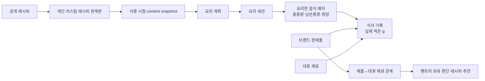

# 요리 계획·식사 기록 분리, 커스텀 레시피, 완제품 검색 통합 실행 계획

- 작성일: 2026-07-22
- 상태: 18차 독립 재검토 P0/P1 반영 완료 · application-controlled SECURITY DEFINER mutation 전수 hotfix 선행 필요 · 사용자 계약 변경 승인 대기
- 구현 여부: 미착수
- 범위: 공식 계약, DB/API, 요리 계획, 식사 기록, 커스텀 레시피, 완제품·재료 연결, 검색, 이관, QA

> 이 문서는 구현 승인이 아니다. 현재 공식 계약에서 비목표인 실제 섭취 기록을 도입하는 `contract-evolution` 후보이며, `사용자 명시 승인 기록 → contract-evolution 공식 문서 PR → 각 successor Stage 1 + internal 1.5 docs gate → 구현` 순서를 통과하기 전에는 제품 코드·DB migration을 시작하지 않는다.

## 1. 결론부터

이번 작업은 단순한 플래너 UI 수정이 아니다. 현재 하나의 플래너에 섞여 있는 `요리 계획`과 `실제로 먹은 기록`을 분리하고, 그 사이를 `실제로 요리된 음식 배치(cooked batch)`가 연결하도록 도메인을 바로잡는 작업이다.

확정할 제품 방향은 다음과 같다.

1. 하단 `플래너` 탭은 유지하고 내부를 `요리 계획 | 식사 기록`으로 나눈다.
2. `요리 계획`은 레시피를 언제 무엇으로 요리할지 관리한다. 계획 영양 합계와 새 완제품 계획 추가는 제거한다.
3. `식사 기록`은 현재 주간 계획표를 복제하지 않는다. 선택한 하루를 중심으로 하루 총영양, 끼니별 영양, 실제 먹은 음식과 양을 빠르게 기록하는 전용 UI로 만든다.
4. 요리 완료 시 음식만의 완성 중량을 저장한다. 저울이 없으면 요리 완료는 허용하되, 중량을 입력하기 전까지 해당 음식의 `g 기준 식사 기록`은 막는다.
5. 커스텀 레시피를 다시 수정해 저장하면 기본적으로 같은 개인 레시피의 현재 내용을 갱신한다. 사용자가 `새 레시피로 저장`을 선택했을 때만 별도 레시피 ID를 만든다.
6. 모든 편집 이력을 저장하지 않는다. 실제 사용 경계인 `계획 등록`, `장보기 생성/갱신`, `요리 시작·완료`, `식사 기록`에서만 불변 스냅샷을 만들고 내용 해시로 중복 제거한다.
7. 미래 요리 계획 반영은 영향 목록과 건수만 보여주고 `전체 반영 / 기존 계획 유지` 중 하나를 고르게 한다. 날짜별 선택은 제공하지 않는다.
8. 미완료 장보기 목록은 새 레시피에 맞춰 재계산할 수 있고, 완료된 장보기 목록은 절대 수정하지 않는다. 추가 장보기나 옛 레시피로 요리하기도 만들지 않는다.
9. 브랜드 제품은 `ingredient_synonyms`에 넣지 않는다. 제품과 대표 재료의 관계를 별도 테이블로 관리해 팬트리 추천에서는 샘표 간장도 `간장 보유`로 인식한다.
10. HOME 검색은 계속 레시피 전용이다. 완제품 검색은 식사 기록 추가와 커스텀 레시피 재료 선택에서 사용한다.
11. `연세크림빵`처럼 공백 없이 일부만 기억한 검색은 브랜드와 제품명을 합쳐 후보를 찾고 관련도 순으로 정렬한다. `연세`와 `크림빵`을 모두 만족하는 결과가 한 조각만 만족하는 결과보다 먼저 나와야 한다.
12. 레시피 영양의 단일 기준은 `recipe_nutrition_snapshots`다. content snapshot은 영양 벡터를 복제하지 않고 exact `recipe_nutrition_snapshot_id`만 고정한다.
13. cooked batch 잔량은 append-only event 원장과 멱등 요청으로 관리한다. 과거 event를 수정·삭제하지 않고 취소 event로 원복한다.
14. 같은 화면에 섞여 보이는 `제품·재료` 결과는 서버의 통합 read model이 단일 정렬·단일 cursor로 제공한다.
15. 구현은 계정 세대 기반 workpack `F0`과 기존 #1~#14를 합친 정확히 15개 successor workpack으로 나누고, 독립적으로 회귀 검증·출고 가능한 기능군별 release train으로 닫는다.
16. 현행 application-controlled `SECURITY DEFINER` mutation의 익명 실행 가능성은 `delete_user_private_data` 한 함수만의 문제가 아니다. 전체 함수를 control class+allowlist로 inventory하되 application-controlled 함수에는 최소 실행권한·NULL 인증 거부를 적용하고 provider/extension-managed 함수에는 immutable baseline·Data API 비노출 검증을 적용하는 별도 보안 hotfix를 이 계획보다 먼저 배포한다. 이 hotfix는 아래 15개 successor workpack 수에 포함하지 않는 공통 선행조건이다.

## 2. 현재 구현에서 확인한 사실

- 현재 공식 기준은 요구사항·화면·Flow·DB·API 5개 문서이며, 계약 변경은 구현 전에 공식 문서와 SOT를 먼저 갱신해야 한다. [CURRENT_SOURCE_OF_TRUTH.md:3](../../docs/sync/CURRENT_SOURCE_OF_TRUTH.md#L3)
- 현행 공식 계약은 실제 섭취 기록을 MVP 비목표로 두고, `cook_done`을 먹은 것으로 해석하지 않는다. 이번 작업은 명백한 contract evolution이다. [요구사항기준선-v1.7.21.md:74](../../docs/요구사항기준선-v1.7.21.md#L74)
- 현재 `PLANNER_WEEK`는 장보기·요리 상태를 가진 주간 식사 계획 화면이며 날짜·주간 `계획 영양`을 표시한다. [화면정의서-v1.5.27.md:814](../../docs/화면정의서-v1.5.27.md#L814)
- `meals`는 Recipe workflow 전용이고 `registered → shopping_done → cook_done` 상태 전이를 가진다. 완제품은 별도 `product_planner_entries`다. [요구사항기준선-v1.7.21.md:78](../../docs/요구사항기준선-v1.7.21.md#L78)
- Meal은 생성 당시 `recipe_nutrition_snapshot_id`를 고정하지만, 재료·조리법 전체를 보존하는 content snapshot은 없다. [20260716090000_add_recipe_nutrition_snapshots.sql:1](../../supabase/migrations/20260716090000_add_recipe_nutrition_snapshots.sql#L1)
- 현행 공식 영양 authority는 `recipe_nutrition_snapshots`의 base/scalable/fixed/status vector 한 곳이며, 선택 인분 공식은 `scalable × selected/base + fixed`다. 새 content snapshot이 같은 vector를 복제하면 이 계약과 충돌한다. [CURRENT_SOURCE_OF_TRUTH.md:87](../../docs/sync/CURRENT_SOURCE_OF_TRUTH.md#L87) [api문서-v1.2.26.md:580](../../docs/api문서-v1.2.26.md#L580)
- 현재 snapshot trigger는 `is_current` 외 update와 모든 DELETE를 차단하고, nutrition writer는 predicate 없는 `ON CONFLICT (recipe_id, input_hash, calculation_version)`에 의존한다. 개인 레시피를 soft delete하면 `recipe_id`를 null로 분리할 이유가 없으므로 기존 NOT NULL FK·일반 unique·writer 계약을 유지하고, 회원 탈퇴 hard delete만 통제된 cleanup 예외로 두는 편이 안전하다. [20260716090000_add_recipe_nutrition_snapshots.sql:383](../../supabase/migrations/20260716090000_add_recipe_nutrition_snapshots.sql#L383) [20260716090000_add_recipe_nutrition_snapshots.sql:1069](../../supabase/migrations/20260716090000_add_recipe_nutrition_snapshots.sql#L1069)
- `meals`, `cooking_session_meals`, `leftover_dishes`는 모두 `recipes.id`를 NOT NULL FK로 참조한다. 개인 레시피 개별 hard delete는 snapshot만 분리해도 실패하므로 `recipes.deleted_at` 기반 soft delete가 현재 역사 보존 구조와 맞는다. [20260301000000_core_schema_bootstrap.sql:244](../../supabase/migrations/20260301000000_core_schema_bootstrap.sql#L244) [20260429050000_14_cook_session_tables.sql:34](../../supabase/migrations/20260429050000_14_cook_session_tables.sql#L34) [20260429080000_15a_cook_planner_complete.sql:13](../../supabase/migrations/20260429080000_15a_cook_planner_complete.sql#L13)
- 요리 완료는 `leftover_dishes`를 만들고 인분만 저장한다. 완성 음식 중량과 남은 g은 없다. [20260429080000_15a_cook_planner_complete.sql:170](../../supabase/migrations/20260429080000_15a_cook_planner_complete.sql#L170)
- `product_planner_entries`는 제품명·브랜드·영양 버전을 고정하지만 장보기·요리·남은요리에는 참여하지 않는다. [20260716150000_prepared_food_planner_entries.sql:4](../../supabase/migrations/20260716150000_prepared_food_planner_entries.sql#L4)
- 완제품 검색 요청은 `q/source/cursor/limit`를 받지만 query는 trim만 한다. [prepared-food-catalog.ts:291](../../lib/server/prepared-food-catalog.ts#L291)
- DB 검색은 `lower(name) LIKE '%검색어%' OR lower(brand) LIKE '%검색어%'`라서 `연세크림빵`이라는 연속 문자열이 없으면 실패한다. [20260718123000_community_prepared_food_catalog_list_perf.sql:247](../../supabase/migrations/20260718123000_community_prepared_food_catalog_list_perf.sql#L247)
- `pg_trgm`과 name/brand GIN 인덱스는 이미 있으므로 외부 검색엔진 없이 개선할 기반은 있다. [20260718123000_community_prepared_food_catalog_list_perf.sql:1](../../supabase/migrations/20260718123000_community_prepared_food_catalog_list_perf.sql#L1)
- 로컬 catalog는 공공 제품 287,041건이며 기존 성능 증거는 DB search p95 약 24.7ms, route p95 약 392ms다. [2026-07-18-stage2-real-db.md:91](../../docs/workpacks/nutrition-products-cross-slice-release-qa/evidence/2026-07-18-stage2-real-db.md#L91)
- 현행 회원 탈퇴는 `delete_user_private_data` transaction으로 개인 기록을 삭제하고 재가입 때 이전 기록을 노출하지 않는 계약이다. 신규 meal log/batch/snapshot도 이 cleanup 경계에 들어가야 한다. [db설계-v1.3.22.md:368](../../docs/db설계-v1.3.22.md#L368)
- 현재 `users`에는 명시적인 timezone authority column이 없고 `settings_json`만 있다. 식사 기록 날짜는 변경 가능한 현재 설정에서 매번 재계산하지 않고 record-time IANA timezone을 함께 고정해야 한다. [20260301000000_core_schema_bootstrap.sql:47](../../supabase/migrations/20260301000000_core_schema_bootstrap.sql#L47)
- 현재 남은요리 reader/mutation은 `leftover|eaten`만 알고 `eaten`을 다먹음·자동 숨김·`leftover_eaten` XP로 해석한다. 버림을 같은 값으로 투영하면 기존 의미가 깨진다. 또한 authenticated owner에게 `leftover_dishes` 전체 UPDATE 정책이 열려 있어 RPC-only 원장을 column DML로 우회할 수 있고, `leftover` 복원 시 기존 CHECK상 `eaten_at`과 `auto_hide_at`을 모두 null로 만들어야 한다. [leftovers/route.ts:130](../../app/api/v1/leftovers/route.ts#L130) [eat/route.ts:133](../../app/api/v1/leftovers/%5Bleftover_id%5D/eat/route.ts#L133) [20260429080000_15a_cook_planner_complete.sql:24](../../supabase/migrations/20260429080000_15a_cook_planner_complete.sql#L24) [20260429080000_15a_cook_planner_complete.sql:57](../../supabase/migrations/20260429080000_15a_cook_planner_complete.sql#L57)
- 현행 XP event는 `xp_delta > 0`만 허용하고 source별 unique이며 기존 `uneat`도 XP/activity를 회수하지 않는다. 이번 batch reversal이 XP를 음수 보상하거나 summary/level/badge를 재계산하도록 넓히지 않고, 최초 `leftover_eaten:{batch_id}` 획득은 유지하되 재소진 시 unique source로 중복 지급만 막아야 한다. [20260610120000_33a_user_progress_foundation.sql:18](../../supabase/migrations/20260610120000_33a_user_progress_foundation.sql#L18) [uneat/route.ts:63](../../app/api/v1/leftovers/%5Bleftover_id%5D/uneat/route.ts#L63)
- 계획 작성 시점에 `31-recipe-media-tags`는 `in-progress`, `36e-recipe-tags-frontend`는 `ready-for-review`, `cook-mode-whole-board`는 `implementation`이며 각각 `/recipes/images`·`MANUAL_RECIPE_CREATE`, `MANUAL_RECIPE_CREATE`, `COOK_MODE`를 수정하므로 관련 후속 train의 merge 선행 조건이다. [31-recipe-media-tags/README.md:15](../../docs/workpacks/31-recipe-media-tags/README.md#L15) [docs/workpacks/README.md:196](../../docs/workpacks/README.md#L196) [docs/workpacks/README.md:213](../../docs/workpacks/README.md#L213)
- `recipebook-diary-port`는 아직 `implementation`이지만 레시피 항목 클릭의 기존 목적지는 이미 `RECIPE_DETAIL`이다. 개인 레시피 편집 CTA를 `RECIPE_DETAIL`에 고정하면 MYPAGE/RECIPEBOOK_DETAIL을 건드리지 않고 이 진행 중 slice를 새 선행조건으로 만들지 않을 수 있다. [recipebook-diary-port/README.md:15](../../docs/workpacks/recipebook-diary-port/README.md#L15) [recipebook-diary-port/README.md:22](../../docs/workpacks/recipebook-diary-port/README.md#L22)
- 현재 Meal 생성 route는 ownership/read 검증 뒤 별도 REST INSERT를 수행한다. 별도 RPC에서 advisory lock만 잡으면 그 RPC transaction 종료와 함께 lock이 풀리므로, 최종 검증·lock·write가 한 DB RPC transaction 안에 있어야 한다. [meals/route.ts:585](../../app/api/v1/meals/route.ts#L585)
- 현재 recipe 이미지 route는 Storage upload 뒤 URL/path만 반환하고 durable object registry나 upload 실패 보상 경로가 없다. Storage 성공 후 DB 기록이 실패하면 orphan object가 생길 수 있다. [recipes/images/route.ts:76](../../app/api/v1/recipes/images/route.ts#L76)
- 현행 `delete_user_private_data(uuid)`뿐 아니라 `complete_standalone_cooking`, `complete_cooking_session`, `complete_shopping_list`, `create_shopping_list_from_payload`도 `SECURITY DEFINER` mutation인데 `auth.uid() IS NULL`을 거부하지 않는 형태의 owner check와 PostgreSQL 기본 `PUBLIC EXECUTE`가 결합되어 있다. 로컬 `pg_proc/proacl`·`has_function_privilege`에서 PUBLIC/anon 실행 가능성이 확인됐으며, `register_youtube_ingredient` 두 signature도 익명 canonical-data write가 가능한지 같은 allowlist audit에 포함해야 한다. [20260718090000_community_prepared_food_catalog.sql:1023](../../supabase/migrations/20260718090000_community_prepared_food_catalog.sql#L1023) [20260512093000_leftover_card_metadata.sql:30](../../supabase/migrations/20260512093000_leftover_card_metadata.sql#L30) [20260620065500_shopping_already_have_pantry_reflection.sql:14](../../supabase/migrations/20260620065500_shopping_already_have_pantry_reflection.sql#L14) [20260616143000_launch_readiness_atomic_rpcs.sql:144](../../supabase/migrations/20260616143000_launch_readiness_atomic_rpcs.sql#L144) [20260609110000_taxonomy_v2_additive.sql:289](../../supabase/migrations/20260609110000_taxonomy_v2_additive.sql#L289)
- 로컬 catalog에는 `supabase_admin`/extension 소유 `net.http_get/http_post`도 `SECURITY DEFINER`+anon EXECUTE로 존재하지만 migration 역할은 이 함수의 grant option/owner 권한이 없고 `net` schema는 현재 Data API exposed schema가 아니다. 전수 inventory에서 놓치면 안 되지만 application 함수와 같은 ACL/search_path mutation을 시도해서도 안 된다. [config.toml:11](../../supabase/config.toml#L11)
- 현행 planner cooking session 생성은 권한/Meal 검증, session INSERT, session-meal INSERT가 여러 REST 호출로 나뉘며 standalone complete는 mutable `recipe_id`와 servings만 받아 완료 시점에 batch를 만든다. 레시피 수정과 조리 시작이 경쟁하면 실제 시작 때 사용한 content를 원자적으로 pin할 authority가 없고 standalone complete 재시도는 새 batch/cook count를 중복 생성할 수 있다. [cooking/sessions/route.ts:1](../../app/api/v1/cooking/sessions/route.ts#L1) [cooking.ts:1](../../lib/api/cooking.ts#L1)
- 회원 탈퇴 Route Handler는 service-role key가 없으면 authenticated route client로 fallback한다. 함수 실행권한을 service-role-only로 잠글 때 이 fallback도 제거하고 안전하게 500/운영 이벤트로 실패시켜야 한다. [users/me/route.ts:268](../../app/api/v1/users/me/route.ts#L268)
- 같은 `recipe-images` URL은 `recipes.thumbnail_url`뿐 아니라 자유 URL 입력을 받는 `recipe_books.cover_image_url`에도 저장될 수 있다. 따라서 recipe row만 join한 legacy inventory는 사용 중인 레시피북 커버를 orphan으로 오판할 수 있다. [recipe-books/route.ts:434](../../app/api/v1/recipe-books/route.ts#L434) [mypage-screen.tsx:1125](../../components/mypage/mypage-screen.tsx#L1125)
- 현재 `recipe-images`는 public bucket이고 authenticated owner 경로의 INSERT/UPDATE/DELETE가 열려 있으며, manual recipe 화면은 브라우저에서 직접 `.remove()`를 호출한다. 이 상태에서는 private 이미지 접근과 registry/outbox-only 삭제를 강제할 수 없다. [20260530103000_31_recipe_media_tags.sql:1](../../supabase/migrations/20260530103000_31_recipe_media_tags.sql#L1) [manual-recipe-create-screen.tsx:759](../../components/recipe/manual-recipe-create-screen.tsx#L759)
- 탈퇴 뒤 같은 auth UUID로 로그인하면 `public.users`가 다시 생성될 수 있다. 완료 tombstone의 단순 존재 여부로 upload를 막으면 재가입 계정도 영구 차단되므로 owner UUID와 별도로 account generation을 고정해야 한다. [user-bootstrap.ts:303](../../lib/server/user-bootstrap.ts#L303)
- 저장소에는 제품 outbox용 `vercel.json`/Cron 설정이나 제품 전용 launchd가 없고, 현재 launchd surface는 OMO 작업 스케줄러 전용이다. P0 MacBook self-hosting에는 별도 제품 worker 산출물이 필요하다. [omo-scheduler-install.mjs:1](../../scripts/omo-scheduler-install.mjs#L1)
- 새 successor slice는 별도 Stage 1 workpack 문서가 merge된 뒤에만 구현할 수 있다. [docs/workpacks/README.md:102](../../docs/workpacks/README.md#L102)

## 3. 목표 사용자 흐름



### 3-1. 커스텀 레시피 저장 규칙

| 사용자 행동 | 결과 |
| --- | --- |
| 공개 레시피의 `내 레시피로 수정` 후 저장 | 공개 원본은 그대로 두고 `origin_recipe_id`를 가진 owner-only 개인 레시피 ID 생성 |
| 개인 레시피를 다시 수정 후 `저장` | 같은 개인 레시피 ID의 현재 내용을 갱신 |
| `새 레시피로 저장` | 별도 개인 레시피 ID 생성, 두 레시피 모두 유지 |
| 개인 레시피 `삭제` | `deleted_at`을 기록해 새 검색·선택·레시피북에서는 숨기되 기존 미래 계획·요리·과거 기록의 FK와 snapshot은 보존. 실제 hard delete는 회원 탈퇴 cleanup에서만 수행 |
| 저장만 하고 어디에도 사용하지 않음 | 별도 역사 버전/스냅샷을 만들지 않음 |
| 계획·장보기·요리에 실제 사용 | 사용 시점 content snapshot 생성 또는 같은 hash snapshot 재사용 |
| 과거 기록 조회 | 당시 사용한 snapshot을 읽음. 현재 레시피 수정의 영향을 받지 않음 |

공개 `RECIPE_DETAIL`에는 로그인 사용자를 위한 `내 레시피로 수정` CTA를, 개인 `RECIPE_DETAIL`에는 owner만 보는 편집·삭제 CTA를 둔다. 비로그인 사용자는 로그인 후 같은 공개 recipe의 fork editor로 복귀한다. `MYPAGE`와 `RECIPEBOOK_DETAIL`은 레시피 항목을 기존처럼 `RECIPE_DETAIL`로 연결하기만 하며, 이번 범위에서 편집 UI를 추가하거나 `recipebook-diary-port`에 의존하지 않는다.

### 3-2. 개인 레시피 수정 후 미래 영향 처리

1. 저장 전에 client가 `base_recipe_revision`과 저장하려는 전체 draft를 preview API에 보낸다. 서버는 draft를 실제 PATCH와 같은 canonicalizer로 정규화해 `proposed_content_hash`를 만들고, 영향받는 미래 계획 수·날짜 범위·미완료/완료 장보기 수와 대상별 Meal revision, active cooking claim 존재/session ID를 계산한다. active claim 수와 `replace_all` 차단 여부를 UI에 함께 반환한다.
2. 서버는 owner-scoped 임시 `recipe_change_previews` row에 `base_recipe_revision + proposed_content_hash + target_set_revision_hash(Meal revisions + active claims/session IDs) + expires_at`을 저장하고 추측 불가능한 opaque `impact_token`을 반환한다. client가 token payload나 hash를 직접 만들게 하지 않는다.
3. UI는 날짜별 checkbox 없이 `모든 미래 계획에 반영`과 `기존 계획 유지`만 제공하며, 저장 요청에 preview한 것과 정확히 같은 draft, `base_recipe_revision`, `impact_token`을 함께 보낸다.
4. Recipe PATCH는 하나의 DB RPC transaction 안에서 recipe ID 기반 canonical transaction advisory lock을 먼저 획득하고, 그 안에서 preview row lock, owner/recipe/만료, base revision, canonical proposed content hash, 대상 집합/revision hash 재검증과 모든 write를 끝낸다. lock key는 기존 `recipe_nutrition_recipe_lock_key(recipe_id)`와 동일한 값을 재사용하고, 이름을 일반화하더라도 새 namespace를 만들지 않고 기존 helper가 같은 key로 위임하게 한다. 하나라도 달라졌으면 레시피·Meal·장보기를 전혀 수정하지 않고 `409`로 최신 preview 재확인을 요구한다.
5. 개인 recipe soft DELETE와 모든 `deleted_at` 복원 경로, 미래 Meal 생성·수정·삭제, 장보기 생성·재계산도 각각 단일 DB RPC transaction으로 옮겨 같은 recipe advisory lock 안에서 권한/상태 재검증과 write를 완료한다. Route Handler가 lock RPC를 먼저 호출한 뒤 별도 REST INSERT/UPDATE/DELETE를 실행하는 구조는 금지한다. route의 사전 read 검증은 UX용일 뿐 DB RPC가 최종 authority다.
6. 여러 recipe를 다루는 장보기 RPC는 같은 transaction 안에서 UUID 정렬 순서로 lock을 잡아 deadlock을 막는다. 이 공통 lock 없이는 preview 검증 직후 새 Meal이 옛 snapshot으로 생길 수 있으므로 관련 writer 하나도 예외로 두지 않는다.
7. `모든 미래 계획에 반영`이면 오늘 이후이며 아직 `cook_done`이 아닌 Meal의 content snapshot을 일괄 교체하되 active claim이 하나라도 있으면 조용히 제외하지 않고 전체 무변경 `409 MEAL_COOKING_ALREADY_STARTED`로 최신 preview를 요구한다. `기존 계획 유지`는 claimed Meal을 포함해 어떤 Meal도 repin하지 않는다.
8. 미완료 장보기 목록은 같은 transaction에서 재계산한다. 동일 재료·단위 항목의 체크/팬트리 제외 상태는 보존하고, 새 항목은 미체크, 더 이상 필요 없는 항목은 다른 Meal의 필요량이 없을 때만 제거한다.
9. 완료된 장보기 목록과 그 item은 read-only로 그대로 둔다. 다만 요리는 새 레시피 snapshot으로 진행하며 `완료한 장보기 기록은 바뀌지 않아요` 안내만 보여준다.
10. 과거 날짜, `cook_done`, 완료된 요리 세션, 과거 식사 기록은 절대 repin하지 않는다.

### 3-3. 요리 완료와 식사 기록 계산

- 완성 중량은 용기를 제외한 먹을 수 있는 음식 전체 무게다.
- UI 기본 입력은 `음식만 무게(g)`다. 보조 입력으로 `용기 포함 무게 - 빈 용기 무게` 계산기를 제공할 수 있다.
- 저울이 없으면 `나중에 입력`을 허용한다. 이 경우 요리 완료/팬트리/상태 전이는 정상 완료되지만, 해당 배치는 중량 입력 전까지 식사 기록 후보에서 `무게 입력 필요`로 표시되고 g 섭취 등록은 차단된다.
- `나중에 입력`하는 값도 `완성 직후 음식 전체 중량`만 허용한다. 첫 consumption/discard event 전이고 사용자가 아직 일부를 먹거나 버리지 않았음을 확인한 경우에만 입력할 수 있다. 이미 일부를 먹었고 원래 전체 중량을 모르면 `현재 남은 중량`을 전체 중량으로 대체하지 않으며, 그 배치는 P0에서 g 영양 기록 불가 상태로 남긴다.
- 배치 영양의 단일 기준은 content snapshot이 가리키는 immutable `recipe_nutrition_snapshot_id`다. content snapshot이나 batch row에 같은 레시피 영양 벡터를 별도 authority로 복제하지 않는다. 유효 snapshot이 없어 ID가 null이면 batch 영양은 `unavailable`이며 임의 재계산이나 0 보충을 하지 않는다.
- 영양소별 배치 전체 영양은 기존 공식식 `scalable_values[n] × cooking_servings / base_servings + fixed_values[n]`로 계산한다. `cooking_servings`는 해당 요리 세션/독립 요리에 실제 확정된 인분이며 batch에 고정한다.
- 실제 섭취 계산식은 `섭취 영양[n] = 배치 전체 영양[n] × 섭취 g / finished_weight_g`다. 예: 기본 2인분 레시피를 10인분 요리했다면 먼저 scalable 부분만 5배 하고 fixed 부분을 한 번 더한 뒤, 그 배치에서 먹은 g 비율을 적용한다.
- 영양 결측은 기존처럼 `complete / partial / unavailable`을 유지하며 0으로 바꾸지 않는다.
- 조리 중 영양 손실률·잔존율은 현재 모델링하지 않으므로 결과에 `예상`을 표시한다.
- 섭취 수정·삭제, 버림, 잔량 조정은 append-only 배치 잔량 event와 식사 기록을 한 transaction으로 처리하고 모든 batch 변경 요청을 멱등하게 만든다.

## 4. 식사 기록 UI 확정안

현재 요리 플래너의 주간 카드·상태 chip 구조를 재사용하지 않는다. 실제 섭취 기록은 하루 단위로 자주 입력하고 바로 고쳐야 하므로 `day-first` 세로 목록이 적합하다.

```text
플래너
[ 요리 계획 ] [ 식사 기록 ]

‹  7월 20  21  [22]  23  24  25  26  ›

오늘 먹은 영양
1,620 kcal   탄수 190g · 단백질 82g · 지방 54g
나트륨 2,100mg                일부 정보 없음 1건

아침                                      420 kcal
  닭가슴살 샐러드 120g                     수정 · 삭제
  연세우유 생크림빵 초코 0.5봉             수정 · 삭제
  + 아침에 먹은 음식 추가

점심                                      680 kcal
  어제 요리한 김치찌개 300g · 남은 양 740g
  + 점심에 먹은 음식 추가

저녁                                      기록 없음
  + 저녁에 먹은 음식 추가
```

### 4-1. 화면 구조

- 상단: Planner 내부 segment `요리 계획 | 식사 기록`.
- 날짜 탐색: 7일 horizontal strip + 선택일. 화면 본문은 선택한 하루만 표시한다.
- 날짜 그룹의 authority는 저장된 `consumed_local_date`다. 현재 device/profile timezone으로 과거 `consumed_at`을 다시 변환해 날짜를 옮기지 않는다.
- 하루 요약: 열량·탄수화물·단백질·지방을 우선, 나트륨은 보조. 목표 달성률·의료 조언은 제공하지 않는다.
- 끼니 section: 기존 사용자 `meal_plan_columns`의 label/order를 표시 설정으로 재사용하되, Meal과 식사 기록 row는 별도 테이블이다. meal log의 column FK는 nullable `ON DELETE SET NULL`, `slot_name_snapshot`은 필수다.
- 삭제된 끼니에 속한 과거 기록은 사라지거나 다른 끼니로 이동하지 않는다. 활성 끼니 section 뒤에 `삭제된 끼니 · {slot_name_snapshot}`으로 모아 표시하고 새 기록 대상으로는 선택할 수 없게 한다.
- 각 section header: 해당 끼니 영양 소계와 incomplete count.
- entry row: 이름, 브랜드/출처, 실제 양, 핵심 영양, `예상/최소/정보 준비 중`, 수정·삭제.
- empty/loading/error/unauthorized/partial/unavailable을 모두 별도 상태로 제공한다.
- 주간 영양 분석은 P0 핵심이 아니다. 7일 strip에 기록 유무만 표시하고, 별도 주간 분석은 후속으로 둔다.

### 4-2. 음식 추가 sheet

1. 끼니 section의 `+`를 누르면 해당 날짜·끼니가 이미 선택된 full-height sheet가 열린다.
2. 상단 source switch는 `요리한 음식 | 제품·재료`다.
3. query가 비어 있으면 `최근 먹은 음식`과 `자주 먹는 음식`을 먼저 보여준다.
4. `요리한 음식`은 최근 cooked batch를 `요리일·완성 중량·남은 g`과 함께 보여준다.
5. `제품·재료` 검색은 대표 재료와 브랜드 제품을 같은 결과 페이지에 보여주되 카드 유형과 source badge로 구분한다. 별도 `브랜드 제품 더보기`는 만들지 않는다.
6. 사용자 등록 제품은 기존 `사용자 등록` badge를 유지하고 공공 제품과 함께 검색한다.
7. 제품 선택 시 label basis와 호환되는 단위만 허용하고, 승인된 exact relation이 없으면 serving/package↔g/mL를 추정하지 않는다.
8. 최근 사용량을 기본값으로 제안할 수 있지만 저장 전 사용자가 실제 양을 확인한다.
9. 이 목록은 client가 재료 API와 제품 API를 각각 호출해 합치지 않는다. 서버 통합 search read model이 `ingredient | food_product` typed union, 전역 관련도 정렬, 단일 opaque cursor, 단일 `has_next`를 반환한다.

## 5. 완제품 검색 설계

### 5-1. 현재 실패 원인

현재 검색은 name 또는 brand 한 필드에 전체 query가 연속으로 포함되어야 한다. `연세크림빵`은 실제 데이터의 `연세우유 생크림빵 초코` 어디에도 연속으로 존재하지 않으므로 결과가 없다. 공백만 제거하는 것으로는 `연세우유생크림빵초코` 중간의 `우유생` 때문에 여전히 해결되지 않는다.

### 5-2. P0 검색 파이프라인

1. 정규화
   - Unicode NFKC, lowercase, 연속 공백 정리.
   - 비교용 compact 값은 공백·일반 구분기호를 제거한다.
   - query 길이 상한을 둬 비정상 비용을 막는다.
2. 검색 document
   - `brand + name`을 합친 normalized document와 compact document를 만든다.
   - 기존 migration 파일은 수정하지 않고 새 migration에서 immutable normalizer와 expression/generated index를 추가한다.
   - public catalog용 index와 owner-private product용 index/조회 경로를 분리해 private row 존재와 규모가 public 검색 계획·통계에 섞이지 않게 한다.
3. indexed candidate retrieval
   - exact substring, 유효한 split fragment 쌍의 AND match, `pg_trgm` indexed similarity를 합쳐 제한된 후보를 먼저 가져온다. `연세|크림빵`은 두 fragment가 모두 있는 row를 index 후보에 포함하므로 similarity threshold 하나에 recall을 맡기지 않는다.
   - ranking 전 후보 수에는 상한을 두되, 실제 fixture Recall@20이 유지되는 최소 안전 상한을 측정해 정한다.
   - 1~2글자 query는 fuzzy 검색을 금지하고 prefix/substring만 허용한다.
4. coverage 판정
   - 공백이 있는 query는 모든 유효 token이 brand+name 전체에서 확인되는 후보를 우선한다.
   - 공백 없는 4글자 이상 query는 가능한 분할점 중 양쪽이 2글자 이상인 조합을 평가한다. `연세|크림빵`이 brand/name 전체에 모두 존재하면 높은 coverage 점수를 준다.
   - 한 조각만 맞는 후보는 두 조각 모두 맞는 후보보다 앞설 수 없다.
5. 관련도 정렬
   - exact name/brand → compact 연속 일치 → 모든 기억 조각 coverage → trigram similarity 순으로 점수를 준다.
   - query가 있을 때는 관련도가 source/최신순보다 우선하고, source 신뢰도와 created_at/id는 tie-break로만 쓴다.
   - query가 없을 때는 기존 source partition·최신순 browse 정렬을 유지한다.
6. 안정적인 pagination
   - 검색 정렬 tuple은 raw 부동소수점 대신 정수/고정값인 `(algorithm_version, match_bucket, coverage_bucket, quantized_score, source_partition, created_at, id)`로 잠근다. raw similarity는 ranking 계산에 쓸 수 있지만 cursor에는 넣지 않는다.
   - cursor는 위 tuple과 query/filter fingerprint를 가진 opaque v2로 발급하고, unified 제품·재료 검색에서는 결과 유형 partition까지 같은 tuple에 포함한다.
   - query 유무와 관계없이 기존 v1 `created_at + id` cursor와 새 v2 cursor를 dual decode한다. v1 query cursor는 기존 정렬 의미로 끝까지 처리하고, 새 첫 페이지부터 v2를 발급해 배포 중 pagination을 깨지 않는다.
7. UI 요청 제어
   - 200~300ms debounce, 한글 IME composition 종료 후 요청, 최신 generation만 반영한다.
   - 결과 없음은 ranked candidate가 실제로 0일 때만 표시한다.

### 5-3. 검색 품질 fixture와 기준

구현보다 먼저 실제 local catalog에서 50~100개의 labeled query fixture를 만든다.

- 필수 positive: `연세크림빵`, `연세 크림빵`, `연세우유`, `생크림빵`, 공백/구분기호 변형.
- 필수 negative: `연세`만 맞고 빵이 아닌 제품, `크림빵`만 맞고 연세가 아닌 제품.
- `연세크림빵` 결과 첫 페이지에는 지정한 3개 제품이 모두 있어야 한다.
- 두 기억 조각을 모두 만족하는 제품이 하나라도 있으면 한 조각만 만족하는 제품이 그보다 위에 오면 안 된다.
- labeled fixture 기준 Recall@20 90% 이상, Precision@20 75% 이상을 P0 gate로 둔다.
- 287,041건 local catalog에서 limit 20 DB p95 300ms 이하, route p95 600ms 이하를 gate로 둔다.
- EXPLAIN/performance fixture는 최소 `연세크림빵`, 공백 있는 복합 query, 1~2글자 query, `source=all`, `source=manual`, owner private 결과 포함 query를 각각 측정한다.
- 다른 사용자 private 제품, hidden/reported/deleted 제품의 존재는 계속 노출하지 않는다.
- P0에는 초성 검색, 자동 교정 문구, 외부 검색엔진, 광범위 1글자 typo 검색을 넣지 않는다.

## 6. 목표 데이터 모델

정확한 이름은 Stage 1 공식 DB 문서에서 잠그되, 책임 경계는 다음과 같이 고정한다.

### 6-1. 개인 레시피와 사용 snapshot

| 대상 | 변경 |
| --- | --- |
| `recipes` | private personal recipe를 구분할 `visibility`, 원본 계보용 nullable `origin_recipe_id`, 개별 삭제용 nullable `deleted_at`, optimistic concurrency용 `updated_at` 계약 잠금. 기존 public/manual row를 자동 비공개로 바꾸지 않음 |
| `recipe_ingredients` | canonical `ingredient_id`는 유지하고 nullable `food_product_id`, 선택 당시 `food_product_nutrition_version_id`를 provenance로 추가. 제품을 고르면 해당 제품의 대표 ingredient link와 일치해야 함 |
| `recipe_content_snapshots` 신규 | nullable `owner_user_id`, NOT NULL `recipe_id ON DELETE RESTRICT`, title, base servings, ingredients, product ID/name/brand/pin된 product nutrition version, steps와 nullable exact `recipe_nutrition_snapshot_id ON DELETE RESTRICT`를 저장. 영양 vector/status/source는 중복 저장하지 않음. `UNIQUE NULLS NOT DISTINCT (recipe_id, content_hash, recipe_nutrition_snapshot_id, schema_version)`로 중복 방지 |
| `recipe_nutrition_snapshots` 기존 | `base_servings`, `scalable_values_json`, `fixed_values_json`, nutrient status, quality, warnings, sources의 유일한 레시피 영양 authority. private recipe용 snapshot에는 owner를 식별할 nullable `owner_user_id`를 추가하되 기존 NOT NULL `recipe_id`·일반 unique·`ON DELETE RESTRICT`와 writer의 predicate 없는 `ON CONFLICT`는 유지 |
| `recipe_change_previews` 신규 | owner, recipe, random token hash, `base_recipe_revision`, `proposed_content_hash`, `target_set_revision_hash`, `expires_at`, optional consumed/result marker. RLS owner-only, short TTL cleanup, 계정 탈퇴 시 삭제 |
| `recipe_tags` 기존 보강 | association visibility는 client payload가 아니라 잠긴 parent recipe의 visibility/deleted 상태에서 파생하는 cached projection. private/deleted parent는 public tag/theme/usage surface에서 항상 제외 |
| `recipe_image_objects` 신규 | 애플리케이션이 소유한 recipe 이미지의 nullable owner UUID/`account_generation`, bucket, canonical object path, raw SHA-256, byte size, actual MIME, server-derived visibility, `pending_upload | uploaded_unlinked | attached_private | attached_public_shared | cleanup_pending | not_found_observed | deleted | verified_not_found` 상태, `upload_attempt_token`, `cleanup_generation`, 실패 upload 회수용 `upload_lease_expires_at`, 정상 finalize 후 attach 유예용 `unlinked_cleanup_after`, `not_found_observed_at`, `late_upload_quarantine_until`, `next_terminal_scan_at`을 URL과 별도로 기록. private/pending/cleanup row는 owner+generation 필수, owner-neutral public/shared row는 둘 다 null인 conditional check를 둔다. 계정/recipe cascade FK를 두지 않고 terminal 뒤에도 managed path/generation/hash/result의 compact tombstone을 영구 보존하며 임의 외부 URL은 Storage 삭제 대상으로 해석하지 않음 |
| `recipe_image_object_references` 신규 | image object와 실제 소비자(`recipe_thumbnail | recipe_book_cover`)의 reference type/ID를 연결한다. 신규 writer에서 service-bucket URL은 검증된 object ID와 같은 RPC로 reference를 attach/detach해야 하며, 외부 URL은 managed object로 오인하지 않음. 한 reference라도 있으면 stale cleanup으로 전환할 수 없음 |
| `user_account_generation_watermarks` 신규 | owner UUID별 monotonic `last_account_generation`만 갖는 append-only 최소 보안 authority. auth/public user FK cascade 없이 영구 보존하며 generation 번호 재사용을 막음. 탈퇴 후 보존되는 최소 security tombstone임을 privacy/retention 계약에 명시 |
| `user_account_lifecycles` 신규 | `(owner_uuid, account_generation)` 복합키와 quarantine-only nullable `auth_identity_created_at_snapshot`, `origin=runtime | cutover_active | cutover_recovery_approved | cutover_legacy_deleted | cutover_auth_without_profile_quarantined | cutover_public_without_auth_quarantined | cutover_personal_owner_quarantined | cutover_orphan_cleanup`, nullable cutover evidence hash, `activated_at`, `active | quarantined | deleting | cleanup_pending | complete`, nullable quarantine reason/resolved_at, `required_cleanup_generation`, `completed_cleanup_generation`, 개인 DB 삭제 완료시각, auth identity 삭제 완료시각, revision/timestamps를 auth/public user FK cascade 없이 compact tombstone으로 영구 보존. active/deleting with auth identity는 epoch 필수이고 identity 없는 orphan quarantine만 null을 허용한다. 탈퇴 initiation과 quarantine resolution 각각의 exact session HMAC/key version, canonical Idempotency-Key/payload hash, durable result를 이 row에 영구 보존하고 일반 non-image idempotency cleanup에서 제외한다. owner당 `active`는 partial unique로 최대 1개이고 owner lock 안에서 watermark `+1`만 생성. quarantined generation은 일반 bootstrap/write를 거부하며 exact recovery/delete만 허용한다 |
| `user_session_generation_bindings` 신규 | raw JWT session ID 대신 versioned server-secret HMAC `session_key_hash`, `hmac_key_version`, owner UUID, `account_generation`, auth identity created-at snapshot, bound/revoked timestamps. direct client read/write를 모두 막고 server-verified bind/revoke RPC만 허용. 모든 personal mutation은 current generation 조회가 아니라 이 binding의 expected generation을 사용. secret rotation은 보존 기간의 old verifier를 유지하고 generation complete+auth delete terminal 뒤 `project JWT max lifetime + 30일`이 지나면 binding row를 삭제 |
| `account_generation_capability_state` 신규 | singleton DB authority로 `legacy | cutover_maintenance | generation_active`, monotonic revision, nullable current cutover attempt ID, activated/updated timestamps를 저장. protected transition RPC만 변경하며 모든 legacy/new personal RPC, direct DML guard trigger, authenticated Storage RLS guard, Auth Before User Created Hook, service external-write start가 같은 state와 transaction fence를 읽음 |
| `account_generation_cutover_attempts/staging` 신규 | attempt ID, staged owner UUID/auth identity epoch, `active_candidate | legacy_deleted_confirmed | incomplete_bootstrap_recovery_approved | auth_without_profile_quarantined | public_without_auth_quarantined | personal_owner_without_identity_quarantined | approved_orphan_cleanup | classification_unresolved`, evidence type/hash, proposed generation/action, validation status와 authoritative auth/public/personal-owner count+digest를 canonical lifecycle/watermark와 분리해 보관. 모든 owner가 정확히 한 action으로 분류되고 `classification_unresolved=0`이어야 promote 가능하며 실패 attempt는 canonical security authority를 건드리지 않은 채 폐기 |
| `legacy_account_delete_receipts` 신규 | F0 expand 뒤 state=`legacy` 탈퇴가 owner UUID, server-verified auth identity epoch, deleted_at, random receipt ID/hash를 기존 개인 DB 삭제와 같은 transaction에 append-only로 기록. auth/public FK cascade와 client access가 없고 cutover promote가 lifecycle origin/evidence hash로 옮길 때까지 삭제하지 않음. F0 이전 history는 immutable operational receipt가 exact epoch/time과 맞을 때만 대체 evidence로 인정 |
| `legacy_external_write_attempts` 신규 | generation 활성화 전 service-role 이미지 PUT처럼 DB transaction 밖에서 진행되는 외부 write의 owner/path, random attempt token, `started | finalized | cleanup_pending | terminal`, 120초 hard deadline/lease를 기록. legacy route는 shared cutover fence 아래 start row를 만든 뒤에만 PUT하며 cutover는 신규 start 차단 후 active attempt 0과 Storage inventory를 기다림 |
| `auth_identity_deletion_outbox` 신규 | owner/generation, auth identity created-at snapshot, `pending | processing | succeeded | failed | dead_letter`, succeeded의 `terminal_result=deleted | already_absent | identity_replaced`, attempts, lease token/expiry, next attempt/error. DB/auth user FK cascade 없이 보존하고 protected consumer만 Supabase Admin identity/session 삭제를 실행. consumer는 삭제 직전 현재 auth identity created-at을 재조회해 snapshot과 exact match할 때만 delete하며 새 identity면 `identity_replaced`로 끝낸다. lifecycle complete는 이 outbox의 succeeded가 필수 |
| `storage_object_deletion_outbox` 신규 | account/stale-upload cleanup이 남기는 bucket/path, owner/account generation, cleanup generation, reason, `pending | processing | awaiting_not_found_recheck | succeeded | failed | dead_letter` 상태, 성공 row의 필수 `terminal_result=deleted | verified_not_found`, attempts, `next_attempt_at`, `lease_token`, `lease_expires_at`, `last_error`. quarantine 대기는 normal drain claim 대상이 아님. 사용자 row 삭제 뒤에도 재시도할 수 있게 snapshot 값을 보존하고 cascade FK를 두지 않음. legacy inventory는 P0에서 이 outbox에 enqueue하지 않음 |
| `mutation_idempotency_keys` 신규 | owner, 필수 `account_generation`, operation scope, client UUID key의 canonical SHA-256 `key_hash`, canonical payload hash, `in_progress | succeeded | failed_retriable | failed_terminal | cancelled`, durable result reference/error, `attempt_token`, `attempts`, `lease_expires_at`, timestamps. `(owner, account_generation, scope, key_hash)` unique. cooking start/complete, meal log, batch lifecycle, managed image upload/cancel이 동일 재시도 계약을 공유한다. active account에서는 terminal compact `(owner,generation,scope,key_hash,payload_hash,terminal_result,result_reference)`를 무기한 보존해 same-key 계약을 유지하고 90일 뒤 attempt/lease/verbose error만 비운다. 탈퇴 DB cleanup은 일반 non-image key를 지우되 image compact key tombstone은 registry와 함께 영구 보존한다. account-delete initiation key는 이 테이블이 아니라 영구 lifecycle row가 authority다 |
| `image_upload_quota_counters` 신규 | `(owner, account_generation)`별 rolling request/byte bucket과 active pending/unlinked count를 DB transaction에서 원자 예약·해제. replay는 재차감하지 않고 global cleanup backlog circuit breaker 상태도 함께 확인. 이전 generation counter는 새 generation quota에 합산하지 않고 그 Storage cleanup terminal 뒤 삭제 |
| `meals` | nullable `recipe_content_snapshot_id`와 `recipe_content_snapshot_origin=created | legacy_backfill`, server-owned monotonic `revision` 추가. content가 있으면 이것이 논리 authority다. rollback 호환 기간에는 기존 direct nutrition pointer가 content.N과 같은 read-only mirror일 수 있고, contract 단계 뒤에는 direct pointer/origin이 null. content가 없는 legacy row만 기존 direct nutrition pointer를 fallback으로 읽으며 모든 Meal mutation RPC가 revision을 증가시킴 |
| `cooking_sessions` 기존 확장 | `contract_version=legacy_v1 | snapshot_v2`를 추가한다. 기존/orphan 가능 row는 `legacy_v1`이며 새 v2 row만 conditional check로 `session_kind=planner | standalone`, NOT NULL `recipe_id`, immutable `recipe_content_snapshot_id`, 확정 `cooking_servings`, standalone-only nullable `base_recipe_revision`를 요구. planner는 1개 이상 session-meal을, standalone은 0개를 연결 |
| `cooking_session_meals` | planner 세션이 소비하는 Meal과 start 당시 `meal_revision_snapshot`을 연결하고 session의 recipe/content snapshot과 일치시킴. content authority를 별도로 중복 저장하지 않음 |
| `cooking_session_meal_claims` 신규 | `meal_id` PK, session/owner, claimed_at. Meal당 active cooking session을 하나로 제한. start가 생성하고 cancel이 해제하며 complete가 같은 transaction에서 소비. 완료/취소 history authority는 session에 남기고 claim은 active lock만 담당 |

현재 개인 레시피는 mutable current state이고, 역사 보존 책임은 `recipe_content_snapshots`에 둔다. content snapshot은 영양 벡터의 두 번째 복사본이 아니라 recipe 내용과 그 내용에 대해 계산된 exact `recipe_nutrition_snapshot_id`를 묶는 pin이다. 같은 recipe 내용이라도 영양 snapshot ID가 달라지면 별도 content snapshot이며, 과거 pin은 current 영양 snapshot 전환의 영향을 받지 않는다.

Snapshot lifecycle은 기존 불변 trigger와 FK를 일반적으로 완화하지 않고 다음 경로로 고정한다.

- 일반 application/service-role 직접 경로에서는 content/nutrition snapshot update·delete를 계속 모두 차단한다. 기존 nutrition writer가 허용하는 current switch도 계산 writer 함수 내부에서만 유지한다.
- 개인 레시피 개별 삭제는 snapshot/역사 FK를 건드리지 않고 `recipes.deleted_at`만 owner-checked mutation으로 기록한다. 새 검색·레시피북·새 계획/요리 선택에서는 숨기지만 이미 존재하는 미래 계획·요리 세션·leftover·과거 기록은 같은 recipe/snapshot을 계속 읽는다. 삭제된 recipe에는 새 snapshot을 만들지 않는다.
- 회원 탈퇴 hard delete만 `delete_user_private_data`가 호출하는 revoke된 내부 cleanup 함수에서 허용한다. 개인 dependent record와 private content/nutrition snapshot을 먼저 삭제한 뒤 private recipe를 지우며, transaction-local guard와 owner 일치가 맞을 때만 snapshot DELETE trigger를 통과한다. public/shared recipe와 snapshot은 삭제하지 않는다.
- private content/nutrition snapshot의 non-null owner는 recipe owner와 같고 두 snapshot의 recipe ID도 같아야 한다. public/shared content와 nutrition snapshot은 `owner_user_id=NULL`인 공용 row로 중복 제거하며 recipe ID가 서로 같아야 한다. 사용자별 public snapshot row는 만들지 않는다.
- nutrition history dedupe는 기존 predicate 없는 `UNIQUE (recipe_id, input_hash, calculation_version)`와 `ON CONFLICT (recipe_id, input_hash, calculation_version)`를 함께 유지한다. current index는 기존 `UNIQUE (recipe_id) WHERE is_current`를 유지한다. `recipe_id`가 null이 되지 않으므로 partial unique 전환과 writer predicate 수정은 하지 않는다.
- content snapshot은 새로 생성할 때 같은 owner/recipe/content/nutrition 조합을 재사용하고, soft-deleted recipe에는 생성·current 전환을 거부한다. soft delete를 내부적으로 복원하더라도 기존 snapshot identity를 재사용하며 payload를 수정하지 않는다.

계정 탈퇴와 개인 write의 경쟁은 JWT session-bound generation과 모든 개인 writer의 공통 lifecycle gate로 직렬화한다.

- F0의 **expand 배포**는 lifecycle/watermark/session/capability/staging/legacy-delete-receipt schema, 새 RPC, dual-dispatch Route code와 inventory를 넣되 canonical lifecycle/watermark를 backfill하지 않는다. 모든 inventory 대상 legacy/new mutation RPC는 global cutover advisory key의 transaction-scoped shared lock을 먼저 얻고 capability singleton을 locking read하도록 바꾼다. 기존 직접 PostgREST DML에는 같은 guard를 수행하는 `BEFORE INSERT OR UPDATE OR DELETE` trigger를, 기존 Storage authenticated policy에는 같은 predicate를 선설치한다. guard는 safe search path의 allowlisted `VOLATILE SECURITY DEFINER` 함수로 `shared advisory xact lock → capability row SELECT ... FOR KEY SHARE` 순서를 사용하고 `READ COMMITTED` 외 isolation은 거부해 query-start의 오래된 MVCC snapshot으로 maintenance를 우회하지 못하게 한다. state=`legacy`에서는 기존 경로를 허용하고, maintenance에서는 exact orchestrator 외 모두 거부하며, active에서는 session-generation 검증을 끝낸 allowlisted internal RPC만 허용한다. Storage RLS는 authenticated 요청만 통제하고 service-role은 external-write wrapper/call-site inventory로 별도 통제한다.
- `account-session-generation-foundation`은 recipe/product뿐 아니라 recipe book·save/like/follow·settings·meal column·progress/XP·pantry·Meal/planner·shopping·cooking·meal-log·batch·report 등 `public.users` 삭제 범위와 연결된 기존/신규 personal mutation Route·RPC·직접 PostgREST DML을 전수 inventory한다. 동시에 local/remote `pg_constraint`에서 `auth.users(id)`를 참조하는 모든 inbound FK와 delete action을 추출한다. 누락 writer·guard trigger·Storage policy predicate·미분류 FK는 release blocker다. 보호 테이블의 authenticated direct INSERT/UPDATE/DELETE grant 회수와 모든 Route의 generation writer 전환은 #3 준비가 끝난 joint cutover의 최종 promote에서 적용한다.
- legacy service-role 이미지 PUT처럼 DB transaction 밖에서 끝나는 write는 pre-cutover wrapper가 shared fence 아래 `legacy_external_write_attempts` start row를 먼저 만든 뒤 120초 hard deadline으로 실행한다. finalize/cleanup도 attempt token으로 기록한다. `cutover_maintenance` 진입 후 신규 start는 거부하고 기존 attempt가 terminal이거나 lease 만료 뒤 inventory/cleanup으로 회수될 때까지 backfill을 시작하지 않는다. PUT 직전에도 state를 다시 검사하며 maintenance 뒤 late success는 attach하지 않고 cleanup 대상으로만 전환한다.
- F0는 공식 Before User Created Hook을 별도 volatile Hook capability guard에 연결한다. Hook guard는 공용 mutation guard의 `FOR KEY SHARE`를 재사용하지 않고 `shared advisory xact lock → capability row plain SELECT` 순서를 사용한다. 모든 capability transition이 같은 key의 exclusive advisory xact lock을 먼저 얻으므로 plain SELECT 시점까지 transition과 직렬화되며, Hook guard도 `READ COMMITTED` 외 isolation을 fail closed한다. hook은 legacy/active에서 허용하되 maintenance에서는 신규 email/OAuth identity 생성을 fail closed한다. cutover runbook은 Auth Admin API/import/dashboard create/delete를 동결하고 auth deletion consumer가 비활성임을 확인한다. hook health·remote configuration이 없거나 admin freeze 증거가 없으면 maintenance에 진입하지 않는다.
- Hook exact wrapper signature는 `SECURITY INVOKER`인 `auth-hook-internal` entry로 두고 `supabase_auth_admin`에만 wrapper schema `USAGE`와 function `EXECUTE`를 명시 grant한다. `PUBLIC/anon/authenticated/service_role`에는 wrapper와 auth-hook 전용 guard EXECUTE를 모두 revoke한다. wrapper가 부르는 minimal capability guard만 dedicated NOLOGIN owner의 hardened `SECURITY DEFINER`로 두며 owner를 dashboard 기본 `postgres`에 암묵 의존하지 않는다. 이 owner는 wrapper/guard schema `USAGE`, capability singleton table `SELECT`, advisory-lock 실행에 필요한 최소 권한만 갖고 해당 table의 `INSERT/UPDATE/DELETE/TRUNCATE/REFERENCES/TRIGGER`와 column-level `UPDATE`는 갖지 않는다. 관리 역할 외 membership·role grant 경로가 없고 `PUBLIC/anon/authenticated/service_role/supabase_auth_admin`이 해당 owner로 `SET ROLE`할 수 없어야 한다. safe search path를 고정하며 공용 RLS/trigger guard와 Hook wrapper/guard는 exact signature와 principal set을 별도 allowlist row로 관리한다.
- `legacy → cutover_maintenance` 전환 RPC는 같은 global key의 transaction-scoped **exclusive** advisory lock을 얻어 기존 shared writer transaction의 commit/rollback을 모두 기다린 뒤 state와 attempt ID를 한 transaction에서 바꾼다. 이후 새 RPC·direct DML trigger·authenticated Storage RLS·Auth creation hook은 maintenance를 보고 무변경 거부한다. cutover orchestrator만 exact attempt ID와 transaction-local internal guard로 staging/inventory/승인된 cleanup을 수행하며 일반 service-role 직접 우회는 허용하지 않는다. hook 전환 뒤 Auth admission quiet window를 두고 denied/created telemetry와 current set을 확인한다.
- maintenance snapshot은 `auth.users`와 `public.users`를 세 집합으로 staging한다. `auth ∩ public`은 `active_candidate`다. `auth \ public`은 exact epoch의 delete receipt가 있으면 `legacy_deleted_confirmed`, signed user recovery receipt가 있으면 `incomplete_bootstrap_recovery_approved`, 둘 다 없으면 삭제/미완료를 추정하지 않고 `auth_without_profile_quarantined`다. `public \ auth`는 승인 cleanup evidence가 있으면 `approved_orphan_cleanup`, 없으면 `public_without_auth_quarantined`다. 모든 personal table·registry/outbox owner universe에서 auth/public 양쪽에 없는 owner는 `personal_owner_without_identity_quarantined`다. owner 귀속 충돌·중복 identity epoch·증거 불일치처럼 안전한 단일 action이 없는 row만 `classification_unresolved`이며 이 값이 한 건이라도 있으면 activation을 차단한다.
- 증거 없는 quarantine은 데이터를 삭제하지 않고 G1 non-active lifecycle/watermark로 영구 분류해 전체 activation은 진행할 수 있게 한다. quarantine owner의 `public.users` profile과 user-owned recipe/product/community content는 모든 public list/search/detail/cache/SEO에서 일시 제외하고 과거 snapshot 내부 표시에 필요한 최소 tombstone만 보존한다. recovery activate 시 기존 visibility를 복원하고 delete 시 cleanup한다. auth-present quarantine은 모든 기존 session/bootstrap/write를 `409 ACCOUNT_CUTOVER_QUARANTINED`로 막되 exact identity epoch+session을 다시 검증한 사용자가 recovery endpoint에서 `activate | delete`를 명시 선택할 수 있다. auth-absent/public-or-personal quarantine은 서비스 소유자의 별도 Manual Only identity 복구 또는 백업·Storage/personal-owner inventory를 포함한 명시적 cleanup 승인 없이는 삭제하지 않는다.
- population과 proposed generation은 attempt-scoped staging에만 작성한다. maintenance를 유지한 채 Auth admission quiet window, 15분 간격 Storage union inventory 2회, known cleanup/re-home, external attempt 0, full writer-fence smoke를 끝낸다. 최종 promote transaction은 exclusive global fence를 잡은 뒤 migration-owner 권한으로 `LOCK TABLE auth.users IN SHARE ROW EXCLUSIVE MODE`를 lock timeout 안에 얻어 concurrent Auth INSERT/UPDATE/DELETE를 기다리거나 막는다. 같은 transaction에서 ordered `(id,created_at)` auth digest, public digest, personal-owner digest를 다시 계산해 staged count+digest/revision과 CAS 비교한다. remote에서 이 lock을 안전하게 획득할 수 없으면 provider-supported Auth maintenance barrier를 증명해야 하며 둘 다 없으면 activation을 중단한다.
- 최종 promote RPC는 위 authoritative lock/barrier 아래 모든 classification/evidence, `classification_unresolved=0`, union-zero를 다시 확인한다. active/recovery-approved는 cutover origin/evidence의 G1 active로, legacy-deleted/approved-cleanup은 G1 cleanup+outbox로, 세 quarantine 분류는 해당 origin/evidence의 G1 quarantined lifecycle/watermark로 승격하면서 capability=`generation_active`를 **한 transaction**에 commit한다. commit 뒤 Auth table lock이 풀리면 신규 identity는 hook에서 active state를 보고 post-cutover 가입으로 진행한다. canonical security authority는 이 transaction 전에는 한 row도 만들지 않는다.
- promote 전 실패는 maintenance 안에서 app adapter와 DB/Storage policy를 legacy로 복구하고 attempt staging/external attempt 잔여를 purge한 뒤 exclusive transition으로 state를 `legacy`로 되돌린다. canonical lifecycle/watermark가 0건임을 확인한 뒤에만 트래픽을 재개하므로 legacy 탈퇴·가입 후 새 attempt를 처음부터 만들 수 있다. promote 뒤에는 legacy delete/bootstrap/writer로 rollback하지 않고 forward-fix만 허용한다.
- 인증된 Route는 검증된 JWT의 owner UUID, `session_id`, `iat`를 사용한다. bind RPC는 server가 조회한 auth identity `created_at`과 session 유효성을 확인하고 `(session_id, owner, expected_account_generation, auth_identity_created_at_snapshot)`을 고정한다. active generation이 있을 때는 identity epoch가 같고 revoke되지 않은 새 session만 그 generation에 bind할 수 있다.
- `generation_active` 뒤 lifecycle이 없는 auth identity는 capability `activated_at`보다 auth identity `created_at`과 JWT/session `iat`가 모두 늦은 진짜 post-cutover 가입일 때만 watermark `+1` 최초 generation을 만들 수 있다. pre-cutover identity는 final promote에서 canonical lifecycle로 승격된 classification이 반드시 있어야 하며 누락되면 `409 ACCOUNT_CUTOVER_UNCLASSIFIED`와 운영 경보로 fail closed한다. 탈퇴 이력이 있으면 이전 lifecycle의 `personal_data_deleted_at`보다 auth identity `created_at`과 JWT/session 발급시각이 모두 늦은 **재생성된 auth identity의 새 session**만 새 generation을 bootstrap할 수 있다. UUID만 같거나 G1의 지연/refresh session이면 `409 ACCOUNT_SESSION_STALE`이며 `public.users`를 재생성하지 않는다. 일반 GET/POST 경로가 binding 없이 암묵 bootstrap하지 않는다.
- 모든 personal mutation RPC는 global shared fence 뒤 canonical owner lifecycle advisory lock을 얻고 JWT `session_id` binding의 expected generation이 같은 owner의 current `active` generation과 일치하는지 재검증한다. idempotency row와 새 개인 row에는 그 generation을 pin한다. binding 부재/취소, `quarantined|deleting|cleanup_pending|complete`, generation 불일치는 무변경 `409 ACCOUNT_CUTOVER_QUARANTINED|ACCOUNT_DELETING|ACCOUNT_SESSION_STALE|ACCOUNT_GENERATION_STALE`다. quarantine recovery/delete RPC만 exact origin/identity epoch/session/evidence를 검증한 allowlist 예외다. service-only background mutation은 user session을 위조하지 않고 별도 allowlisted actor+expected generation을 요구한다.
- account delete RPC도 같은 owner lock을 먼저 얻는다. 시작 시 exact revoked session HMAC/key version, deletion key/payload hash와 durable 202 initiation result를 G1 lifecycle에 먼저 고정하고, G1을 `deleting`으로 바꾸고 모든 session binding을 revoke한 뒤 DB cleanup과 Storage/auth identity outbox enqueue를 수행해 `cleanup_pending`으로 전환한다. 이 compact initiation tombstone은 cleanup이나 account cascade로 삭제하지 않는다. Auth identity 삭제 뒤 replay는 `auth.getUser()`에 의존하지 않고 server가 Supabase project JWKS/accepted algorithm으로 JWT signature와 exact `iss/aud/sub/session_id/iat/exp`를 검증한다. 아직 만료되지 않은 JWT, retained exact session HMAC, 같은 key/payload 조합만 일반 write 없이 기존 initiation result를 재생할 수 있고, JWKS/claim 검증 실패·다른 session/key/payload·G2 session은 fail closed한다. JWT 만료 뒤에는 익명 replay를 허용하지 않고 401이며 tombstone은 key 재사용·세대 혼동 방지용으로 계속 보존한다.
- protected auth consumer는 G1 registry cleanup terminal+dead-letter 0뿐 아니라 service bucket의 exact expected-owner signal 합집합이 0임을 먼저 증명한 뒤 exact owner/generation/identity epoch/lease CAS와 삭제 직전 Admin get-user의 created-at 재검증으로 같은 G1 identity만 삭제한다. 이미 absent면 terminal, 같은 UUID의 newer identity면 삭제하지 않고 `identity_replaced` terminal로 끝낸다. 외부 삭제 실패·process crash 중에도 revoked binding과 lifecycle gate가 personal write를 막는다. 이미 시작한 mutation이 lock을 먼저 얻으면 delete가 그 commit을 기다린 뒤 함께 삭제하고, delete가 먼저 얻으면 후속 mutation이 실패하므로 탈퇴 commit 뒤 개인 row가 다시 생기지 않는다.
- F0 additive migration은 `admin_audit_logs.actor_admin_user_id`를 nullable `ON DELETE SET NULL`로 바꾸되 신규 audit INSERT는 계속 actor 필수 writer 검증을 적용한다. 탈퇴 DB cleanup은 target의 `admin_members`를 먼저 제거하고, 해당 사용자가 `granted_by`인 row와 audit actor는 null로 익명화하며, `operational_events.actor_user_id/target_user_id`와 metadata의 direct user identifiers도 null/scrub한다. action/result/timestamp와 이미 hash된 IP/user-agent는 운영 감사 보존 정책대로 남긴다. 새 `auth.users` RESTRICT FK가 inventory에 생기면 auth consumer를 실행하지 않는다.
- 중첩 lock 순서는 항상 `global cutover shared fence → owner lifecycle → recipe UUID 정렬 → Meal UUID 정렬 → resource row`다. exclusive cutover transition은 owner/resource lock을 잡기 전에 global fence에서 기존 writer가 끝나기를 기다린다. Recipe PATCH/start/미래 Meal/장보기의 기존 recipe lock 규칙은 이 안쪽 순서를 따르며, Route Handler가 session/lifecycle-check RPC와 실제 write를 별도 transaction으로 나누지 않는다.

Meal의 기존 direct nutrition pin과 새 content pin은 `expand → compatibility mirror → contract` 3단계로 단일화한다.

- 논리 authority는 content snapshot이다. `recipe_content_snapshot_id IS NULL`이면 content origin도 null이고 legacy Meal만 기존 direct nutrition pointer를 fallback으로 읽는다.
- expand 단계는 content-aware reader를 먼저 배포한다. 기존 미래 `registered|shopping_done` Meal은 현재 direct nutrition N을 그대로 가리키는 content snapshot으로 backfill한다. 당시 재료·조리법이 보존되지 않은 row는 current recipe projection을 쓰되 `origin=legacy_backfill`, `당시 상세 내용 미보존`을 유지하고 N은 바꾸지 않는다.
- compatibility mirror 단계에서는 content가 있으면 direct N이 null이거나 `content.recipe_nutrition_snapshot_id`와 같아야 하며 mismatch는 commit-time constraint/trigger로 차단한다. 새 content writer는 rollback용 read-only mirror direct N/origin도 DB가 파생해 기록하고 client 직접 선택/변경은 금지한다. 구 binary가 만든 direct-only Meal은 content-aware reader가 fallback으로 읽고 idempotent backfill job이 content를 채운다.
- current와 immediate-previous release가 content-aware이고 old-shape/direct-only write telemetry가 한 호환 release 동안 0이며 backfill/pair 검증이 끝난 뒤에만 contract 단계로 간다. 이때 direct N/origin을 controlled migration으로 null 처리하고 `content non-null → direct/origin null`, `content null → content origin null` 최종 XOR constraint를 validate한다.
- contract 단계 뒤 허용 rollback floor는 content-aware release로 고정하며 그보다 오래된 direct-only binary 배포를 차단한다. 배포 문서와 smoke에 rollback floor를 기록하고 최종 null 전환 전후 복구 절차를 분리한다.

Tag visibility는 parent recipe보다 넓어질 수 없다.

- recipe/tag writer는 client가 보낸 `recipe_tags.visibility`를 authority로 신뢰하지 않는다. 잠근 parent가 private/deleted이면 무조건 `private`으로 낮추고, public+not-deleted일 때만 기존 moderation/source/review_status 규칙에 따라 trusted writer가 `public | public_pending | private` 중 하나를 정한다. 승인되지 않은 association을 자동 public 승격하지 않는다. recipe visibility/soft-delete 전환도 이 upper-bound projection을 같은 transaction에서 갱신하며 직접 association DML은 차단한다.
- anon/public RLS와 `/tags`, `/recipes?tag`, `/recipes/themes`, sitemap/theme/search RPC는 association flag만 믿지 않고 항상 `EXISTS recipes WHERE visibility='public' AND deleted_at IS NULL`을 재검증한다.
- `tags.usage_count`, theme eligibility/ranking과 cache는 위 parent 조건을 통과한 association만 집계한다. private recipe 제목/ID/tag 연결 수가 direct PostgREST나 aggregate 차이로 노출되지 않아야 한다.

개인 recipe 이미지 Storage 삭제는 DB transaction과 분리하되 유실되지 않게 처리한다.

- personal/manual editor의 신규 이미지는 client intent를 받지 않고 server가 항상 private로 강제해 별도 `recipe-images-private` owner path에 저장하며 owner 확인 뒤 짧은 signed URL로만 읽는다. public/shared object 생성은 authorized publisher/service-only ingestion 또는 검증된 private→public publish RPC만 가능하다. private→public은 기존 private registry row의 owner를 지우는 갱신이 아니라 public bucket의 owner-neutral `shared/<object_uuid>.<ext>`와 owner/generation-null 새 registry row로 copy한 뒤 reference를 원자 교체하고 old private object를 outbox로 정리한다. 일반 authenticated upload가 public intent를 선택할 수 없다. DB에는 signed URL을 영구 저장하지 않고 bucket/path/object ID를 저장한다. visibility/bucket/owner conditional mismatch attach는 거부하고 전환은 registry-aware server copy/attach/old-object outbox 순서만 허용한다.
- 기존 public `recipe-images`와 신규 private bucket 모두 anon/authenticated의 직접 INSERT/UPDATE/DELETE 정책·grant를 회수한다. upload/attach/detach/delete는 인증된 Route Handler가 owner를 확인한 뒤 revoke된 RPC와 service-role Storage client로만 수행한다. `recipe_image_objects`, references, lifecycle, outbox는 RLS를 켜고 anon/authenticated 직접 table DML/execute를 회수하며 허용된 owner read와 내부 RPC만 연다. 브라우저 `.remove()` cleanup은 서버 취소 API로 교체한 뒤 정책을 닫는다.
- 최초 가입/bootstrap 또는 재가입은 owner lifecycle lock 안에서 검증된 auth identity epoch와 JWT `session_id`를 binding한 뒤 watermark `+1`의 account generation을 확정한다. 이전 generation의 개인 DB 삭제가 commit되었고 auth identity/session이 삭제 이후 새로 생성됐으면 그 generation이 `cleanup_pending`이어도 새 `active` generation을 만들 수 있으며, partial unique로 owner당 active는 하나뿐이다. G1 session은 G2에 bind될 수 없고 동시 double-bootstrap은 같은 검증 session/generation을 재사용하거나 한 요청만 생성에 성공한다.
- 새 upload key는 PUT 전에 DB transaction에서 MIME magic-byte allowlist(`image/jpeg|png|webp`), 5MB/object, owner당 `10 new uploads/10min`, `100MB/24h`, active pending+unlinked `20개`를 원자 검사·예약한다. global cleanup backlog가 `500건` 이상이거나 oldest due가 15분 초과/dead-letter가 있으면 circuit breaker로 신규 upload를 멈춘다. replay key는 quota를 재차감하지 않는다. 초과는 object/registry 생성 전 `429 IMAGE_UPLOAD_LIMITED`와 `Retry-After`를 반환하며 값 변경은 공식 운영 contract를 거친다.
- upload-start RPC는 current session-bound generation, quota reservation, raw file SHA-256/byte size/actual MIME과 idempotency hash를 확인한 뒤 하나의 deterministic object path와 동일한 `upload_attempt_token`, `cleanup_generation`, `pending_upload`, `upload_lease_expires_at=now()+5 minutes`를 registry/idempotency row에 함께 기록한다. PUT custom metadata에도 같은 SHA-256·size·MIME을 기록하되 ETag를 SHA-256으로 해석하지 않는다. server Storage PUT는 120초 hard abort deadline과 `upsert=false`를 사용한다. delete가 시작된 generation은 `409 ACCOUNT_DELETING`이고 외부 PUT 동안 DB transaction/lock을 열어두지 않는다.
- 살아 있는 `in_progress` 동일 key/hash 재시도는 새 object/PUT를 만들지 않고 durable object ID/state와 `202 + Retry-After`를 반환한다. lease 만료 뒤에는 `idempotency in_progress + registry pending_upload + expected attempt token/generation` CAS 승자만 새 attempt token으로 같은 object/path를 takeover한다. takeover는 object metadata/HEAD 뒤 object가 있으면 registry의 expected size/MIME/SHA와 비교하고, metadata가 없거나 불일치하면 최대 5MB object를 service-role GET해 raw bytes를 SHA-256 재계산한다. exact match만 finalize하며 mismatch는 cleanup+terminal error다. object가 없으면 동일 path에 `upsert=false` PUT를 재시도한다. object-exists 응답도 덮어쓰지 않고 같은 검증을 거친다. scanner/cancel이 먼저 이기면 takeover는 실패하고 기존 key는 terminal `IMAGE_EXPIRED|cancelled`; 새 업로드에는 새 key가 필요하다.
- Storage 성공 뒤 upload-finalize RPC는 owner/account generation뿐 아니라 `registry=pending_upload + idempotency=in_progress + exact upload_attempt_token + cleanup_generation` CAS에서만 성공한다. 성공 시 idempotency를 `succeeded`, registry를 `uploaded_unlinked`, attach deadline을 `now()+24 hours`로 함께 전환한다. scanner/cancel/takeover가 token을 무효화한 뒤의 late finalize는 registry를 되살리거나 URL을 반환하지 않고 cleanup 상태를 유지한다. durable idempotent result는 object ID/state만 저장하고 private signed URL은 매 replay 응답에서 새로 발급한다.
- 삭제 중이거나 오래된 account generation의 finalize는 attach/URL 반환을 금지하고 object cleanup generation과 lifecycle required generation을 함께 올려 pending outbox로 원자 재개방한다. 이미 complete였던 generation도 다시 pending이 되며 새 계정 object로 귀속되지 않는다.
- recipe/recipe-book writer의 attach는 같은 registry row를 잠그거나 `uploaded_unlinked AND cleanup_generation=expected AND now()<unlinked_cleanup_after` 조건부 갱신으로 reference와 `attached_*` 상태를 한 transaction에서 만든다. stale scanner는 만료 `pending_upload`를 exact attempt token/generation CAS로 `cleanup_pending` 전환하면서 idempotency row도 `failed_terminal/IMAGE_EXPIRED`로 만들고 token을 폐기한다. 정상 finalize된 `uploaded_unlinked`에는 지난 attach deadline과 reference 0건을 적용한다. scanner가 먼저 이기면 attach/finalize는 409/no URL, attach가 먼저 이기면 scanner는 0 rows이며 cleanup_pending 재attach는 금지한다.
- account delete는 해당 account generation의 in-flight upload lease 만료 전 cleanup을 끝내지 않는다. request가 lease 뒤 늦게 finalize해도 outbox와 lifecycle의 required generation을 함께 재개방하며, finalize 없이 끊겨도 expired `pending_upload` scanner가 새 cleanup generation을 enqueue한다. registry/lifecycle/watermark compact tombstone은 terminal 뒤에도 삭제하지 않는다. `complete`는 현재 required 집합의 cleanup이 끝났다는 상태일 뿐 tombstone 제거 신호가 아니다.
- cleanup generation 증가/재등록은 outbox를 `pending`으로 되돌리면서 기존 lease token/expiry를 즉시 null 처리해 이전 worker 권한을 폐기한다. normal claim은 `status=pending AND due`만 `FOR UPDATE SKIP LOCKED`로 processing 전환하며 `awaiting_not_found_recheck`는 절대 claim하지 않는다. complete/fail RPC는 exact outbox/account/cleanup generation/lease/status에서만 성공하고 worker도 삭제 직전 registry가 같은 cleanup generation의 `cleanup_pending`이며 reference 0인지 재확인한다.
- 첫 Storage 404는 성공이 아니다. worker는 guarded transaction에서 registry를 `not_found_observed`, outbox를 `awaiting_not_found_recheck`로 바꾸고 observation/quarantine deadline을 기록한다. quarantine이 지난 다음 scheduler tick의 전용 recheck가 object를 찾으면 registry=`cleanup_pending`, outbox=`pending`으로 되돌려 같은 tick normal drain에서 실제 DELETE한다. 두 번째 독립 HEAD/list도 404일 때만 outbox `succeeded/verified_not_found`와 registry `verified_not_found`를 같은 guarded transaction에서 기록한다. late finalize는 attempt CAS가 실패해 되살릴 수 없다.
- 실제 DELETE 성공은 outbox `succeeded/deleted`와 registry `deleted`를 같은 guarded completion에서 기록한다. generation 완료는 해당 owner/account generation에서 cleanup에 등록되어 `cleanup_generation <= required`인 object가 1부터 required까지 연속 terminal success여야 한다. 그 집합에 `pending|processing|awaiting_not_found_recheck|failed|dead_letter` 또는 registry nonterminal이 하나라도 있으면 lifecycle은 pending이다. owner/generation-null `attached_public_shared`와 cleanup 비대상 row는 완료 집합에 넣지 않는다. 매 tick은 `scanner → terminal-tombstone late-object scan → due quarantine recheck → 발견 object pending 복귀 → normal drain → contiguous-success lifecycle complete` 순서를 고정한다.
- Storage 성공 뒤 registry 전환이 실패하면 같은 request에서 즉시 Storage 삭제를 보상 시도한다. 보상 실패는 기존 pending row의 새 cleanup generation으로 회수한다. 기존 URL backfill은 서비스 bucket·owner path·실제 reference가 모두 검증된 positive row만 등록하고 외부 URL은 절대 삭제 대상으로 해석하지 않는다. 개인 레시피 soft delete만으로는 과거 기록 표시용 이미지를 지우지 않는다.
- terminal registry tombstone scanner는 `next_terminal_scan_at <= now()` row를 `(next_terminal_scan_at,id)` 순으로 최대 50건 `FOR UPDATE SKIP LOCKED` claim하고 persistent per-row cursor를 갱신한다. terminal 직후 24시간은 5분, 이후는 24시간 간격으로 재검증해 오래된 row도 굶지 않게 한다. managed path inventory에서 `deleted|verified_not_found` object가 뒤늦게 나타나면 같은 permanent tombstone의 cleanup generation과 lifecycle required generation을 올리고 새 outbox row를 원자 생성한다. 따라서 succeeded outbox 상세가 retention 뒤 compact되었어도 late object를 다시 회수할 수 있다. P0에서 lifecycle/watermark/registry와 image idempotency compact tombstone은 무기한 유지한다. `cleanup terminal + 최소 90일 + terminal tombstone 재검증` 뒤 succeeded outbox의 verbose detail과 quota counter를 제거하고 image idempotency의 attempt/lease/verbose error만 null로 compact한다. key/payload/result/object reference는 삭제하지 않는다.
- quota의 active pending/unlinked reservation은 attach 또는 terminal cleanup에서 exact `(owner, account_generation, object_id)` release marker로 정확히 한 번 해제한다. upload 실패/보상 삭제/expired/cancel도 idempotency·registry 전환과 같은 transaction에서 해제하며 rolling request/byte 사용량은 감사·남용 방지를 위해 되돌리지 않는다. 재가입 generation은 이전 generation counter를 읽거나 차감하지 않는다.
- 회원 탈퇴 transaction은 해당 account generation의 private reference가 함께 삭제되는 `attached_private`와 아직 연결되지 않은 private object만 같은 DB transaction에서 `cleanup_pending`으로 전환하고 outbox에 enqueue한다. 다른 사용자가 계속 읽을 public/shared recipe의 object는 삭제하지 않는다.

기존 미연결 object inventory는 P0에서 report-only로 제한한다.

- 신규 registry-aware upload/writer를 먼저 배포한 뒤 서비스 bucket을 허용된 `<owner_uuid>/<uuid>.<ext>` path로 전수 listing한다. 최소한 `recipes.thumbnail_url`, `recipe_books.cover_image_url`, registry와 visibility를 join하되 이 목록이 완전한 참조 그래프라고 가정하지 않는다. 확인된 referenced object만 idempotent registry/reference backfill하고 `referenced_public_shared | referenced_private | deletion_candidate_unverified | suspicious_unclassified` dry-run report를 만든다.
- `deletion_candidate_unverified`와 `suspicious_unclassified`는 나이·반복 관찰과 무관하게 P0 outbox에 enqueue하거나 Storage에서 삭제하지 않는다. P0 산출물은 count/path hash, known-reference coverage, 후보 보고서, idempotent positive backfill evidence뿐이다.
- 실제 legacy orphan 삭제는 모든 서비스 bucket 참조 열·JSON/파생 URL·writer·직접 Storage mutation을 목록화하고 reference graph와 CAS attach/detach를 잠근 별도 `legacy-image-reference-graph-gc` contract-evolution/승인 작업으로 미룬다. 그 작업의 dry-run deletion manifest는 서비스 소유자인 사용자가 `Manual Only`로 명시 승인해야 하며 Codex/worker/scheduler가 자동 승인·적용하지 않는다.

Auth identity 삭제를 막는 legacy Storage owner 정리는 orphan GC와 별도다.

- #3의 expected-owner signal은 service bucket에서 다음 합집합이다: `(a) storage.objects.owner_id=expected_owner`, `(b) allowlist된 legacy bucket의 strict canonical '<expected_owner UUID>/<object UUID>.<ext>' prefix`, `(c) `recipe_image_objects` row 자체의 owner UUID/account generation이 expected identity인 canonical path`. reference/known URL은 object ID/path 식별에만 쓰고 parent recipe의 `created_by`나 reference owner를 object 귀속 근거로 역추론하지 않는다. service-role 업로드처럼 `owner_id=NULL`이어도 (b)나 (c)에 걸리면 반드시 inventory 대상이다. arbitrary UUID substring이나 외부 URL은 owner signal로 해석하지 않는다.
- 이 합집합을 local/remote에서 전수 inventory하고 registry/reference/known URL과 대조한다. known private/unlinked는 delete outbox, known public/shared는 UUID가 없는 owner-neutral path로 re-home한다. 사용 여부가 불명확한 owner-id object는 `owned_unverified`, `owner_id=NULL` canonical owner-path object는 `owner_path_unverified` activation blocker로 보고하며 둘 다 orphan으로 간주해 자동 삭제하지 않는다.
- registry-aware upload/cancel code와 revoke policy는 feature-off로 선배포한다. joint `cutover_maintenance`가 모든 upload/write를 막은 뒤 registry route를 generation-aware mode로 준비하고 authenticated direct Storage mutation을 회수한다. maintenance를 유지한 채 15분 간격 union inventory를 두 번 실행한다. 새 expected-owner signal object가 0이고 모든 known object가 cleanup/re-home terminal이며 마지막 합집합이 0일 때만 `generation_active`와 새 account delete를 함께 켠다. 탈퇴 직전 시작된 direct PUT과 service-role `owner_id=NULL` upload도 maintenance 전 write drain 및 이 barrier에 포함한다.
- `owned_unverified|owner_path_unverified`가 한 건이라도 있으면 account-delete activation을 중단한다. 별도 `legacy-storage-owner-neutralization` contract는 content bytes·content-type/cache metadata·canonical path를 보존하는 official Storage API 기반 lossless copy/verify/owner-neutral re-home과 rollback을 정의하고, raw SHA 검증·URL read smoke·결과 owner signal 0을 증명해야 한다. API가 lossless owner-neutral path를 보장하지 못하면 자동 적용하지 않고 서비스 소유자 `Manual Only` 판단으로 남긴다. 이는 content를 삭제하는 orphan GC가 아니다.
- runtime auth deletion consumer도 exact G1 identity를 삭제하기 직전에 해당 generation의 registry cleanup terminal, Storage outbox/dead-letter 0과 위 expected-owner signal 합집합 0을 다시 확인한다. 하나라도 아니면 auth outbox를 due retry/blocked 상태로 유지하고 deleteUser를 호출하지 않는다.

사용 중인 기존 object의 privacy·익명화 이관은 orphan GC와 분리된 `legacy-image-visibility-migration`으로 #3에서 수행하되, reader 호환 release와 irreversible old-path 삭제를 분리한다.

- known-reference positive backfill과 전체 서비스 bucket 참조 열/writer 목록을 먼저 잠근다. **첫 호환 release**는 registry-aware reader와 object-ID writer를 먼저 배포하고 raw URL reader도 유지한다. current와 즉시 이전 release가 모두 registry/path-v2를 읽을 수 있다는 rollback smoke가 green이 되기 전 copy/swap을 시작하지 않는다.
- 기존 private recipe-book/private recipe reference는 private bucket의 새 object로 copy하고, public/shared reference는 public bucket의 owner-neutral `shared/<object_uuid>.<ext>`로 copy한다. 한 owner path를 private와 public reference가 함께 쓰면 visibility별 object로 분리한다. Storage copy 성공 뒤 한 DB transaction에서 모든 해당 reference를 새 object ID/path로 바꾸고 registry state/visibility를 검증한다. copy 또는 DB 전환 실패 시 old path를 유지해 reader를 깨지 않으며 copy된 새 object는 재시도 가능한 정리 대상으로만 남긴다.
- reference swap 뒤에도 old owner-scoped path를 **최소 한 번의 호환 release 전체** 동안 보존한다. 이 기간 rollback은 reference/read를 old path로 되돌릴 수 있어야 한다. old path 삭제는 호환 기간 종료, current+immediate-previous reader smoke, 모든 reference 0, 새 object read smoke, unresolved outbox/dead-letter 0을 요구하는 별도 irreversible gate다. 삭제 이후 old-reader release로의 rollback은 배포 gate에서 명시적으로 금지한다.
- 위 gate를 통과한 positive-reference old path만 generation-aware outbox로 정리한다. 이는 확인되지 않은 orphan 후보 삭제가 아니라 검증된 re-home cleanup이다. 참조 그래프 coverage가 불완전하거나 migration이 실패하면 old path 삭제와 탈퇴 익명화 release를 차단하고 기존 경로를 유지한다.
- 이후 신규 public/shared upload와 private→public 전환은 처음부터 neutral path를 사용하므로 탈퇴 후 보존 recipe 이미지 URL에 삭제된 auth UUID가 남지 않는다.

P0 scheduler 배포 대상은 이전 합의대로 MacBook self-hosting으로 고정한다.

- 실행 주체는 같은 Next.js server의 browser 비노출 internal maintenance tick이다. 전용 고엔트로피 `HOMECOOK_MAINTENANCE_WORKER_SECRET`을 constant-time 검증한다. #3 activation 전에는 consumer를 실행하지 않는다. activation 뒤 service-role Storage scanner/tombstone/recheck/drain을 한 번에 최대 50건씩 먼저 수행하고 expected-owner signal 합집합 0을 증명한 계정만 F0 auth identity deletion consumer가 처리한다.
- F0는 OMO scheduler와 분리된 `ops/launchd/com.homecook.account-maintenance.plist.template`, `scripts/account-maintenance-scheduler-{install,verify,uninstall}.mjs`, `pnpm account-maintenance:scheduler:*` skeleton을 제공하고 #3은 같은 tick script/verify에 Storage 단계를 additive 확장한다. 로그인된 서비스 운영자 계정의 LaunchAgent로 `StartInterval=300`, `RunAtLoad=true`, 절대경로/PATH를 고정한다. 설치와 production secret 최초 설정/교체만 `Manual Only`이며 서비스 소유자인 사용자의 수행 증거 없이는 F0/#3 release gate를 통과하지 않는다. legacy deletion manifest 승인·적용은 미래 `legacy-image-reference-graph-gc`에만 존재한다.
- P0 운영 전제는 MacBook 전원 연결, 운영자 로그인 유지, Next.js/Supabase 서비스와 네트워크 실행, 시스템 자동 sleep 금지다. 5분은 이 전제가 유지될 때의 tick 간격이지 전원 꺼짐·sleep·logout 중 보장하는 wall-clock SLA가 아니다. heartbeat gap 15분을 허용 가능한 최대 무응답으로 두고 초과하면 운영 incident로 판정하며, Storage cleanup 완료 목표는 enqueue 후 24시간이다. P0는 24/7 가용성을 주장하지 않는다.
- secret은 plist/log가 아니라 서비스 소유자가 설치한 mode 600 운영 env 또는 Keychain에서 읽고 노출 의심/담당 변경 시 즉시 교체한다. worker는 성공 heartbeat를 MacBook 밖의 dead-man endpoint에 보내 host 전체 offline도 감지한다. `HOMECOOK_MAINTENANCE_HEARTBEAT_URL` 설치 책임과 외부 경보 수신자는 서비스 소유자로 고정한다.
- worker는 구조화 JSON 로그를 `~/Library/Logs/Homecook/`에 남기고 10MB 초과 시 5개까지 회전한다. 3회 연속 호출 실패, heartbeat 15분 단절, oldest pending 15분 초과, dead-letter 발생 시 외부 경보와 로컬 health가 실패한다. 다음 정상 tick은 `Storage scanner → terminal-tombstone late-object scan → quarantine recheck → normal drain → expected-owner signal union-zero check → auth identity deletion drain → lifecycle complete` 순서로 lease-expired/backlog를 다시 처리한다.
- 배포 gate는 `Manual Only` 설치 증거, `launchctl print` alignment, 전원/sleep/login 설정, RunAtLoad와 강제 tick, 외부 heartbeat 단절 경보, wrong-secret 401, pending fixture 삭제/first-404-awaiting/second-404, late object delete, 동시 consumer 단일 claim, stale generation/attempt worker no-op, scanner-vs-attach 승자 1개, endpoint/Storage 실패 후 다음 tick 회복, quota/circuit breaker, backlog/dead-letter 알림, log rotation을 실제 환경에서 검증한다.
- Vercel은 P0 scheduler가 아니다. 향후 전환 시 Hobby Cron은 하루 한 번만 허용되어 5분 SLA를 충족하지 못하므로 지원 요금제를 먼저 확정한다. Vercel Cron은 configured path에 GET을 보내므로 기존 POST drain을 그대로 연결하지 않고 `CRON_SECRET` Bearer를 검증한 GET-only scheduler wrapper가 동일 internal tick 함수를 호출하게 한다. `vercel.json`의 `*/5 * * * *`, 중복 idempotency, 자동 retry 대신 다음 tick backlog 회복 smoke를 별도 contract/deploy PR로 잠근다. [Vercel Cron 요금제별 제한](https://vercel.com/docs/cron-jobs/usage-and-pricing) [Vercel Cron 관리·실패 처리](https://vercel.com/docs/cron-jobs/manage-cron-jobs) [vercel.json Cron 설정](https://vercel.com/docs/project-configuration/vercel-json#crons)

제품 선택 당시 version은 편집 provenance와 삭제/숨김 시 안전한 fallback을 위해 보존하지만, 사용자에게 제품 영양 버전 관리 UI를 요구하지 않는다. 실제 사용 snapshot을 만들 때는 서버 정책에 따라 사용 가능한 current version을 해석하고 그 exact version을 pin한다. 제품이 삭제·숨김되어 current를 안전하게 해석할 수 없으면 과거 선택 version으로 조용히 새 계획을 만들지 않고 교체 확인을 요구한다.

### 6-2. 제품과 대표 재료

`ingredient_synonyms`는 계속 문자열 별칭만 저장한다. 브랜드 제품 ID를 넣지 않는다.

`food_product_ingredient_links` 신규 계약:

- `product_id`, `ingredient_id`
- relation: P0는 `represents`만 production matching에 사용. 향후 `contains/substitute`는 저장 가능하더라도 추천에는 사용하지 않는다.
- `review_status`, `is_primary`, source/provenance, created_at
- 제품당 active approved primary `represents`는 최대 1개
- 모호하거나 검수되지 않은 제품은 generic ingredient로 추정하지 않음
- product FK는 `ON DELETE CASCADE`, ingredient FK는 `ON DELETE RESTRICT`로 둔다. 회원 탈퇴 때 owner-only private product가 hard delete되면 link도 함께 제거하고, 익명화해 보존하는 public/shared product는 link와 provenance를 유지한다. link 자체에 사용자 개인정보를 복제하지 않는다.

팬트리는 제품 ID와 당시 영양 version을 보존하면서 effective ingredient ID를 함께 제공한다. 추천 쿼리는 generic pantry row와 product link의 ingredient ID를 `DISTINCT` union해 `간장 보유`를 판정한다.

- 287,041개 제품을 이름만으로 일괄 자동 연결하지 않는다. P0는 실제 recipe/pantry 사용 빈도가 높은 후보부터 deterministic candidate를 만들고 사람 승인된 link만 production matching에 사용한다.
- 그릭요거트·통밀식빵처럼 브랜드별 편차가 큰 항목은 generic 선택 결과를 노출하지 않고 브랜드 제품을 우선한다. 내부 taxonomy anchor가 필요하면 검색 비노출 상태로 둔다.
- 의미가 지나치게 넓은 `화이트크림`은 참조 row를 먼저 감사한 뒤 신규 선택에서 deprecate/hide한다. 이미 참조된 row를 hard delete해 과거 기록을 깨지 않는다.
- effective ingredient reader는 최소 `GET /recipes/pantry-match`, HOME의 pantry-cleanout 추천, custom recipe product validation, pantry 표시/추가, meal-log 제품·재료 picker다. 각 reader가 raw `pantry_items.ingredient_id`만 읽지 않는 회귀 테스트를 둔다.

### 6-3. 요리한 음식 배치와 잔량

요리 시작 경계는 기존 `cooking_sessions`를 versioned planner/standalone persisted cooking attempt로 확장해 고정한다. 기존 v1 route/row와 새 snapshot-v2 route/row를 전환 기간에 명시적으로 구분한다.

- snapshot-v2 planner와 standalone은 cook mode 진입 전에 새 start RPC를 호출하지만 snapshot 선택 기준은 다르다.
  - planner start는 candidate Meal에서 recipe ID를 읽은 뒤 canonical recipe advisory lock을 **먼저** 잡고, 그 안에서 Meal row를 UUID 순으로 다시 잠가 recipe/owner/status/revision/active-claim 없음/같은 non-null content snapshot을 재검증한다. 그런 뒤 Meal에 이미 pin된 content를 session에 복사한다. `future_plan_strategy=keep`나 recipe soft delete 이후에도 기존 계획 Meal은 당시 snapshot으로 조리할 수 있으며 current recipe로 바꾸지 않는다. server가 locked Meal의 계획 인분에서 session servings를 계산한다.
  - standalone start만 recipe advisory lock 아래 owner/public 접근, `deleted_at IS NULL`, `expected_recipe_revision`을 검증하고 current content/nutrition snapshot을 생성·재사용한다. client의 explicit `cooking_servings`를 session에 pin한다.
- planner start는 session/session-meal과 함께 각 Meal의 active claim을 같은 recipe lock transaction에서 만든다. `meal_id` PK 때문에 다른 key의 동시 start도 한 요청만 성공한다. claim 변화는 future impact target hash의 claim/session tuple을 바꾸며, `replace_all` PATCH가 lock을 얻었을 때 claim이 있으면 전체 409다. cancel은 claim을 해제하고 complete는 같은 transaction에서 소비한다.
- planner session의 모든 Meal은 같은 `(recipe_id, recipe_content_snapshot_id)`를 사용한다. standalone session은 session-meal/claim 없이 동일한 session row에 recipe/content snapshot/servings를 직접 고정한다. UI는 start RPC 성공과 session ID를 받기 전 cook mode를 열지 않는다.
- snapshot-v2 completion은 session ID만 recipe authority로 사용한다. pantry 선택은 exact owner row ID인 `consumed_pantry_item_ids`를 받는다. content가 특정 product를 pin하면 pantry row의 exact product ID가 같아야 하고, generic ingredient면 generic row 또는 approved effective-ingredient link가 같은 product row를 명시적으로 선택할 수 있다. owner/중복/이미 삭제된 row를 거부하며 pantry 차감·batch/ledger·session complete·claim consume를 한 transaction과 payload hash로 묶는다. 사용하지 않은 같은 effective ingredient의 다른 pantry row는 건드리지 않는다.
- snapshot-v2 start/cancel/complete는 각각 필수 client UUID `Idempotency-Key`를 사용한다. 같은 key+payload는 최초 결과, 다른 payload는 409이며 unique completion이 batch·cook count·XP 중복을 막는다.
- legacy v1 planner start/complete와 standalone complete는 기존 body/response를 dual contract로 유지하고 `consumed_ingredient_ids`는 v1 generic pantry 호환에만 사용한다. 첫 호환 release에서 **두 legacy client 모두** optional stable UUID key를 먼저 전송하고 server는 old-shape/no-key telemetry를 수집한다. 한 호환 release 0건 뒤에만 key 누락을 무변경 428로 막되 v1 endpoint/body/response 자체는 유지한다. 새 v1 start를 닫고 strict v1 route를 제거하는 일은 별도 tombstone/contract, 모든 legacy active session terminal, old-shape 0을 모두 요구한다.
- v2 creation을 켜기 최소 한 호환 release 전에 current와 immediate-previous UI 모두에 dormant version-dispatch adapter를 먼저 배포한다. adapter는 v1은 기존 UI/body로, 이미 존재하는 v2는 snapshot cook-mode와 exact pantry-row 선택/cancel/complete로 drain하며 v2 새 시작은 아직 하지 않는다. 두 UI release의 v1 회귀와 seeded-v2 drain smoke가 green이고 실제 old client telemetry가 허용 floor 이상임을 확인한 다음 release에서만 v2 creation과 personal edit를 함께 켠다.
- feature flag는 새 snapshot-v2 session 생성과 personal-recipe edit/propagation UI·server write capability만 함께 제어한다. 비활성 상태에서는 migration/test 전용 내부 호출 외 새 personal mutation과 새 v2 start를 서버도 거부한다. flag rollback 뒤에도 이미 생성된 v2 session의 cook-mode read/cancel/complete는 위 version-dispatch adapter와 server drain route로 항상 허용한다. v1 session은 v1 reader/complete로 끝내며 각 route가 `contract_version`을 명시적으로 filter하고 다른 version ID는 404/409로 거부한다. body로 version을 추측하거나 parser를 섞지 않는다.

기존 `leftover_dishes`가 요리 완료마다 1 row를 이미 만들기 때문에 테이블을 새로 중복 생성하지 않고 cooked batch 역할로 확장한다.

- nullable `recipe_content_snapshot_id`, 확정 `cooking_servings`. 신규 session completion row는 content snapshot을 필수로 하고 legacy backfill row만 null을 허용
- nullable `finished_weight_g`, `remaining_weight_g`
- `weight_status = known | missing | unrecoverable`
- `batch_status = available | depleted`, nullable `depleted_reason = consumed | discarded | mixed | consumed_unweighed | discarded_unweighed | mixed_unweighed`; available이면 reason null, depleted이면 reason 필수
- batch에는 별도 `recipe_nutrition_snapshot_id`를 두지 않는다. 영양 authority는 immutable `recipe_content_snapshot_id → recipe_content_snapshots.recipe_nutrition_snapshot_id`와 `cooking_servings` 한 경로뿐이다. content가 nutrition ID를 가지지 않으면 `unavailable`이며 완료 시 current recipe로 재계산하지 않음
- optimistic concurrency용 revision/updated_at

`cooked_batch_quantity_events` 신규 append-only quantity/lifecycle 원장:

- event type은 `consumed`, `discarded`, `adjustment`, `marked_unrecoverable`, `closed_unweighed`, `reversal`이다. 생성된 event는 update/hard delete하지 않는다.
- batch-source `consumed` event와 그 `reversal`에는 immutable `meal_log_entry_id ON DELETE RESTRICT`가 필수다. discard/adjustment/marked_unrecoverable/closed_unweighed 및 meal entry와 무관한 허용 reversal에는 null이며, event owner/batch가 entry owner/source batch와 일치해야 한다.
- `delta_g`는 `remaining_weight_g`에 더하는 값이다. `consumed/discarded`는 음수, weight event의 `reversal`은 대상 event의 정확한 반대값, `adjustment`는 사유가 필수인 signed 값이다. adjustment 적용 후 값은 반드시 `0 < remaining_weight_g <= finished_weight_g`여야 하며 0 도달/통과는 거부해 depletion reason을 우회하지 못하게 한다.
- `adjustment`는 `weight_status=known AND batch_status=available`일 때만 허용하며 depleted 배치를 임의 재개하는 용도로 쓸 수 없다.
- `marked_unrecoverable`은 row lock 안에서 `weight_status=missing AND batch_status=available`, finished/remaining null, quantity event 없음일 때 한 번만 허용한다. 이 lifecycle event는 P0의 `reversal` target에서 명시적으로 제외하고 DB constraint/내부 RPC가 대상 지정 자체를 거부한다. `unrecoverable` 전환 뒤 finished weight 입력/known 복원은 모두 `409 WEIGHT_UNRECOVERABLE`이며 close-unweighed만 허용한다.
- `weight_status=missing|unrecoverable AND batch_status=available` 배치를 닫을 때 `closed_unweighed`와 필수 `closure_reason=consumed|discarded|mixed`를 저장한다. `delta_g`는 null이고 각각 `consumed_unweighed|discarded_unweighed|mixed_unweighed`로 투영한다. 세 경우 모두 섭취량·영양·meal-log entry를 생성하지 않으며, 취소 시 null-delta reversal event로 원래 weight status의 available 상태를 복원한다.
- `reverses_event_id`는 nullable self FK이고 한 event는 최대 한 번만 직접 reverse할 수 있게 partial unique constraint를 둔다. 수정은 기존 consumption을 reverse한 뒤 새 consumption을 추가하고, 삭제는 현재 consumption을 reverse한다.
- meal-log PATCH/DELETE는 event 순서와 무관하게 해당 entry가 가리키는 active consumed event를 reverse할 수 있다. RPC는 batch row를 잠근 뒤 reversal/replacement를 append하고 전체 active event replay로 remaining, batch status, depleted reason, bounds를 재계산한다. 60g 뒤 40g으로 소진된 배치에서 앞선 60g entry 삭제도 +60g available로 정확히 복원한다.
- meal-log entry와 무관한 `배치 다시 열기`는 금지한다. unweighed closure 취소는 현재 active terminal `closed_unweighed` event만 reverse할 수 있고 후속 event가 있으면 `409`다. depleted 상태의 discard/adjustment를 임의로 취소해 재개하는 범용 API는 두지 않는다.
- client가 보낸 UUID `operation_id`와 payload hash를 owner별 멱등 registry에 기록한다. 한 operation이 여러 event를 만들면 event ordinal을 사용하고 `(owner_id, operation_id, ordinal)`을 unique로 둔다.
- 동일 `operation_id` + 동일 payload 재요청은 저장된 성공 결과를 반환하고 추가 차감하지 않는다. 같은 key에 다른 payload면 `409`다.
- 현재 remaining g와 batch 상태는 row lock을 잡은 server RPC만 변경하며 항상 `0 <= remaining_weight_g <= finished_weight_g`를 만족해야 한다. 기존 owner UPDATE policy를 제거하고 authenticated role의 `leftover_dishes` 직접 UPDATE privilege를 회수하며, protected column guard trigger가 내부 RPC의 transaction-local guard 외 변경을 거부한다. 기존 eat/uneat/keep/stale mutation을 RPC로 먼저 옮긴 뒤 이 차단을 활성화한다.
- `remaining_weight_g`는 읽기 성능을 위한 cached projection이고 event replay 결과와 일치해야 한다. 불일치 검증을 migration/운영 QA에 포함한다.

weight-known row의 상태 규칙은 Stage 1에서 다음과 같이 잠근다.

| 조건/행동 | batch authority | legacy `leftover_dishes.status` projection | UI/XP |
| --- | --- | --- | --- |
| 중량 미입력 | `batch_status=available`, `weight_status=missing` | `leftover` | `무게 입력 필요`, g 기록 불가 |
| 일부를 이미 먹어 원래 총중량을 모름 | `batch_status=available`, `weight_status=unrecoverable` | `leftover` | `원래 무게 확인 불가`, 해당 batch의 g 영양 기록 불가 |
| 중량 모르는 배치를 전부 먹음 | `depleted`, reason=`consumed_unweighed`, weight는 null 유지 | `eaten`, `eaten_at/auto_hide_at` 설정 | `무게 없이 다 먹음`, 영양 미생성, `leftover_eaten` XP 최초 1회 |
| 중량 모르는 배치를 전량 버림 | `depleted`, reason=`discarded_unweighed`, weight는 null 유지 | `eaten`으로 쓰지 않음 | `무게 없이 모두 버림`, 영양·XP 생성 금지 |
| 중량 모르는 배치를 일부 먹고 나머지 버림 | `depleted`, reason=`mixed_unweighed`, weight는 null 유지 | `eaten`으로 쓰지 않음 | `무게 없이 먹고 버림`, 영양·XP 생성 금지 |
| `remaining_weight_g > 0` | `available`, reason=null | `leftover` | 먹은 양 기록/버림 가능 |
| 섭취만으로 0g 도달 | `depleted`, reason=`consumed` | 호환 기간에만 `eaten` | `다 먹음`, `leftover_eaten` XP 최초 1회 |
| 버림만으로 0g 도달 | `depleted`, reason=`discarded` | `eaten`으로 쓰지 않음 | `모두 버림`, `leftover_eaten` XP 금지 |
| 섭취+버림으로 0g 도달 | `depleted`, reason=`mixed` | `eaten`으로 쓰지 않음 | `먹음·버림으로 소진`, `leftover_eaten` XP 금지 |
| linked meal event reversal로 다시 양수/비-g terminal 종료 취소 | full active-event replay로 `available`, reason=null | `leftover`, `eaten_at=null`, `auto_hide_at=null` | 상태만 원자 복원. 기존 XP/activity는 회수하지 않음 |
| 과거 weight-null row | legacy authority | 기존 `leftover/eaten` | 기존 eat/uneat와 XP 유지 |

`meals.leftover_dish_id`와 `cooking_completed:{leftover_dish_id}` XP source는 그대로 유지하며, cooking completion XP는 batch quantity event와 무관하게 한 번만 기록한다.

신규 `batch_status/depleted_reason`이 유일한 상태 authority다. 기존 `leftover_dishes.status`를 직접 필터하는 `/leftovers`, detail, stale/keep/eat/uneat, mock/fixture reader를 새 batch read model로 먼저 전환하고 회귀 검증한 뒤 discard/close mutation을 활성화한다. 호환 adapter의 `status=eaten`은 `consumed|consumed_unweighed`만 반환하고 두 reason의 최초 소진에만 source-unique `leftover_eaten:{batch_id}` XP/activity를 지급한다. reversal 뒤 상태가 available이 되어도 이미 획득한 XP/activity는 유지하고 재소진에는 중복 지급하지 않는다. discarded/mixed/discarded_unweighed/mixed_unweighed는 다먹음 목록·자동 숨김·XP에 포함하지 않고 legacy storage column에도 `eaten`을 쓰지 않는다.

### 6-4. 식사 기록

`meal_log_entries` 신규:

- owner, nullable `consumed_at timestamptz`, 필수 `consumed_local_date date`, 필수 `timezone_name_snapshot`, nullable `meal_plan_column_id ON DELETE SET NULL`, 필수 과거 표시용 `slot_name_snapshot`
- source type: `cooked_batch | food_product | ingredient`
- source별 exact ID와 pin된 product version/profile/content snapshot
- nullable `active_consumption_event_id ON DELETE RESTRICT`, nullable `deleted_at`. batch source의 활성 row는 자신의 non-reversed consumed event 하나를 가리키고 product/ingredient row는 event pointer가 null이어야 함
- 실제 quantity amount/unit
- 표시용 이름·브랜드 snapshot
- compact nutrition snapshot JSON: 핵심/선택 영양소, complete/partial/unavailable, quality, warnings, safe attribution
- created_at/updated_at
- source별 exact-one check와 owner/RLS

batch meal-log write는 entry와 event를 다음처럼 한 RPC transaction으로 묶는다.

- POST는 entry UUID를 먼저 정해 entry를 삽입하고, 같은 entry ID를 가진 consumed event를 만든 뒤 `active_consumption_event_id`를 설정한다. deferred constraint/commit trigger가 entry↔event owner, batch, active/reversed 상태의 일치를 검사한다.
- PATCH는 해당 entry와 batch를 lock하고 기존 active event를 reverse한 뒤 같은 `meal_log_entry_id`의 replacement consumed event를 추가해 active pointer를 교체한다. 동일한 100g entry가 여러 개여도 entry ID로 정확히 구분한다.
- DELETE는 모든 source에서 entry를 hard delete하지 않고 `deleted_at`을 기록한다. batch source는 active event reversal과 pointer null을 같은 transaction에서 처리하고 aggregate는 deleted row를 제외한다.
- 일반 사용자는 entry/event hard delete나 event link 변경을 직접 수행할 수 없다. 회원 탈퇴 cleanup만 active pointer 정리 → event hard delete → entry hard delete 순서로 제거한다.

제품·재료 source의 영양 환산은 추정 없이 다음 exact evidence만 사용한다.

- 제품은 선택 당시 pin한 `food_product_nutrition_version_id`의 exact `basis_relations`만 사용한다. 저장 시점 current version을 다시 찾거나 label serving/package를 임의 g·mL로 바꾸지 않는다.
- 재료는 승인된 nutrition profile과 그 profile에 연결된 exact 질량/부피 conversion 또는 승인된 piece weight만 사용한다. density 등급이나 이름 유사도로 ad-hoc 환산하지 않는다.
- 요청 quantity를 profile basis로 변환할 exact 경로가 없으면 row를 `unavailable`로 저장하지 않고 전체 mutation을 `422 UNIT_CONVERSION_MISSING`으로 거부한다. exact 경로는 있지만 영양 profile 자체가 partial/unavailable이면 그 상태를 보존한 entry는 허용한다.
- meal nutrition snapshot에는 실제 사용한 product nutrition version, basis relation ID/key 또는 ingredient profile ID·profile version·conversion/piece-weight evidence ID와 source attribution을 함께 pin한다.
- batch 여부와 관계없이 모든 meal-log POST/PATCH/DELETE는 client UUID `Idempotency-Key`를 필수로 받고 owner+operation+payload hash 기준으로 최초 결과를 재사용한다.

식사 날짜/timezone 계약:

- `consumed_local_date`가 day/meal aggregate와 `GET /meal-log?date=` 조회의 불변 grouping authority다.
- `timezone_name_snapshot`은 기록 당시 client device가 보낸 IANA timezone을 서버가 검증해 저장한다. 현재 `users`에 timezone authority가 없으므로 `settings_json`의 임의 문자열이나 서버 timezone을 추정 사용하지 않는다.
- `consumed_at`은 실제 섭취 instant를 아는 경우 저장한다. 오늘 바로 기록할 때는 현재 instant를 기본값으로 쓰고, 과거 날짜만 기록해 정확한 시각을 모르면 null을 허용한다. `created_at`은 별도의 서버 기록 시각이다.
- `consumed_at`이 있으면 해당 IANA timezone으로 변환한 날짜와 `consumed_local_date`가 일치해야 하며 불일치는 `422`다. 날짜/timezone 수정은 명시적 edit에서만 세 값을 원자적으로 바꾼다.
- 이후 device 또는 향후 사용자 timezone 설정이 바뀌어도 과거 row를 재분류/backfill하지 않는다. 여행 중 기록도 당시 snapshot 날짜에 남는다.

식사 기록 수정은 현재 row와 pin된 nutrition snapshot을 원자적으로 바꾸되, 편집 이력 버전은 별도 저장하지 않는다. 배치 source의 양 수정/삭제는 `active_consumption_event_id`가 가리키는 event만 reversal/replacement하고 과거 event를 지우지 않는다.

배치 완성 중량은 첫 consumption/discard/adjustment 전까지만 정정할 수 있다. event가 생긴 뒤에는 과거 식사 기록의 분모와 영양을 소급 변경하지 않도록 P0에서 총중량 수정을 `409`로 차단한다. 이미 일부를 먹었는데 원래 완성 중량을 모르는 경우 현재 남은 중량을 대신 저장하지 않는다.

### 6-5. 계정 삭제와 FK 정책

P0는 보존/익명화 선택지를 열어두지 않고 현재 공식 원칙인 `사용자 개인 기록 삭제`를 따른다.

- 개인 레시피 개별 삭제 API는 owner의 `recipes.deleted_at`만 기록한다. soft-deleted row와 snapshot은 기존 미래 계획·요리 세션·leftover·과거 기록의 FK anchor로 남고, 신규 검색/선택/write에서는 제외한다. 개별 삭제로 hard delete나 snapshot detach를 수행하지 않는다.
- 탈퇴 transaction은 owner lifecycle lock 안에서 session binding을 revoke하고 current `account_generation` lifecycle을 `deleting`으로 바꿔 그 generation의 모든 개인 mutation을 닫은 뒤, 현재 image registry/upload lease를 snapshot하고 private/unlinked object cleanup generation을 lifecycle의 `required_cleanup_generation`과 함께 올려 durable outbox에 enqueue한다. DB hard delete는 기존 cleanup의 전체 FK 목록을 보존하면서 새/history-critical chain을 `recipe_change_previews → meal_log_entries.active_consumption_event_id null → quantity/lifecycle event → meal-log entry와 비-image mutation idempotency key → active cooking claim → cooking_session_meals → cooking_sessions → Meals → cooked batch(leftover_dishes) → private content snapshot → private nutrition snapshot → private personal recipe → pantry/product-planner 등 owner-only private product 참조 → private product link/version/profile/product` 상대 순서로 삽입한다. 특히 `meals.leftover_dish_id`가 `leftover_dishes.id`를 `NO ACTION`으로 참조하므로 batch보다 Meal을 먼저 지우며 `SET NULL`로 완화하지 않는다. recipe ingredient/content가 private product를 참조할 수 있으므로 private recipe/snapshot보다 product를 먼저 지우지 않는다. lifecycle/watermark/registry/image-idempotency compact tombstone은 영구 보존한다. succeeded outbox verbose detail·quota·image attempt/lease/error만 Storage terminal+90일+terminal recheck 뒤 제거/compact할 수 있고 active/pending/dead-letter나 key/payload/result tombstone을 지우지 않는다. public/shared anonymized product link는 보존하고 끝에 `personal_data_deleted_at`을 기록한다.
- auth/Storage outbox, image registry/reference, account watermark/lifecycle/session binding은 auth user나 `public.users` 삭제에 cascade되지 않는다. 개인 DB 삭제 commit 뒤에는 이전 generation이 `cleanup_pending`이어도 삭제 뒤 새로 생성된 auth identity/session만 owner lock 아래 watermark `+1` active generation을 만들 수 있다. G1 binding은 revoked라 G2에 붙지 않는다. in-flight finalize/stale scanner/terminal-tombstone scan은 이전 lifecycle의 required generation과 상태를 함께 재개방한다. lifecycle complete는 auth identity deletion outbox `succeeded`, `completed_cleanup_generation`의 1..required 연속 성공, 모든 required object `deleted|verified_not_found`, registry 비종결/cleanup_pending 0건, Storage outbox pending/processing/failed/dead_letter 0건을 모두 요구한다. complete 뒤에도 watermark/lifecycle/registry compact tombstone은 남고 새 active generation은 과거 row/object/finalize를 재사용하지 않는다.
- 다른 사용자가 참조 가능한 public/shared recipe, 공용 owner-null snapshot, shared manual product는 기존 계약대로 작성자만 익명화하고 row/version/snapshot을 보존한다.
- 신규 테이블은 `delete_user_private_data` cleanup RPC의 삭제 순서와 검증 목록에 반드시 포함하며, 탈퇴 뒤 같은 소셜 계정으로 재가입해도 이전 개인 기록이 조회되지 않아야 한다.

## 7. API 계약 계획

### 7-1. 유지·확장

- `GET /food-products`: 기존 제품-only 소비자를 위해 query/response 표면을 유지하고 검색 의미·정수 tuple opaque cursor만 개선.
- 기존 `POST /cooking/sessions`, `GET /cooking/sessions/{id}/cook-mode`, `POST /cooking/sessions/{id}/complete`, `POST /cooking/standalone-complete`는 `legacy_v1` body/response를 바꾸지 않는다. phase 1에서 기존 planner/standalone client 모두 optional stable `Idempotency-Key`를 먼저 보내고 telemetry를 수집하며, 한 호환 release old-shape/no-key 0건 뒤 phase 2에서 key 누락을 무변경 428로 막는다. 이 단계에서도 v1 route/body/response와 `consumed_ingredient_ids` generic pantry semantics는 유지한다. 새 v1 start 차단·route 제거는 별도 tombstone 단계다.
- `GET /planner`: 요리 계획 read model로 유지. nutrition UI용 호출은 최종 cutover에서 중단.
- `DELETE /users/me`: F0 expand-only state=`legacy`에는 lifecycle authority를 쓰지 않고 현행 legacy delete/bootstrap 계약을 함께 유지한다. cutover maintenance 동안에는 legacy/new delete 모두 무변경 `503 ACCOUNT_LIFECYCLE_MAINTENANCE`다. activation 뒤 필수 client UUID `Idempotency-Key`로 exact session HMAC·key/payload hash·durable 202 result를 영구 lifecycle initiation tombstone에 기록하면서 binding revoke+DB cleanup+Storage/auth outbox enqueue를 한 owner-lock RPC에서 시작하고 `202 { deletion_status: 'cleanup_pending' }`을 반환한다. Auth identity가 이미 삭제된 replay는 `auth.getUser()` 대신 project JWKS와 exact `iss/aud/sub/session_id/iat/exp`를 검증하고, 아직 만료되지 않은 JWT의 같은 revoked session HMAC+같은 key/payload만 general write 권한 없이 기존 result를 반환한다. unknown kid/alg/JWKS 실패·다른 session/key/payload·G2는 fail closed, 만료 JWT는 401이다. personal DB cleanup/enqueue 전 실패는 binding과 initiation tombstone을 남기지 않은 채 500 rollback, commit 뒤에는 maintenance tick이 Storage expected-owner signal 합집합 0→Auth delete를 끝낸다.

### 7-2. 신규 후보

- `POST /users/me/cutover-quarantine-resolution`: auth-present `quarantined` lifecycle 전용. 필수 `Idempotency-Key`, `action=activate | delete`이고 server가 current JWT identity epoch와 exact session을 재검증한다. `activate`는 필수 onboarding profile과 함께 quarantine→같은 G1 active, `public.users` 생성, restricted session bind, resolution tombstone을 한 owner-lock RPC로 commit한다. `delete`는 같은 RPC에서 account-delete durable initiation 계약으로 넘겨 quarantine→cleanup_pending/outbox를 만든다. 같은 key/payload는 영구 resolution result, 다른 payload는 409다. auth-absent quarantine은 409와 Manual Only 안내이며 이 endpoint가 임의 identity 연결이나 자동 삭제를 하지 않는다.
- `POST /recipes/{id}/future-plan-impact`: `base_recipe_revision`과 proposed recipe draft를 받아 canonical content hash, 영향 수/날짜 범위, opaque `impact_token`을 반환한다. draft를 body로 받아야 하므로 GET으로 두지 않는다.
- `PATCH /recipes/{id}`: owner-only 개인 레시피 current 수정 + `base_recipe_revision` + preview와 같은 draft + `future_plan_strategy=replace_all|keep` + `impact_token`. 단일 DB RPC의 canonical recipe advisory lock 안에서 base revision, proposed content hash, 대상 집합/revision 중 하나라도 바뀌면 전체 무변경 `409`.
- `POST /recipes`: 기존 create를 확장해 공개 recipe의 `origin_recipe_id`가 있으면 공개 원본을 수정하지 않고 새 private personal fork ID를 생성. 저장 성공 응답은 새 private recipe detail ID를 반환.
- `DELETE /recipes/{id}`: owner-only private recipe soft delete. 단일 DB RPC가 같은 recipe lock 안에서 `deleted_at`을 멱등하게 기록하고 역사 FK/snapshot은 유지하며 신규 선택에서는 즉시 숨김.
- P0 사용자 restore UI/API는 범위 밖이지만 support/internal 또는 향후 restore가 `deleted_at`을 되돌릴 때도 직접 UPDATE를 금지하고 동일 단일 DB RPC+recipe lock+owner/revision 검증을 의무화한다.
- `POST /cooking/session-attempts`: snapshot-v2 전용 새 endpoint, 필수 `mode`와 `Idempotency-Key`. planner body는 `meal_ids + expected_meal_revisions`, standalone body는 `recipe_id + expected_recipe_revision + cooking_servings`다. 기존 `/cooking/sessions` parser와 겹치지 않는다.
- `GET /cooking/session-attempts/{id}/cook-mode`: v2 content snapshot 전용 reader. mutable recipe tables를 다시 읽지 않는다. creation feature flag가 꺼져도 이미 존재하는 owner v2 session은 계속 읽을 수 있다.
- `POST /cooking/session-attempts/{id}/cancel`: 필수 key. in-progress owner session만 cancelled로 바꾸고 planner claim을 해제한다. creation flag rollback 뒤에도 drain을 위해 항상 허용한다.
- `POST /cooking/session-attempts/{id}/complete`: 필수 key, exact `consumed_pantry_item_ids`, `finished_weight_g|weigh_later`. pantry row/product/effective ingredient를 session content에 검증하고 pantry/batch/ledger/claim/session/cook count/XP를 한 번만 변경한다. creation flag rollback 뒤에도 기존 v2 session 완료를 허용한다. v1 route는 `legacy_v1`, 이 route는 `snapshot_v2`만 조회해 교차-version ID를 거부한다.
- `PATCH /cooked-batches/{id}/weight`: 필수 `action=set_finished_weight|mark_unrecoverable`과 `Idempotency-Key`를 받는 row-lock RPC mutation. `set_finished_weight`는 missing+available이며 quantity/lifecycle event가 없을 때만 `완성 직후 음식 전체 중량` 입력/정정을 허용하고 현재 남은 중량 대체 입력은 받지 않는다. `mark_unrecoverable`은 missing→unrecoverable append-only 전환이며 성공 뒤 어떤 weight 입력/복원도 `409 WEIGHT_UNRECOVERABLE`이다.
- `GET /cooked-batches?availability=loggable`: 식사 기록에 사용할 배치 목록.
- `GET /meal-log?date=YYYY-MM-DD`: `consumed_local_date` 기준 하루 entry, 끼니 소계, 하루 합계. 현재 timezone으로 과거 timestamp를 재분류하지 않음.
- `GET /meal-log/recent`: 최근/자주 먹은 source projection.
- `GET /food-catalog/search`: `ingredient | food_product` typed union, 전역 관련도, 단일 opaque cursor/`has_next`. 정확한 endpoint 이름은 contract-evolution에서 확정한다.
- `POST /meal-log/entries`, `PATCH/DELETE /meal-log/entries/{id}`. write body는 필수 `consumed_local_date`, 검증된 IANA `timezone_name_snapshot`, nullable `consumed_at`을 사용한다. cooked batch/product/ingredient source를 포함한 모든 mutation에 client 생성 UUID `Idempotency-Key`가 필수다.
- `POST /cooked-batches/{id}/discard|adjust|close-unweighed`: append-only event mutation이며 같은 idempotency 계약을 사용한다. adjustment는 known+available에서만 허용하고, `close-unweighed`는 missing/unrecoverable+available 배치에 `closure_reason=consumed|discarded|mixed`를 필수로 받으며 영양/meal-log entry를 만들지 않는다. 정확한 endpoint 결합 여부는 Stage 0에서 잠근다.
- `POST /recipes/images`: personal/manual authenticated upload는 private-only다. 필수 key와 server가 magic-byte 검증 후 계산한 `SHA-256(file bytes)+actual mime+server-derived private visibility` hash를 사용한다. quota/circuit breaker를 PUT 전에 원자 검사한다. live in-progress replay는 `202+Retry-After`, expired lease는 same-object CAS takeover, 성공 replay는 durable object ID/state와 매번 새로 서명한 read URL을 반환한다. client-callable start/finalize/attach DB RPC는 두지 않는다.
- `POST /recipes/images/{image_object_id}/cancel`: 필수 `Idempotency-Key`. owner/session-bound expected generation만 같은 generation의 미연결 object를 조건부 cleanup-pending으로 전환하고 outbox에 enqueue한다. 같은 요청 재시도는 최초 결과를 반환하며 attached/expired/다른 owner·generation은 변경하지 않는다.
- `POST/PATCH /recipes`의 이미지 입력은 `image_object_id`다. recipe write RPC가 content 저장과 reference attach를 같은 transaction에서 수행하며 visibility/bucket/generation/grace를 검증한다. `upload-start/finalize/attach`, scanner, drain 함수는 exact signature revoke 후 server/service-role 내부 allowlist로만 호출한다.
- `POST /internal/account-maintenance/tick`: browser 비노출 운영 endpoint. maintenance secret 인증 뒤 #3의 Storage scanner/tombstone/recheck/claim/process/complete RPC와 service-role Storage 삭제를 먼저 수행하고, account별 terminal+expected-owner signal union-zero를 통과한 auth identity deletion outbox만 drain한 뒤 lifecycle complete를 계산한다. public API 문서가 아니라 배포 운영 계약에 기록한다.

Recipe PATCH/DELETE, 미래 Meal write, 장보기 생성·재계산 Route Handler는 사전 검증 후에도 최종 mutation을 정확히 한 DB RPC로 호출한다. advisory lock RPC와 REST write를 분리하지 않는다.

모든 응답은 기존 wrapper를 유지한다. 같은 key/payload는 최초 durable result, 다른 payload/stale impact는 409다. 추가 오류는 `409 MEAL_COOKING_ALREADY_STARTED`, `428 IDEMPOTENCY_KEY_REQUIRED`, cutover `503 ACCOUNT_LIFECYCLE_MAINTENANCE|409 ACCOUNT_CUTOVER_UNCLASSIFIED|409 ACCOUNT_CUTOVER_QUARANTINED`, lifecycle `409 ACCOUNT_DELETING|ACCOUNT_DELETION_PENDING|ACCOUNT_SESSION_STALE|ACCOUNT_GENERATION_STALE`, 이미지 `404 IMAGE_NOT_FOUND`, `409 IMAGE_EXPIRED`, `422 IMAGE_VISIBILITY_MISMATCH`, `422 MANAGED_IMAGE_REFERENCE_REQUIRED`, `429 IMAGE_UPLOAD_LIMITED + Retry-After`로 고정한다. signed URL은 durable idempotent response에 저장하지 않고 매 응답에 재발급한다. account deletion 202, quarantine resolution, v1/v2 endpoint/body/status, feature activation/drain, legacy phase/rollback floor는 contract-evolution에서 먼저 잠근다.

## 8. 작업 분할과 순서

이 범위를 한 PR이나 한 workpack으로 만들지 않는다. successor slice는 독립성을 유지하되 아래 release train 단위로 통합 QA와 출고 여부를 판단한다. 앞 train의 필수 회귀가 닫히기 전에는 뒤 train을 사용자에게 노출하지 않는다.

### -1. 즉시 보안 hotfix — 마스터 플랜과 분리된 최우선 선행조건

`security-definer-mutation-authorization-hotfix`는 새 제품 계약을 추가하지 않는 현행 권한 결함 수정이며, 이 계획의 사용자 승인·15개 successor docs를 기다리지 않고 별도 작은 보안 PR로 먼저 닫는다. `delete_user_private_data`만 고치는 부분 패치는 허용하지 않는다.

1. local과 원격 각각의 `pg_proc`에서 모든 application-owned trusted-schema function과 schema 불문 `prosecdef=true` function의 exact signature, owner, extension/version(`pg_depend`/`pg_extension`), `prosecdef`, `proacl`, `proconfig/search_path`, principal별 schema/function privilege, schema/Data API 노출 여부를 추출한다. 먼저 `application-controlled | provider/extension-managed` control class를 정한다. project migration이 생성·소유하고 migration role이 정당하게 ALTER/GRANT할 수 있으며 extension member가 아닌 함수만 application-controlled이다. 나머지는 provider/extension-managed immutable baseline이다. 두 class 모두 효과 축 `read-only | mutation | trigger/internal | auth-hook`과 노출 축 `public | authenticated-self | service-internal | auth-hook-internal`을 기록한다. application-controlled에는 exact 허용 principal 집합을, provider-managed에는 environment+extension-version별 observed DB privilege 집합과 exposed-schema를 반영한 effective Data API caller 집합을 별도로 기록한다. 기본 principal은 `PUBLIC/anon/authenticated/service_role`이고 F0 Auth Hook 도입 시 `supabase_auth_admin`을 별도 principal로 inventory한다. control class·효과·노출·principal 계약·extension 근거가 없는 함수는 release blocker다.
2. 최소 application-controlled 확인 대상은 `delete_user_private_data(uuid)`, `complete_standalone_cooking(uuid,uuid,integer,uuid[])`, `complete_cooking_session(uuid,uuid,uuid[])`, `complete_shopping_list(uuid,uuid,uuid[])`, `create_shopping_list_from_payload(...)`, `register_youtube_ingredient(...)` 두 signature다. additive migration은 **모든 application-controlled mutating exact signature**에서 먼저 `REVOKE EXECUTE FROM PUBLIC, anon`을 수행한다. provider/extension-managed 함수에는 프로젝트 migration이 `REVOKE/GRANT/ALTER FUNCTION`을 시도하지 않는다.
3. `delete_user_private_data(uuid)`는 authenticated도 회수하고 `service_role`에만 grant한다. `DELETE /api/v1/users/me`는 authenticated caller를 먼저 확인하되 cleanup RPC는 service-role client로만 호출한다. service key가 없으면 사용자 client로 fallback하지 않고 public `INTERNAL_ERROR` 500과 내부 `ACCOUNT_DELETE_CONFIGURATION_ERROR`로 안전하게 실패한다.
4. `p_user_id`를 받는 authenticated-self mutation은 authenticated/service_role만 grant하고 함수 첫 guard가 `auth.uid() IS NULL`인 anon을 즉시 `42501`로 거부한다. authenticated는 `auth.uid() = p_user_id`만 허용하며, service-role internal call만 명시적 role allowlist로 예외 처리한다. row ownership을 뒤에서 다시 검사하더라도 NULL 인증 거부를 생략할 수 없다.
5. `register_youtube_ingredient` 두 signature는 전역 taxonomy mutation이므로 PUBLIC/anon/authenticated를 모두 회수하고 service-only로 고정한다. 기존 YouTube import Route가 authenticated user와 extraction session·rate limit을 검증한 뒤 service-role client로만 internal RPC를 호출하는 유일한 authority가 되며 caller/session audit provenance를 남긴다. 인증 사용자의 직접 PostgREST RPC는 거부한다. 반면 `list_food_products`처럼 자기 private row를 포함하는 read는 `read-only + authenticated-self`로 분류해 owner filter와 authenticated grant를 유지하며 public-read로 잘못 넓히거나 service-only로 깨뜨리지 않는다.
6. DB 테스트는 전체 inventory가 control class+두 축+principal 계약에 1:1 대응하는지, 각 application-controlled signature의 privilege matrix가 exact 허용 집합과 같은지, 실제 anon/authenticated A·B/service-role과 도입된 hook signature의 `supabase_auth_admin` 호출이 기대한 거부/성공을 내는지 검증한다. 특히 위 최소 7개 application-controlled mutating signature 모두 anon 호출이 어떤 row도 바꾸지 않는다는 전후 checksum을 남기고, taxonomy authenticated direct 거부+server import 성공, self-read A/B 격리를 함께 고정한다. provider/extension-managed 함수는 각 환경·extension version에 pin한 owner·signature·observed ACL·proconfig·schema/Data API exposure baseline drift를 검사한다. `net`을 포함한 비노출 schema를 anon/authenticated의 일반 RPC와 `Accept-Profile/Content-Profile`로 실제 호출하면 거부되어야 한다. provider-managed mutation이 exposed schema에서 API role에 호출 가능하면 provider-supported ACL 변경 또는 exposed-schema 제외가 확인될 때까지 release blocker다.
7. 공식 DB/API 문서에서 authenticated-self로 설명한 mutation은 실제 grant/NULL guard와 일치하게 갱신한다. 모든 application-controlled SECURITY DEFINER는 writable untrusted schema를 제외하고 `pg_catalog`, 필요한 trusted app schema, 명시적 `pg_temp` 마지막 순서의 안전한 search_path를 갖는다. migration lint는 application-controlled signature의 같은-transaction exact revoke/grant, exact principal set, 두 축 allowlist 근거, safe search_path가 없으면 실패한다. provider/extension-managed baseline은 project migration으로 변경하지 않고 extension update 뒤 drift review를 요구한다. `auth-hook-internal`을 `service_role`과 같은 뜻으로 취급하지 않는다.
8. local fresh/replay, full existing DB role matrix, 원격 migration 적용, provider baseline/exposure negative smoke, 배포 Route smoke, 독립 보안 리뷰가 모두 green이고 control-class를 포함한 P0 함수 inventory artifact가 merge된 뒤에만 아래 contract-evolution gate로 진행한다. 계획 문구 수정만으로 P0가 해결됐다고 간주하지 않는다.

### 0. 승인·공식 계약 gate — 구현 전 공통 차단선

1. 위 `security-definer-mutation-authorization-hotfix`가 원격 DB와 서비스 Route에 배포되고 전체 inventory의 control class, application-controlled SECURITY DEFINER allowlist/role matrix/실제 anon 무변경, provider/extension-managed immutable baseline·Data API 비노출/호출 거부 증거가 확인된 뒤, 사용자가 이 검토 반영안의 contract-evolution 범위를 명시적으로 승인한다. 이 계획 검토 요청 자체는 승인으로 간주하지 않는다.
2. `cooking-meal-log-contract-evolution`에서 5개 공식 문서와 `CURRENT_SOURCE_OF_TRUTH.md`를 갱신한다.
3. 요리 계획/식사 기록 용어, private personal recipe soft delete/public fork와 parent-bounded tag visibility, Meal content authority의 expand→rollback mirror→contract/null+rollback floor, batch content-only 영양, 회원탈퇴-only hard delete, JWT session-bound account generation과 전체 personal-writer inventory, DB-backed cutover capability/shared-exclusive transaction fence·Auth creation hook/final authoritative digest barrier·auth/public/personal staging·quarantine recovery·canonical atomic promote, owner lifecycle→recipe→Meal 공통 lock, claim/session이 결합된 impact token, shopping read-only, versioned v1 sessions/v2 session-attempts·R/R+1 dormant drain·R+2 personal/v2 creation 공동 activation·existing v2 drain, planner pin/standalone current pin·Meal claim·exact pantry row completion·legacy planner/standalone stable-key rollout, cooked batch 원장/RPC-only mutation·weighted/unweighed reason·unrecoverable, meal entry↔event/timezone/exact 영양 evidence, append-only account watermark/permanent compact image tombstone, personal private-only/owner-null publisher public image, upload quota/circuit breaker·attempt lease/takeover/finalize CAS·signed URL 재발급·404 awaiting recheck, generation outbox/dead-letter 차단, visibility rollback과 report-only orphan inventory, MacBook launchd ordered tick/SLO/Manual Only gate, legacy 보존을 잠근다.
4. successor slice ID/dependency를 roadmap에 추가하고, 각 slice의 Stage 1 workpack/acceptance/automation 문서를 별도 작성한다.
5. 각 Stage 1 docs PR은 mandatory `internal 1.5 docs gate` 승인과 merge를 통과해야 하며, 그 전에는 해당 구현을 시작하지 않는다.
6. 신규 `MEAL_LOG`, high-risk `PLANNER_WEEK`·`COOK_MODE`, owner edit CTA가 추가되는 `RECIPE_DETAIL` 변경은 wireframe/design critique/authority evidence 계획을 Stage 1에서 잠근다.

정확한 15개 successor workpack(`F0` + #1~#14)과 선행조건은 다음 표가 authority다. `계약 gate`는 위 1~5가 모두 끝났음을 뜻하고, 같은 행에 적힌 선행 workpack이 merge·required checks green이기 전에는 구현을 시작하지 않는다.

| # | Release train | Exact slice ID | 구현 선행조건 |
| ---: | --- | --- | --- |
| 1 | A | `prepared-food-search-relevance` | 계약 gate, 기존 nutrition-products catalog release merged |
| F0 | B | `account-session-generation-foundation` | 계약 gate, 보안 hotfix merged/deployed |
| 2 | B | `product-ingredient-link-foundation` | F0+#3 joint account-delete activation gate |
| 3 | B | `recipe-visibility-read-hardening` | F0, `31-recipe-media-tags` merged, `36e-recipe-tags-frontend` merged |
| 4 | B | `recipe-snapshot-authority-foundation` | #3, 기존 recipe nutrition snapshot release merged |
| 5 | C | `personal-recipe-editor-decoupling` | #3, `31-recipe-media-tags` merged, `36e-recipe-tags-frontend` merged |
| 6 | C | `personal-recipe-customization-write-core` | #2, #3, #4, #5 |
| 7 | C | `recipe-content-snapshot-future-propagation` | #4, #6, `cook-mode-whole-board` merged |
| 8 | D | `cooked-batch-weight-ledger` | #7, `cook-mode-whole-board` merged |
| 9 | D | `meal-log-core` | #1, #2, #4, #8 |
| 10 | E | `planner-shell` | #9 |
| 11 | E | `cooked-batch-weight-ui` | #8, `cook-mode-whole-board` merged |
| 12 | E | `meal-log-ui` | #9, #10 |
| 13 | E | `legacy-product-compat` | #10, #12 |
| 14 | F | `cooking-meal-log-cross-slice-release-qa` | F0와 #1~#13 모두 merged/current-head green |

`recipebook-diary-port`는 이 matrix의 선행조건이 아니다. #3은 기존 recipe-book API의 외부 URL 입력을 유지하되 service-owned bucket URL 문자열만으로 cover를 신규 attach하는 요청은 `422 MANAGED_IMAGE_REFERENCE_REQUIRED`로 거부한다. recipe-book UI가 registry object picker/reference ID를 지원하는 것은 `recipebook-diary-port` merge 이후 별도 후속 계약으로 두므로 진행 중 MYPAGE/RECIPEBOOK_DETAIL 파일을 #3이 수정하지 않는다. 반면 #3과 #5는 `/recipes/images`·`MANUAL_RECIPE_CREATE` 소유권이 겹치는 `31-recipe-media-tags`, `36e-recipe-tags-frontend`가 모두 merge된 뒤 시작하며, 그 결과를 되돌리지 않고 server upload/cancel·object-ID attach 계약 위에서 확장한다.

### Foundation F0. 인증 세션–계정 세대 격리

#### `account-session-generation-foundation`

- watermark/lifecycle/session-generation binding, DB capability singleton, attempt-scoped cutover staging/external-write lease schema와 server-verified bind/revoke/transition RPC를 먼저 구현한다. 기존 UUID-only `ensureUserBootstrap`은 state=`legacy`에서만 현행 동작을 유지하고 `generation_active`에서는 staged/promoted pre-cutover identity나 activation 뒤 새 identity가 아니면 `public.users`를 재생성할 수 없게 바꾼다.
- `public.users` cascade 범위와 연결된 기존 personal writer 전수 inventory와 `auth.users` inbound FK/delete-action inventory를 artifact로 만든다. 모든 RPC/Route/direct DML의 fence, authenticated Storage RLS, service-role external lease, Before User Created Hook을 포함한다. Hook wrapper는 invoker, internal guard는 dedicated NOLOGIN owner definer로 분리하고 exact `supabase_auth_admin` schema USAGE/function EXECUTE만 허용한다. `PUBLIC/anon/authenticated/service_role` negative ACL과 local/remote `has_schema_privilege`/`has_function_privilege`를 고정한다. guard owner는 Hook schema USAGE+capability table SELECT만 받고 DML/column UPDATE와 비관리 role membership/SET ROLE은 전부 거부하며, Hook guard는 same-key shared advisory xact lock 뒤 plain SELECT를 수행한다. admin audit SET NULL/operational event 익명화도 잠그며 누락 signature·principal·owner privilege·trigger/grant/policy/hook·UUID bootstrap·미분류 auth FK가 있으면 train을 닫지 않는다.
- F0는 additive canonical schema와 staging/guard/fence/legacy-delete receipt, dual-dispatch Route, auth outbox/consumer와 MacBook `com.homecook.account-maintenance` 300초 launchd skeleton까지만 dark-ship한다. F0-only state=`legacy`에서는 guard가 기존 writer/bootstrap/delete 의미를 유지하고 탈퇴 receipt만 같은 transaction에 append하며 canonical lifecycle/watermark는 0건이다. #3 준비가 끝나기 전 서로 다른 authority를 혼용하지 않는다.
- F0는 auth callback/MYPAGE에 최소 quarantine interstitial을 소유한다. `ACCOUNT_CUTOVER_QUARANTINED`를 일반 로그인 오류로 숨기지 않고 본인 확인 뒤 `계정 복구 | 삭제`와 auth-absent 지원 안내를 보여주며, 필수 Idempotency-Key·재시도/오류 상태를 recovery endpoint와 함께 검증한다. 다른 MYPAGE 기능 재설계는 범위 밖이다.
- #3이 registry/outbox와 browser `.remove()` 대체 server code, DB/Storage revoke policy를 feature-off로 배포한 같은 activation release에서 exclusive fence로 maintenance에 들어간다. 기존 shared writer/external attempt를 drain하고 Auth Hook+Admin freeze/quiet window 뒤 owner 집합을 staging한다. 증거 없는 symmetric-difference/personal orphan은 삭제 추정 대신 G1 quarantine으로 분류한다. final migration-owner transaction이 `auth.users` write-blocking lock 또는 검증된 provider barrier 아래 current count+digest를 staging과 CAS 비교한 뒤 active/cleanup/quarantine lifecycle+watermark/outbox, grant/adapter/new delete/recovery endpoint와 capability active를 함께 commit한다.
- joint train gate: writer volatile locking guard+Storage policy/external lease+Auth Hook+`auth.users` inbound FK inventory 100%, maintenance 직전 장기 transaction·old-client direct PostgREST/Storage·service-role late PUT 무변경/회수, staging 뒤 Auth create/final 검증 뒤 Auth delete 경합, auth table lock/provider barrier와 digest mismatch abort를 검증한다. Hook은 실제 `supabase_auth_admin`으로 legacy allow/maintenance deny/active allow를 호출하고 schema USAGE+wrapper/guard EXECUTE=true, `PUBLIC/anon/authenticated/service_role` EXECUTE=false를 local/remote에서 증명한다. guard owner는 schema USAGE+table SELECT=true, DML/column UPDATE=false, 비관리 membership closure 0이고 same-key plain SELECT race smoke가 green이어야 한다. 세 owner 집합 분류/quarantine resolution, failed attempt, final atomic promote, admin audit, union-zero, JWT/outbox/identity CAS/launchd smoke도 green이어야 새 lifecycle을 활성화하고 #2를 시작한다.

### Release train A. 완제품 검색 개선 — 독립 출시

#### `prepared-food-search-relevance`

- 새 SQL migration: normalizer, public/private 분리 index, combined search document, ranked RPC, 정수 정렬 tuple v2 cursor.
- route/parser/client의 cursor·IME/debounce 변경.
- 실제 287,041건 relevance/performance fixture와 EXPLAIN ANALYZE evidence.
- 회귀: source filter, moderation, owner/private, report, current nutrition version, pagination.
- train gate: Recall/Precision/p95, private 존재 비노출, current-head CI가 모두 green이면 다른 train을 기다리지 않고 출고 가능.

### Release train B. private recipe·단일 snapshot authority·제품 연결 기반

#### `product-ingredient-link-foundation`

- product→canonical ingredient reviewed relation과 RLS/admin promotion 경계.
- pantry product identity 보존 + effective ingredient projection.
- pantry-match 추천이 제품을 generic ingredient로 인식하는 회귀 테스트.

#### `recipe-visibility-read-hardening`

- private personal recipe write보다 먼저 `recipes.visibility/origin_recipe_id/deleted_at`와 전체 read matrix를 잠근다.
- public 목록/HOME/theme/search/sitemap은 private/deleted를 노출하지 않고, private detail은 owner 외 404, soft-deleted detail은 새 선택 불가다. 기존 계획·요리·과거 기록 전용 reader만 FK anchor를 해석한다.
- F0 quarantine lifecycle을 public visibility upper bound로 소비해 quarantined owner의 profile과 user-owned recipe/product/community row를 public list/detail/search/tag/cache/SEO에서 제외한다. recovery activate는 기존 row visibility를 복원하고 cleanup은 삭제하며, system/owner-neutral content는 quarantine owner로 역귀속하지 않는다.
- `recipe_tags.visibility`는 parent recipe에서만 파생하고 public RLS/tag/theme/search RPC와 usage count가 parent public+not-deleted를 매번 재검증하도록 보강한다. direct PostgREST와 aggregate/cache에서도 private association 존재를 노출하지 않는다.
- F0의 session-bound account generation/lifecycle을 소비해 private/public snapshot owner 모델, private/public-neutral bucket과 signed read, server-only Storage mutation/RLS revoke, upload attempt token+idempotency lease CAS, permanent compact tombstone, 24시간 attach grace, per-owner quota/global circuit breaker, pre-upload registry·reference/CAS attach·late finalize 거부·보상 삭제, generation+lease outbox와 ordered scanner/recheck/drain/complete를 구현한다. 완료는 required까지 연속 terminal이며 awaiting/failed/dead-letter·registry nonterminal 0을 강제한다.
- public 표면은 private-only personal `POST /recipes/images`, owner cancel, recipe object-ID attach로 고정한다. public/shared creation은 publisher/service-only 또는 publish RPC뿐이다. internal DB 함수는 최소 allowlist로 닫는다. live replay 202, expired takeover, scanner/cancel token invalidation, signed URL 재발급, quota 429, Storage 성공-DB 실패 보상, first-404 `awaiting_not_found_recheck`와 late-object delete를 이 slice acceptance가 소유한다.
- 기존 positive reference의 private bucket/owner-neutral public path 이관은 `legacy-image-visibility-migration`으로 수행하고, legacy orphan inventory는 positive backfill+후보 report-only/enqueue·delete 0건으로 분리한다. registry-aware reader를 먼저 배포하고 old path를 한 호환 release 보존한 뒤 별도 irreversible gate에서만 삭제하며, current/immediate-previous rollback smoke가 실패하면 old path를 유지한다. recipe-book cover writer는 service-bucket URL-only attach를 거부하고 외부 URL만 기존 계약대로 유지한다. 제품 전용 MacBook launchd의 운영 전제·외부 heartbeat·Manual Only install/secret 책임·deploy smoke와 tag visibility, cache/SEO 누출을 검증한다.

#### `recipe-snapshot-authority-foundation`

- content snapshot은 exact nutrition snapshot ID만 pin하고 영양 vector를 중복하지 않는다.
- `cooking_sessions`에 planner/standalone 공용 persisted attempt field와 immutable content snapshot FK를 additive하게 추가하고, `leftover_dishes`는 content snapshot 하나만 영양 pointer로 사용한다. batch의 별도 nutrition snapshot FK는 만들지 않는다.
- #4가 Meal schema, content-aware/legacy-fallback reader, direct N 보존 backfill, compatibility mirror writer/trigger, contract-stage null/XOR와 rollback floor를 단독 소유한다. #7은 이 migration을 재구현하지 않고 검증된 content pin을 소비한다.
- `recipe_id`는 NOT NULL/RESTRICT로 유지하고 기존 predicate 없는 nutrition unique+`ON CONFLICT` writer를 함께 보존한다. partial unique/detach 경로를 만들지 않는다.
- 일반 불변 trigger는 유지하면서 account-cleanup-only private hard delete guard만 추가한다. public/shared content/nutrition은 owner-null 공용 row, private pair는 owner=recipe owner로 고정한다.
- snapshot 신규 생성·동일 hash 재사용·soft-deleted recipe 신규 생성 차단·내부 복원 후 재사용, owner/recipe mismatch, `scalable × cooking/base + fixed` fixture를 잠근다.
- train gate: public/private read matrix, direct update/delete 차단, account-cleanup-only delete, 기존 writer conflict inference, single-authority invariant, Storage cleanup outbox, pantry effective ingredient 통합 QA.

### Release train C. 커스텀 편집·미래 계획 반영

선행 조건: 현재 `in-progress`인 `31-recipe-media-tags`와 `ready-for-review`인 `36e-recipe-tags-frontend`가 모두 merge되어 `/recipes/images`·`MANUAL_RECIPE_CREATE` 공유 파일 충돌이 해소되어야 한다.

#### `personal-recipe-editor-decoupling`

- planner에 묶인 `MANUAL_RECIPE_CREATE`를 standalone create/edit에서도 쓰는 editor shell과 순수 form primitives로 분리한다.
- `planner-add | personal-create | personal-edit | public-fork` context, 공개 `RECIPE_DETAIL`의 `내 레시피로 수정` CTA, owner 개인 detail 편집/삭제 CTA, 로그인 return-to-action, 복귀 경로, dirty discard, 이미지·태그 재사용을 잠근다. MYPAGE/RECIPEBOOK_DETAIL 변경은 범위 밖이다.

#### `personal-recipe-customization-write-core`

- public 원본 불변 private fork 생성, private personal recipe 생성/수정/새 레시피 저장, `deleted_at` 멱등 soft delete, 재료·제품·조리법 add/change/delete.
- public 원본 mutation 차단, RLS, optimistic concurrency를 구현한다.
- `personal_recipe_v2` capability 뒤에 dark-ship한다. #8 snapshot-v2 cook complete가 준비되기 전에는 public-fork/personal-edit/future keep·replace UI와 외부 write activation을 하지 않아 기존 v1 cook-mode가 mutable current recipe로 과거 Meal을 해석하는 상황을 만들지 않는다.

#### `recipe-content-snapshot-future-propagation`

- #4가 제공한 Meal content authority를 소비하는 planner/standalone snapshot-v2 session-attempt start/cancel RPC, owner-scoped `recipe_change_previews`, base revision+proposed content+Meal revision+active claim/session target에 결합된 `impact_token`, replace-all/keep, stale/mismatched preview `409`.
- recipe PATCH/soft DELETE/모든 restore 경로와 미래 Meal·장보기 관련 writer를 단일 DB RPC transaction으로 전환하고 그 내부에서 같은 recipe advisory lock을 적용한다. 다중 recipe lock은 UUID 순으로 획득한다.
- planner start는 locked Meal의 기존 content pin과 servings를 복사하고 Meal별 active claim을 만든다. standalone start만 recipe lock/current revision으로 snapshot을 pin한다. cancel은 claim을 해제하며 start/cancel 모두 Idempotency-Key replay를 보장한다. planner/standalone UI는 session ID를 받기 전 cook mode로 진입하지 않는다.
- #7은 v2 start/cancel/read API와 v1/v2 `contract_version` dispatch skeleton까지만 소유하고 모두 dormant하게 merge한다. exact-pantry complete API·완료 UI나 seeded full-drain release를 #7 acceptance로 요구하지 않는다. #6/#7의 `personal_recipe_v2`와 새 v2 start는 #8의 R→R+1 호환 배포 gate가 끝날 때까지 client/server 모두 비활성이다.
- 미완료 shopping deterministic reconciliation, 완료 shopping/과거 record 불변.
- grouping key를 `(recipe_id, content_snapshot_id)`로 변경한다.
- train gate: custom save/fork, future all-or-keep, Meal content-only authority/direct-pointer fallback, same-Meal concurrent start 한 건, cancel/restart, stale preview, shopping read-only, 과거 snapshot 불변 E2E. `cook-mode-whole-board` merge 전에는 #7을 시작하지 않는다.

### Release train D. cooked batch·잔량 원장·식사 기록 backend

선행 조건: 현재 `implementation`인 `cook-mode-whole-board`가 merge되어 `COOK_MODE` 공유 파일 충돌이 해소되어야 한다.

#### `cooked-batch-weight-ledger`

- session-ID 기반 planner/standalone v2 complete의 필수 Idempotency-Key, snapshot 기준 exact `consumed_pantry_item_ids` 선택/차감, finished weight, `나중에 입력`, missing/unrecoverable 상태를 구현한다. COOK_MODE 완료 UI도 generic ingredient별 후보 pantry row의 제품명/브랜드를 보여주고 실제 사용 row ID를 선택하게 하며, product-pin은 exact product row만, generic-pin은 generic 또는 approved effective-link row만 보낸다. completion은 session에 pin된 content snapshot/servings만 소비하고 선택하지 않은 동의 effective row는 유지하며 pantry/batch/ledger/claim/session/cook count·XP를 한 transaction과 unique completion으로 묶는다. legacy v1 complete만 기존 `consumed_ingredient_ids`를 유지한다.
- legacy `/cooking/standalone-complete`는 client optional key 선배포+한 release no-key 0 telemetry 뒤 key 누락 428 gate를 적용하되 기존 body/response와 implicit legacy completion semantics를 유지한다. strict 제거는 새 v1 start가 닫히고 active legacy session이 0인 별도 tombstone 뒤에만 한다.
- #8은 exact-pantry complete API와 COOK_MODE row-selection, 기능상 필수인 `finished_weight_g|weigh_later` 입력, seeded-v2 read/cancel/complete 전체 drain smoke를 소유한다. #8 merge 뒤 기능 flag는 끈 채 dormant release R을 배포하고, 같은 drain adapter와 v1 endpoint/body 호환을 유지한 R+1에서 current+immediate-previous 두 release의 seeded-v2 drain을 다시 검증한다. R+2에서만 `cooking_session_v2`와 `personal_recipe_v2`를 함께 활성화한다. flag rollback은 새 v2 session/personal mutation을 client와 server에서 막을 뿐 기존 v2 read/cancel/complete를 끄거나 row를 지우지 않는다.
- append-only consumed/discarded/adjustment/marked-unrecoverable/closed-unweighed/reversal event, consumed/discarded/mixed unweighed 종료, missing→unrecoverable 멱등 writer, adjustment known+available 전용/0 도달 금지, operation registry, row lock, bounds/checksum.
- 기존 leftover mutation을 server RPC로 전환한 뒤 authenticated 직접 UPDATE를 회수하고 protected-column guard trigger를 활성화한다. reversal은 `eaten_at/auto_hide_at`을 함께 null로 복원한다.
- `batch_status/depleted_reason` read model을 authority로 추가하고 기존 `/leftovers`와 모든 server reader를 먼저 전환한다. `status=eaten` 호환 결과는 consumed/consumed_unweighed로 제한한다.
- reader cutover와 회귀가 green이 된 뒤에만 discard/close writer를 활성화한다. consumed/consumed_unweighed만 eaten·자동 숨김·`leftover_eaten` XP 최초 1회로 투영하고 나머지 reason은 제외한다. reversal은 XP/activity를 회수하지 않고 재소진 중복 지급을 막는다.
- linked meal event는 event 순서와 무관하게 자기 entry PATCH/DELETE로 reverse하고 full replay로 batch를 재계산한다. last-only 제한은 meal entry와 무관한 active terminal unweighed closure 취소에만 둔다.
- current leftover 호환 projection, missing→unrecoverable, XP/activity 상태표를 DB/API 테스트로 고정한다.

#### `meal-log-core`

- meal log schema/RLS/RPC/API와 cooked batch/product/ingredient 세 source writer. batch entry의 immutable event link와 current active event pointer, 사용자 soft delete/account-only hard delete를 포함한다.
- `consumed_local_date` grouping authority, nullable actual `consumed_at`, validated IANA `timezone_name_snapshot`과 과거 날짜 불변 규칙.
- nullable column FK + 필수 slot snapshot, unified product·ingredient search read model.
- 제품은 pin된 nutrition version의 exact basis relation, 재료는 승인 profile+conversion/piece evidence만 사용하고 evidence를 meal nutrition snapshot에 pin한다. exact 환산 경로가 없으면 무변경 `422`다.
- 하루·끼니 aggregate에서 complete/partial/unavailable을 보존한다.
- cooked batch/product/ingredient 구분 없이 모든 POST/PATCH/DELETE 재시도 멱등성, 앞선 active consumed event의 수정/삭제 reversal, full replay 상태 재계산, concurrent 잔량 차감을 검증한다.
- train gate: fresh migration, A/B RLS, operation replay, event/projection 일치, 영양 공식·집계 backend 통합 QA.

### Release train E. Planner shell·배치 중량·식사 기록 UI·legacy 종료 준비

#### `planner-shell`

- Planner 내부 `요리 계획 | 식사 기록` navigation만 담당한다.
- HOME은 레시피 전용임을 유지하고, focus/route/back 동작을 검증한다.

#### `cooked-batch-weight-ui`

- #8이 activation 전에 제공한 기능형 COOK_MODE `finished_weight_g|weigh_later` 입력 계약은 유지한다. #11은 planner/독립 요리 완료 화면의 디자인·접근성 완성, `음식만 무게` 문구와 용기 무게 계산 보조를 소유하며 동일 mutation을 새로 만들지 않는다.
- 남은요리/batch surface의 추후 전체 중량 등록, 아직 먹거나 버리지 않았다는 확인, `원래 무게를 알 수 없음`의 명시적 missing→unrecoverable 확인 action, 전환 후 되돌릴 수 없음/중량 입력 409 안내와 g 기록 차단을 소유한다.
- `available/depleted + depleted_reason`을 표시하고 weighted/unweighed 각각의 `다 먹음`, `모두 버림`, `먹음·버림으로 소진`을 구분한다. missing/unrecoverable 배치의 비-g 종료 사유 선택 전에 `무게가 없어 식사 영양에는 반영되지 않아요`를 확인시키고 취소를 제공하며, discard/close action은 Train D reader cutover가 green인 뒤에만 노출한다.
- `COOK_MODE`/남은요리 high-risk 변경이므로 320/390/desktop screenshot, exploratory QA, design authority를 필수로 한다.

#### `meal-log-ui`

- day-first `MEAL_LOG`, 하루/끼니 영양, cooked batch와 통합 제품·재료 add/edit/delete sheet.
- 삭제된 끼니 과거 표시, recent/frequent, 모든 loading/empty/error/partial 상태.
- 320/390/desktop screenshot, exploratory QA, design authority 필수.

#### `legacy-product-compat`

- 요리 계획에서 계획 영양 summary와 새 product planner entry CTA를 제거한다.
- 기존 `product_planner_entries`는 최소 한 호환 release 동안 `PLANNER_WEEK`의 날짜별 `과거 완제품 계획` read-only 카드로 기존 `GET /planner` projection을 조회한다. 카드를 누르면 같은 화면의 read-only detail sheet에서 제품명·브랜드·당시 수량/영양 version을 표시하고 `DELETE /product-planner-entries/{entry_id}` 사용자 삭제만 허용한다. 별도 detail route나 자동 meal log 이관은 만들지 않고 POST/PATCH UI는 닫는다.
- 한 release 경과는 자동 삭제/자동 숨김 조건이 아니다. 기존 row와 위 조회·삭제 경로는 별도 사용자 승인·contract-evolution·retention/tombstone 계획이 merge될 때까지 무기한 보존한다.
- 기존 `GET /planner/nutrition`도 한 호환 release 동안 유지하되 새 UI에서는 호출하지 않는다.
- train gate: Planner/COOK_MODE anchor authority, 완성 중량·추후 입력·unrecoverable, weighted/unweighed consumed/discarded/mixed 표시, legacy read/delete, actual intake 합계, 접근성/브라우저 회귀가 모두 green.

### Release train F. 최종 교차 QA

#### `cooking-meal-log-cross-slice-release-qa`

- 각 train QA 증거를 재사용하되 final exact head에서 모든 application-owned trusted-schema function과 schema 불문 SECURITY DEFINER exact signature의 control class/effect/exposure/exact-principal inventory, application-controlled ACL·safe-path·`auth-hook-internal`·taxonomy service-only·role matrix·anon 무변경, provider/extension-managed immutable baseline·Data API 비노출/실제 호출 거부를 먼저 검증한다. 이어 F0 session-generation writer inventory/탈퇴 경합, local fresh migration, real DB, RLS A/B user, private tag 비노출, Meal content-only/direct fallback, planner keep snapshot+active claim+pantry 원자 completion, R/R+1 seeded-v2 drain과 legacy stable-key gate, real Chrome, performance, accessibility, snapshot history, shopping/cooking regression, first-404/permanent-tombstone late-object quarantine, legacy positive-reference visibility re-home/rollback window와 orphan report-only/enqueue-delete 0건 evidence, 제품 전용 MacBook launchd Manual Only install/tick/ordered scanner-tombstone-recheck-drain-complete/recovery/external-heartbeat alert Storage smoke를 다시 검증한다.
- search 287,041 rows, product relation, custom propagation, batch ledger, meal log aggregate를 하나의 end-to-end evidence로 닫는다.
- blocker 0, current-head check 전체 green 뒤 최종 출고한다.

## 9. 데이터 이관·호환 계획

1. 기존 migration 파일은 수정하지 않고 additive migration만 추가한다.
   - F0는 lifecycle/watermark/session/capability와 attempt-scoped staging/legacy receipt/external-write schema, session-aware RPC, dual-dispatch Route, shared fence/volatile locking guard trigger/Storage policy predicate, Before User Created Hook을 additive 배포한다. Hook wrapper invoker/internal guard NOLOGIN-definer 분리와 exact `supabase_auth_admin`-only ACL, guard owner schema USAGE+capability SELECT-only ACL, same-key shared-lock→plain-SELECT Hook guard를 같은 migration에서 고정한다. F0-only state=`legacy`에서는 canonical lifecycle/watermark를 만들지 않고 현행 writer/bootstrap/delete를 허용하되 delete receipt는 같은 transaction에 남긴다. #3 준비 뒤 exclusive fence+Auth admin freeze로 maintenance에 진입해 prior transaction/external PUT/Auth admission drain→owner universe를 active/cleanup/quarantine으로 staging한다. final promote는 verified Auth lock/barrier와 count+digest CAS 후 canonical lifecycle/watermark/outbox·writer/Storage/new delete/quarantine recovery와 active state를 함께 commit한다. promote 전 실패는 staging만 purge하고 legacy로 복구하며 canonical row는 0이다.
   - snapshot `recipe_id` NOT NULL/RESTRICT, predicate 없는 nutrition unique와 기존 writer `ON CONFLICT`를 유지한다. 새 migration은 기존 snapshot trigger를 drop해 무방비 상태로 두지 않고, 같은 transaction에서 일반 불변 guard와 account-cleanup-only private DELETE 예외만 잠근다.
   - #4가 Meal 전환을 `expand reader → N-preserving backfill → compatibility mirror → one-release old-shape 0 → contract null/XOR`로 수행한다. 최종 contract 전에는 direct N mirror를 유지해 immediate-previous rollback을 허용하고, 이후 rollback floor를 content-aware release로 올린다.
   - `cooking_sessions`에는 먼저 `contract_version`과 nullable v2 field를 추가한다. 기존 row는 `legacy_v1`; 원격 preflight에서 session-meal 0건 orphan, mixed recipe/servings를 보고하되 fabricated v2 backfill을 하지 않는다. conditional check는 `snapshot_v2` row에만 required recipe/content/servings/kind를 강제한다. active claim과 v2 idempotency를 추가하며 `leftover_dishes`는 v2 content snapshot 하나만 pin한다.
   - Recipe PATCH/soft DELETE/restore, 미래 Meal write, 장보기 reconcile RPC를 additive하게 배포한 뒤 Route Handler를 RPC로 전환한다. 모든 consumer 전환과 회귀 검증 전에는 direct table write privilege/guard를 먼저 차단하지 않는다.
2. 기존 공개/system/youtube/manual recipe는 현재 공개 의미를 유지한다. 새 custom fork부터 private를 적용하며 기존 manual recipe를 일괄 비공개로 바꾸지 않는다.
   - 개인 레시피 개별 삭제는 `deleted_at` backfill 없이 이후 요청부터 soft delete한다. account cleanup에서 owner-only private product는 product FK cascade로 `food_product_ingredient_links`를 제거하고 public/shared anonymized product link는 보존한다. public/shared recipe와 shared manual product는 기존 정책대로 작성자만 익명화한다. owner-only private personal recipe, 개인 content/nutrition snapshot, batch, meal log, quantity/lifecycle event, idempotency operation은 hard delete하고 `attached_private`/unlinked private image object만 durable outbox로 Storage 삭제한다.
   - 신규 private bucket/owner-neutral public path, account-generation lifecycle, registry/reference, upload attempt/idempotency lease, quota counters, 필수 key의 server-only upload/attach/cancel API와 browser 대체 code를 feature-off로 먼저 배포한다. joint maintenance에서 기존 upload/write를 503으로 drain한 뒤 generation-aware server route와 authenticated Storage policy/grant 회수를 준비하고, 15분 간격 union inventory 2회에서 `owner_id`, strict legacy owner UUID path, registry/reference owner signal 합집합 0을 확인한다. `owned_unverified|owner_path_unverified`가 있으면 joint activation을 막는다. `generation_active` 뒤 personal upload는 private-only이고 public creation은 authorized publish 경로뿐이다.
   - registry-aware current/immediate-previous reader compatibility를 먼저 배포한 뒤 positive reference backfill과 `legacy-image-visibility-migration` copy+reference swap을 수행한다. old path는 최소 한 호환 release 보존하고 rollback smoke·reference 0·new read·unresolved failure 0의 별도 irreversible gate 뒤에만 outbox로 정리한다. 기존 서비스 bucket orphan inventory는 미검증 삭제 후보 report만 만들며 legacy orphan 후보는 이번 release에서 enqueue/delete하지 않는다.
   - account/stale-new-upload cleanup은 session-bound owner generation, upload attempt takeover/finalize CAS, raw hash 재검증, quota release, permanent registry tombstone, `awaiting_not_found_recheck`, required까지 연속 terminal, dead-letter/nonterminal 차단, 24시간 attach grace/first-404 quarantine, 제품 전용 MacBook launchd ordered tick smoke가 green인 뒤에만 출시한다.
3. 기존 과거 Meal은 실제 섭취로 변환하지 않는다.
4. cutover 시점 이후의 미래 `registered/shopping_done` Meal은 기존 direct N을 pin한 content snapshot으로 backfill하고 `origin=legacy_backfill`을 남긴다. compatibility release 동안 DB-derived direct mirror를 유지한다. current+immediate-previous content reader, old-shape 0, pair 검증 뒤 contract migration에서만 direct N/origin을 null 처리한다. 과거/cook_done은 content가 없으면 legacy fallback을 유지한다.
5. 기존 `product_planner_entries`를 먹은 것으로 변환하지 않는다. 새 product 계획 생성 UI는 닫되 기존 row는 legacy 계획 기록으로 계속 조회·사용자 삭제할 수 있게 한다. 최소 한 호환 release 뒤에도 별도 승인된 retention/tombstone 계약 없이는 자동 삭제·숨김하지 않는다.
6. 기존 `leftover_dishes`의 중량은 null로 둔다. 임의 인분→g 환산을 하지 않으며, 사용자가 원래 완성 전체 중량을 정확히 입력하기 전에는 g 기반 식사 기록에 쓰지 않는다. 이미 일부를 먹어 원래 전체 중량을 모르면 현재 잔량을 대신 넣지 않는다.
7. 기존 `GET /planner/nutrition`은 UI cutover 후 한 호환 release 동안 유지하되 새 UI는 호출하지 않는다. 삭제는 별도 tombstone/contract 작업으로 한다.
8. dual-read 기간에는 content가 논리 authority이고 direct는 null 또는 content.N과 같은 read-only rollback mirror다. content가 없는 legacy row만 direct fallback을 사용한다. contract 단계 뒤 content row의 direct는 null이며 rollback floor 아래 binary를 금지한다.
9. 새 table/column은 nullable/additive로 먼저 배포하고 backfill 검증 후 write path를 전환한다.
10. local Supabase fresh migration·기존 데이터 migration·동일 migration replay를 검증한 뒤 원격 DB에 같은 순서로 적용한다.
11. private account hard delete migration fixture는 기존 cleanup 전체 목록에 새 chain을 `meal event pointer → event → meal log/일반 non-image idempotency keys → active cooking claims → cooking_session_meals → cooking_sessions → Meals → leftover_dishes → private content snapshot → private nutrition snapshot → private recipe → pantry/product-planner 등 private-product references → private product links/versions/profiles/products` 순서로 삽입해 실제 FK로 실행한다. `meals.leftover_dish_id`는 SET NULL로 바꾸지 않는다. lifecycle의 account-delete initiation tombstone, watermark, registry, image-idempotency compact tombstone은 영구 보존하고 succeeded outbox verbose detail·quota·image attempt/lease/error만 terminal+90일+recheck retention으로 정리한다.
12. legacy planner start/complete와 standalone complete client 모두 phase 1에서 optional stable key를 먼저 전송한다. 한 호환 release old-shape/no-key 0 뒤 phase 2에서 key 누락 428만 적용하고 v1 route/body/response는 유지한다. 동시에 dormant version-dispatch UI를 current+immediate-previous 두 release에 확보해 seeded v2 drain을 증명한 뒤에만 별도 `session-attempts` creation/personal flags를 켠다. 이후 새 v1 start를 닫고 모든 legacy active session terminal을 증명한 별도 tombstone/contract에서만 strict v1 제거를 검토한다.

## 10. 테스트 전략

### DB/API

- immediate security hotfix: local/remote `pg_proc`의 모든 application-owned trusted-schema function과 schema 불문 SECURITY DEFINER exact signature가 control class/effect/exposure/exact-principal inventory에 1:1 대응한다. application-controlled mutation만 PUBLIC/anon=false와 safe search_path(`pg_temp` last, writable untrusted schema 없음)를 강제하고 `auth-hook-internal`은 service-only와 구분한다. delete service-only, owner self, taxonomy authenticated direct 실패+검증 server 성공, self-read A/B 격리, 최소 7개 application mutation anon checksum 무변경/42501, key 부재 fallback 없음, 신규 application signature revoke/grant/search_path lint를 고정한다. provider/extension-managed는 owner·extension/version·ACL·proconfig·exposure baseline이 불변이고 `net` 등 비노출 schema의 anon/authenticated 일반/프로필 지정 RPC가 실제 거부되며, exposed provider mutation은 별도 지원된 완화 전 release blocker여야 한다.
- F0 Auth Hook ACL/owner: wrapper exact signature는 SECURITY INVOKER+`auth-hook-internal`, internal guard만 dedicated NOLOGIN owner SECURITY DEFINER다. local/remote에서 `has_schema_privilege('supabase_auth_admin', wrapper_schema, 'USAGE')`와 `has_function_privilege('supabase_auth_admin', wrapper/guard exact signature, 'EXECUTE')`가 true, `PUBLIC/anon/authenticated/service_role` EXECUTE가 false인지 검사한다. guard owner는 `has_schema_privilege(...,'USAGE')`와 `has_table_privilege(...,'SELECT')`만 true이고 table `INSERT/UPDATE/DELETE/TRUNCATE/REFERENCES/TRIGGER` 및 모든 capability column의 `has_column_privilege(...,'UPDATE')`는 false여야 한다. `pg_auth_members` transitive closure에서 비관리 역할 membership 0과 실제 `SET ROLE` 실패를 검사한다. Hook guard의 `shared advisory xact lock → plain SELECT`가 pre-started Hook, maintenance transition, final promote 경합에서도 직렬화되는지 검증한다. 실제 `supabase_auth_admin` principal/event payload로 legacy allow, maintenance deny, generation-active allow를 호출하고 권한 누락 시 email/OAuth 가입이 fail closed하며 release gate가 실패해야 한다.
- RLS: A 사용자의 personal recipe, batch, meal log를 B가 읽거나 수정할 수 없음.
- snapshot: content가 논리 authority다. expand reader, direct N 보존 backfill, compatibility mirror에서 null-or-equal/mismatch 차단, old binary rollback, old-shape 0, contract null/XOR, rollback floor를 각 release fixture로 검증한다. content-null legacy만 direct fallback이다. batch는 content만 가리키며 snapshot NOT NULL recipe FK/일반 unique/기존 writer conflict가 fresh/replay 모두 성공한다.
- snapshot lifecycle: 직접 update/delete 차단, 개인 recipe soft delete 시 snapshot/FK 유지·신규 snapshot 차단, account cleanup만 private hard delete, public/shared owner-null 공용 row 보존, content/nutrition owner·recipe mismatch 차단.
- recipe deletion/fork/tag: soft-deleted recipe는 새 검색·레시피북·계획 선택에서 보이지 않고 기존 미래 계획·요리·과거 기록은 정상 조회. 공개 fork는 원본 불변+새 private ID. private/deleted recipe tag는 association flag, direct PostgREST, `/tags`, tag/theme/search RPC, usage count/cache 어느 경로에서도 anon에 노출되지 않는다. account cleanup은 pointer→event/meal log/일반 non-image idempotency→claim→session-meal/session→Meal→batch→private content/nutrition snapshot→private recipe→pantry/product-planner 등 private-product reference→link/version/profile/product의 단일 실제 FK 순서와 private-only Storage outbox enqueue를 검증하되 lifecycle의 delete initiation tombstone은 남긴다.
- account/session/recipe transaction boundary: writer inventory의 기존·신규 모든 개인 mutation과 탈퇴가 같은 owner lifecycle lock에서 JWT session binding의 expected generation을 한 RPC로 검증한다. G1 delayed request→delete→G2, revoked/expired/missing session, same UUID old identity, auth-admin deletion failure를 재현해 G1 write가 G2에 절대 기록되지 않고 UUID-only bootstrap도 실패해야 한다. mutation-first면 delete가 기다린 뒤 해당 row까지 삭제, delete-first면 후속 write가 409이며 탈퇴 commit 뒤 orphan 개인 row 0건이다. local/remote `auth.users` inbound FK inventory가 100% 분류되고 admin audit row가 있는 탈퇴에서 membership 제거·actor SET NULL·operational event scrub 뒤 Auth delete가 성공해야 한다. PATCH/soft DELETE/restore, 미래 Meal write, 장보기 reconcile/start는 `owner→recipe→Meal` lock+최종 검증+write를 한 RPC에 묶고 lock RPC 뒤 별도 REST write를 금지한다.
- propagation: target hash에 Meal revision+active claim/session을 포함한다. planner start와 PATCH가 같은 owner→recipe→Meal lock 순서를 사용하고 `preview→start→replace_all`은 무변경 409, `PATCH→start`는 새 pin을 일관되게 사용한다. claim을 조용히 제외하지 않으며 keep은 기존 pin을 유지한다.
- shopping: open list reconcile, completed list 409/read-only 불변, 체크/제외 보존.
- cooking start/cancel/complete: legacy `/sessions` shape와 새 `/session-attempts`를 동시에 검증하고 route가 contract_version을 명시 filter해 reader/complete를 섞지 않는다. planner는 owner→recipe→Meal lock, keep pin, claim PK를 사용하며 standalone만 current pin이다. v2 exact pantry row는 product/effective ingredient를 검증해 선택 row만 삭제한다. phase 1 optional stable key→한 호환 release old-shape/no-key 0→428만 먼저 적용하고 v1 shape는 유지한다. #8 merge 뒤 flag-off R과 R+1의 seeded-v2 read/cancel/complete 및 v1 회귀가 모두 green인 뒤 R+2에서만 v2 creation을 켜며, flag/server rollback 뒤 existing v2 drain도 계속된다. 새 v1 start 차단+legacy terminal 0 전에는 strict v1 제거가 실패해야 한다.
- batch: weight missing/known/unrecoverable, `mark_unrecoverable` 멱등/row lock/이후 weight 409와 reversal target 지정의 DB/RPC 거부, available/depleted+reason, append-only event, adjustment known+available 전용/0 도달 거부, consumed/discarded/mixed 비-g 종료·허용된 취소, 부호/reversal, bounds, concurrent consume 한 건만 성공, edit/delete 원복, event replay=remaining projection.
- leftover mutation: authenticated 직접 protected-column UPDATE 실패, RPC만 성공, reversal이 `eaten_at/auto_hide_at`을 둘 다 null로 복원해 CHECK 통과.
- leftover compatibility: 기존 reader 전환 전 discard/close 활성화 금지, consumed/consumed_unweighed만 eaten·자동 숨김·XP 최초 1회, discarded/mixed/discarded_unweighed/mixed_unweighed는 제외. reversal 뒤 XP/activity 유지와 재소진 source-unique 중복 지급 차단.
- meal event link: 동일 batch/동일 100g entry 여러 개를 각각 자기 event로 연결, PATCH/DELETE는 event 순서와 무관하게 자기 active event만 reverse/replace하고 full replay, 일반 hard delete/FK mismatch 차단, account cleanup 순서 검증. 60g→40g 소진 뒤 앞선 60g 삭제 fixture를 포함.
- idempotency: cooking/meal-log/image에서 same session-bound generation+key+payload는 1회, 다른 payload는 409다. account delete는 응답 유실 직후·DB cleanup 뒤·Auth 삭제 뒤 JWT 만료 전에도 project JWKS signature와 exact `iss/aud/sub/session_id/iat/exp`, retained session HMAC+key/payload가 모두 맞을 때만 lifecycle의 동일 202/terminal initiation result를 replay한다. 이 replay-only verifier는 `auth.getUser()`에 의존하지 않고 unknown kid/alg·JWKS 실패·다른 session/key/payload·G2는 fail closed, 만료 JWT는 401이다. 재가입 generation은 이전 key/result를 재사용하지 않는다. image live attempt는 202, expired takeover는 same path/new token CAS와 `upsert=false`를 사용한다. object-exists는 registry/custom metadata의 raw SHA-256·size·actual MIME을 비교하고 metadata 부재/불일치는 service GET raw-byte 재해시하며 ETag는 hash로 쓰지 않는다. scanner/cancel 승리 뒤 late finalize는 no-op/no URL이고 durable result는 object ID/state이며 signed URL은 매번 재발급한다. terminal image를 91일 retention으로 compact한 뒤에도 동일 key/payload는 최초 terminal result를 반환하고 다른 payload는 409다.
- nutrition: batch 전체 `scalable × cooking/base + fixed`, 실제 섭취 g 비율, product exact pinned basis relation, ingredient approved profile+conversion/piece evidence pin, complete/partial/unavailable과 source attribution, missing≠0. exact 환산 경로 부재는 row 없는 `422`.
- meal column: column 삭제 후 FK null/slot snapshot 유지, 삭제된 끼니 표기, 신규 선택 차단.
- meal timezone: IANA validation, local date/timestamp 일치, timezone 변경 후 과거 grouping 불변, date-only backfill은 consumed_at null.
- image security/outbox: personal private-only, publisher-only public, magic-byte/5MB, generation-scoped per-owner rolling quotas/active 20, global backlog breaker, replay quota exemption과 exact-once active reservation release를 검증한다. attempt token/generation CAS, 5분 lease/120초 PUT, attach grace, first 404→outbox awaiting 상태, tick `scanner→terminal tombstone scan→recheck→drain→owner-signal-zero→auth delete→complete`, late object delete, second-404 atomic terminal을 검증한다. 151개 due tombstone을 50건 limit과 `(next_terminal_scan_at,id)` cursor로 모두 처리해 starvation이 없어야 한다. awaiting/dead-letter가 있으면 lifecycle/auth delete를 막는다. terminal 뒤 detail retention을 실행해도 permanent registry tombstone이 늦게 나타난 object를 새 outbox로 재개방하며 G2 quota를 소모하지 않아야 한다.
- account lifecycle/cutover: owner당 active partial unique, append-only watermark+1, HMAC binding과 G1 cleanup/G2 active 병존을 검증한다. volatile guard는 `shared advisory lock→capability FOR KEY SHARE` 순서이고 READ COMMITTED 외 isolation을 거부한다. pre-started statement가 maintenance commit 뒤 old snapshot으로 write하지 못하고 service-role은 Storage RLS가 아니라 tracked external wrapper로 막혀야 한다. F0 legacy delete success/rollback과 exact epoch receipt는 같은 transaction이다. Before User Created Hook은 maintenance 가입을 거부하고 hook 직전 OAuth, staging 뒤 Auth insert, final digest 뒤 Auth delete를 강제로 끼워 넣는다. final promote는 `auth.users` SHARE ROW EXCLUSIVE lock 또는 검증된 provider barrier에서 auth/public/personal ordered count+digest를 staging과 CAS하며 mismatch/lock timeout/권한 부족은 무변경 abort다. exact delete receipt는 cleanup, signed recovery는 active, 증거 없는 `auth\public`·`public\auth`·identity 없는 personal owner는 G1 quarantine으로 승격되어 전체 activation을 막지 않되 일반 write는 409다. auth-present quarantine의 exact-session `activate|delete` idempotent resolution과 auth-absent Manual Only를 검증한다. classification conflict만 activation blocker다. promote 전 실패→staging purge/canonical 0→legacy 변화→second cutover, promote 뒤 legacy rollback 금지도 검증한다. #3 owner-signal union은 service-role owner-null fixture를 포함하고 signal (c)는 registry object 자체 owner/generation만 사용한다. runtime auth delete는 Storage terminal/union-zero/identity epoch가 모두 맞을 때만 실행하며 owner-neutral shared row는 제외한다.
- legacy image visibility: registry-aware reader를 먼저 배포하고 current/immediate-previous release가 old/new path를 모두 읽는지 확인한다. 기존 private reference는 private bucket으로, public/shared는 owner-neutral path로 copy+atomic swap하며 mixed visibility는 분리한다. copy/swap 실패·호환 기간 rollback은 old path를 유지한다. old path는 한 호환 release 뒤 reference 0+새 read+unresolved failure 0의 별도 gate에서만 삭제되고, 삭제 뒤 old-reader rollback은 배포가 거부된다. 탈퇴 후 보존 public/shared URL에 auth UUID가 남지 않는다.
- legacy orphan inventory: owner-id/strict owner-UUID-path/registry-reference signal 합집합 전수 listing과 recipes/recipe-book cover를 포함한 known reference positive backfill, deletion-candidate/suspicious report를 만든다. `owner_id=NULL` service-role UUID-path도 빠지지 않아야 한다. candidate는 나이/반복 관찰과 무관하게 enqueue/delete 0건이고 path hash/idempotent report replay를 검증한다. manifest approve/apply endpoint·scheduler path는 현재 slice에 존재하지 않는다.
- scheduler deploy: 제품 전용 launchd install/verify/uninstall, 300초/RunAtLoad, 전원·sleep·login 전제, secret 비노출/교체, 외부 heartbeat 15분 경보, `scanner→terminal tombstone scan→quarantine recheck→normal drain→expected-owner signal union-zero→auth delete→complete`, 다음 tick 회복, quota breaker, JSON log rotation, backlog/dead-letter 알림. install/production secret만 Manual Only evidence다.
- search: typed union 단일 cursor, 정수 tuple 안정성, public/private 분리, relevance fixture, source/visibility/moderation, 287,041 performance.

### Component/E2E

- pre-cutover 증거 없는 auth-present 계정은 로그인 뒤 quarantine interstitial에서만 `계정 복구 | 삭제`를 선택할 수 있다. activate는 같은 G1/profile/visibility를 복원하고 delete는 cleanup pending으로 간다. 응답 유실 same-key replay와 다른 session/payload 거부를 포함한다.
- quarantined owner의 profile·recipe/product/community content는 public HOME/list/detail/search/tag/cache/SEO에 보이지 않고 system/owner-neutral content는 영향받지 않는다. auth-absent quarantine은 임의 복구/삭제 CTA 없이 지원 안내만 제공한다.
- personal recipe에서 간장 10g → 브랜드 간장 12g, step 변경·삭제, save/fork.
- 공개 `RECIPE_DETAIL`의 `내 레시피로 수정`에서 public-fork editor가 열리고, 저장하면 공개 원본은 불변인 채 새 private ID detail로 복귀. 비로그인 로그인 왕복도 같은 draft action을 복원.
- `31-recipe-media-tags`와 `36e-recipe-tags-frontend` merge 뒤 MANUAL_RECIPE_CREATE 취소/unmount는 browser Storage `.remove()`가 아니라 registry-aware server cancel을 호출한다. recipe-book cover는 외부 URL은 기존처럼 저장하되 service-owned bucket URL-only 요청은 `422 MANAGED_IMAGE_REFERENCE_REQUIRED`이고 진행 중 recipebook 화면 파일은 수정하지 않는다.
- owner `RECIPE_DETAIL`에서 개인 recipe를 삭제하면 새 목록/선택에서는 사라지고 기존 계획·요리·과거 기록은 깨지지 않음. MYPAGE/RECIPEBOOK_DETAIL에는 새 편집 UI가 없음.
- private recipe에 public 기본 tag를 넣어도 tag/theme/search/usage count에서 anon에게 제목·ID·연결 수가 노출되지 않음.
- legacy v1 `/sessions` UI/body와 snapshot-v2 `/session-attempts` UI가 호환 기간에 각각 동작한다. #8 merge 뒤 flag-off R과 R+1에 배포된 동일 dormant adapter가 seeded v2 cook-mode/cancel/complete를 끝까지 drain하고, R+2 전에는 새 v2/personal mutation이 생기지 않는다. R+2 activation 뒤 flag 또는 server writer rollback에도 열린 v2는 drain되고 새 v2 시작·personal mutation만 막힌다.
- `기존 계획 유지` Meal은 옛 content로 시작하고 같은 Meal 동시 start는 한 건만 성공한다. preview 뒤 start가 생기면 replace_all은 409, keep은 pin을 유지한다. cancel 뒤 재시작할 수 있다.
- v2 complete UI는 generic ingredient 이름만 보내지 않고 실제 사용할 pantry row의 제품명/브랜드를 보여준다. generic 간장과 브랜드 간장 두 row 중 선택한 exact row ID만 제거되고 다른 row는 남는다. 특정 product recipe는 같은 product pantry row만 허용한다. 재시도에도 pantry/batch/cook count가 한 번만 변경된다.
- impact dialog에 날짜 checkbox가 없고 전체 반영/유지만 존재.
- impact preview 뒤 recipe revision, draft 내용 또는 대상 집합이 바뀌면 저장되지 않고 최신 영향 재확인.
- 완료 shopping 안내 후 새 recipe로 cook mode가 열리고 shopping record는 그대로임.
- cook complete에서 음식 중량 입력/나중에 입력/`원래 무게를 알 수 없음` 전환/이후 중량 입력 409 상태.
- personal 이미지 업로드는 항상 private이며 quota 초과는 PUT 전 429다. live 동일-key 재시도는 진행 상태, lease takeover는 같은 object를 사용하고 성공 replay의 signed URL은 새로 발급된다. 취소/화면 이탈은 server cancel을 사용하며 late finalize가 이미 cleanup된 object를 되살리지 않는다.
- 남은요리에서 추후 중량 등록과 weighted/unweighed consumed/discarded/mixed 소진 상태가 서로 다른 문구·action으로 표시됨. 중량 미상 `다 먹음`은 영양을 만들지 않고 XP만 1회, 혼합/버림은 XP 없음.
- 10인분 batch에서 fixed 영양을 5배하지 않고 공식 인분 변환 후 100g 섭취 비율과 잔량이 정확함.
- 식사 기록 하루 총합 = 끼니 소계 합, 수정/삭제 즉시 재계산.
- 60g 후 40g으로 소진된 batch에서 앞선 60g entry를 PATCH/DELETE해도 자기 event만 reverse되고 full replay로 available 60g이 되며, 다른 40g entry는 유지됨.
- consumed 소진→reversal→재소진을 반복해도 최초 XP/activity는 유지되고 두 번째 XP가 생기지 않음.
- device timezone을 바꿔도 과거 entry가 다른 날짜로 이동하지 않고, 과거 날짜-only 기록은 거짓 consumed instant를 만들지 않음.
- `연세크림빵` 검색의 지정 3개 결과, result ordering, source badges.
- 재료와 제품이 한 목록/한 cursor에서 페이지 중복·누락 없이 정렬됨.
- 제품·재료 기록 재시도는 한 번만 합산되고 exact 환산 evidence가 없으면 저장되지 않으며 교정 가능한 안내가 표시됨.
- 기존 완제품 계획은 새 추가 없이 조회·사용자 삭제할 수 있고, 호환 release가 지나도 자동으로 사라지지 않음.
- 기존 완제품 계획 카드는 `PLANNER_WEEK`의 read-only detail sheet에서 당시 제품/브랜드/수량·영양 version을 확인하고 삭제할 수 있음.
- HOME 검색에는 제품이 나타나지 않음.
- loading/empty/error/unauthorized/read-only/partial/unavailable.
- 320px/390px/desktop, 44px touch target, keyboard focus, screen reader landmarks.

### 실행 gate

- 각 slice의 targeted Vitest/Postgres integration/Playwright.
- `pnpm verify:backend`, `pnpm verify:frontend`.
- schema slice는 fresh local Supabase + migration replay + real DB smoke.
- `pnpm validate:workpack`, `pnpm validate:workflow-v2`, `git diff --check`.
- high-risk UI는 design critic, screenshot/Figma authority, Stage 5/6 독립 review.

## 11. 최종 수용 기준

- local/원격의 모든 application-owned trusted-schema function과 schema 불문 SECURITY DEFINER exact signature가 `application-controlled | provider/extension-managed` control class와 effect/exposure/exact-principal inventory에 분류된다. application-controlled mutating exact signature는 PUBLIC/anon 실행권한이 없고 safe search_path를 가지며, provider/extension-managed는 프로젝트 migration이 변경하지 않은 immutable owner·extension/version·ACL·proconfig baseline과 Data API 비노출/실제 호출 거부를 증명한다. exposed provider mutation은 지원된 ACL 변경 또는 schema 비노출 없이는 출고하지 않는다. `auth-hook-internal`은 service-only와 구분하고 exact `supabase_auth_admin` 권한 및 dedicated guard-owner 최소 권한을 검증한다. authenticated-self read/mutation은 NULL 인증과 다른 owner를 거부하고, service-only 함수는 최소 role만 허용한다. taxonomy 등록은 검증된 API→service-role만 가능하고 authenticated direct RPC는 실패한다. `delete_user_private_data` Route는 service-role key 부재 시 사용자 client로 fallback하지 않는다. 이 전수 보안 hotfix는 나머지 계획보다 먼저 배포되어 있다.
- 사용자가 요리 계획과 실제 식사 기록을 혼동하지 않는다.
- 10인분을 요리해도 요리 계획 화면에 10인분 칼로리를 먹은 것으로 표시하지 않는다.
- 실제 먹은 100g만 해당 batch 영양 비율로 하루·끼니 합계에 들어간다.
- 개인 레시피를 수정해도 과거 계획·요리·식사 기록이 바뀌지 않는다.
- recipe content snapshot에는 중복 영양 vector가 없고 exact recipe nutrition snapshot ID만 고정된다.
- Meal/batch 영양의 논리 authority는 content다. compatibility release의 direct N은 null 또는 content.N과 같은 DB-derived rollback mirror이고, current+previous content-aware/old-shape 0 뒤 contract에서 null 처리한다. 그 이후 rollback floor보다 오래된 binary는 배포할 수 없다.
- snapshot 직접 update/delete는 계속 실패하고 recipe FK는 NOT NULL로 유지된다. 개인 recipe 개별 삭제는 soft delete, 회원 탈퇴만 owner-checked cleanup에서 private snapshot/recipe hard delete로 성공한다.
- 새 저장은 같은 personal recipe current를 갱신하고, 명시적 `새 레시피로 저장`만 별도 identity를 만든다.
- 공개 recipe의 `내 레시피로 수정`은 공개 원본을 바꾸지 않고 새 private ID를 만들며 저장 후 그 detail로 이동한다.
- 미래 계획은 사용자가 전체 반영/유지를 선택하고 날짜별 선택을 요구하지 않는다.
- preview한 recipe revision·draft 내용·영향 대상과 실제 PATCH가 하나라도 다르면 전체 저장이 409로 중단된다.
- F0 inventory의 모든 personal writer는 JWT session binding의 expected generation을 검증한다. recipe PATCH/soft DELETE/restore와 미래 Meal·장보기 writer는 각자 한 DB RPC transaction 안에서 같은 owner→recipe→Meal lock을 사용해 재검증 직후 생성·삭제·탈퇴 경쟁에서도 G1/G2나 replace-all 대상이 갈라지지 않는다.
- planner start와 replace_all은 같은 owner→recipe→Meal lock 순서를 사용하고 active claim/session은 impact hash에 들어간다. claimed Meal replace_all은 409이며 keep은 옛 pin을 유지한다. v2 completion은 exact pantry row ID만 삭제한다. `/sessions` v1과 `/session-attempts` v2가 version별로 공존하고 #8 뒤 flag-off R/R+1 dormant adapter를 검증한 후 R+2에서만 creation을 켠다. rollback 뒤에도 기존 v2 drain이 가능하다. legacy key 428은 old-shape/no-key 0 뒤 적용하되 strict 제거는 새 v1 start 차단+active terminal 0의 별도 gate 뒤다.
- 완료 장보기는 어떤 경로에서도 수정되지 않는다.
- 브랜드 간장은 제품 ID를 유지하면서 pantry recommendation에서 generic 간장 보유로 인식된다.
- 그릭요거트·통밀식빵처럼 제품별 편차가 큰 항목은 브랜드 제품을 우선 제공할 수 있고, 모호한 generic 제품을 강제 생성하지 않는다.
- owner-only private product 삭제는 대표 재료 link도 제거하지만 public/shared anonymized product link는 보존한다.
- `연세크림빵`으로 지정한 3개 제품이 첫 페이지에 나오며 두 조각 coverage 결과가 한 조각 결과보다 먼저 나온다.
- 제품·재료 혼합 결과가 서버의 단일 cursor/전역 관련도로 페이지되며 client merge를 사용하지 않는다.
- 네트워크 재시도로 동일한 100g이 두 번 차감되지 않고 수정·삭제는 append-only reversal로 복원된다.
- 각 batch meal-log entry가 자기 active consumed event를 가리켜 동일한 100g 기록이 여러 개여도 PATCH/DELETE가 다른 entry를 reverse하지 않는다. linked event는 기록 순서와 무관하게 reverse 가능하고 full replay로 잔량/상태를 재계산한다. 사용자 DELETE는 soft delete이고 account cleanup만 hard delete한다.
- 제품·재료 식사 기록까지 모든 mutation이 멱등하며, pin된 exact basis/profile/conversion evidence가 없으면 추정 저장하지 않고 `422`다.
- 버린 음식과 먹은 음식은 weighted/unweighed `depleted_reason`으로 구분된다. `consumed|consumed_unweighed`의 최초 소진만 eaten·자동 숨김·XP/activity 1회이고 reversal에도 획득 기록을 회수하지 않으며 재소진 중복 지급만 막는다. 중량 미상 종료는 영양을 만들지 않고 adjustment는 available에서만 가능하다.
- 기록 당시 IANA timezone과 local date가 보존되어 이후 timezone 변경으로 과거 식사 날짜가 이동하지 않는다.
- 요리 완료와 남은요리 화면에서 완성 중량, 나중 입력, 추후 등록, missing→unrecoverable 멱등 전환과 이후 중량 입력·reversal 차단, 중량 미상 종료를 끝까지 처리할 수 있다.
- 계정 탈퇴 후 G1 session binding이 먼저 revoke되고 private recipe와 식사·batch·event·snapshot은 실제 FK 안전 순서로 삭제되며 public/shared row만 기존 정책대로 익명 보존된다. auth outbox는 expected identity epoch만 삭제하고 newer same-UUID identity는 건드리지 않는다. G1 개인 DB 삭제 뒤 G1 auth/Storage cleanup과 fresh-identity G2 active가 병존할 수 있고 owner당 active는 하나다. 늦은 G1 object는 permanent tombstone이 required cleanup과 lifecycle을 재개방하며 G2에 붙지 않는다. auth outbox succeeded와 G1의 1..required가 모두 연속 `deleted|verified_not_found`이고 failed/dead-letter·registry 비종결이 0건이 되기 전 complete로 판정하지 않는다.
- personal upload는 private-only, public object는 publisher/publish RPC 전용이며 magic-byte/size/raw SHA, session-bound account-generation별 owner quota, global backlog breaker를 PUT 전에 적용한다. upload attempt/idempotency token CAS와 `upsert=false` same-path takeover, metadata 또는 raw-byte 재해시로 retry/takeover/scanner/cancel/late-finalize 승자를 하나로 제한하고 signed URL은 재발급한다. first 404는 awaiting 상태이며 recheck 후 object면 delete, 두 번째 404만 current cleanup terminal이다. permanent G1 registry/lifecycle/watermark tombstone은 G2 quota에 합산되지 않고 late object를 새 outbox로 회수한다.
- private/deleted recipe는 association visibility 기본값과 무관하게 public tag/theme/search/usage count/direct PostgREST에 존재가 노출되지 않는다.
- 사용 중인 기존 private image reference는 private bucket으로, public/shared reference는 owner-neutral path로 안전하게 이관되어 탈퇴 후 보존 URL에 auth UUID가 남지 않는다. registry reader 선배포와 한 호환 release old-path 보존으로 직전 release rollback이 가능하고, irreversible old-path 삭제 뒤에는 old-reader rollback을 배포 gate가 차단한다. 기존 Storage orphan inventory는 known reference만 backfill하고 deletion candidate/suspicious를 report하되 legacy orphan을 한 건도 enqueue/delete하지 않는다. 실제 orphan 삭제는 완전한 reference graph와 별도 사용자 승인 전까지 보류된다.
- P0 MacBook 제품 전용 launchd는 운영 전제가 충족된 동안 5분 tick으로 `Storage scanner→terminal tombstone late-object scan→quarantine recheck→normal drain→expected-owner signal union-zero→auth identity deletion drain→complete`를 실행한다. Manual Only 설치/secret 증거, heartbeat, 비밀 비노출, quota/circuit breaker, 로그 회전, 다음 tick 회복, 24시간 목표, awaiting/backlog/dead-letter 알림이 검증된다.
- 기존 `product_planner_entries`는 사용자가 직접 삭제하거나 별도 승인된 retention/tombstone 계약이 생기기 전까지 조회·삭제 가능하게 보존된다.
- 기존 287,041건 catalog에서 검색 성능 gate, owner/private/moderation 경계, no-runtime-provider-search를 유지한다.
- HOME은 레시피 검색만 제공한다.

## 12. 주요 위험과 완화

| 위험 | 완화 |
| --- | --- |
| 범위가 커 마지막에 회귀가 누적 | successor workpack은 유지하되 기능군별 release train마다 통합 QA·출고 gate를 닫음 |
| 모든 편집 버전 저장으로 데이터 증가 | current mutable + 실제 사용 snapshot만 생성 + content hash dedupe |
| content와 nutrition snapshot 값 불일치 | content는 영양 vector를 저장하지 않고 exact nutrition snapshot ID만 pin |
| 개인 recipe/product hard delete가 역사 FK와 충돌 | 개별 recipe 삭제는 `deleted_at` soft delete. account cleanup만 pointer→event/entry→session-meal/session→Meal→batch→snapshot→recipe→private-product references→product 실제 FK 순서로 hard delete |
| snapshot delete 예외가 불변성을 우회 | recipe FK/일반 unique를 유지하고 application 직접 DML은 차단, account-cleanup-only private DELETE guard만 허용 |
| 단일 권한 분류가 authenticated-self read를 깨거나 taxonomy mutation을 사용자에게 직접 노출 | control class+effect/exposure pg_proc allowlist, application-controlled mutation PUBLIC/anon revoke, taxonomy service-only+API 검증, self-read A/B 격리, 실제 역할별 smoke를 별도 즉시 hotfix로 선행 |
| provider/extension 소유 SECURITY DEFINER를 앱 migration이 수정하려다 실패하거나 수용 gate가 영구 미완료 | 전수 inventory는 control class로 분리. application-controlled만 ACL/search_path 강제, provider-managed는 immutable baseline+Data API 비노출/실제 호출 거부, exposed mutation만 지원된 완화 전 release block |
| account cleanup이 batch를 Meal보다 먼저 지워 FK rollback | active pointer→event→entry→session-meal→session→Meal→batch→snapshot→recipe 실제 순서를 migration test로 고정하고 `meals.leftover_dish_id` SET NULL 완화 금지 |
| 탈퇴 전 JWT 또는 UUID-only bootstrap이 재가입 generation에 개인 row를 생성 | 모든 기존/신규 personal writer inventory를 F0에서 session-generation RPC로 전환하고 G1 binding revoke, fresh auth identity/session만 watermark+1 G2 bind, owner→recipe→Meal lock을 고정 |
| maintenance 진입 뒤 old client 직접 DB/Storage write나 기존 transaction이 commit | 모든 RPC/direct DML/authenticated Storage policy에 volatile shared-fence+locking-read guard를 선설치하고 exclusive transition이 기존 commit을 기다림. service PUT은 별도 tracked lease/120초 drain |
| staging/final 검증 사이 Auth identity가 생성·삭제 | Before User Created Hook+Admin/import/dashboard freeze+quiet window, final auth.users write-blocking lock/provider barrier 안에서 authoritative count+digest CAS |
| Auth Hook 전용 역할 권한 누락으로 가입 전면 실패 또는 service-role 과권한 | wrapper invoker/guard NOLOGIN-definer 분리, `supabase_auth_admin` exact schema USAGE+EXECUTE only, 네 public/API principal revoke와 실제 역할 local/remote smoke |
| Hook guard가 `FOR KEY SHARE`에 필요한 UPDATE 권한 때문에 실패하거나 전용 owner가 과권한 | Hook만 same-key shared advisory lock 뒤 plain SELECT, owner schema USAGE+table SELECT only, 모든 DML/column UPDATE false, 비관리 membership/SET ROLE 0과 경합 smoke |
| `auth.users`와 `public.users` 차집합을 삭제/신규로 오분류하거나 과거 증거 부재가 영구 activation blocker | exact evidence는 active/cleanup, 증거 없는 owner는 데이터 보존 G1 quarantine. public user-owned content는 임시 비노출하고 본인 확인 activate/delete 또는 auth-absent Manual Only만 허용 |
| 실패한 cutover의 G1 canonical row가 legacy 동작과 충돌 | canonical lifecycle/watermark는 final promote transaction 전 0건, 실패 시 attempt staging만 purge하고 legacy 복구, 두 번째 cutover 회귀 고정 |
| F0-only에서 legacy delete와 generation authority가 섞여 lifecycle이 stale | F0는 fence/staging/schema만 expand하고 state=legacy authority를 유지. #3 뒤 final staging promote와 writer/bootstrap/delete/DB grant를 한 transaction으로 전환 |
| F0 Auth 삭제가 #3 전에 실행되거나 legacy Storage object 때문에 영구 실패 | F0 capability-off dark ship, #3 direct Storage revoke+quiet union inventory+maintenance final union-zero joint activation, runtime Storage terminal→expected-owner signal union-zero→Auth delete 순서, `owned_unverified|owner_path_unverified` activation block |
| 탈퇴 202 응답 유실 뒤 key가 cleanup되어 안전한 재시도 불가 | lifecycle에 exact session HMAC/key version+deletion key/payload/result compact tombstone을 영구 보존하고 유효 JWT exact replay만 허용, 다른 session/G2 차단 |
| service-role `owner_id=NULL` UUID-path object가 owner-id inventory를 통과 | owner_id+strict allowlisted owner UUID prefix+registry/reference signal 합집합을 activation/runtime blocker로 사용하고 미분류 object 자동 삭제 금지 |
| 관리자 audit의 `auth.users RESTRICT` 또는 미래 inbound FK가 Auth 삭제 차단 | local/remote pg_constraint inventory, admin membership 제거, audit actor nullable SET NULL, operational ID scrub, 미분류 RESTRICT FK release block |
| 탈퇴 중 in-flight/late upload가 선행 404 outbox를 빠져나가거나 재가입 generation에 붙음 | owner/account-generation lifecycle lock + upload lease + old-generation finalize 거부/requeue + non-cascade registry |
| 느린 PUT가 첫 404 직후 성공해 orphan으로 남음 | 첫 404는 not-found-observed tombstone만 저장, 15분 quarantine+다음 tick 독립 HEAD/list 두 번째 404만 terminal, 발견 object는 실제 delete |
| quarantine outbox가 normal drain에 선점되거나 complete 뒤 늦은 object가 orphan | `awaiting_not_found_recheck`를 normal claim에서 제외하고 permanent registry tombstone을 유지하며 tick을 scanner→terminal tombstone scan→recheck→pending 복귀→drain→complete로 고정 |
| upload 중 process crash가 idempotency를 영구 in-progress로 남기거나 late finalize가 scanner를 되살림 | generation-scoped registry/idempotency 동일 attempt token+lease, live 202, `upsert=false` same-path expired CAS takeover+HEAD/hash 검증, scanner/cancel token 폐기, exact finalize CAS/no URL |
| 90일 detail retention 뒤 같은 image key가 새 업로드로 처리 | registry와 compact image key/payload/result/object tombstone을 영구 보존하고 verbose attempt/lease/error만 제거, 91일 replay 회귀 고정 |
| authenticated 사용자가 public intent·새 key로 Storage 비용을 고갈 | personal private 강제, public publisher-only, magic-byte/5MB, rolling owner quota+active cap, global backlog breaker, pre-PUT 429 |
| 이전 worker가 새 cleanup generation을 완료하거나 scanner와 attach가 경쟁해 사용 중 object 삭제 | generation 증가 시 lease 무효화 + exact outbox/generation/lease/processing CAS + registry row의 scanner-vs-attach 조건부 전환 + 삭제 직전 reference 재검증 |
| 낮은 cleanup generation dead-letter를 높은 성공 generation이 건너뛰어 계정을 complete 처리 | 1..required 연속 terminal-success watermark, `deleted|verified_not_found` 결과, failed/dead-letter·registry nonterminal 0건을 complete 조건으로 고정 |
| 불완전한 legacy reference join이 recipe-book cover 등 사용 중 이미지를 orphan으로 오판 | P0 inventory는 known-reference positive backfill/report-only, enqueue/delete 0건. 전체 참조 그래프+별도 사용자 승인 작업으로 실제 GC 분리 |
| 신규 private 이미지가 public bucket 또는 direct Storage/table mutation으로 노출·삭제 | private/public-neutral bucket 분리+signed owner read, authenticated mutation revoke, registry-aware server RPC/outbox-only write/delete |
| 기존 private cover가 public에 남거나 보존 public/shared URL에 탈퇴 owner UUID 노출 | positive reference visibility migration으로 private bucket/owner-neutral path copy+atomic swap하고 old path는 rollback 호환 release와 별도 deletion gate 뒤 정리 |
| visibility migration 뒤 즉시 old path를 지워 직전 release rollback 시 이미지 손실 | registry reader 선배포, current+immediate-previous 호환 smoke, old path 한 release 보존, 별도 irreversible deletion gate와 삭제 후 old-reader rollback 금지 |
| 완료/cleanup-pending account lifecycle이 같은 UUID 재가입을 막거나 tombstone 정리 뒤 늦은 PUT를 회수하지 못함 | append-only watermark, auth identity/session-bound G2, DB 삭제 뒤 G1 cleanup/G2 active 병존, permanent lifecycle/registry compact tombstone, required/completed generation atomic reopen |
| upload 실패 또는 신규 미연결 recipe 이미지가 Storage에 고립 | upload 전 pending registry/보상 삭제 + stale scanner CAS + durable generation-aware outbox |
| upload lease 만료를 정상 미연결 이미지의 attach 만료로 오해해 작성 중 삭제 | pending 회수용 `upload_lease_expires_at`과 finalize 후 24시간 `unlinked_cleanup_after` 분리, grace 내 attach 회귀 테스트 |
| 완료 shopping과 새 recipe의 불일치 | shopping은 불변, cook은 새 snapshot, 짧은 안내만 제공 |
| REST 호출 사이 advisory lock이 풀리거나 preview 뒤 미래 Meal/soft delete 경쟁 | 관련 mutation을 각각 단일 DB RPC로 묶고 그 transaction 내부에서 공통 recipe lock+재검증+write 완료 |
| Meal contract에서 direct N을 즉시 null로 만들어 직전 binary rollback이 실패 | expand→compatibility mirror null-or-equal→한 release old-shape 0→contract null/XOR, 이후 rollback floor 고정 |
| start claim과 replace_all 경쟁으로 session C1/Meal C2가 갈라짐 | planner start/PATCH 모두 owner→recipe→Meal lock, impact hash에 claim/session, active claim replace_all 전체 409 |
| v2 parser/flag 또는 frontend rollback이 v1 API를 깨거나 이미 시작한 v2를 끝내지 못함 | 별도 session-attempts namespace·contract_version filter, v1 shape 유지, dormant version-dispatch adapter를 current+immediate-previous release에 선배포, seeded-v2 drain 검증 뒤 personal+v2 creation 동시 활성화, flag/server writer rollback에도 existing v2 drain |
| effective ingredient만으로 어느 pantry product row를 썼는지 모호 | v2는 exact owner `consumed_pantry_item_ids`, product exact/effective generic 검증 후 선택 row만 삭제; ingredient IDs는 v1 전용 |
| legacy no-key planner/standalone 재시도가 중복 mutation | 두 client optional stable key 선배포, 한 호환 release old-shape/no-key 0 뒤 428 적용. v1 shape 유지와 strict 제거는 분리하고 새 v1 start 차단+active terminal 0을 후자 gate로 요구 |
| private recipe tag association이 public 기본값·aggregate로 노출 | association visibility를 parent에서 파생하고 public RLS/RPC/usage count가 parent public+not-deleted를 항상 join 검증 |
| batch의 content/nutrition 두 FK가 서로 다른 영양을 가리킴 | batch에는 content snapshot FK 하나만 두고 nutrition은 content가 pin한 exact nutrition snapshot으로만 조회 |
| 검색 recall을 넓혀 무관한 결과 증가 | all-fragment coverage 우선, labeled precision gate, 짧은 query fuzzy 금지 |
| fuzzy search로 287k full scan | combined indexed candidate retrieval 후 제한된 ranking, EXPLAIN/p95 gate |
| 중량 없는 과거 leftover를 거짓 환산 | null 유지, 명시 입력 전 g 기록 차단 |
| discarded/mixed를 legacy eaten으로 오해 | 신규 batch read model을 먼저 전환하고 consumed/consumed_unweighed-only eaten·XP 호환, discard/close UI/API 활성화 gate 적용 |
| timezone 변경으로 과거 식사 날짜 이동 | consumed local date와 IANA timezone을 record-time snapshot으로 고정하고 timestamp 재분류 금지 |
| 동시/재시도 식사 기록으로 잔량 음수·이중 차감 | append-only 원장 + operation idempotency + DB row lock + bounds + replay 검증 |
| adjustment/중량 미상 배치가 종료 상태를 우회 | adjustment known+available 전용/0 도달 금지 + consumed/discarded/mixed `closed_unweighed` + RPC-only protected columns |
| missing batch를 일부 먹은 뒤 unrecoverable로 전환할 writer가 없음 | row-lock/idempotent `mark_unrecoverable`, append-only lifecycle event, 이후 weight/known 복원 409 |
| `marked_unrecoverable` event가 generic reversal로 복원되어 영구 차단 계약 우회 | 해당 event를 reversal target에서 DB constraint/RPC로 제외하고 거부 테스트 고정 |
| 동일 batch의 앞선 entry를 last-only 규칙 때문에 수정 못함 | immutable entry-event link는 순서 무관 reversal + full replay/bounds; last-only는 terminal unweighed closure 취소에만 적용 |
| reversal XP 회수가 양수-only XP 원장/기존 uneat와 충돌 | 최초 positive XP/activity는 유지하고 source unique로 재소진 중복 지급만 차단; 보상/재계산은 범위 밖 |
| 제품·재료가 추정 환산되거나 재시도로 중복 합산 | 모든 meal-log mutation 멱등 + exact version/profile/conversion evidence pin + 부재 시 422 |
| private recipe가 HOME에 노출 | visibility/RLS/server filter를 별도 보안 테스트로 고정 |
| 계획 영양 endpoint 즉시 제거로 구 client 파손 | UI 선전환, 한 release 호환 유지, 삭제는 별도 contract |
| legacy 완제품 계획이 호환 release 뒤 자동 소실 | 최소 한 release 이후에도 별도 승인된 retention/tombstone 전까지 조회·사용자 삭제 경로와 row 보존 |
| MacBook sleep/logout/offline 중 5분 scheduler가 조용히 멈춤 | 전원·로그인·sleep 금지 운영 전제, 외부 dead-man heartbeat 15분 incident, cleanup 24시간 목표, Manual Only 설치/secret 책임과 실제 회복 smoke를 #3 산출물로 고정 |

## 13. 범위 밖

- 의료 처방, 질환 코칭, 영양 목표 자동 추천.
- 조리 손실률·잔존율의 식품별 정밀 모델.
- 바코드/OCR/외식 메뉴 실시간 조회.
- 외부 검색 SaaS 도입.
- 모든 recipe edit history 보존/복원 UI.
- soft-deleted personal recipe의 사용자-facing 휴지통/복원 UI. support/internal 또는 향후 복원 writer는 동일 단일-RPC lock 계약을 따라야 함.
- 날짜별 future plan 선택.
- 완료 shopping 이후 자동 추가 장보기.
- 초성 검색과 광범위 오탈자 자동 교정.

외부 provider API key는 필요 없다. 완제품 검색은 이미 로컬에 적재된 Supabase catalog와 `pg_trgm`을 사용하고 runtime 외부 provider 검색은 계속 금지한다. 다만 browser에 노출하지 않는 내부 운영 credential `HOMECOOK_MAINTENANCE_WORKER_SECRET`은 배포 환경과 초기 MacBook `launchd`에 각각 설정해야 한다.

## 14. 외부 검토 피드백 판정 기록

| 피드백 | 판정 | 반영 결정 |
| --- | --- | --- |
| content/nutrition snapshot authority 모순 | 수용 | content에는 nutrition ID만 저장하고 기존 공식 인분 계산식을 batch 계산에 명시 |
| 잔량 event의 원복·멱등 계약 부족 | 수용 | append-only, delta 부호, reversal, operation registry, bounds, 재시도 계약 추가 |
| 제품·재료 통합 UI의 서버 계약 부재 | 수용 | 별도 탭 대안 대신 typed union + 단일 cursor unified read model 선택 |
| 계정 삭제 정책 양립 불가 | 수용 | P0는 개인 recipe/meal/batch/event/snapshot 전부 삭제, public/shared만 기존 익명화 정책 유지 |
| contract-evolution 사용자 승인 gate 부재 | 수용 | 문서 상태를 승인 대기로 낮추고 명시 승인부터 시작하도록 Step 0 재작성 |
| future impact 조회/적용 경쟁 조건 | 수용 | 대상 집합+revision hash 기반 `impact_token`, stale 409 추가 |
| 나중에 무게 입력의 의미 불명확 | 보완 수용 | 정확한 영양 밀도를 계산할 수 있는 원래 완성 전체 중량만 허용; 현재 잔량 대체는 거부 |
| 삭제 가능한 meal column FK | 수용 | nullable `ON DELETE SET NULL` + 필수 slot snapshot + 삭제된 끼니 표시 규칙 추가 |
| 부동소수점 cursor·private index 혼용 | 수용 | quantized integer tuple과 public/private 분리 경로 추가 |
| 진행 중 UI 작업과 충돌 | 후속 확장 | `36e-recipe-tags-frontend`, `cook-mode-whole-board` merge를 관련 train의 선행 조건으로 추가했고, 8차 독립 검토에서 `/recipes/images`를 소유한 `31-recipe-media-tags`도 #3/#5 선행조건에 추가 |
| meal-log UI slice 과대 | 수용 | `planner-shell`, `meal-log-ui`, `legacy-product-compat`으로 분리 |
| 기능군별 release train | 수용 | 검색→기반→편집→backend→UI→최종 QA 순으로 재구성 |
| 식사 기록만 최소 출시 | 미수용 | 이번에 합의한 커스텀 레시피·미래 계획·제품 연결 목표를 충족하지 못하므로 전체 범위의 임시 대안으로만 남김 |
| 재검토: snapshot 삭제와 기존 불변 trigger 충돌 | 후속 검토로 대체 | 당시 detach/partial unique를 선택했으나, 역사 FK 3개를 확인한 3차 검토에서 개인 recipe soft delete + account-cleanup-only hard delete로 더 단순하게 교체 |
| 재검토: impact token이 proposed content와 미결합 | 수용 | GET 후보를 draft body를 받는 POST preview로 변경하고 base revision+content hash+target revision을 server row에 고정 |
| 재검토: 식사 날짜 timezone authority 부재 | 수용 | local date grouping authority + nullable actual instant + record-time IANA snapshot, 과거 재분류 금지 |
| 재검토: discarded를 legacy eaten으로 투영 | 후속 확장 | available/depleted+reason과 reader-first cutover를 채택. 4차 검토에서 weighted consumed 외 `consumed_unweighed`도 eaten/XP 대상으로 확장 |
| 재검토: 완성 중량 UI 담당 slice 부재 | 수용 | Train E에 `cooked-batch-weight-ui`를 추가해 완료·나중 입력·추후 등록·unrecoverable·소진 사유 UI를 소유 |
| 3차 재검토: 개인 recipe hard delete가 NOT NULL 역사 FK와 충돌 | 수용 | 개별 삭제를 `deleted_at` soft delete로 바꾸고 회원 탈퇴만 dependent→snapshot→recipe hard delete. Storage 이미지는 durable outbox로 삭제 |
| 3차 재검토: partial unique 전환과 기존 writer `ON CONFLICT` 불일치 | 보완 수용 | soft delete로 snapshot detach가 불필요해져 partial unique 전환 자체를 제거. 기존 NOT NULL recipe FK·일반 unique·predicate 없는 writer를 유지하고 public/shared snapshot은 owner-null 공용 row로 고정 |
| 3차 재검토: impact 재검증 직후 미래 Meal 생성 경쟁 | 수용 | recipe PATCH와 미래 Meal·장보기 writer 전부가 같은 recipe advisory lock을 사용하고 다중 recipe는 UUID 순으로 잠금 |
| 3차 재검토: 잔량 adjustment/중량 미상/직접 UPDATE/reversal 상태 공백 | 후속 확장 | adjustment 0 도달 금지, 비-g close, direct UPDATE 회수+guard trigger, reversal 원복을 채택. 4차 검토에서 close 사유와 adjustment available-only를 완성 |
| 3차 재검토: 제품·재료 meal log 멱등성과 환산 evidence 부족 | 수용 | 모든 mutation에 Idempotency-Key, product exact basis/ingredient approved profile+conversion pin, 환산 경로 부재는 무변경 422 |
| 3차 재검토: 14개 slice 의존성·recipebook/legacy 후속 경로 불명확 | 후속 확장 | 당시 exact 14개 matrix를 만들었고, 11차 검토에서 session-generation foundation 누락을 확인해 F0를 더한 exact 15개 workpack DAG로 확장. 편집 CTA/legacy 보존 결정은 유지 |
| 4차 재검토: 공통 recipe lock과 REST write transaction 경계 | 수용 | PATCH/soft DELETE/restore, 미래 Meal, 장보기 writer를 각각 단일 DB RPC로 옮기고 동일 transaction 내부 lock+최종 검증+write를 강제 |
| 4차 재검토: 중량 미상 consumed/mixed 종료 부재 | 수용 | `consumed_unweighed/mixed_unweighed` 추가, 영양 미생성, consumed만 eaten·XP 1회, adjustment available 전용·reversal-only 재개 |
| 4차 재검토: meal-log entry와 consumed event 연결 부재 | 수용 | immutable `meal_log_entry_id`와 current `active_consumption_event_id`, 사용자 soft delete+reversal, account-only hard delete 추가 |
| 4차 재검토: Storage outbox 실행 주체 부재 | 후속 확장 | pre-upload registry/보상, lease RPC, protected consumer를 채택. 5차 검토에서 P0 MacBook 제품 전용 launchd·로그·알림·복구 산출물까지 확정 |
| 4차 재검토: 공개 recipe fork UI 진입점 부재 | 수용 | 공개 RECIPE_DETAIL CTA, public-fork editor context, 로그인 복귀, 원본 불변·새 private ID·새 detail 복귀 E2E 추가 |
| 5차 재검토: reversal XP 원복이 양수-only 원장과 충돌 | 수용 | 기존 최초 XP/activity를 유지하고 `leftover_eaten:{batch_id}` unique로 재소진 중복 지급만 차단. 보상 event/summary·badge 재계산은 제외 |
| 5차 재검토: last-only reversal이 앞선 식사 entry 수정 차단 | 수용 | linked active consumed event는 순서 무관 reversal+full replay, last-only는 meal entry와 무관한 terminal unweighed closure 취소에만 제한 |
| 5차 재검토: missing→unrecoverable API 부재 | 수용 | weight PATCH에 idempotent `mark_unrecoverable`, row lock, append-only event, 이후 weight 입력/known 복원 409 추가 |
| 5차 재검토: 탈퇴와 in-flight image upload 경쟁 | 수용 | owner lifecycle lock+tombstone, upload lease, late finalize/stale generation requeue, image registry non-cascade 보존 추가 |
| 5차 재검토: 기존 미연결 Storage object 정리 부재 | 후속 안전 축소 | inventory 필요성은 유지하되 6차 P0에서 불완전 참조 그래프를 확인해 positive backfill+report-only로 축소하고 실제 legacy GC는 별도 승인 작업으로 분리 |
| 5차 재검토: 5분 scheduler 실제 배포 방식 미확정 | 수용 | P0를 MacBook으로 고정하고 제품 전용 launchd install/verify/uninstall, 300초, log rotation, alert/recovery smoke를 #3에 배정. Vercel은 별도 후속 contract |
| 6차 재검토 P0: recipe URL만 본 inventory가 recipe-book cover를 삭제 가능 | 수용 | `recipe_books.cover_image_url` 참조를 확인. P0 legacy inventory는 known referenced positive backfill+candidate report-only이며 enqueue/delete를 0건으로 고정. 전체 reference graph GC는 별도 contract+사용자 Manual Only 승인으로 분리 |
| 6차 재검토 P0: outbox generation/scanner/attach 경쟁 | 수용 | generation 증가 시 lease 폐기, complete/fail exact outbox+account generation+cleanup generation+lease+processing CAS, registry scanner-vs-attach 조건부 전환과 ordered tick 추가 |
| 6차 재검토 P1: complete tombstone이 동일 UUID 재가입 차단 | 수용 | 단순 tombstone 존재 검사를 제거하고 `(owner_uuid, account_generation)` lifecycle, 새 active generation, 모든 image/finalize/outbox generation pin 추가 |
| 6차 재검토 P1: public bucket/direct Storage 정책이 registry 우회 | 수용 | 신규 private/public bucket 경계, private owner signed read, browser/authenticated Storage mutation 및 metadata table DML revoke, server registry/outbox-only mutation 추가 |
| 6차 재검토 P1: `marked_unrecoverable` reversal 모순 | 수용 | event는 유지하되 reversal target에서 DB constraint/RPC 수준으로 제외하고 이후 weight/known 복원과 함께 409/거부 테스트로 고정 |
| 6차 재검토 P1: MacBook scheduler 운영 조건·수동 책임 부재 | 후속 범위 정정 | 전원·로그인·sleep 금지 전제, heartbeat/cleanup 목표, 외부 dead-man, 사용자 소유 Manual Only install·secret 책임은 유지. 7차 검토에서 report-only와 충돌한 legacy manifest 적용 책임은 미래 GC로 완전히 이동 |
| 7차 재검토 P0: 익명 실행 가능한 `delete_user_private_data` SECURITY DEFINER | 후속 검토로 확대 | 당시 단일 함수 hotfix를 추가했으나 8차 독립 검토에서 다른 mutating SECURITY DEFINER도 같은 결함이 확인되어 전체 allowlist audit hotfix로 교체 |
| 7차 재검토 P1: account generation 병존·완료 재개방 불변식 부족 | 후속 강화 | G1 cleanup/G2 active·required/completed generation은 유지. 11차 검토에서 append-only watermark, JWT session binding, permanent compact registry/lifecycle tombstone으로 번호 재사용과 terminal 뒤 late object 공백을 추가 차단 |
| 7차 재검토 P1: 기존 private/public 이미지 privacy·익명화 이관 부재 | 수용 | orphan GC와 분리된 `legacy-image-visibility-migration`으로 private bucket/owner-neutral public path copy+atomic reference swap+verified old path cleanup. 신규 public/shared도 neutral path 강제 |
| 7차 재검토 P1: upload lease와 attach 유예시간 혼용 | 수용 | pending 실패 회수용 `upload_lease_expires_at`과 finalize 후 24시간 `unlinked_cleanup_after`를 분리하고 grace 내 attach 성공/이후 scanner 경쟁 테스트 추가 |
| 7차 재검토 P1: #3 Storage cutover의 공유 파일 선행조건 누락 | 수용 | #3에 `36e-recipe-tags-frontend` merged를 추가. `recipebook-diary-port`는 선행조건 대신 service-bucket URL-only cover attach를 422로 거부하고 진행 중 UI 파일을 수정하지 않음 |
| 7차 재검토 P1: report-only와 legacy manifest 적용 gate 충돌 | 수용 | #3/scheduler의 manifest 승인·적용을 제거하고 positive backfill+candidate report+enqueue/delete 0건만 검증. manifest는 미래 `legacy-image-reference-graph-gc`에만 유지 |
| 8차 독립 재검토 P0: `delete_user_private_data`만 고치면 다른 SECURITY DEFINER mutation의 익명 실행이 남음 | 수용·즉시 확대 | hotfix를 전체 `pg_proc` exact-signature inventory로 확대. application-controlled mutation PUBLIC/anon revoke, authenticated-self NULL/mismatch guard, service-internal 최소 grant, 확인된 cooking/shopping/register 함수와 실제 role별 무변경 smoke를 선행 gate로 고정. 18차에서 provider-managed는 immutable baseline/exposure 검증으로 분리 |
| 8차 독립 재검토 P1: account cleanup의 batch-before-Meal 순서가 FK와 충돌 | 수용 | `meals.leftover_dish_id`를 완화하지 않고 pointer→event→entry→session-meal→session→Meal→batch→snapshot→recipe 순서를 migration/수용 테스트에 고정 |
| 8차 독립 재검토 P1: 요리 시작 시점 content snapshot을 원자 pin할 경계 부재 | 수용 | 기존 cooking session을 planner/standalone 공용 persisted attempt로 확장하고 start RPC의 recipe lock·revision 검증·snapshot/session write를 한 transaction으로 고정. complete는 session ID만 소비 |
| 8차 독립 재검토 P1: standalone completion 재시도 중복 | 수용 | start/complete 모두 owner+Idempotency-Key+payload hash와 unique session completion을 사용. legacy standalone endpoint는 한 호환 release의 implicit legacy session wrapper로 제한 |
| 8차 독립 재검토 P1: batch의 content/nutrition pointer 불일치 가능 | 수용 | batch의 nutrition pointer를 제거하고 content snapshot 하나만 저장. 영양은 content가 pin한 exact nutrition snapshot으로만 조회 |
| 8차 독립 재검토 P1: outbox dead-letter를 건너뛴 lifecycle complete | 수용 | required generation까지 연속 terminal-success watermark와 object별 `deleted|verified_not_found`, failed/dead-letter·registry nonterminal 0건을 complete 조건으로 추가 |
| 8차 독립 재검토 P1: visibility migration의 rollback 호환 기간 부재 | 수용 | registry reader 선배포, current+immediate-previous 호환 smoke, old path 한 release 보존, 별도 irreversible delete gate, 삭제 뒤 old-reader rollback 금지 추가 |
| 8차 독립 재검토 P1: `31-recipe-media-tags` 공유 소유권 선행조건 누락 | 수용 | #3/#5에 `31-recipe-media-tags merged`를 추가하고 `/recipes/images`·MANUAL_RECIPE_CREATE 결과 위에서 확장하도록 고정 |
| 8차 독립 재검토 P2: 이미지 public API 표면이 추상적 | 선제 수용 | authenticated server-upload, owner cancel, recipe object-ID atomic attach만 공개하고 start/finalize/attach/scanner/drain은 internal allowlist로 닫음. 오류코드와 보상 삭제를 Stage 0 계약에 명시 |
| 9차 독립 재검토 P1: SECURITY DEFINER 분류가 authenticated-self read를 표현하지 못하고 taxonomy authority가 모호 | 수용 | effect/read-mutation-internal과 exposure/public-self-service 두 축 allowlist로 변경. taxonomy 두 signature는 service-only, 검증된 extraction API만 호출하며 self-read RPC A/B 격리 유지 |
| 9차 독립 재검토 P1: Meal content/direct nutrition 이중 authority | 후속 강화 | content를 논리 authority로 정했으나 10차 검토에서 즉시 direct-null의 rollback 파손을 확인. compatibility에서는 DB-derived equal mirror만 허용하고 한 호환 release 뒤 contract에서 null로 전환 |
| 9차 독립 재검토 P1: planner keep snapshot 손실·동일 Meal 복수 active session | 수용 | planner는 locked Meal pin/servings를 복사하고 standalone만 current revision 사용. meal_id PK active claim을 start/cancel/complete transaction에 추가 |
| 9차 독립 재검토 P1: completion pantry 입력 소실·legacy wrapper 무멱등 | 후속 강화 | 당시 ingredient IDs 복원을 택했으나 10차 검토에서 제품 identity 모호성을 확인해 v2는 exact pantry row IDs로 교체. v1만 기존 ingredient IDs를 유지하며 optional stable key→no-key 0→428 순서를 적용 |
| 9차 독립 재검토 P1: 첫 Storage 404 뒤 늦은 PUT orphan | 수용 | first-404 tombstone, 15분 quarantine, 다음 tick 두 번째 HEAD/list만 verified terminal. late object 발견 시 실제 delete·late finalize lifecycle reopen 테스트 추가 |
| 9차 독립 재검토 P1: private recipe tag association public 노출 | 수용 | tag visibility를 parent에서 파생하고 direct RLS/tag/theme/search/usage count가 parent public+not-deleted를 재검증하도록 #3에 추가 |
| 9차 독립 재검토 P1: #7 COOK_MODE predecessor 누락 | 수용 | #7에 `cook-mode-whole-board merged`를 추가하고 start-before-entry UI 전환 충돌을 차단 |
| 9차 독립 재검토 P2: product link account delete 정책·legacy product detail 위치 | 선제 수용 | private product FK cascade/public shared link 보존을 명시하고 legacy detail을 PLANNER_WEEK read-only sheet로 고정 |
| 9차 자체 점검: image registry terminal state·upload/cancel 멱등성 | 선제 수용 | registry에 deleted/verified-not-found tombstone을 추가하고 upload/cancel에 필수 Idempotency-Key+file hash 계약을 추가 |
| 10차 독립 재검토 P1: Meal direct nutrition 즉시 null이 직전 binary rollback을 파손 | 수용 | expand→compatibility mirror→contract 단계로 분리하고 current+immediate-previous content-aware, old-shape 0, pair 검증 뒤에만 null/XOR와 rollback floor를 적용 |
| 10차 독립 재검토 P1: planner start/claim과 `replace_all`이 recipe lock을 공유하지 않음 | 수용 | start도 recipe advisory lock을 먼저 잡고 같은 transaction에서 Meal UUID lock·재검증·claim을 생성. PATCH는 claim을 조용히 제외하지 않고 전체 409 |
| 10차 독립 재검토 P1: #7/#8 dark ship이 기존 v1 계약과 rollback drain을 보장하지 않음 | 수용 | 별도 v2 namespace와 contract_version filter, v1 shape 유지, current+immediate-previous dormant version-dispatch adapter 선배포·seeded-v2 drain 뒤 공동 activation, rollback 뒤 existing-v2 drain을 고정 |
| 10차 독립 재검토 P1: 제품 identity가 있는 pantry에서 ingredient ID 차감이 모호 | 수용 | v2 완료 입력을 exact owner `consumed_pantry_item_ids`로 변경하고 product exact/effective generic 검증, 선택 row만 삭제, COOK_MODE row 선택 UI까지 #8에 배정. ingredient ID는 v1 전용 |
| 10차 독립 재검토 P1: first-404 quarantine의 outbox 상태·tick 순서 부재 | 수용 | `awaiting_not_found_recheck`를 normal claim에서 제외하고 scanner→due recheck→발견 시 pending→drain→연속 terminal complete 순서를 고정. 두 번째 독립 404만 terminal |
| 10차 독립 재검토 P1: upload idempotency에 lease/takeover/finalize CAS가 없어 late finalize가 승자를 뒤집음 | 수용 | generation-scoped attempt token, 5분 lease, 120초 PUT, live 202, same-path `upsert=false` takeover+HEAD/hash 검증, scanner/cancel token 폐기, exact finalize CAS/no URL을 추가 |
| 10차 독립 재검토 P1: authenticated upload의 public intent authority와 비용 제한 부재 | 수용 | personal private 강제, public publisher/publish RPC 전용, magic-byte/5MB, generation별 rolling quota+active cap, global backlog breaker, pre-PUT 429와 exact-once reservation release 추가 |
| 10차 독립 재검토 P2: legacy session 분류·slice 소유권·signed URL·search_path·Vercel Cron 세부 | 선제 수용 | `legacy_v1|snapshot_v2`와 v2-only checks/원격 preflight, Meal migration #4 단독 소유, signed URL replay 재발급, safe search_path의 `pg_temp` last, 향후 Vercel GET wrapper를 명시 |
| 11차 독립 재검토 P1: account generation이 JWT session에 묶이지 않아 G1 요청이 G2에 기록 가능 | 수용 | F0 `account-session-generation-foundation`, append-only watermark, auth identity epoch+JWT session binding, 전체 기존/신규 personal writer inventory/RPC 전환, G1 binding revoke와 fresh identity-only G2 bootstrap을 추가 |
| 11차 독립 재검토 P1: terminal tombstone 삭제와 complete 뒤 late finalize 재개방이 충돌 | 수용 | watermark/lifecycle/managed registry compact tombstone은 영구 보존하고 complete를 현재 required 집합 완료로만 정의. terminal-tombstone scan이 late object를 새 outbox/cleanup generation으로 재개방하며 detail row만 90일 retention 뒤 정리 |
| 11차 독립 재검토 P1: 탈퇴 FK 테스트가 본문의 안전한 순서를 역전 | 수용 | DB/API 테스트와 migration fixture를 모두 Meal→batch→content snapshot→nutrition snapshot→recipe→private-product references→link/version/profile/product 한 순서로 통일 |
| 11차 독립 재검토 P1: #7이 #8 complete UI를 선행 요구하는 순환 DAG | 수용 | #7은 start/cancel/read+dispatch skeleton만, #8은 exact pantry complete·기능형 weight UI·full drain을 소유. #8 merge 뒤 flag-off R/R+1 검증, R+2 activation으로 고정 |
| 11차 독립 재검토 P2: takeover hash 출처 불명확 | 선제 수용 | registry/Storage metadata에 raw SHA-256·size·actual MIME을 기록하고 metadata 부재/불일치는 max 5MB service GET raw-byte 재해시. ETag 사용 금지 |
| 12차 독립 재검토 P1: F0 account-delete가 #3 Storage 기반보다 먼저 활성화되어 Auth 삭제 정지 | 수용 | F0는 capability-off dark ship, #3 direct Storage revoke+15분 quiet inventory 2회+owner-zero 뒤 joint activation. runtime도 Storage cleanup→owner-zero→Auth delete 순서이며 owned-unverified는 lossless neutralization contract 전 activation blocker |
| 12차 독립 재검토 P1: `admin_audit_logs`의 `auth.users ON DELETE RESTRICT`가 관리자 탈퇴 차단 | 수용 | F0에 local/remote auth inbound FK inventory를 추가하고 audit actor nullable SET NULL, admin membership 제거, operational event identifier scrub 뒤 Auth delete. 미분류 RESTRICT FK는 blocker |
| 12차 독립 재검토 P1: image idempotency 90일 삭제가 무기한 same-key 계약과 충돌 | 수용 | canonical key SHA-256/payload/result/object의 compact image idempotency tombstone을 registry와 함께 영구 보존하고 90일 뒤 attempt/lease/error만 compact. 91일 replay 테스트 추가 |
| 12차 독립 재검토 P2: terminal scan 공정성·session/operational ID retention | 선제 수용 | `next_terminal_scan_at,id` SKIP LOCKED cursor+151건 starvation test, raw session ID 대신 versioned HMAC와 JWT lifetime+30일 retention, 탈퇴 시 operational actor/target/metadata scrub 추가 |
| 13차 독립 재검토 P1: F0-only legacy 탈퇴가 generation lifecycle을 우회 | 수용 | F0는 additive schema/RPC/dual-dispatch만 expand하고 legacy authority를 유지. #3 준비 뒤 maintenance 503 gate에서 final drain·current user G1 backfill·generation writer/UUID bootstrap 차단/new delete/DB revoke를 한 revision으로 공동 전환 |
| 13차 독립 재검토 P1: account-delete 자체 멱등 기록이 cleanup 뒤 사라짐 | 수용 | lifecycle에 exact initiation session HMAC/key version, deletion key/payload hash, durable result를 영구 보존. 유효 JWT exact replay만 허용하고 다른 session/G2 및 만료 JWT를 차단하는 응답 유실 회귀 추가 |
| 13차 독립 재검토 P1: service-role `owner_id=NULL` legacy object가 activation inventory에서 누락 | 수용 | owner_id+strict allowlisted owner UUID path+registry/reference owner signal 합집합으로 joint/runtime blocker를 확장하고 `owner_path_unverified`는 자동 삭제 없이 activation 차단 |
| 13차 독립 재검토 P2: scanner 테스트 컬럼명이 모델과 불일치 | 선제 수용 | 모든 모델·알고리즘·151건 starvation 테스트를 `next_terminal_scan_at`으로 통일 |
| 14차 독립 재검토 P1: maintenance가 direct DB/Storage·기존 transaction을 원자 차단하지 못함 | 수용 | 모든 legacy/new RPC, direct DML trigger, Storage RLS에 shared fence/state guard를 legacy 때 선설치하고 exclusive transition이 prior commit을 기다림. service external PUT는 tracked lease/120초 drain·late cleanup으로 닫음 |
| 14차 독립 재검토 P1: `auth\public`/`public\auth`를 영구 분류하지 않아 stale identity가 최초 가입 가능 | 수용 | 세 집합 attempt staging, exact delete/user-recovery evidence, unresolved activation block, post-cutover identity-only first bootstrap과 pre-cutover 미분류 409를 추가 |
| 14차 독립 재검토 P1: 실패한 backfill canonical G1과 legacy 재시도가 충돌 | 수용 | proposed generation은 staging에만 쓰고 final exclusive promote에서 canonical watermark/lifecycle/outbox+capability를 한 transaction으로 생성. 실패 시 staging purge/canonical 0/legacy second-attempt 회귀 고정 |
| 14차 독립 재검토 P2: Auth 삭제 뒤 replay verifier·registry signal 귀속 세부 | 선제 수용 | `auth.getUser()` 대신 project JWKS와 exact JWT claims/HMAC fail-closed verifier를 고정하고 signal (c)는 registry object 자체 owner/generation만 사용, parent recipe `created_by` 역추론 금지 |
| 15차 독립 재검토 P1: maintenance 중 Auth create/delete가 staging/final promote와 경합 | 수용 | Before User Created Hook+Admin/import/dashboard freeze+Auth quiet window를 추가하고 final migration-owner transaction이 auth.users write-blocking lock 또는 provider barrier 아래 auth/public/personal count+digest CAS 후에만 promote |
| 15차 독립 재검토 P1: F0 이전 receipt 없는 `auth\public`이 전체 activation을 영구 차단 | 수용 | row 부재로 삭제 추정하지 않고 G1 `quarantined`로 데이터 보존 승격. 일반 write/bootstrap 409, exact identity/session 본인 확인 activate/delete, auth-absent Manual Only만 허용 |
| 15차 독립 재검토 P2: RLS MVCC snapshot·service-role 우회 세부 | 선제 수용 | 공용 mutation guard를 safe-path `VOLATILE SECURITY DEFINER`의 shared advisory lock→`FOR KEY SHARE` locking read로 고정하고 READ COMMITTED 외 거부. Storage RLS는 authenticated 전용, service-role은 external-attempt wrapper/call-site inventory로 분리. 17차에서 최소권한 Hook guard만 same-key plain SELECT로 분리 |
| 16차 독립 재검토 P1: Before User Created Hook 실행 역할이 권한 분류/검증에서 누락 | 수용 | exposure에 `auth-hook-internal`+exact principal set을 추가. wrapper SECURITY INVOKER, guard dedicated NOLOGIN owner SECURITY DEFINER, `supabase_auth_admin` schema USAGE/EXECUTE만 grant하고 PUBLIC/anon/authenticated/service_role revoke. 실제 역할 local/remote 3-state smoke 추가 |
| 17차 독립 재검토 P1: Hook guard NOLOGIN owner의 최소 read 권한과 `FOR KEY SHARE` UPDATE 권한 요구가 충돌 | 수용 | Hook guard를 same-key shared advisory xact lock→plain SELECT로 분리. owner는 schema USAGE+table SELECT only이고 모든 DML/column UPDATE·비관리 membership/SET ROLE을 차단하며 pre-started Hook/maintenance/final-promote 경합 테스트 추가 |
| 17차 독립 재검토 P2: 최종 QA·수용 기준이 이전 SECURITY DEFINER/service-only 용어에 머묾 | 선제 수용 | 최종 교차 QA·DB 테스트·수용 기준을 application-owned trusted-schema+SECURITY DEFINER exact signature, exact principal set, auth-hook-internal 용어로 동기화 |
| 18차 독립 재검토 P1: provider/extension 소유 SECURITY DEFINER까지 앱 ACL/search_path 수정 대상으로 묶여 hotfix gate가 닫히지 않음 | 수용 | 전수 inventory에 application-controlled/provider-managed control class와 extension/version/exposure 근거를 추가. 앱 함수만 revoke/grant/safe-path를 강제하고 provider 함수는 immutable baseline+Data API 비노출/negative RPC smoke로 검증하며 exposed mutation은 지원된 완화 전 차단 |
