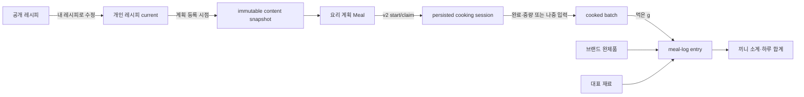
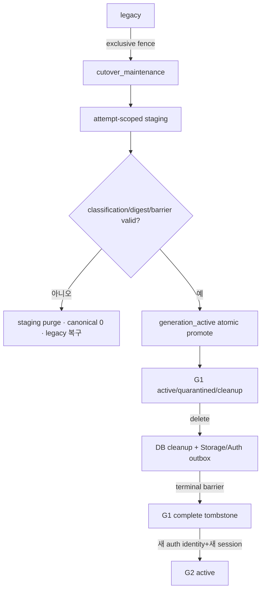

# 유저 Flow맵 v1.3.25

상태: 공식문서
담당자: 채실장
날짜: 7월 23

> **2026-07-23 contract-evolution — 요리 계획→요리 배치→식사 기록 및 계정 세대 흐름**
>
> 사용자는 2026-07-23에 아래 end-to-end flow와 단계별 rollback/legacy 보존 경계를 승인했다. 이 addendum은 기존 `실제 섭취 기록 제외`, `PLANNER_WEEK 계획 영양`, 완제품 신규 계획 추가 흐름과 충돌하는 부분을 대체한다. 기존 Meal 상태, 완료 장보기 read-only, HOME recipe-only search, public/shared 보존 흐름은 명시한 호환 기간 동안 유지한다.

## ⓭ 요리 계획과 실제 식사 기록 분리 여정



### 진입 조건

- Planner 하단 tab은 유지하고 내부 segment에서 `요리 계획 | 식사 기록`을 선택한다.
- 비로그인 사용자는 protected action의 날짜·끼니·recipe/draft를 보존한 채 로그인 후 같은 action으로 복귀한다.
- `요리 계획`과 `식사 기록`은 별도 read/write model이다. `cook_done`이나 계획 인분을 실제 섭취로 자동 변환하지 않는다.

### 요리 계획 flow

1. 사용자가 공개 또는 접근 가능한 개인 recipe를 날짜·끼니에 등록한다.
2. server는 content snapshot을 생성/재사용하고 exact nutrition snapshot ID를 pin한다. content 안에 영양 vector를 복제하지 않는다.
3. Meal은 `registered → shopping_done → cook_done`만 이동한다.
4. 장보기 생성은 `registered AND shopping_list_id IS NULL`만 대상으로 하고 Meal link를 먼저 고정한다.
5. 완료 장보기는 어떤 recipe edit/reconcile에서도 변경하지 않는다.
6. 새 `PLANNER_WEEK`는 계획 영양 합계와 product 신규 추가를 표시하지 않는다. 기존 product plan은 read-only card/detail과 사용자 삭제로만 보존한다.

### 식사 기록 flow

1. 사용자가 `식사 기록` segment에서 7일 strip의 하루와 끼니를 선택한다.
2. `+ 음식 추가` sheet가 선택 날짜·끼니를 유지한 채 `요리한 음식 | 제품·재료`를 보여준다.
3. batch는 완성·남은 g과 weight 상태를, 제품·재료는 server typed-union의 source badge와 단일 관련도/cursor를 보여준다.
4. 사용자가 실제 양을 확인한다. batch는 known weight만 g 기록이 가능하고 제품/재료는 exact pinned basis/profile/conversion evidence가 있어야 한다.
5. server는 필수 UUID Idempotency-Key와 record-time IANA timezone/local date를 검증한다.
6. batch source는 entry INSERT와 consumed event, active event pointer, remaining projection을 한 transaction에서 만든다. 제품·재료는 exact evidence의 compact nutrition snapshot을 pin한다.
7. 성공 후 해당 끼니 소계와 하루 합계를 재조회한다. partial/unavailable count를 0으로 합치지 않는다.
8. 수정은 자기 active event reversal+replacement, 삭제는 reversal+entry soft delete다. 같은 양의 다른 entry는 바뀌지 않는다.

### 끼니/timezone 예외

- 삭제된 meal column의 과거 entry는 `slot_name_snapshot`으로 `삭제된 끼니` section에 남고 신규 선택 대상에서는 빠진다.
- `consumed_local_date`가 grouping authority다. device timezone 변경은 과거 entry를 다른 날로 옮기지 않는다.
- 과거 날짜만 알고 시각을 모르면 `consumed_at=null`이다. instant가 있으면 IANA timezone 변환 날짜가 local date와 다를 때 전체 `422`다.

## ⓮ 개인 레시피 fork·편집·미래 계획 반영 여정

### 공개 recipe fork

1. 공개 `RECIPE_DETAIL`에서 `내 레시피로 수정`을 선택한다.
2. 비로그인은 draft action을 보존해 로그인 후 editor로 복귀한다.
3. 저장하면 공개 원본은 불변이고 `origin_recipe_id`를 가진 새 owner-private recipe ID가 생긴다.
4. 저장 성공 뒤 새 private `RECIPE_DETAIL`로 이동한다.

### 개인 recipe 저장

1. owner가 private `RECIPE_DETAIL → 편집`으로 들어간다.
2. 기본 `저장`은 같은 recipe ID의 mutable current를 갱신한다. `새 레시피로 저장`만 별도 ID를 만든다.
3. 저장 전 client는 `base_recipe_revision + 전체 draft`를 impact preview로 보낸다.
4. server는 실제 PATCH와 같은 canonicalizer로 content hash를 만들고 미래 Meal/장보기/claim 집합과 revision hash를 owner+session-bound token에 고정한다.
5. UI는 영향 수·날짜 범위·미완료/완료 장보기·active claim을 보여주고 `전체 반영 | 기존 계획 유지`만 받는다.
6. PATCH RPC는 global fence→owner→recipe→Meal lock 안에서 token, draft hash, revision, 대상 집합, claim을 재검증한다.
7. 하나라도 바뀌면 모든 write를 무변경 409로 끝내고 최신 preview로 되돌린다.
8. `keep`은 기존 Meal pin을 유지한다. `replace_all`은 미래 Meal을 새 snapshot으로 바꾸고 미완료 장보기만 reconcile한다. 완료 장보기는 그대로다.
9. active cooking claim이 있으면 `replace_all` 전체가 409이며 대상을 조용히 제외하지 않는다.

### soft delete

1. owner `RECIPE_DETAIL`에서 삭제를 확인한다.
2. 단일 recipe-lock RPC가 `deleted_at`을 멱등 기록한다.
3. 새 검색/선택/레시피북/snapshot 생성에서는 즉시 숨는다.
4. 기존 Meal·shopping·session·batch·meal-log는 당시 snapshot/FK로 계속 조회된다.
5. 사용자-facing 복원은 이번 범위 밖이다. 향후 internal restore도 같은 owner/recipe lock+revision RPC를 사용한다.
6. hard delete는 회원 탈퇴 cleanup에서만 실행한다.

## ⓯ v1/v2 요리 session과 cooked batch 여정

### release R: dormant dispatch

1. 새 DB/schema와 v2 route를 feature-off로 배포한다.
2. current와 immediate-previous UI에 `contract_version` dispatch를 먼저 배포한다.
3. v1은 기존 body/UI로, seeded v2는 v2 read/cancel/complete로 drain한다.
4. 두 UI release의 v1 회귀와 seeded-v2 drain이 green이어야 한다.

### R+1: flag-off drain 검증

1. #8 merge 뒤에도 새 v2/personal mutation은 server에서 0건이어야 한다.
2. existing v2는 flag-off 상태에서도 read/cancel/complete가 가능해야 한다.
3. v1 planner/standalone client는 optional stable key를 보낸다. old-shape/no-key telemetry가 한 호환 release 0건이 되기 전 428을 켜지 않는다.

### R+2: 공동 activation

1. personal edit/propagation과 snapshot-v2 creation을 같은 feature gate로 켠다.
2. planner start는 recipe lock→Meal UUID lock에서 pin/revision/claim을 검증하고 session+session-meal+claim을 한 transaction으로 만든다.
3. standalone start는 recipe access/deleted/revision을 확인해 current content와 servings를 pin한다.
4. start 성공과 session ID 수신 뒤에만 `COOK_MODE`로 이동한다.
5. cancel은 claim을 해제한다.
6. complete는 session ID와 exact `consumed_pantry_item_ids`, `finished_weight_g | weigh_later`만 받는다. 선택 row/product/effective ingredient를 검증해 pantry, batch, ledger, session, claim, cook count, XP를 한 번만 변경한다.
7. flag rollback은 새 v2 start/personal mutation만 닫고 기존 v2 drain은 유지한다. promote된 content contract를 direct-only binary로 rollback하지 않는다.

### v1 보존

- v1 endpoint/body/response와 generic `consumed_ingredient_ids`는 유지한다.
- no-key 0 이후 key 누락만 무변경 428로 바꿀 수 있다.
- 새 v1 start 차단, active v1 terminal 0, 별도 tombstone/contract 없이는 v1 route를 삭제하지 않는다.

### batch 중량·잔량

1. complete에서 음식만의 전체 중량을 입력하면 known/available, 나중 입력이면 missing/available batch가 된다.
2. 첫 event 전에는 전체 중량을 설정/정정할 수 있다.
3. 일부 사용 뒤 원래 중량을 모르면 missing→unrecoverable event를 한 번 기록한다. 이후 weight/known 복원과 marked event reversal은 409다.
4. known batch는 consumed/discarded/adjustment/reversal event로 잔량을 계산한다. adjustment는 available에서만 가능하고 0 도달을 허용하지 않는다.
5. missing/unrecoverable 전체 종료는 `consumed|discarded|mixed` closure를 남기되 영양/meal-log를 만들지 않는다.
6. consumed 계열 최초 소진만 eaten/자동 숨김/XP를 받는다. discard/mixed는 먹은 것으로 표시하지 않는다.
7. meal-linked reversal 또는 현재 active unweighed closure 취소만 available 복원이 가능하다. 범용 reopen은 없다.

## ⓰ 제품·재료 통합 검색 및 pantry 연결 여정

1. `MEAL_LOG` 또는 custom recipe ingredient picker에서 query를 입력한다. HOME은 이 flow를 호출하지 않는다.
2. server는 NFKC/lowercase/compact/token을 만들고 ingredient와 food-product visibility/moderation scope를 각각 적용한다.
3. approved primary `food_product_ingredient_links(relation=represents)`만 제품의 effective ingredient를 만든다. brand product ID를 synonym으로 저장하지 않는다.
4. 두 source를 DB에서 union한 뒤 integer relevance tuple+stable ID로 전역 정렬해 single opaque cursor를 반환한다.
5. `연세크림빵`은 브랜드+제품명 전체 coverage 결과가 부분 일치보다 먼저 나오며 지정 fixture 3개가 첫 page에 있어야 한다.
6. custom recipe에서 제품을 선택하면 product ID와 nutrition version provenance를 보존하고 대표 ingredient link 일치를 검증한다.
7. pantry recommendation은 generic pantry ingredient와 approved product effective ingredient의 DISTINCT union으로 판단한다.
8. product 삭제/숨김으로 current version을 안전하게 찾지 못하면 과거 version으로 조용히 새 계획/기록을 만들지 않고 교체를 요구한다.

## ⓱ account generation cutover·탈퇴·재가입 여정



### F0 expand / legacy

1. lifecycle/watermark/session/capability/staging/receipt/outbox와 dual-dispatch를 feature-off로 배포한다.
2. 모든 existing/new personal writer, direct DML, Storage policy, auth inbound FK를 local/remote inventory한다.
3. legacy mutation은 shared global fence와 capability guard를 통과한다. legacy account delete는 exact identity epoch receipt를 DB cleanup과 같은 transaction에 append한다.
4. service-role external PUT은 fence 아래 tracked attempt를 먼저 만들고 120초 안에 finalize/cleanup한다.

### maintenance와 staging

1. Before User Created Hook health, exact `supabase_auth_admin` 권한, Admin/import/dashboard auth create/delete freeze, auth consumer stop를 확인한다.
2. exclusive global fence가 기존 shared writers 종료를 기다리고 capability를 maintenance+attempt ID로 바꾼다.
3. 이후 Route/DML/Storage/Auth creation은 무변경 503이고 orchestrator만 attempt-scoped staging을 쓴다.
4. `auth∩public`, `auth\\public`, `public\\auth`, personal-owner universe를 exact evidence로 분류한다.
5. evidence가 없는 auth/public/personal orphan은 삭제 추정 대신 G1 quarantine proposal로 보존한다. classification conflict만 unresolved blocker다.
6. external attempt 0, 15분 간격 owner signal inventory 2회, Auth quiet window, full writer fence를 확인한다.

### final promote / rollback

1. exclusive fence와 `auth.users SHARE ROW EXCLUSIVE` 또는 provider barrier를 확보한다.
2. ordered auth/public/personal count+digest를 staging과 CAS 비교한다.
3. mismatch/lock timeout/권한 부족/unresolved이면 canonical row를 만들지 않고 abort한다.
4. valid하면 watermark/lifecycle/outbox와 capability active를 한 transaction에 commit한다.
5. promote 전 실패는 staging purge+canonical 0 확인 후 legacy로 되돌린다. promote 뒤 legacy writer/bootstrap으로 rollback하지 않고 forward-fix한다.

### quarantine resolution

1. auth-present quarantined user는 interstitial에서 `activate|delete`를 선택한다.
2. server는 exact identity epoch/session과 Idempotency-Key/payload를 재검증한다.
3. activate는 같은 G1을 active로 만들고 profile/visibility/session binding을 복원한다.
4. delete는 durable deletion initiation과 cleanup/outbox로 전환한다.
5. auth-absent quarantine은 서비스 소유자의 Manual Only recovery/cleanup 승인 전 삭제하지 않는다.

### delete / late object / G2

1. account delete가 owner lock을 잡고 exact session HMAC/key/payload/result를 lifecycle에 영구 기록한 뒤 모든 G1 binding을 revoke한다.
2. FK 안전 순서로 개인 DB를 삭제하고 private/unlinked image를 cleanup generation/outbox에 enqueue한다.
3. maintenance tick은 Storage scanner→terminal tombstone scan→quarantine recheck→normal drain→owner-signal-zero 순서로 처리한다.
4. auth consumer는 identity created-at exact match일 때만 G1 identity를 삭제한다. newer same UUID는 `identity_replaced`다.
5. auth outbox success, required object 연속 terminal, pending/awaiting/failed/dead-letter/registry nonterminal 0일 때만 G1 complete다.
6. 새 auth identity와 새 session만 watermark+1 G2를 만들 수 있다. G1 stale request/finalize/object는 G2에 붙지 않고 G1 cleanup을 재개방한다.

## ⓲ image upload·visibility·maintenance 운영 여정

### 신규 personal upload

1. client가 필수 Idempotency-Key와 파일을 server upload route에 보낸다.
2. server는 active session generation, magic byte/actual MIME, 5MB, raw SHA-256, rolling quota, active 20, global backlog breaker를 PUT 전에 검사·예약한다.
3. registry/idempotency row에 attempt token과 5분 lease를 만들고 `upsert=false` private path에 120초 timeout으로 PUT한다.
4. live replay는 202+Retry-After다. expired takeover는 같은 path를 HEAD/metadata 또는 raw-byte rehash해 CAS로 이어간다.
5. finalize는 exact token/generation/cleanup CAS로 uploaded-unlinked+24시간 attach grace를 만든다. signed URL은 응답마다 재발급한다.
6. recipe POST/PATCH가 object ID reference attach와 content write를 한 transaction에서 끝낸다.
7. cancel/scanner가 먼저 이기면 late finalize/attach는 409/no URL이고 cleanup을 되살리지 않는다.

### delete/recheck/tombstone

1. actual delete success는 outbox `deleted`와 registry terminal을 guarded completion으로 함께 기록한다.
2. 첫 404는 awaiting+15분 quarantine이며 normal claim에서 제외한다.
3. 다음 tick의 HEAD/list에서 object가 보이면 pending delete로 되돌리고, 두 번째 독립 404만 verified-not-found다.
4. terminal tombstone scanner는 늦게 나타난 G1 object를 새 cleanup generation으로 재개방한다.
5. compact registry/lifecycle/watermark/image-key tombstone은 영구 보존하고 attempt/lease/error detail만 90일 뒤 줄인다.

### legacy visibility / orphan report

1. registry-aware reader를 current+immediate-previous에 먼저 배포한다.
2. known private reference는 private bucket, public/shared는 owner-neutral path로 copy한다.
3. reference를 atomic swap하고 old path를 한 호환 release 보존한다.
4. reference 0, new read, unresolved failure 0 뒤 별도 irreversible gate에서만 old path를 지운다. 이후 old-reader rollback은 금지한다.
5. orphan inventory는 recipe와 recipe-book cover known reference를 positive backfill하고 suspicious/candidate report만 만든다. enqueue/delete는 0이다.
6. 실제 legacy orphan GC는 별도 contract와 사용자 Manual Only manifest 승인 전 실행하지 않는다.

### MacBook P0 worker

1. 사용자가 Manual Only로 product 전용 launchd와 production secret/heartbeat를 설치한다.
2. 로그인·전원·network·sleep 금지 전제에서 300초/RunAtLoad tick을 실행한다.
3. tick은 `scanner → terminal scan → recheck → drain → owner signal zero → auth delete → complete` 순서를 지킨다.
4. 15분 heartbeat gap, 3회 호출 실패, oldest pending 15분, dead-letter를 외부 경보로 보낸다.
5. JSON log는 10MB×5로 회전하고 다음 정상 tick이 lease-expired/backlog를 회복한다.
6. Vercel Cron은 별도 contract/deploy 승인 전 이 flow의 scheduler가 아니다.

## v1.3.25 release/legacy gate

- 실행 순서는 exact 15 successor workpack(F0+#1~#14)과 Release Train A→B→C→D→E→F다.
- 각 successor는 Stage 1 workpack/acceptance/automation 문서와 mandatory internal 1.5 docs gate가 먼저 merge되어야 한다.
- Meal direct nutrition은 expand→DB-derived compatibility mirror→contract null 순서이며 contract 뒤 rollback floor보다 오래된 binary는 배포하지 않는다.
- v1 session, legacy product planner read/delete, HOME recipe-only search, public/shared content, immutable history는 별도 tombstone/호환 gate 전 삭제하지 않는다.
- 신규 `MEAL_LOG`, `PLANNER_WEEK`, `COOK_MODE`, `RECIPE_DETAIL` 변경은 wireframe/design critic/product-design authority evidence와 mobile/a11y 상태 검증을 통과한다.

> **2026-07-21 contract-evolution — 영양 결측 검수 흐름**
>
> | # | 변경 내용 | 영향 범위 |
> | --- | --- | --- |
> | 1 | 운영 batch는 최신 local inventory를 일부 결측/profile 없음으로 분리하고 RDA 10.4, K-FIND/NIFS, MFDS 순으로 compatible 후보를 만든다 | operator data flow |
> | 2 | 후보는 `raw → normalize → review HTML → explicit approval → local apply`를 따르며 HTML 검수 전 DB write는 0이다 | review gate |
> | 3 | 승인 replacement는 새 immutable source/profile/value/link를 만들고 기존 active primary를 같은 transaction에서 supersede한다 | append-only activation |
>
> 이름 유사도, category, source rank만으로 자동 승인하지 않는다. 다른 source의 nutrient field를 섞지 않고 동일 식품·상태·가식부·기준량의 단일 row 전체를 검수하며, 결측과 관측 0을 계속 구분한다.

> **2026-07-21 contract-evolution — 실측 계량 evidence 우선 계산 흐름**
>
> | # | 변경 내용 | 영향 범위 |
> | --- | --- | --- |
> | 1 | recipe snapshot writer는 exactly-one active approved assignment/evidence/source 경로의 `normalized_g_per_15ml`을 직접 사용한다 | snapshot writer |
> | 2 | 실측값이 없거나 승인 경로가 0개·복수이면 대표 등급으로 보충하지 않고 해당 기여를 `partial/unavailable`로 둔다 | fail-closed flow |
> | 3 | 특정 제품 식별자가 없는 canonical ingredient recipe에는 제품명 유사도만으로 제품별 밀도·영양값을 섞지 않는다 | product/generic boundary |
>
> 아래 이전 절의 `대표 등급 검수 evidence` 흐름은 과거 assignment 감사·호환 기록으로만 유지한다. 신규 계산 흐름의 값 authority는 승인 evidence의 실측 소수값이며, 결측≠0·immutable snapshot·source attribution 계약은 그대로다.

> **2026-07-17 contract-evolution — 사용자 공동 제품·공공 완제품 flow 확장**
>
> | # | 변경 내용 | 영향 범위 |
> | --- | --- | --- |
> | 1 | MENU_ADD는 `공공 영양DB`, `사용자 등록` public 제품, 본인 legacy private 제품을 함께 검색하고 source filter를 유지한다 | ③ 식단 계획 |
> | 2 | 검색 결과가 없으면 신규 shared manual 제품을 만들고, owner만 수정·soft-delete하며 다른 로그인 사용자는 검색·조회·플래너 추가만 한다 | ③-e 완제품 |
> | 3 | 사용자 등록 public 제품에는 신고 흐름이 있고, 신고/운영 숨김 제품은 새 검색·새 planner 추가에서 제외된다 | ③-e 완제품 / moderation |
> | 4 | 기존 legacy `private/manual` 제품은 자동 공개하지 않는다. 탈퇴 후 shared manual 제품은 owner를 익명화한 read-only public row로 남는다 | ③-e / ⑪ 저장·관리 |
> | 5 | ingredient promotion이 끝나면 모든 active recipe snapshot을 backfill하고 partial/unavailable 원인을 유지한다 | ① 탐색 / batch backfill |
>
> 이 flow는 기존 Recipe Meal / ProductPlannerEntry 분리, shopping/cooking/leftover/XP 제외, immutable nutrition version pin, login return-to-action을 유지한다. client는 owner/source/moderation/public stable key를 정하지 못하고, runtime 외부 API 검색 없이 batch 승격된 catalog만 사용한다.

> **2026-07-16 contract-evolution — recipe 기본 영양 후보 선택과 조회 복구 flow**
>
> | # | 변경 내용 | 영향 범위 |
> | --- | --- | --- |
> | 1 | recipe 정량 `amount + unit`을 실제 투입 가식부 사용량으로 읽고, 직접 질량/호환 부피의 상태 미지정 후보는 자격 있는 active approved primary link/profile이 정확히 1개일 때만 선택한다 | snapshot writer |
> | 2 | 부피 환산도 자격 있는 승인 경로가 정확히 1개일 때만 사용하며, 0개/복수 후보는 추측 없이 partial/unavailable로 흐른다 | snapshot writer |
> | 3 | `개/장`은 recipe 입력과 exact `size_code + preparation_state`가 일치하는 승인 piece weight가 있을 때만 계산하고 직접 g 입력에는 크기를 요구하지 않는다 | snapshot writer |
> | 4 | RECIPE_DETAIL은 snapshot 부재와 일시 조회 실패를 `availability_reason`으로 분리하고, 일시 실패에서는 상세 본문을 유지한 채 영양만 다시 시도한다 | ① 탐색 |
>
> 이 flow는 `recipe_ingredients`에 상태 컬럼을 추가하거나 첫 후보를 임의 선택하지 않는다. public endpoint·HTTP status·error code는 그대로이며, 조리 손실은 계속 미모델링 한계다.

> **2026-07-15 contract-evolution — recipe nutrition snapshot 출처 pin flow 수정**
>
> | # | 변경 내용 | 영향 범위 |
> | --- | --- | --- |
> | 1 | recipe snapshot writer는 영양 profile source와, 실제 영양값 계산에 사용된 대표 부피/개당 중량 evidence source의 승인된 attribution을 결과와 함께 pin한다 | ① 탐색 / snapshot writer |
> | 2 | RECIPE_DETAIL과 planner는 pin된 snapshot의 `sources[]`를 소비하고 current source/profile relation을 다시 join해 과거 attribution을 바꾸지 않는다 | ① 탐색 / ③ 식단 계획 |
> | 3 | Meal nullable pin, no-silent-repin, complete/partial/unavailable·결측≠0·return-to-action 흐름은 그대로 유지한다 | 기존 흐름 호환 |
>
> 사용자는 2026-07-15에 계산 결과와 당시 출처를 함께 고정하는 최소 수정을 승인했다. 실행 시점에 current source를 다시 조회하는 flow는 과거 Meal의 출처를 바꾸므로 허용하지 않는다. public endpoint·response field·status와 사용자 action 수는 변경하지 않는다.

> **2026-07-15 successor contract-evolution — 영양 계산·완제품 catalog·완제품 planner flow 잠금**
>
> | # | 변경 내용 | 영향 범위 |
> | --- | --- | --- |
> | 1 | public data pilot PR `#1005`의 merge commit `3866952c3e81bedfd80593f576e5ed6183ec7538`와 reviewed head `028c6e8f13d3c8586bbbfaa9dad42f0ae65c1420`를 pinned predecessor로 소비하고, approved/current source·profile·assignment만 영양 계산 흐름에 투입한다 | ① 탐색 / 영양 계산 predecessor |
> | 2 | 기존 `meals`와 `POST /meals`는 recipe workflow 전용으로 유지한다. ProductPlannerEntry는 별도 create/update/delete 흐름을 사용하고, 기존 recipe `meals/items` + additive `product_entries`를 client adapter에서만 합치며 같은 recipe row를 중복 반환·표시·합산하지 않는다 | ③ 식단 계획 |
> | 3 | ProductPlannerEntry는 shopping preview/list, cooking session, leftover, recipe count/status, `planner_registered` XP와 `meal_add_path_used` activity 흐름에서 구조적으로 제외한다 | ④/⑤/⑥/⑪-a 경계 보호 |
> | 4 | 제품 수량의 `serving/package/g/ml` 교차 변환은 현재 immutable nutrition version의 승인된 `basis_relations[]`에 `{ from: { amount, unit }, to: { amount, unit } }` 관계가 있을 때만 진행한다. 관계가 없으면 추정하지 않고 `422 NUTRITION_BASIS_MISMATCH`로 실패한다 | ③-e 완제품 추가/수정 |
> | 5 | 영양소별 `complete/partial/unavailable`, 별도 품질 `direct/estimated/mixed`, 대표 환산의 `약/예상`, partial의 `최소 X`, unavailable의 amount `null`을 조회·합계·오류 복구 흐름 전체에서 유지한다 | ① / ③ 계획 영양 |
> | 6 | 선택 인분은 immutable recipe snapshot의 `scalable vector × selected_servings / base_servings + fixed vector`로 계산한다. `COOK_MODE`는 확정 인분을 읽기 전용으로 소비하며 인분 조절 흐름을 추가하지 않는다 | ① 탐색 / ⑤ / ⑧ 요리 |
> | 7 | Meal 생성 당시 nullable recipe nutrition snapshot과 ProductPlannerEntry 생성 당시 product nutrition version을 pin하며, 이후 source/profile/product 갱신으로 기존 계획을 자동 repin하지 않는다 | ③ 식단 계획 |
> | 8 | 관련 flow는 `loading/empty/error/read-only/unauthorized` 분기와 로그인 후 검색어·날짜·끼니·선택 context로 돌아오는 return-to-action을 유지한다. public product는 일반 사용자 read-only, private product는 owner-only이며 RLS/route guard를 모두 통과해야 한다 | ② 로그인 / ③-e 완제품 |
> | 9 | 끼니 컬럼 삭제는 연결된 Recipe Meal 또는 ProductPlannerEntry가 하나라도 있으면 기존 `409 COLUMN_HAS_MEALS`로 종료한다 | ③ 식단 계획 / ⑪ SETTINGS |
>
> 이 successor는 아래 2026-07-13 flow addendum을 구체화한다. 제공하는 합계는 실제 섭취가 아닌 `계획 영양`이며 `cook_done`은 섭취 완료가 아니다. 의료 처방·질환 코칭·실제 섭취 기록·OCR·바코드·외식·밀키트는 MVP 비목표다. 기존 삭제 endpoint와 금지된 상태 전이를 되살리지 않고 기존 권한·소유권·read-only·멱등성 계약을 완화하지 않는다.

> **2026-07-13 contract-evolution — 재료 영양·완제품·플래너 계획 영양 flow**
>
> | # | 변경 내용 | 영향 범위 |
> | --- | --- | --- |
> | 1 | RECIPE_DETAIL에서 immutable recipe nutrition snapshot의 1인분 예상 영양과 상태/품질을 확인한다 | ① 탐색 |
> | 2 | MENU_ADD에서 `공공 영양DB` + `사용자 등록` public + 본인 legacy private 완제품을 검색하고, 없으면 shared manual 제품을 등록한 뒤 플래너에 추가한다 | ③ 식단 계획 |
> | 3 | PLANNER_WEEK/MEAL_SCREEN은 Recipe Meal과 ProductPlannerEntry를 유형별로 표시하고 pin된 snapshot만 `계획 영양`으로 합산한다 | ③ 식단 계획 |
> | 4 | 완제품은 장보기·요리·남은요리·recipe XP/activity 흐름에 진입하지 않는다 | ④/⑤/⑥/⑪-a 경계 보호 |
>
> 공공 영양 source는 운영자 batch의 raw/normalize/review/approved 경로로만 catalog와 계산에 들어온다. 농촌진흥청 계량자료는 필요한 소량 실측 사실값과 출처/조회일/변환 결과만 대표 등급 검수 evidence로 보존하고 원문 표·문장·배치·전체 데이터셋은 복제하지 않는다. 결측은 모든 flow에서 0과 구분하며, 계획 영양은 실제 섭취로 전환되지 않는다.

> **2026-07-13 contract-evolution — 서비스 브랜드 전환 flow**
>
> | # | 변경 내용 | 영향 범위 |
> | --- | --- | --- |
> | 1 | 최초 서비스 정의는 `무엇을 먹든`, 좁은 AppBar/내비게이션 표시는 `무먹`으로 전환한다 | 전역 사용자 여정 / 앱 shell |
> | 2 | HOME·ABOUT_SERVICE_GUIDE·성장/업적의 고정 브랜드 copy를 새 canonical copy로 표시한다 | ① / ①-a / ⑪-b |
> | 3 | 신규·빈 nickname만 `무먹러`로 fallback하고 기존 저장 nickname은 그대로 통과시킨다 | ② 로그인 |
> | 4 | 과거 system notification 브랜드 copy는 read-time canonicalization하며 DB rewrite와 사용자 콘텐츠 변환은 하지 않는다 | ⑪-b 성장/알림 |
>
> API/DB shape, endpoint/field, 상태 전이, 기술 식별자, 과거 공식 버전과 merged evidence/prototype은 변경하지 않는다.

> **2026-07-12 addendum — 서비스 가이드 진입 flow**
>
> | # | 변경 내용 | 영향 범위 |
> | --- | --- | --- |
> | 1 | 웹 공통 `집밥 가이드` 메뉴에서 `/about`으로 진입한다 | 전역 웹 flow |
> | 2 | 모바일 HOME의 `빠른 이동` 다음 `집밥 둘러보기` 첫 카드에서 `/about#how-to`로 진입한다 | ① 탐색 / 신규 ①-a 가이드 |
> | 3 | legacy `/mypage?tab=help`는 `/about#faq`로 이동하며 MYPAGE에 도움말 탭을 남기지 않는다 | ⑪ 저장/관리 |

> **2026-07-10 addendum — social auth provider memory / linking flow**
>
> | # | 변경 내용 | 영향 범위 |
> | --- | --- | --- |
> | 1 | 세 provider 이메일 필수, callback 누락 차단, 동일 이메일 same-user/different-user 분기를 로그인 여정에 추가한다 | ② 로그인 여정 |
> | 2 | 최근 provider 안내와 다른 provider 확인창 흐름을 추가한다 | ② 로그인 여정 |
> | 3 | 로그인된 MYPAGE에서 provider identity를 수동 연결하는 흐름을 추가한다 | ⑪ 저장/관리 여정 |

> 기준 문서: 요구사항 기준선 v1.7.21 / 화면정의서 v1.5.27 / DB 설계 v1.3.22 / API 설계 v1.2.26
>
> 작성: Claude / Codex (H2 Stage 1, Baemin prototype planner contract-evolution)
>
> **v1.3.17 → v1.3.18 변경 요약**
>
> | # | 변경 내용 | 영향 범위 |
> | --- | --- | --- |
> | 1 | HOME 검색 flow를 제목 검색에서 제목+승인 태그 검색으로 확장하고, 태그 chip/테마 진입의 정확 태그 필터 flow를 추가한다 | ① 레시피 탐색 |
> | 2 | YouTube 등록 flow에서 서버 추천 태그를 사용자가 검수/수정한 뒤 저장하는 흐름을 추가한다. 사용자가 수정하지 않으면 서버 추천값을 저장한다 | ⑨ 유튜브 등록 |
> | 3 | 직접 등록 flow에 서버 태그 추천과 사용자 추가/삭제 검수 흐름을 추가한다 | ⑩ 직접 등록 |
> | 4 | HOME 테마 seed는 승인된 public 시스템 의미/source 태그만 사용하는 것으로 제한한다 | ① 레시피 탐색 |
>
> **2026-06-16 addendum — SETTINGS 끼니 컬럼 순서 변경 flow**
>
> | # | 변경 내용 | 영향 범위 |
> | --- | --- | --- |
> | 1 | SETTINGS에서 끼니 컬럼 순서 변경 flow를 추가한다. 서버 저장 후 PLANNER_WEEK가 동일 순서를 표시한다 | ⑨ 마이페이지/설정, ③ 식단 계획 여정 |
>
> **v1.3.16 → v1.3.17 변경 요약**
>
> | # | 변경 내용 | 영향 범위 |
> | --- | --- | --- |
> | 1 | 퀘스트를 튜토리얼 전용으로 축소하고 튜토리얼을 업적 앨범 category로 이동한다 | ⑪-b 사용자 성장 |
> | 2 | MYPAGE 성장 확인 흐름을 등급/업적/튜토리얼/알림 버튼 진입형 modal/sheet 구조로 갱신한다 | ⑪-b 사용자 성장 |
> | 3 | 업적 앨범의 category tab, stamp grid, locked hint, silent backfill 흐름을 추가한다 | ⑪-b 사용자 성장 |
> | 4 | 등급 흐름을 `Clay → Titanium` spoon grade 체계로 갱신한다 | ⑪-b 사용자 성장 |
>
> **v1.3.15 → v1.3.16 변경 요약**
>
> | # | 변경 내용 | 영향 범위 |
> | --- | --- | --- |
> | 1 | XP source action에 플래너 등록을 추가하고 첫/반복 XP 및 cap 흐름을 분리한다 | ⑪-a 사용자 진도 |
> | 2 | gamification 흐름에 priority toast stack, level-up/badge/quest/XP 순서, archive 조회를 추가한다 | ⑪-b 사용자 성장 |
> | 3 | 장보기 리스트 완료와 끼니 묶음 준비 활동의 카운트 기준을 분리한다 | ⑪-b 사용자 성장 / 장보기 |
> | 4 | MYPAGE 성장 확인 흐름을 별도 성장 card가 아닌 프로필 영역 통합으로 갱신한다 | ⑪-b 사용자 성장 |
>
> **v1.3.13 → v1.3.14 변경 요약**
>
> | # | 변경 내용 | 영향 범위 |
> | --- | --- | --- |
> | 1 | COOK_MODE 여정을 현재 단계 이동 없이 전체 재료와 전체 조리순서를 동시에 보는 whole-board 흐름으로 변경한다 | ⑤ 요리하기, ⑧ 독립 요리 |
> | 2 | 단계별 재료/불세기/조리시간 확인 흐름을 제거하고, 전체 재료 보드와 조리방법 태그 중심의 단계 목록으로 정리한다 | ⑤ 요리하기, ⑧ 독립 요리 |
> | 3 | 요리모드 화면 꺼짐 방지 상태는 실제 wake lock 활성화 시에만 표시한다 | ⑤ 요리하기, ⑧ 독립 요리 |
>
> **v1.3.12 → v1.3.13 변경 요약**
>
> | # | 변경 내용 | 영향 범위 |
> | --- | --- | --- |
> | 1 | 재료 등록·검색·필터 흐름에 v2 8대분류/21소분류 mapping을 추가한다 | HOME, PANTRY, YT_IMPORT, 직접등록 |
> | 2 | 조리방법 선택·검수 흐름에 v2 6그룹/20대표 method mapping을 추가한다 | YT_IMPORT, 직접등록, RECIPE_DETAIL, COOK_MODE |
> | 3 | v1 category label 8종은 migration 동안 입력/필터/validation fallback으로 유지한다 | HOME, PANTRY, YT_IMPORT, 직접등록 |
> | 4 | `씻기`는 canonical method flow에서 제외하고 `에어프라이어`는 canonical method flow에 포함한다 | YT_IMPORT, 직접등록 |
>
> **v1.3.11 → v1.3.12 변경 요약**
>
> | # | 변경 내용 | 영향 범위 |
> | --- | --- | --- |
> | 1 | YouTube extract 후 공개 텍스트 수량이 부족할 때 visual quantity enrichment를 거치는 흐름을 추가한다 | ⑨ 유튜브 등록 여정 |
> | 2 | YT_IMPORT 검수 단계에서 수량 provenance 확인 및 confirm/edit/clear 인터랙션 흐름을 추가한다 | ⑨ 유튜브 등록 여정 |
> | 3 | quick import에서 review-required 수량이 있으면 검수 화면 fallback 분기를 추가한다 | ⑨ 유튜브 등록 여정 |
>
> v1.3.10 → v1.3.11 변경: 레시피 미디어/태그 영속화 flow
> - YouTube register RPC가 세션 `thumbnail_url`을 `recipes.thumbnail_url`에 복사한다
> - YouTube/직접 등록 시 서버가 공유 태그 생성기로 `recipes.tags`를 자동 생성한다
> - 직접 등록 flow에 이미지 업로드 단계를 추가한다 (`POST /api/v1/recipes/images` → `POST /recipes`에 참조 포함)
>
> v1.3.9 → v1.3.10 변경: YouTube 섹션 라벨 영속화 flow
> - extract 결과의 ingredient/step `component_label`을 검수/등록/DB 저장까지 보존
> - RECIPE_DETAIL, COOK_MODE에서 같은 섹션 소제목 표시
> - manual recipe create와 shopping aggregation flow는 변경 없음
>
> v1.3.8 → v1.3.9 변경: Admin Foundation 내부 운영자 플로우 추가
>
> v1.3.7 → v1.3.8 변경: slice27 선행 taxonomy contract lock
> - YouTube/직접등록/팬트리/HOME 흐름의 재료 카테고리는 `과일` 포함 v1 canonical 8종 label을 유지
> - 신규 ingredient taxonomy는 기존 flow를 대체하지 않고 shared mapping source / additive shadow metadata로만 해석
> - 조리방법 category는 optional additive metadata이며, 사용자 flow는 기존 label/color_key 기반 선택/표시를 유지
> - 외부 데이터는 production 직적재 없이 staging/review/approved seed gate를 거친 뒤에만 flow에 노출
>
> v1.3.6 → v1.3.7 변경: 회원 탈퇴 데이터 정리 flow
> - SETTINGS 회원 탈퇴 확인 후 사용자 개인 기록 삭제
> - 직접/유튜브 등록 레시피는 작성자 정보 없이 보존
> - 성공 후 HOME 이동, 동일 소셜 계정 재로그인 시 새 사용자 bootstrap 상태로 시작
>
> v1.3.5 → v1.3.6 변경: YT_IMPORT 미등록 재료 등록 흐름
> - YouTube 추출 검수 단계에서 unresolved / needs_review 재료에 [재료 검색으로 교체]와 [새 재료로 등록] 분기 추가
> - extract 결과의 `draft_ingredient_id`로 서버 추출 row를 안정적으로 식별
> - 새 재료 등록 성공 시 클라이언트가 현재 row를 `resolved`로 전환하고 최종 등록 흐름을 계속 진행
> - 데이터 변화에 `ingredients`, `ingredient_synonyms`, `register_youtube_ingredient(...)` RPC 추가
>
> v1.3.3 → v1.3.4 변경: PL-03 MEAL_SCREEN 개별 식사 요리하기 단축 경로
> - 사용자 승인 (2026-05-18): `MEAL_SCREEN`에서 `shopping_done` 상태 개별 식사의 `[요리하기]` → `COOK_MODE` → `MEAL_SCREEN` 단축 경로 추가
> - ③ 식단 계획 여정과 ⑤ 요리하기 여정에 새 경로 반영
> - `registered` 식사는 대상 제외 — 장보기 우회 불가
> - 독립 요리(⑧)는 변경 없음
> - 신규 엔드포인트/DB 스키마 변경 없음. API v1.2.5에서 기존 `POST /cooking/sessions`의 `MEAL_SCREEN` 단일 meal 호출 패턴을 명시
>
> v1.3.2 → v1.3.3 변경: Wave1 prototype parity contract decisions
> - HOME `좋아요순` 노출을 `최신순`으로 교체하고 기본 `조회수순`은 유지
> - 저장 flow는 여러 `saved/custom` 레시피북 multi-select 저장을 지원
> - 장보기 기록 flow는 완료된 리스트를 기록 카드 탭으로 read-only 재열람
> - 남은요리/다먹은 목록과 레시피북 상세의 카드 메타를 prototype 기준으로 확장
> - LoginGateModal visual은 prototype, return-to-action behavior는 MVP 유지
>
> v1.3.1 → v1.3.2 변경: planner column customization contract
> - 사용자 승인 (2026-05-10): 신규 사용자 기본 끼니 컬럼을 `아침 / 점심 / 저녁` 3개로 변경
> - 설정 화면에서 끼니 컬럼 이름 변경, 추가, 삭제 flow 추가
> - 삭제는 등록된 Recipe Meal과 ProductPlannerEntry가 모두 없는 컬럼만 허용하고, 최소 1개/최대 5개 정책을 적용한다(`v1.3.21 successor 확장`).
>
> v1.3.0 → v1.3.1 변경: PLANNER_WEEK prototype parity contract
> - 사용자 승인 (2026-04-27): `PLANNER_WEEK`의 "가로 스크롤 없음" 잠금을 제거하고 Baemin prototype planner reference를 우선 기준으로 채택
> - ③ 식단 계획 여정의 탐색 방식은 prototype reference의 스크롤/탐색 모델을 따른다
> - API/DB 계약 및 MEAL_SCREEN 진입 flow는 변경 없음
>
> v1.2.3 → v1.3.0 변경: PLANNER_WEEK day-card slot row 전환에 따른 §③ 갱신
> - 세로 스크롤 중심 탐색 명시 (가로 스크롤 없음, v1.3.1에서 planner-level 잠금은 Baemin prototype parity 기준으로 supersede됨)
> - day card 본문 레이아웃을 세로 slot row 방식으로 명시
> - 탐색 흐름 자체(③ 식단 계획 여정 flow)는 변경 없음

---

## v1.3.3 → v1.3.4 변경 체크리스트

| # | 변경 내용 | 영향 범위 | 상태 |
|---|----------|----------|------|
| 1 | `MEAL_SCREEN`에서 `shopping_done` 개별 식사 `[요리하기]` → `COOK_MODE` → `MEAL_SCREEN` 단축 경로 추가 | ③ 식단 계획, ⑤ 요리하기 | ✅ |
| 2 | `registered` 식사는 `[요리하기]` 대상에서 제외 — 장보기 우회 불가 | ③ 식단 계획, ⑤ 요리하기 | ✅ |
| 3 | 독립 요리(⑧)는 변경 없음 — cooking_session 미생성, meal 상태 미변경 유지 | ⑧ 독립 요리 | ✅ |
| 4 | 신규 엔드포인트/DB 스키마 변경 없음 — API v1.2.5에서 기존 `POST /cooking/sessions`의 `MEAL_SCREEN` 단일 meal 호출 패턴을 명시 | — | ✅ |

---

## v1.3.2 → v1.3.3 변경 체크리스트

| # | 변경 내용 | 영향 범위 | 상태 |
|---|----------|----------|------|
| 1 | HOME 정렬을 `조회수순/최신순/저장순/플래너등록순`으로 변경 | ① 탐색 | ✅ |
| 2 | 레시피 저장 모달에서 여러 레시피북 동시 저장 허용 | ⑪ 레시피 저장/관리 | ✅ |
| 3 | 장보기 완료 기록을 기록 카드 탭으로 read-only 재열람 | ④ 장보기, ⑪ 저장/관리 | ✅ |
| 4 | 남은요리/다먹은 목록 카드 메타 확장 | ⑥ 남은요리 관리 | ✅ |
| 5 | 레시피북 상세 카드 메타 확장 | ⑪ 레시피 저장/관리 | ✅ |

---

## v1.3.1 → v1.3.2 변경 체크리스트

| # | 변경 내용 | 영향 범위 | 상태 |
|---|----------|----------|------|
| 1 | 신규 사용자 기본 끼니 컬럼을 `아침 / 점심 / 저녁` 3개로 변경 | ① 가입, ③ 식단 계획 여정 | ✅ |
| 2 | SETTINGS에서 끼니 컬럼 이름 변경/추가/삭제 flow 추가 | ⑨ 마이페이지/설정 | ✅ |
| 3 | 컬럼 삭제는 등록된 Recipe Meal과 ProductPlannerEntry가 모두 없는 경우만 허용 | ③ 식단 계획 여정, ⑨ 마이페이지/설정 | ✅ |

---

## v1.3.0 → v1.3.1 변경 체크리스트

| # | 변경 내용 | 영향 범위 | 상태 |
|---|----------|----------|------|
| 1 | `PLANNER_WEEK`의 "가로 스크롤 없음" 잠금을 제거하고 Baemin prototype planner reference를 우선 기준으로 채택 | ③ 식단 계획 여정 | ✅ |
| 2 | prototype reference와 동일한 localized scroll/swipe/peek affordance를 허용 | ③ 식단 계획 여정 | ✅ |
| 3 | API/DB 계약 및 MEAL_SCREEN 진입 flow 변경 없음 | — | ✅ |

---

## v1.2.3 → v1.3.0 변경 체크리스트

| # | 변경 내용 | 영향 범위 | 상태 |
|---|----------|----------|------|
| 1 | `PLANNER_WEEK` 탐색 방식을 세로 스크롤로 명시하고 가로 스크롤 없음을 선언 (v1.3.1에서 planner-level 잠금 supersede) | ③ 식단 계획 여정 | ✅ |
| 2 | day card 본문 레이아웃을 `세로 slot row` 방식으로 명시 | ③ 식단 계획 여정 | ✅ |
| 3 | API/DB 계약 변경 없음 — flow 자체(탐색 → MEAL_SCREEN → MENU_ADD)는 동일 | — | ✅ |

---

## 여정 전체 지도

```
┌─────────────────────────────────────────────────────────────────┐
│                    무엇을 먹든 서비스 사용자 여정                  │
├─────────────────────────────────────────────────────────────────┤
│                                                                 │
│  ① 탐색 ─── ② 로그인 ─── ③ 식단 계획 ─── ④ 장보기             │
│     │                        │                  │               │
│     │                        ├─ ⑨ 유튜브 등록    │               │
│     │                        ├─ ⑩ 직접 등록      │               │
│     │                        ├─ ③-e 완제품 추가   │               │
│     │                        │                  │               │
│     │                        │              ⑤ 요리하기           │
│     │                        │                  │               │
│     ├── ⑧ 독립 요리          │              ⑥ 남은요리 관리      │
│     │                        │                                  │
│     └── ⑪ 레시피 저장/관리    ├─ ⑦ 팬트리 관리                   │
│                                                                 │
└─────────────────────────────────────────────────────────────────┘
```

### 핵심 사이클 (주 1~2회 반복)

```
③ 식단 계획 → ④ 장보기 → ⑤ 요리하기 → ⑥ 남은요리 관리
     ↑                                        │
     └────────── 남은요리 재등록 ───────────────┘
```

---

## ① 레시피 탐색 여정

> 앱에 처음 들어온 사용자가 레시피를 둘러보고 마음에 드는 걸 찾는 여정

### 진입 조건

- 앱 실행 또는 재방문 (로그인 불필요)

### 플로우

```
앱 실행
  │
  ▼
HOME (홈)
  ├─ 테마 섹션 탐색 (스크롤)
  │    └─ 승인된 semantic/source tag theme → GET /recipes?tag=<normalized_key>
  ├─ 검색어 입력
  │    └─ GET /recipes?q=<검색어> → 제목 + 승인 태그 label 검색
  ├─ 제목 검색 (검색바 입력)
  ├─ 재료 검색 → INGREDIENT_FILTER_MODAL
  │               ├─ 재료 다중 선택 → [적용]
  │               └─ [초기화]
  ├─ 정렬 변경 (조회수순/최신순/저장순/플래너등록순)
  │
  └─ 레시피 카드 탭
       │
       ▼
     RECIPE_DETAIL (레시피 상세)
       ├─ 레시피 정보 확인 (재료, 스텝, 인분)
       ├─ 1인분 예상 영양 확인
       │    ├─ availability_reason=null → snapshot의 complete/partial/unavailable 표시
       │    │    ├─ complete → 예상값
       │    │    ├─ partial → 최소 X + 반영 수/누락 사유
       │    │    └─ unavailable → amount null + 정보 준비 중 (0으로 표시하지 않음)
       │    ├─ availability_reason=missing → current snapshot 없음 + 정보 준비 중
       │    └─ availability_reason=temporarily_unavailable → 상세 유지 + 영양만 [다시 시도]
       ├─ 인분 조절 (실시간 재료량 + scalable × selected/base + fixed 영양 반영)
       ├─ [공유] → Web Share / 링크 복사
       ├─ [요리하기] → ⑧ 독립 요리 여정
       ├─ [좋아요] → ② 로그인 게이트
       ├─ [저장] → ② 로그인 게이트
       └─ [플래너에 추가] → ② 로그인 게이트
```

### 종료 조건

- 레시피 상세까지 확인 완료
- 또는 로그인 필요 액션 시도 → ② 로그인 여정으로 분기

### 관련 화면

`HOME` → `INGREDIENT_FILTER_MODAL` → `RECIPE_DETAIL`

---

## ①-a 서비스 가이드 여정

> 처음 방문한 사용자가 서비스 전체 흐름을 이해하고 레시피 탐색 또는 플래너로 이동하거나, 기존 사용자가 FAQ를 확인하는 여정

### 진입 경로

- desktop web: 공통 상단 `무먹 가이드`
- mobile HOME initial state: `빠른 이동` → `무먹 둘러보기` 첫 가이드 카드
- direct URL: `/about`, `/about#how-to`, `/about#faq`
- legacy: `/mypage?tab=help` → `/about#faq`

### 플로우

```text
공통 웹 내비게이션 / HOME 가이드 카드 / direct URL
  │
  ▼
ABOUT_SERVICE_GUIDE (/about)
  ├─ Hero에서 핵심 가치 확인
  ├─ [사용법부터 보기] → #how-to
  ├─ 5단계 흐름 확인
  ├─ 기능별 가이드 / FAQ accordion 확인
  ├─ [레시피 둘러보기] → HOME
  └─ [플래너 시작하기] → 기존 PLANNER_WEEK 인증 flow
```

### 상태 / 회복

- `/about`은 정적 콘텐츠를 기본으로 렌더링하며 API loading/error에 의존하지 않는다.
- 문의 이메일이 설정되지 않으면 가짜 링크를 만들지 않고 문의 CTA를 비활성/대체 안내로 처리한다.
- 모바일 back action은 히스토리가 없으면 HOME(`/`)으로 복귀한다.

### 종료 조건

- 사용자가 가이드/FAQ를 확인하고 HOME이나 PLANNER_WEEK로 이동
- 또는 직접 URL 방문 후 mobile back/Home affordance로 복귀

### 관련 화면

`HOME` → `ABOUT_SERVICE_GUIDE` → `HOME` / `PLANNER_WEEK`

---

## ② 로그인 여정

> 비로그인 사용자가 로그인 필요 기능을 만났을 때, 또는 직접 로그인할 때의 여정

### 진입 조건

- (A) 로그인 필요 기능 시도 시 로그인 게이트 작동
- (B) 마이페이지/플래너/팬트리 탭 직접 진입 시도

### 플로우

```
[로그인 필요 액션 시도]
  │
  ▼
안내 모달
  "이 기능은 로그인이 필요해요"
  [로그인] [취소]
  │          │
  │          └─ 이전 화면 유지 (아무 일 없음)
  ▼
LOGIN (로그인 화면)
  ├─ 이 브라우저의 마지막 성공 provider 안내/강조 (advisory only)
  ├─ [카카오 로그인]
  ├─ [네이버 로그인]
  └─ [구글 로그인]
       │
       ├─ (기억한 provider와 다름)
       │    └─ 확인창
       │         ├─ [기억한 provider로 로그인] → 해당 OAuth 시작
       │         ├─ [다른 계정으로 계속] → 선택 provider OAuth 시작
       │         └─ [취소/ESC/backdrop] → OAuth 호출 없이 LOGIN 유지
       │
       ▼
     소셜 인증 완료
       │
       ├─ provider configuration 검증
       │    ├─ Kakao: built-in `kakao` 우선
       │    └─ Naver: 기존 no-store `/api/auth/oauth-userinfo/naver`를 custom UserInfo URL로 사용
       │         └─ 표준 sub/email/email_verified 실측 실패 시 E3 중단·기존 adapter 설정/동작 복구
       │
       ├─ email 누락 또는 명시적 invalid/unverified
       │    └─ 부분 세션 sign out → email_required → public.users/bootstrap 없음
       │
       └─ 정규화 email로 활성 public.users 조회
            ├─ row 없음
            │    └─ callback Supabase user id로 신규 회원 bootstrap
            │         ├─ 닉네임 입력값이 없거나 trim 후 빈 값이면 `무먹러` fallback
            │         └─ meal_plan_columns ×3, recipe_books ×3
            ├─ row 있음 + existing app user id = callback Supabase user id
            │    └─ 기존/연결 identity 로그인 허용
            │         ├─ public.users.social_provider 유지
            │         └─ 기존 저장 nickname 유지(브랜드 전환 rewrite 없음)
            └─ row 있음 + existing app user id ≠ callback Supabase user id
                 └─ 부분 세션 sign out → account_conflict
                      └─ 자동 merge/delete/bootstrap 없음
                              │
                              ▼
                         일반 로그인 성공
                              ├─ 검증된 attempt + 실제 identity sign-in evidence로 provider 확정
                              ├─ localStorage 마지막 성공 provider 갱신
                              ├─ compatibility cookie 갱신
                              └─ ★ return-to-action
                                  원래 하려던 작업으로 자동 복귀
```

> LoginGateModal의 visual은 Wave1 prototype reference를 따르지만, 로그인 후 원래 작업으로 돌아오는 return-to-action 동작은 MVP flow를 유지한다.

### 종료 조건

- 로그인 성공 + 원래 액션 자동 수행
- 또는 [취소]로 이전 화면 복귀

### return-to-action 대상 액션

| 원래 시도한 액션   | 복귀 후 자동 수행        |
| ------------------ | ------------------------ |
| 좋아요             | 해당 레시피 좋아요 토글  |
| 저장               | 레시피북 선택 모달 열림  |
| 플래너 추가        | 날짜/끼니 선택 모달 열림 |
| 완제품 추가        | 제품 검색/수량 선택 상태 복귀 |
| 요리완료 저장      | 요리완료 처리 진행       |
| 플래너 탭 진입     | PLANNER_WEEK 진입        |
| 팬트리 탭 진입     | PANTRY 진입              |
| 마이페이지 탭 진입 | MYPAGE 진입              |

### 관련 화면

안내 모달 → `LOGIN`

---

## ③ 식단 계획 여정 `v1.3.0 변경`

> 로그인한 사용자가 이번 주 뭘 먹을지 플래너에 식사를 채워넣는 여정

### 진입 조건

- 로그인 상태
- 하단 탭 "플래너" 선택

### 플로우

```
PLANNER_WEEK (식단 플래너)
  ├─ 주간 범위 확인
  ├─ 요일 스트립을 좌우로 넘겨 이전 주 / 다음 주 이동
  ├─ 필요 시 [이번주로 가기]
  ├─ Baemin prototype planner reference와 동일한 스크롤/탐색 모델로 날짜 카드 탐색
  │    └─ localized horizontal scroll / swipe / peek affordance는 prototype reference와 일치하는 경우 허용
  ├─ 하루 카드 단위로 식단 확인
  │    └─ 카드 안에 사용자가 설정한 끼니 컬럼 노출
  ├─ 식사 상태 표시 확인 (등록/장보기/요리)
  ├─ 날짜/주간 `계획 영양`과 incomplete entry count 확인
  │
  └─ 끼니 칸 탭
       │
       ▼
     MEAL_SCREEN (끼니 화면)
       ├─ Recipe Meal + ProductPlannerEntry 목록 확인
       │    └─ 기존 recipe meals/items + additive product_entries를 중복 없이 합침
       ├─ 끼니 `계획 영양`과 partial/unavailable count 확인
       ├─ 식사별 인분 조절 (+/-)
       ├─ 완제품 entry 수량 변경
       ├─ 식사 삭제 → 삭제 확인 모달 → 삭제
       ├─ 완제품 entry 삭제 → 삭제 확인 모달 → 삭제
       ├─ 식사 탭 → RECIPE_DETAIL (레시피 상세 조회만)
       ├─ [요리하기] (shopping_done 식사만) → ⑤-b 개별 식사 요리 단축 경로  ← v1.3.4 추가
       │
       └─ [식사 추가]
            │
            ▼
          MENU_ADD (식사 추가)
            ├─ 검색창 → RECIPE_SEARCH_PICKER ─────── (③-a)
            ├─ [유튜브 링크] → YT_IMPORT ─────────── ⑨ 유튜브 등록
            ├─ [완제품] → FOOD_PRODUCT_PICKER ────── (③-e)
            ├─ [레시피북에서] → 레시피북 선택 ────────── (③-b)
            ├─ [남은요리에서] → 남은요리 선택 ─────────── (③-c)
            ├─ [팬트리만 이용] → 필터링 결과 ────────── (③-d)
            └─ 직접 등록 → MANUAL_RECIPE_CREATE ──── ⑩ 직접 등록
```

> **정책 변경 (v1.3.4)**: MEAL_SCREEN에서 `shopping_done` 상태 개별 식사에 `[요리하기]` 단축 경로를 제공한다.
>
> 요리 진입 경로:
> - **MEAL_SCREEN 개별 식사 [요리하기]** → `COOK_MODE` (단일 식사 단축 경로, `shopping_done`만 대상) `v1.3.4 추가`
> - **레시피 상세 [요리하기]** → `COOK_MODE` (독립 요리, planner 무관)
>
> `registered` 상태 식사는 `[요리하기]` 대상이 아니며, 장보기를 거치지 않고 `cook_done`으로 전이할 수 없다.

### ③-a. 검색해서 추가

```
RECIPE_SEARCH_PICKER
  │ 검색 입력 → 결과 리스트
  │ 레시피 선택
  │    ▼
  │ 계획 인분 입력 모달
  │    ▼
  └─ Meal 생성 (status='registered') → MEAL_SCREEN 복귀
```

### ③-b. 레시피북에서 추가

```
레시피북 목록 → 레시피 선택 → 계획 인분 입력 → Meal 생성 → MEAL_SCREEN 복귀
```

### ③-c. 남은요리에서 추가

```
남은요리 리스트 → 선택 → 계획 인분 입력
  → Meal 생성 (status='registered', is_leftover=true, leftover_dish_id 세팅)
  → MEAL_SCREEN 복귀
```

### ③-d. 팬트리만 이용

```
팬트리 보유 재료 기반 레시피 필터링/스코어링 → 결과 리스트
  → 레시피 선택 → 계획 인분 입력 → Meal 생성 → MEAL_SCREEN 복귀
```

### ③-e. 완제품에서 추가

```text
MENU_ADD → FOOD_PRODUCT_PICKER
  │
  ├─ `공공 영양DB` + `사용자 등록` public + 본인 legacy private 제품 검색
  │    └─ 제품 선택 → 호환 수량/단위 입력
  │         └─ ProductPlannerEntry 생성 + 현재 product nutrition version pin
  │              └─ MEAL_SCREEN 복귀
  │
  └─ 검색 결과 없음 → FOOD_PRODUCT_CREATE
       ├─ 이름/브랜드/g/mL 기준량(+ 원 라벨 기준량 text) 입력
       ├─ 열량 필수 + 나머지 영양소 optional 입력
       ├─ shared manual 제품 + immutable nutrition version 생성
       └─ FOOD_PRODUCT_PICKER 선택 상태 복귀 → 수량 입력 → entry 생성
```

- 다른 사용자의 private 제품은 검색·조회·수정할 수 없다. `공공 영양DB` 제품과 다른 사용자의 `사용자 등록` public 제품은 일반 사용자가 수정/삭제할 수 없다.
- 제품 entry는 Recipe Meal 상태를 만들지 않고 `planner_registered` XP와 `meal_add_path_used` activity를 기록하지 않는다.
- 제품 entry는 ④ 장보기, ⑤ 요리하기, ⑥ 남은요리 flow와 recipe plan/cook count/status 집계의 대상 query에 포함되지 않는다.
- public/private product nutrition이 갱신돼도 이미 생성된 entry는 pin된 version을 유지한다.
- 비로그인 보호 액션은 로그인 안내 후 검색어·날짜·끼니·선택 context로 return-to-action 한다.
- 사용자 등록 public 제품은 신고할 수 있고, report hidden/operator hidden 제품은 새 검색과 새 planner 추가에서 제외한다. 기존 entry와 pin된 version은 남긴다.
- 신규 shared manual 제품은 `g/mL` 기준량으로 생성하고, planner의 g/mL 입력 기본값은 `100`, step은 `1g/1mL`다.
- 수량 단위가 nutrition version의 basis와 같으면 같은 차원 안에서 배수 계산한다. `serving/package/g/ml` 간 교차 변환은 승인된 `basis_relations[]`의 정확한 `{ from: { amount, unit }, to: { amount, unit } }` 관계가 있을 때만 진행한다. 관계가 없으면 단위를 추정하거나 entry를 만들지 않고 `422 NUTRITION_BASIS_MISMATCH`를 표시한 뒤 수량 선택 단계에 머문다.
- FOOD_PRODUCT_PICKER/CREATE/MEAL_SCREEN의 제품 흐름은 loading/empty/error/read-only/unauthorized를 분리한다. unauthorized 후에는 원래 검색어·날짜·끼니·선택 context로 복귀한다.

### 종료 조건

- Recipe Meal 또는 ProductPlannerEntry가 1개 이상 등록된 상태로 PLANNER_WEEK 복귀
- 등록된 Recipe Meal: status='registered'; ProductPlannerEntry: workflow status 없음

### 관련 화면

`PLANNER_WEEK` → `MEAL_SCREEN` → `MENU_ADD` → `RECIPE_SEARCH_PICKER` / `FOOD_PRODUCT_PICKER` / `FOOD_PRODUCT_CREATE` / `YT_IMPORT` / `MANUAL_RECIPE_CREATE`

### 데이터 변화

| 시점                      | 테이블                                    | 변화                                             |
| ------------------------- | ----------------------------------------- | ------------------------------------------------ |
| 식사 추가                 | meals                                     | INSERT (status='registered')                     |
| 남은요리에서 추가         | meals                                     | INSERT (is_leftover=true, leftover_dish_id 세팅) |
| 인분 변경                 | meals                                     | UPDATE planned_servings                          |
| 식사 삭제                 | meals                                     | DELETE                                           |
| 사용자 등록 제품 생성     | food_products, nutrition_profiles, nutrition_values, food_product_nutrition_versions | shared manual INSERT + current version 지정 |
| 완제품 수정               | food_product_nutrition_versions           | 기존 row 불변, 새 version INSERT                 |
| 완제품 신고               | food_product_reports                      | INSERT (중복 reporter/product 차단)              |
| 완제품 플래너 추가        | product_planner_entries                   | INSERT + 당시 nutrition_version_id pin           |
| 완제품 수량 변경/삭제     | product_planner_entries                   | UPDATE quantity / DELETE                         |
| 끼니 컬럼 추가            | meal_plan_columns                         | INSERT (최대 5개)                                |
| 끼니 컬럼 이름 변경       | meal_plan_columns                         | UPDATE name                                      |
| 끼니 컬럼 순서 변경       | meal_plan_columns                         | UPDATE sort_order (사용자 소유 컬럼만, 0부터 연속 정렬) |
| 끼니 컬럼 삭제            | meal_plan_columns                         | DELETE (연결된 meals와 product_planner_entries가 없고 최소 1개 유지) |
| 레시피 등록 (직접/유튜브) | recipes, recipe_ingredients, recipe_steps | INSERT                                           |

---

## ④ 장보기 여정 `v1.2 변경`

> 식단이 완성된 사용자가 장볼 재료를 확인하고, 순서를 정리하고, 제외 재료를 관리하고, 완료 후 팬트리 반영까지 처리하는 여정

### 진입 조건

- 로그인 상태
- PLANNER_WEEK에 `status='registered' AND shopping_list_id IS NULL` 식사가 1개 이상 존재
- 대상은 Recipe Meal만 조회한다. ProductPlannerEntry는 preview, recipe별 인분 합산, list row, Meal status 전이에서 제외한다.
- 플래너 상단 [장보기] 버튼 클릭

### 플로우

```
PLANNER_WEEK → [장보기]
  │
  ▼
SHOPPING_FLOW Step A) 대상 자동 취합
  │ 범위: 오늘 ~ 마지막 등록일
  │ 대상: status='registered' AND shopping_list_id IS NULL
  │ 레시피별 계획 인분 합산
  │
  ▼
Step B) 레시피 선택/해제
  │ 체크로 포함/제외 가능
  │ (해제된 레시피의 meals는 이번 장보기에서 제외)
  │
  ▼
Step C) 장보기 기준 인분 오버라이드
  │ 각 레시피별 +/- 로 인분 조정 가능
  │ (기본값 = planned_servings_total)
  │
  ▼
[장보기 목록 만들기]
  │
  │ ⚠️ 이 시점에:
  │   shopping_lists 생성
  │   shopping_list_recipes 생성
  │   shopping_list_items 생성
  │   팬트리 보유 재료는 is_pantry_excluded=true 자동 세팅
  │   선택된 meals에 shopping_list_id 미리 세팅
  │   (status는 registered 유지)
  │
  ▼
SHOPPING_DETAIL (장보기 리스트 상세)로 자동 이동
  │
  ├─ [구매 섹션]
  │    ├─ 카드형 아이템 리스트
  │    ├─ 왼쪽 체크박스 = 구매 완료
  │    ├─ 드래그&드롭으로 순서 변경
  │    └─ 아래로 이동 시 팬트리 제외 섹션으로 보냄
  │
  ├─ [팬트리 제외 섹션]
  │    ├─ 팬트리에 있어 자동 제외된 재료
  │    ├─ 위로 이동 시 구매 섹션으로 복귀
  │    └─ 제외 섹션에 들어가면 is_checked=false 자동 정리
  │
  ├─ [공유]
  │    └─ 텍스트 체크리스트 공유
  │       (is_pantry_excluded=false 항목만 포함)
  │
  └─ [장보기 완료]
       │
       ▼
     "팬트리에 반영할 아이템" 팝업
       │
       │ 표시 대상:
       │   구매 체크된 구매 섹션 아이템
       │   (is_checked=true AND is_pantry_excluded=false)
       │   + 이미있음으로 표시된 팬트리 제외 아이템
       │   (is_pantry_excluded=true)
       │
       ├─ 기본 전체 선택
       ├─ 체크 해제로 팬트리 반영 제외 가능
       ├─ [팬트리에 반영]
       └─ [반영 안 함]
            │
            ▼
          ┌────────────────────────────────────┐
          │ shopping_lists.is_completed = true │
          │ meals.status: registered           │
          │   → shopping_done                  │
          │                                    │
          │ 선택된 item만 pantry_items INSERT   │
          │ 이미 있으면 중복 INSERT 생략        │
          │ + shopping_list_items              │
          │   .added_to_pantry = true          │
          └────────────────────────────────────┘
            │
            ▼
          PLANNER_WEEK 복귀
          (대상 식사 뱃지가 "장보기 완료"로 변경)
```

### 장보기 상세 화면 동작 원칙

- **구매 섹션 ↔ 팬트리 제외 섹션** 간 이동 가능
- **팬트리 제외 섹션으로 이동 시** 해당 item은 자동으로 `is_checked=false`
- **드래그 순서 변경 결과는 서버 저장** → 재진입 시 그대로 유지
- **장보기 완료 후 리스트는 read-only**
  - 이후 체크/제외 토글, 순서 변경 불가
  - 장보기 기록 재열람 시에도 수정 불가

### 종료 조건

- [장보기 완료] 클릭 → 대상 meals가 `shopping_done` 상태
- 또는 중간 이탈
  - 미완료 리스트는 저장된 상태로 남아 이후 다시 진입 가능
  - 완료된 리스트는 기록용 read-only

### 관련 화면

`PLANNER_WEEK` → `SHOPPING_FLOW` → `SHOPPING_DETAIL` → `PLANNER_WEEK`

### 데이터 변화

| 시점           | 테이블                | 변화                                                                 |
| -------------- | --------------------- | -------------------------------------------------------------------- |
| 목록 생성      | shopping_lists        | INSERT                                                               |
| 목록 생성      | shopping_list_recipes | INSERT                                                               |
| 목록 생성      | shopping_list_items   | INSERT (`is_pantry_excluded`, `sort_order`, `added_to_pantry=false`) |
| 목록 생성      | meals                 | UPDATE shopping_list_id (미리 세팅)                                  |
| 체크/제외 변경 | shopping_list_items   | UPDATE `is_checked`, `is_pantry_excluded`                            |
| 순서 변경      | shopping_list_items   | UPDATE `sort_order`                                                  |
| 장보기 완료    | meals                 | UPDATE status → `shopping_done`                                      |
| 장보기 완료    | pantry_items          | INSERT (선택된 item만)                                               |
| 장보기 완료    | shopping_list_items   | UPDATE `added_to_pantry=true` (선택된 item만)                        |
| 장보기 완료    | shopping_lists        | UPDATE `is_completed=true`                                           |

---

## ⑤ 요리하기 여정 (플래너 경유)

> 장을 본 사용자가 플래너에서 요리할 레시피를 하나 골라서 요리모드로 요리하는 여정

### 진입 조건

- 로그인 상태
- PLANNER_WEEK에 `status='shopping_done'` 식사가 1개 이상 존재
- `MEAL_SCREEN`에서 `shopping_done` 상태 개별 식사의 [요리하기] 버튼 클릭
- ProductPlannerEntry는 cooking session 대상, Meal status 전이, leftover 생성, `recipes.cook_count` 증가에서 제외한다.

### 플로우

```
MEAL_SCREEN → 개별 식사 [요리하기] (shopping_done만)
  │
  │ cooking_sessions 생성 (meal 1건 단위)
  │ cooking_session_meals INSERT (선택 meal 1건)
  │
  ▼
COOK_MODE (요리모드 — 전체화면)
  │
  ├─ 재료 보드
  │    조리 인분 (읽기 전용)
  │    인분 조절 UI 없음
  │    재료 전체 목록 + 수량/단위
  │    component_label 소제목(있는 경우)
  │
  ├─ 조리순서 보드
  │    전체 스텝 카드 리스트
  │    카드: 브랜드 파란색 번호 + 조리방법 태그 + 조리법 본문
  │    component_label 소제목(있는 경우)
  │    긴 레시피는 내부 세로 스크롤
  │
  ├─ [취소]
  │    → cooking_sessions.status = 'cancelled'
  │    → 상태 변경 없이 MEAL_SCREEN 복귀
  │
  └─ [요리 완료]
       │
       ▼
     소진 재료 체크리스트 팝업
       │ (기본 체크 해제)
       │ 체크한 재료 = 팬트리에서 제거
       │
       ▼
     ┌─────────────────────────────────────────┐
     │ cooking_session_meals.is_cooked = true │
     │ cooking_sessions.status = 'completed'  │
     │                                         │
     │ 선택 meal 1건:                           │
     │   meals.status → 'cook_done'            │
     │   meals.cooked_at = now()               │
     │                                         │
     │ leftover_dishes INSERT                  │
     │ pantry_items DELETE (체크된 재료)         │
     │ recipes.cook_count += 1                 │
     └─────────────────────────────────────────┘
       │
       ▼
     MEAL_SCREEN 복귀
     (해당 식사 뱃지가 "요리 완료"로 변경)
```

**대상 제한**: `registered` 상태 식사에는 `[요리하기]`를 노출하지 않는다. 장보기를 우회하여 `cook_done`으로 전이할 수 없다.

**독립 요리(⑧)와의 차이**: 이 경로는 `cooking_session`을 생성하고 `meals.status`를 전이하는 **planner 세션 단축 경로**이다. 독립 요리는 `cooking_session`을 생성하지 않으며 `meals.status`를 변경하지 않는다.

### 종료 조건

- MEAL_SCREEN 개별 요리: 완료 → MEAL_SCREEN 복귀 / 취소 → MEAL_SCREEN 복귀 `v1.3.4 추가`

### 관련 화면

`MEAL_SCREEN` → `COOK_MODE` → `MEAL_SCREEN` `v1.3.4 추가`

### 데이터 변화

| 시점            | 테이블                | 변화                                              |
| --------------- | --------------------- | ------------------------------------------------- |
| [요리하기] 클릭 | cooking_sessions      | INSERT (레시피 1개 단위, status='in_progress')    |
| [요리하기] 클릭 | cooking_session_meals | INSERT (선택 meal 1건 스냅샷)                    |
| 요리 완료       | cooking_session_meals | UPDATE is_cooked=true                             |
| 요리 완료       | cooking_sessions      | UPDATE status='completed'                         |
| 요리 완료       | meals                 | UPDATE status → 'cook_done', cooked_at            |
| 요리 완료       | leftover_dishes       | INSERT (status='leftover')                        |
| 요리 완료       | pantry_items          | DELETE (소진 체크된 재료)                         |
| 요리 완료       | recipes               | UPDATE cook_count += 1                            |
| 취소            | cooking_sessions      | UPDATE status='cancelled'                         |

> 위 데이터 변화는 MEAL_SCREEN 개별 식사 요리 경유를 기준으로 한다. 세션에는 선택 meal 1건만 포함된다. `v1.3.4 참고`

---

## ⑥ 남은요리 관리 여정

> 요리가 끝난 후 남은 음식을 관리하고, 다 먹거나 플래너에 재등록하는 여정

### 진입 조건

- 로그인 상태
- PLANNER_WEEK 상단 [남은요리] 버튼 클릭
- 목록과 재등록 source는 recipe cooking 결과만 사용한다. ProductPlannerEntry는 leftover를 만들거나 이 여정에 나타나지 않는다.

### 플로우

```
PLANNER_WEEK → [남은요리]
  │
  ▼
LEFTOVERS (남은요리 목록)
  │ 최근순 정렬
  │ 카드: 레시피명 + 썸네일 + 요리완료일 + 끼니명 + 요리 인분
  │
  ├─ [다먹음]
  │    │
  │    ▼
  │  leftover_dishes.status → 'eaten'
  │  leftover_dishes.eaten_at = now()
  │  leftover_dishes.auto_hide_at = now() + 30일
  │    │
  │    ▼
  │  ATE_LIST (다먹은 목록)으로 이동
  │    ├─ [덜먹음] → status → 'leftover' 복귀
  │    └─ 30일 후 자동 숨김
  │
  └─ [플래너에 추가]
       │
       ▼
     날짜/끼니 선택 + 계획 인분 입력
       │
       ▼
     Meal 생성 (status='registered', is_leftover=true, leftover_dish_id=해당 ID)
       │
       ▼
     ★ 이 식사는 플래너에서 색상 구분 표시
```

### 종료 조건

- 남은요리 처리 완료 (다먹음 또는 플래너 재등록)
- 또는 확인만 하고 이탈

### 관련 화면

`PLANNER_WEEK` → `LEFTOVERS` ↔ `ATE_LIST`

### 데이터 변화

| 시점          | 테이블          | 변화                                                       |
| ------------- | --------------- | ---------------------------------------------------------- |
| 다먹음        | leftover_dishes | UPDATE status='eaten', eaten_at, auto_hide_at              |
| 덜먹음        | leftover_dishes | UPDATE status='leftover', eaten_at=NULL, auto_hide_at=NULL |
| 플래너 재등록 | meals           | INSERT (is_leftover=true, leftover_dish_id)                |

---

## ⑦ 팬트리 관리 여정

> 집에 있는 재료를 등록/관리하여 장보기 자동 제외 혜택을 받는 여정

### 진입 조건

- 로그인 상태
- 하단 탭 "팬트리" 선택

### 플로우

```
PANTRY (팬트리)
  │
  ├─ [재료 추가] → 직접 검색/입력 → pantry_items INSERT
  │
  ├─ [묶음 추가] → PANTRY_BUNDLE_PICKER
  │    │
  │    ▼
  │  묶음 카테고리 선택 (조미료 모음 / 야채 모음 / …)
  │    │
  │    ▼
  │  해당 묶음 재료 체크리스트
  │  집에 있는 것만 체크
  │    │
  │    ▼
  │  [팬트리에 추가] → pantry_items INSERT (체크된 것만)
  │
  ├─ [선택 삭제] → pantry_items DELETE
  │
  ├─ 검색/필터
  │
  └─ (선택) [이 재료로 레시피 보기] → HOME 재료 필터로 이동
```

### 종료 조건

- 팬트리 재료 목록 업데이트 완료
- 이후 장보기 시 팬트리 재료가 자동 제외됨

### 관련 화면

`PANTRY` → `PANTRY_BUNDLE_PICKER`

### 데이터 변화

| 시점      | 테이블       | 변화          |
| --------- | ------------ | ------------- |
| 재료 추가 | pantry_items | INSERT        |
| 묶음 추가 | pantry_items | INSERT (복수) |
| 재료 삭제 | pantry_items | DELETE        |

---

## ⑧ 독립 요리 여정 (플래너 미경유)

> 플래너를 거치지 않고 레시피 상세에서 바로 요리하는 여정

### 진입 조건

- RECIPE_DETAIL에서 [요리하기] 클릭
- 로그인 불필요 (요리모드 진입까지)

### 플로우

```
RECIPE_DETAIL → [요리하기]
  │
  │ (인분: 상세에서 마지막으로 설정한 인분)
  │
  ▼
COOK_MODE (요리모드 — 전체화면)
  │
  ├─ 재료 보드 + 조리순서 보드
  │    전체 재료와 전체 스텝을 한 화면에서 확인
  │
  ├─ [취소] → RECIPE_DETAIL 복귀
  │
  └─ [요리 완료]
       │
       ├─ (비로그인) → 안내 모달 → 로그인 → return-to-action
       │
       └─ (로그인)
            │
            ▼
          소진 재료 체크리스트 팝업
            │
            ▼
          ┌──────────────────────────────────────┐
          │ leftover_dishes INSERT               │
          │ pantry_items DELETE (체크된 재료)      │
          │ recipes.cook_count += 1              │
          │                                      │
          │ ⚠️ cooking_session 생성 안 함         │
          │ ⚠️ meals 상태 변경 안 함              │
          │ (플래너 미경유이므로)                 │
          └──────────────────────────────────────┘
            │
            ▼
          RECIPE_DETAIL 복귀
```

> YouTube 등록 레시피의 `component_label`은 독립 요리 COOK_MODE에서도 유지된다. 재료/스텝 목록은 기존 순서를 유지하고 인접 label이 바뀌는 지점에만 소제목을 표시한다.

### 종료 조건

- 요리 완료 → 남은요리 저장 + 팬트리 업데이트 → 이전 화면 복귀
- 또는 취소 → 이전 화면 복귀

### ⑤ 플래너 요리와의 차이

| 항목            | ⑤ 플래너 요리                  | ⑧ 독립 요리          |
| --------------- | ------------------------------ | -------------------- |
| 진입            | MEAL_SCREEN                    | RECIPE_DETAIL        |
| 요리 세션       | cooking_sessions 생성          | 생성 안 함           |
| 식사 상태 전이  | meals.status → 'cook_done'     | 변경 없음            |
| 남은요리 저장   | O                              | O                    |
| 팬트리 업데이트 | O                              | O                    |
| 인분 기준       | 합산 인분(세션 기준)           | 상세에서 설정한 인분 |

### 관련 화면

`RECIPE_DETAIL` → `COOK_MODE` → `RECIPE_DETAIL`

---

## ⑨ 유튜브 레시피 등록 여정 `v1.3 contract-evolution`

> 유튜브 요리 영상 URL로 레시피를 자동 추출하고, 검수 후 플래너에 등록하는 여정.
> 슬라이스 20에서 실제 YouTube Data API description-first 추출, 3-way classification, 서버 세션, 원자적 RPC 등록으로 확장.

### 진입 조건

- 로그인 상태
- feature flag `youtube_import` on (off → 404 FEATURE_DISABLED)
- MENU_ADD에서 [유튜브 링크로 추가] 선택

### 플로우

```
MENU_ADD → [유튜브 링크로 추가]
  │
  ▼
YT_IMPORT Step 1) URL 입력
  │ 유튜브 URL 붙여넣기 + [가져오기]
  │ → POST /recipes/youtube/validate
  │
  ▼
Step 1.5) 3-way Classification 결과
  │ ┌──────────────────────────────────────────────────┐
  │ │ YouTube oEmbed → title/channel/thumbnail 미리보기   │
  │ │ classification_status=uncertain                     │
  │ │ → Step 2로 진행                                    │
  │ └──────────────────────────────────────────────────┘
  │
  ▼
Step 2) 공개 텍스트 우선 추출
  │ → POST /recipes/youtube/extract
  │ YouTube videos.list API → description/tags/category 분석
  │ recipe/uncertain/non_recipe 판정 (non_recipe → 422 차단)
  │ 서버: youtube_extraction_sessions 생성 (status=draft, 24h TTL)
  │ 설명란 파싱 → 부족하면 공개 작성자 댓글 → 부족하면 공개 caption timedtext 파싱
  │ 그래도 재료/스텝이 부족하면 조건부 Gemini structured fallback으로 공개 텍스트 JSON 구조화
  │ 한 영상에 여러 요리 후보가 있으면 multi_parent 세션 + recipe_candidates[] 생성
  │ 재료/스텝 섹션명은 component_label로 응답
  │ 서버: 태그 추천기 실행 → draft tags/suggested_tags 생성
  │ extraction_methods: ["description"], ["comment"], ["caption"] 또는 조합
  │ 미분류 조리방법은 이 단계에서 즉시 생성
  │ UI: indeterminate spinner/progress
  │
  ▼
Step 3) 결과 검수/수정
  │ ├─ 다중 후보 목록 (필요 시)
  │ │    ├─ 후보명 / 재료 개수 / 단계 수 표시
  │ │    ├─ 후보 선택 → POST /recipes/youtube/candidate-drafts
  │ │    └─ 서버: candidate_child 세션 생성 후 단일 draft 반환
  │ ├─ 레시피명 (편집 가능)
  │ ├─ 기본 인분 (필수, 편집 가능)
  │ ├─ 재료 리스트 (추가/삭제/수정)
  │ │    ├─ component_label 보존, 인접 label 변경 지점에 소제목 표시
  │ │    └─ resolution_status: resolved / needs_review / unresolved
  │ │         각 서버 추출 row는 draft_ingredient_id 보유
  │ │         needs_review → 경고 배지, candidate 선택/검색 교체/새 재료 등록 전 저장 차단
  │ │         unresolved  → 에러 배지, 검색 교체 또는 새 재료 등록 전 저장 차단
  │ │
  │ │         [재료 검색으로 교체]
  │ │            → GET /ingredients 검색 → 기존 표준 재료 선택 → row resolved
  │ │
  │ │         [새 재료로 등록]
  │ │            → 표준명/v1 canonical 8종 카테고리/동의어 확인
  │ │            → POST /recipes/youtube/ingredient-registration
  │ │            → 서버: 소유권 + draft_ingredient_id 검증
  │ │            → RPC register_youtube_ingredient
  │ │            → 응답 ingredient_id / standard_name으로 client row resolved
  │ ├─ 스텝 리스트 (추가/삭제/수정)
  │ │    ├─ component_label 보존, 인접 label 변경 지점에 소제목 표시
  │ │    └─ is_incomplete / missing_fields 표시
  │ │         blocking (instruction, cooking_method) → 빈값 시 저장 차단
  │ │         warning  (duration, ingredients_used) → 빈값 시 경고만
  │ └─ 조리방법 자동 분류 (수동 변경 가능, is_new 라벨)
  │ └─ 태그 검수
  │      ├─ 서버 추천 chip 표시
  │      ├─ 사용자가 삭제/추가하지 않으면 추천값 유지
  │      └─ 사용자 추가 태그는 정규화 후 저장하되 테마 seed 자동 승격 금지
  │
  │ 저장 활성화: 모든 재료 resolved + blocking incomplete=0
  │
  ▼
Step 4) [레시피 등록]
  │ → POST /recipes/youtube/register (extraction_id 기반)
  │ 서버: RPC register_youtube_recipe_from_session
  │   - 소유권 검증 (cross-user → 404, expired → 410, consumed → 409)
  │   - 원자적 INSERT: recipes + recipe_sources + recipe_ingredients + recipe_steps
  │   - recipes.thumbnail_url ← 세션 thumbnail_url 복사 (클라이언트 오버라이드 불가) `v1.3.11 추가`
  │   - tags / recipe_tags ← 서버 추천 또는 사용자 검수 태그 저장 `v1.3.18 갱신`
  │   - recipes.tags ← recipe_tags public projection 저장 `v1.3.18 갱신`
  │   - recipe_ingredients.component_label / recipe_steps.component_label 저장
  │   - Provenance: session에서 복사 (client body 아님)
  │   - session status → consumed
  │
  ▼
"이 끼니에 추가" → 계획 인분 입력
  │
  ▼
Meal 생성 (status='registered') → MEAL_SCREEN 복귀
```

### Quick Import 분기: `/recipes/new/youtube` `2026-05-28 addendum`

```
/recipes/new/youtube
  │ URL 붙여넣기 또는 추천 영상 선택
  │ → GET /recipes/youtube/recipio/check
  │
  ├─ duplicate
  │    └─ 저장된 레시피 카드 표시 → /recipes/{recipe_id}
  │
  └─ not duplicate
       │ → POST /recipes/youtube/validate
       │ → oEmbed 미리보기 표시
       │ → POST /recipes/youtube/extract
       │
       ├─ 자동 등록 가능
       │    └─ POST /recipes/youtube/register → /recipes/{recipe_id}
       │
       └─ 검수 필요
            └─ /menu/add/youtube?youtubeUrl=... 로 이동해 기존 Step 3 검수 계속
```

- 자동 등록 가능 조건은 모든 재료 `resolved` + blocking step field 없음 + 기존 register validation 통과다.
- duplicate 분기에서는 extract/register를 호출하지 않는다.
- 진행률은 화면 상태 표시이며 서버-side job/status 계약을 새로 만들지 않는다.
- `non_recipe`, provider error, quota error는 자동 등록하지 않고 재입력/오류 안내를 표시한다.

- **Visual Quantity Enrichment 흐름** `v1.3.12 추가`:
    - extract 단계에서 공개 텍스트 추출 + Gemini text structured fallback 이후에도 재료 수량이 부족하면 조건부로 `visual_quantity_extractor`를 실행한다.
    - enrichment 결과는 각 재료에 `quantity_source`, `quantity_review_required`, `quantity_evidence_refs`를 설정한다.
    - YT_IMPORT 검수 화면에서 사용자가 수량 배지를 확인하고 review-required 수량을 confirm/edit/clear한다.
    - 모든 review-required 수량이 해결된 후 register를 호출하면 서버가 `quantity_confirmation_status`를 검증한다.
    - quick import에서 `quantity_review_required=true`가 있으면 auto-register를 차단하고 검수 화면으로 fallback한다.
    - visual enrichment 비활성화/실패 시 public-text-only 결과로 fallback한다.
    - 데이터 변화: `youtube_visual_extraction_cache`/`events` 테이블에 캐시/이벤트 기록, `extraction_meta_json.quantity_enrichment_summary`에 요약 저장.

### 종료 조건

- 레시피 등록 완료 + 플래너에 식사 추가
- 또는 classification에서 `non_recipe` → [다시 입력]으로 재시도 또는 이탈
- 또는 `uncertain` 경고에서 이탈
- 또는 검수 단계에서 이탈 (세션은 24h 후 만료)

### 관련 화면

`MENU_ADD` → `YT_IMPORT` → `MEAL_SCREEN`

### 데이터 변화

| 시점 | 테이블 | 변화 |
| --- | --- | --- |
| 추출 시 | youtube_extraction_sessions | INSERT (status='draft', expires_at=now+24h) |
| 다중 후보 감지 시 | youtube_extraction_sessions | INSERT (session_kind='multi_parent', recipe_candidates[] 포함) |
| 다중 후보 감지 시 | youtube_extraction_candidates | INSERT (후보별 draft ledger) |
| 후보 선택 시 | youtube_extraction_sessions | INSERT (session_kind='candidate_child', parent 참조) |
| 후보 선택 시 | youtube_extraction_candidates | UPDATE status='promoted', child_extraction_session_id |
| 미분류 조리방법 | cooking_methods | INSERT (is_system=false) |
| 미등록 재료 등록 (RPC) | ingredients | INSERT 또는 기존 standard_name row 재사용 |
| 미등록 재료 등록 (RPC) | ingredient_synonyms | optional INSERT, ambiguous synonym은 skip |
| 레시피 등록 (RPC) | recipes | INSERT (source_type='youtube', thumbnail_url=세션값, tags=생성기결과) `v1.3.11` |
| 레시피 등록 (RPC) | recipe_sources | INSERT (youtube_extraction_session_id FK, provenance from session) |
| 레시피 등록 (RPC) | recipe_ingredients | INSERT (복수) |
| 레시피 등록 (RPC) | recipe_steps | INSERT (복수) |
| 레시피 등록 (RPC) | youtube_extraction_sessions | UPDATE status='consumed' |
| 후보 child 등록 시 | youtube_extraction_candidates | UPDATE status='registered', recipe_id |
| 플래너 추가 | meals | INSERT (status='registered') |

> 재료 카테고리는 v2 기준으로 8대분류/21소분류를 사용한다. migration 동안 `과일`을 포함한 v1 canonical 8종 label은 입력/필터/validation fallback으로 유지한다.
> v2 대분류/소분류는 `곡류/면/떡(밥/쌀, 면/파스타, 빵/떡/시리얼)`, `채소/버섯(잎/나물채소, 뿌리/줄기채소, 열매채소/버섯)`, `과일/견과(과일, 견과/씨앗/건과일)`, `단백질(돼지/소/양, 닭/오리, 달걀, 두부/콩류)`, `해산물(생선/갑각/조개, 해조/건어물/어묵)`, `유제품/대체유(우유/요거트/크림, 치즈/버터/대체유)`, `양념/조미(장류/소스, 향신료/허브, 기름/식초/당류/육수)`, `가공/기타(김치/절임/통조림, 냉동/간편식/음료/기타)`다.
> 조리방법은 6그룹/20대표 method(`준비/손질: 썰기, 다지기`, `전처리: 해동, 밑간, 절이기`, `물/수분 조리: 끓이기, 삶기, 데치기, 찌기`, `팬/기름 조리: 볶기, 굽기, 부치기, 튀기기`, `혼합/조림: 섞기, 무치기, 조리기, 졸이기`, `기기 조리: 전자레인지, 오븐굽기, 에어프라이어`)로 매핑한다. `씻기`는 canonical method로 자동 승격하지 않는다.
> 외부 데이터 raw row는 이 flow에서 production ingredient로 자동 승격되지 않으며, 별도 staging/review/approved seed gate를 거친 뒤에만 검색/매칭 대상이 된다.

---

## ⑩ 직접 레시피 등록 여정

> 사용자가 직접 레시피를 수동 입력하여 등록하고 플래너에 추가하는 여정

### 진입 조건

- 로그인 상태
- MENU_ADD에서 "직접 등록" 선택

### 플로우

```
MENU_ADD → 직접 등록
  │
  ▼
MANUAL_RECIPE_CREATE
  │ 입력:
  │   이미지 (선택) → POST /api/v1/recipes/images 로 즉시 업로드 `v1.3.11 추가`
  │   레시피명 (필수)
  │   기본 인분 (필수)
  │   재료 추가 (QUANT: 수량+단위 필수 / TO_TASTE 가능)
  │   스텝 추가 (텍스트 + 조리방법 선택)
  │   태그 추천/검수
  │     - 서버 추천 chip 표시
  │     - 사용자가 삭제/추가하지 않으면 추천값 유지
  │     - 사용자 추가 태그는 정규화/검증 후 저장
  │
  └─ [저장]
       │
       ▼
     POST /recipes (thumbnail_url=업로드된 이미지 참조 또는 미전달, tags=검수된 태그 또는 미전달)
     recipes + recipe_ingredients + recipe_steps INSERT
     tags + recipe_tags UPSERT, recipes.tags projection 갱신
     (source_type='manual', thumbnail_url=업로드값, tags=projection) `v1.3.18`
       │
       ▼
     계획 인분 입력 → Meal 생성 → MEAL_SCREEN 복귀
```

### 종료 조건

- 레시피 등록 + 플래너 식사 추가 완료

### 관련 화면

`MENU_ADD` → `MANUAL_RECIPE_CREATE` → `MEAL_SCREEN`

### 데이터 변화 `v1.3.11 추가`

| 시점 | 테이블 | 변화 |
| --- | --- | --- |
| 이미지 업로드 | Supabase Storage (`recipe-images`) | 사용자별 경로에 파일 저장 |
| 레시피 저장 | recipes | INSERT (source_type='manual', thumbnail_url=업로드URL 또는 null, tags=projection) |
| 태그 저장 | tags / recipe_tags | 서버 추천 또는 사용자 검수 태그 UPSERT. 사용자 자유 태그는 승인 전 theme seed 제외 |
| 레시피 저장 | recipe_ingredients | INSERT (복수) |
| 레시피 저장 | recipe_steps | INSERT (복수) |
| 플래너 추가 | meals | INSERT (status='registered') |

---

## ⑪ 레시피 저장/관리 여정 `v1.2 보완`

> 마음에 드는 레시피를 좋아요하거나 레시피북에 저장하고, 마이페이지에서 레시피북/장보기 기록을 관리하는 여정

### 진입 조건

- 로그인 상태
- RECIPE_DETAIL에서 [좋아요] 또는 [저장] 클릭
- 또는 MYPAGE 진입

### 플로우

```
RECIPE_DETAIL
  │
  ├─ [좋아요] → recipe_likes INSERT/DELETE (토글)
  │              → recipes.like_count 업데이트
  │
  └─ [저장] → 레시피북 선택 모달
       │
       ├─ 기존 레시피북 여러 개 선택 → recipe_book_items INSERT
       │   (saved / custom만 저장 대상, 이미 저장된 책은 건너뜀)
       │
       └─ [+ 새 레시피북] → 이름 입력 → recipe_books INSERT
            → recipe_book_items INSERT
       │
       ▼
     recipes.save_count 업데이트
```

### 마이페이지에서 관리

```
MYPAGE → 레시피북 탭
  │
  ├─ 시스템 레시피북
  │    ├─ 내가 추가한 레시피
  │    ├─ 저장한 레시피
  │    └─ 좋아요한 레시피
  │
  └─ 커스텀 레시피북
       │
       ▼
     RECIPEBOOK_DETAIL (레시피북 리더)
       ├─ 목차에서 레시피 선택
       ├─ 카드: 태그 + 조회수 + 조리시간 + 기본 인분 + 재료 + 만들기
       ├─ 리더 상세 조회는 view_count 증가 없음
       ├─ 레시피 탭 → RECIPE_DETAIL
       └─ 레시피 제거
            ├─ liked 책: 좋아요 해제
            ├─ saved/custom: 책에서 제거
            └─ my_added 책: 제거 불가

MYPAGE → 장보기 기록 탭
  │
  └─ 저장된 장보기 리스트 (최신순)
       │
       ├─ 완료 시각 표시
       ├─ 완료된 리스트 카드 탭
       │
       ▼
     SHOPPING_DETAIL
       └─ 완료된 장보기 리스트는 read-only 재열람

MYPAGE → SETTINGS
  │
  ├─ 요리모드 화면 꺼짐 방지 토글
  │
  ├─ 끼니 컬럼 관리
  │    ├─ 이름 변경 → meal_plan_columns.name UPDATE
  │    ├─ 컬럼 추가 → 최대 5개까지 meal_plan_columns INSERT
  │    ├─ 순서 변경 → meal_plan_columns.sort_order UPDATE 후 PLANNER_WEEK 표시 순서 반영
  │    └─ 컬럼 삭제 → 연결된 meals와 product_planner_entries가 모두 없고 최소 1개가 남을 때만 DELETE
  │         └─ 하나라도 연결됨 → 409 COLUMN_HAS_MEALS, 컬럼 유지
  │
  └─ 닉네임 변경 / 로그아웃 / 회원탈퇴
       └─ 회원탈퇴 확인
            ├─ 레시피북/플래너/장보기/팬트리/좋아요/남은요리 등 개인 기록 삭제
            ├─ 직접/유튜브 등록 레시피는 recipes.created_by = null 상태로 보존
            ├─ public shared manual 제품은 owner 익명화 + read-only public row로 보존
            ├─ HOME 이동
            └─ 같은 소셜 계정 재로그인 시 새 사용자 bootstrap 상태

MYPAGE → 연결된 로그인 제공자
  │
  ├─ 연결된 provider 목록 확인 (Supabase Auth identity truth, read-only)
  └─ 미연결 provider [연결]
       │
       ├─ 현재 로그인 세션 확인 실패 → unauthorized / 로그인 복귀
       └─ provider 인증 시작 → /auth/link/callback
            ├─ 같은 Supabase user id에 새 identity 확인
            │    └─ 연결 성공 표시
            │         ├─ public.users.social_provider 변경 없음
            │         └─ 마지막 로그인 provider 변경 없음
            ├─ identity가 다른 Supabase user 소유 / user id 불일치
            │    └─ 안전한 conflict 표시, 자동 merge 없음
            └─ 취소/실패
                 └─ 기존 계정/identity 상태 유지
```

### 종료 조건

- 좋아요/저장 완료
- 또는 마이페이지에서 레시피북/장보기 기록/설정 변경 완료

### 관련 화면

`RECIPE_DETAIL` → 저장 모달 / `MYPAGE` → `RECIPEBOOK_DETAIL` / `SHOPPING_DETAIL`

---

## ⑪-a 사용자 진도 확인 (User Progress) `user-progress 예정`

> MYPAGE 계정 섹션 내 compact progress display — ⑪ 저장/관리 여정의 확장

### 사전 조건

- 로그인 완료 상태
- `GET /users/me/progress` 호출 가능 (별도 fetch, MYPAGE fatal init에 연동하지 않음)

### 플로우

```
MYPAGE (Bottom Tab) → 계정 섹션
  └─ 진도 표시 (compact subtitle + progress bar)
       ├─ 현재 레벨 + 레벨 타이틀
       ├─ 진행도 바 (progress_percent)
       └─ 다음 레벨까지 남은 XP (xp_to_next_level)

[XP source events]
  ├─ 요리 완료 (leftover_dishes 확정) → cooking_completed XP
  ├─ 장보기 완료 (shopping_lists 완료 전환) → shopping_completed XP
  ├─ 레시피 저장 (saved/custom membership 0→≥1) → recipe_saved XP
  ├─ 커스텀 레시피북 생성 → custom_book_created XP
  ├─ 플래너 Recipe Meal 등록 (meals INSERT 성공) → planner_registered XP
  └─ ProductPlannerEntry 등록 → XP/activity 없음
```

플래너 등록 XP는 최초 등록 25 XP와 반복 등록 5 XP로 분리한다. 반복 등록은 KST 기준 3/day, 12/week cap을 적용하며, 삭제/재생성이나 PATCH는 cap과 idempotency key를 우회할 수 없다.

### 에러 처리

- progress API 실패 (5xx/network) → progress 영역만 soft-fail, MYPAGE 나머지 정상 표시
- 401 → 기존 auth gate (fatal)
- 0 XP 사용자 → 안정적 level 1 응답

### 종료 조건

- MYPAGE 진입 시 progress compact UI가 렌더링되면 종료

### 관련 화면

`MYPAGE` (계정 섹션 내 progress subtitle/bar)

### 33a/33b/33c 범위

- 33a: `GET /users/me/progress` backend + ledger/projection (UI 없음)
- 33b: MYPAGE compact progress UI (badge/quest/toast 없음)
- 33c: 배지, 퀘스트, XP toast, 튜토리얼 퀘스트

---

## ⑪-b 사용자 성장/업적 앨범 확인 (Gamification) `growth-achievement-album`

> ⑪-a progress 기반 성장 surface — 경쟁 랭킹이 아니라 집밥 루틴 안내

### 사전 조건

- 로그인 완료 상태
- 33a `GET /users/me/progress` 사용 가능
- `GET /users/me/gamification` 호출 가능
- official contract-evolution으로 35a API/DB/UI 계약이 확정됨

### MYPAGE 확인 플로우

```
MYPAGE (Bottom Tab) → 계정 섹션
  └─ profile header 통합 성장 surface
       ├─ avatar / nickname / provider
       ├─ 등급명 + 레벨 + XP progress
       ├─ 요리/플래너/장보기 compact count
       ├─ 등급 버튼 → grade modal/bottom sheet
       ├─ 업적 버튼 → achievement album modal/bottom sheet
       ├─ 튜토리얼 버튼 → tutorial category modal/bottom sheet
       └─ 알림 버튼 → notification archive modal/bottom sheet
```

전체 achievement album, grade list, tutorial detail, notification archive는 버튼 진입 후 표시한다. 첫 viewport에는 별도 대형 성장 card나 locked grid를 두지 않는다.

### 튜토리얼 업적 플로우

```
신규/초기 사용자 MYPAGE 진입
  ├─ GET /users/me/progress
  ├─ GET /users/me/gamification
  └─ 튜토리얼 버튼 또는 header summary
       ├─ 첫 레시피 저장
       ├─ 첫 플래너 끼니 등록
       ├─ 첫 장보기 목록 만들기
       ├─ 첫 장보기 목록 완료
       ├─ 첫 요리 완성
       ├─ 첫 나만의 레시피북 생성
       └─ 6개 완료 시 튜토리얼 전체 완료 badge/stamp 획득
```

튜토리얼은 업적 앨범의 `tutorial` 카테고리다. 각 단계 완료는 achievement/stamp 상태를 채우지만 XP를 추가 지급하지 않는다.

### 업적 앨범 확인 플로우

```
MYPAGE → 업적 버튼
  └─ achievement album modal/bottom sheet
       ├─ category tab: 전체 / 튜토리얼 / 레시피 / 플래너 / 장보기 / 요리 / 팬트리 / 남은요리 / 레시피북
       ├─ earned stamp: 획득 이미지 + 획득일
       ├─ active stamp: current/target + progress
       └─ locked stamp: 잠김 visual + 짧은 hint
```

업적 threshold는 서버 definition 기준이다. 클라이언트는 unlock, current count, next target을 계산하지 않는다.

### Source action 후 XP toast 플로우

```
XP source action 성공
  ├─ progress event append/projection update
  ├─ growth activity/projection attempt
  │    ├─ 성공: level/achievement/badge/tutorial/notification 갱신
  │    └─ 실패: 원래 source action 성공은 유지, gamification soft-fail 기록
  └─ FE notification refresh
       ├─ 과거 system 브랜드 고정 copy는 승인된 exact mapping으로 read-time canonicalization
       │    └─ 저장 row/payload, nickname, 사용자 콘텐츠, 일반명사 `집밥`은 변경하지 않음
       ├─ priority_unseen 조회
       ├─ level_up > achievement_unlocked/badge_unlocked > xp_awarded 순서로 toast stack 표시
       ├─ 퀘스트 완료는 별도 toast 없이 업적 앨범 tutorial 상태로 표시
       ├─ mobile visible max 2 / desktop visible max 3
       └─ rendered/collapsed notification만 seen 처리 → 실패해도 core action rollback 없음
```

XP source action 범위:

- 레시피 저장
- 커스텀 레시피북 생성
- 장보기 완료
- 요리 완료
- 플래너 등록

Non-XP activity / achievement count 범위:

- 장보기 끼니 묶음 준비 (`shopping_bundle_prepared`)
- 팬트리 distinct 재료 추가 (`pantry_item_added`, distinct ingredient 기준)
- 남은요리 다먹음 (`leftover_eaten`, 사용자 직접 처리만 포함)
- 다양한 식사 추가 경로 사용 (`meal_add_path_used`)
- 레시피북 생성/레시피 추가/레시피 제거 (`recipebook_*`)
- 레시피 등록 (`recipe_registered`, 직접/YouTube 등록)

장보기 quest 카운트 기준:

- `shopping_list_completed_count`: 완료된 `shopping_lists` row 수
- `shopping_meal_bundle_completed_count`: distinct `shopping_bundle_prepared` activity 수
- `shopping_meals_covered_count`: 장보기 prep action으로 cover된 meal id 수

SHOPPING_FLOW 안내 문구:

```
여러 끼니를 한번에 장보기할 수 있어요
```

이 문구는 shopping list 1개가 meal 1개와 같다는 뜻으로 읽히면 안 된다.

### 에러 처리

- gamification API 실패 (5xx/network) → gamification 영역만 soft-fail, MYPAGE core와 compact progress는 유지
- 401 → 기존 auth gate (fatal)
- notification seen 실패 → 다음 조회에서 재표시될 수 있으나 source action 결과는 유지
- invalid achievement key, quest key, notification id → 본인 리소스만 처리, 타인 리소스 정보 노출 금지
- backfill/recompute 이후 첫 로그인 → 과거 notification toast burst 없음. Historical state는 `is_new=false`로 취급.

### 종료 조건

- MYPAGE에서 grade/action buttons/achievement album entry가 렌더링되거나 soft-fail 상태로 안전하게 축소됨
- XP source action 직후 toast가 표시되거나, 표시할 unseen notification이 없음을 확인함
- notification archive에서 cutover 이후 live 성장 기록이 최신순으로 조회됨

### 관련 화면

`MYPAGE` (계정 섹션 내 gamification surface), source action 화면들(레시피 저장, 장보기 완료, 요리 완료, 커스텀 책 생성)

### 범위 제외

- leaderboard, competitive rank, pressure streak, season reset, loot-box/random reward
- claim reward flow
- `GET /users/me` 또는 `GET /users/me/progress` response shape 변경

---

## ⑫ 내부 운영 관리 (Admin Foundation)

> 내부 운영자 전용 플로우 — 일반 사용자에게는 노출되지 않음

### 사전 조건

- 운영자가 일반 사용자로서 OAuth 로그인 완료 상태
- `admin_members` 테이블에 해당 user_id가 등록되어 있음
- 최초 admin 등록은 Supabase SQL 또는 service-role API로 직접 수행

### 플로우

1. **관리 대시보드 진입** (`/admin`)
   - OAuth 인증 확인 → admin_members 조회
   - 미등록 시 → 403 Forbidden (fail closed)
   - 성공 시 → `admin_page_view` 감사 로그 기록 → 대시보드 표시
   - 대시보드: 사용자 통계 요약, 운영 이벤트 요약, 각 관리 화면 링크

2. **사용자 목록 조회** (`/admin/users`)
   - 사용자 목록 테이블 표시 (승인된 요약 정보만)
   - 표시 항목: user id, 마스킹된 이메일, provider, nickname, created_at, 고수준 카운트/상태
   - 검색/필터 가능 (검색어는 로그에 기록하지 않음)
   - 페이지네이션 지원
   - API: `GET /api/v1/admin/users` → 감사 로그 기록

3. **운영 이벤트 조회** (`/admin/events`)
   - 시스템 운영 이벤트 목록 표시
   - 필터: event_type, severity, source, 날짜 범위
   - 이벤트 상세 보기 (metadata_json 포함)
   - 페이지네이션 지원
   - API: `GET /api/v1/admin/operational-events` → 감사 로그 기록

4. **감사 로그 조회** (`/admin/audit-logs`)
   - 관리자 행위 감사 로그 목록 표시
   - 필터: action, actor, target_type, 날짜 범위
   - 페이지네이션 지원
   - API: `GET /api/v1/admin/audit-logs` → 감사 로그 기록

### 에러 처리

- 인증 실패 → 로그인 페이지로 리다이렉트
- admin_members 미등록 → 403 Forbidden (제어된 에러)
- service-role 부재 → 제어된 서버 에러 (fail closed)
- API 에러 → 에러 상태 표시 (기존 `{ success, data, error }` 래퍼 형식)

### 관련 화면

`ADMIN_DASHBOARD` → `ADMIN_USERS` / `ADMIN_EVENTS` / `ADMIN_AUDIT_LOGS`

---

## 전체 화면 ↔ 여정 매핑

| 화면 ID                 | 소속 여정                                     |
| ----------------------- | --------------------------------------------- |
| HOME                    | ① 탐색                                        |
| ABOUT_SERVICE_GUIDE     | ①-a 서비스 가이드                         |
| INGREDIENT_FILTER_MODAL | ① 탐색                                        |
| RECIPE_DETAIL           | ① 탐색, ⑧ 독립 요리, ⑪ 저장/관리, ⓮ 개인 레시피 fork·편집 |
| LOGIN                   | ② 로그인                                      |
| PLANNER_WEEK            | ⓭ 요리 계획, ④ 장보기, ⑤ 요리하기, ⑥ 남은요리 |
| MEAL_LOG                | ⓭ 실제 식사 기록                              |
| MEAL_SCREEN             | ③ 식단 계획, ⑤ 요리하기(개별 단축) `v1.3.4`  |
| MENU_ADD                | ③ 식단 계획                                   |
| RECIPE_SEARCH_PICKER    | ③ 식단 계획                                   |
| FOOD_PRODUCT_PICKER     | ③-e 완제품 추가                               |
| FOOD_PRODUCT_CREATE     | ③-e 완제품 추가                               |
| MANUAL_RECIPE_CREATE    | ⑩ 직접 등록, ⓮ 개인 레시피 편집·이미지 attach |
| YT_IMPORT               | ⑨ 유튜브 등록                                 |
| SHOPPING_FLOW           | ④ 장보기                                      |
| SHOPPING_DETAIL         | ④ 장보기, ⑪ 저장/관리(기록 재열람)            |
| COOK_MODE               | ⑤ 요리하기, ⑧ 독립 요리, ⓯ versioned cooking |
| LEFTOVERS               | ⑥ 남은요리, ⓯ cooked batch 원장              |
| ATE_LIST                | ⑥ 남은요리                                    |
| PANTRY                  | ⑦ 팬트리                                      |
| PANTRY_BUNDLE_PICKER    | ⑦ 팬트리                                      |
| MYPAGE                  | ⑪ 저장/관리, ⑪-a 사용자 진도                   |
| SETTINGS                | ⑪ 저장/관리, ⓱ account generation 탈퇴       |
| ACCOUNT_QUARANTINE      | ⓱ account cutover quarantine 복구/삭제        |
| RECIPEBOOK_DETAIL       | ⑪ 저장/관리                                   |
| ADMIN_DASHBOARD         | ⑫ 내부 운영 관리                               |
| ADMIN_USERS             | ⑫ 내부 운영 관리                               |
| ADMIN_EVENTS            | ⑫ 내부 운영 관리                               |
| ADMIN_AUDIT_LOGS        | ⑫ 내부 운영 관리                               |
