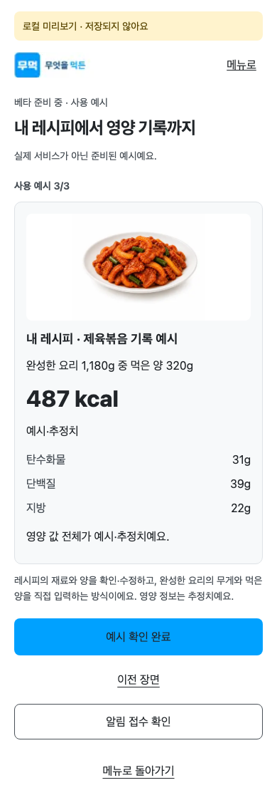
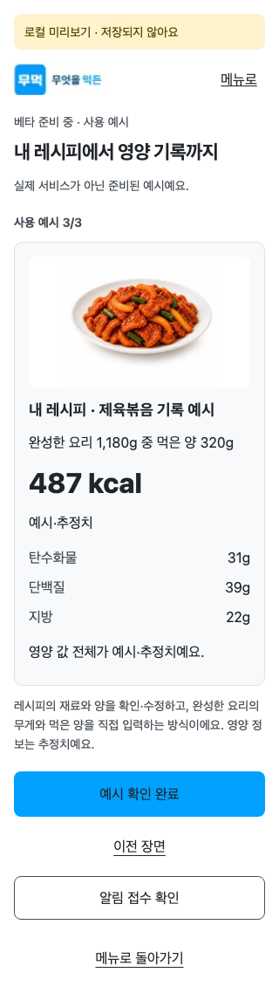
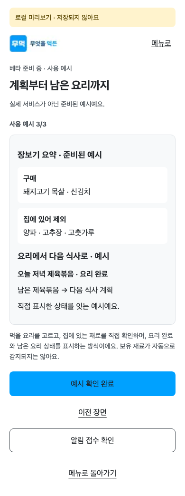
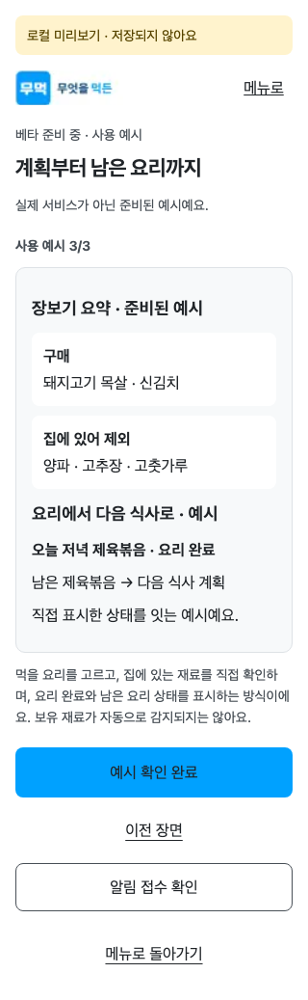

# R2_EXAMPLE — 독립 final authority

- verdict: **pass**
- actor/task: `01a08f0c-bbbb-74b1-ac9b-20feb1ac085f`, product-design-authority
- review_scope: `final_authority_gate` only
- 최종 metadata 검토 head: `1a51971262e758896e725af31f104f42424cff78`; 제품·테스트·harness 변화0 확인.
- 제품/브라우저 head: `62eff252cdd537c9a849caf1881ac490687abac3`; 제품 commit `7bfe0d3b48f771bf5c3fa26421fac54ad6e53e77`
- base: `8c6573bf594fa15613205ce97e4435d751c7d87c`; PR #1555 Draft
- canonical: `R2_RECORDING_EXAMPLE` / `R2_HOMEFLOW_EXAMPLE`
- Stage4 author `01a08e24-2609-77e2-b303-3fb8bd6223e8`, Stage5 reviewer `01a08e8f-6c04-7233-a12c-b256f460e6cb`와 다른 실제 task다.

> evidence:
> - `ui/designs/evidence/marketing-demand-validation-round2/final-authority-01a08f0c/direct/recording-390-EXAMPLE-3-full.png`
> - `ui/designs/evidence/marketing-demand-validation-round2/final-authority-01a08f0c/direct/recording-320-EXAMPLE-3-full.png`
> - `ui/designs/evidence/marketing-demand-validation-round2/final-authority-01a08f0c/direct/homeflow-390-EXAMPLE-3-full.png`
> - `ui/designs/evidence/marketing-demand-validation-round2/final-authority-01a08f0c/direct/homeflow-320-EXAMPLE-3-full.png`

## 화면 판정과 근거

두 주제의 세 장면을 직접 진행했다. 기록은 재료 확인→직접 무게 입력→예시·추정 영양, 관리는 계획→구매/보유 제외→남은 요리 연결로 읽힌다. 장면3/3은 예시 내부 진행이며 전체 참여0/3 압박과 다르다. 명시 예시 확인 완료와 메뉴 복귀가 구분된다.

기본390×844·narrow320×568 직접 캡처는 built-in memory preview이다. RECOVERY는 제공 route-mocked와 실제 API 원자료를 검토했으며 직접 오류 재현은 하지 않았다. 제공 확대자료는 실제 글자200%이며 screenshot 확대가 아니다. 각 근거의 환경 차이는 [통합 보고서](../../../docs/workpacks/marketing-demand-validation-round2/evidence/final-authority/01a08f0c/final-authority-report.md)에 명시한다.

## Scorecard

정성 평가 /5: 5는 매우 명확, 4는 사용 가능한 범위이며 4점을 미해결 결함으로 세지 않는다. 픽셀 일치율/전체 접근성 인증이 아니다.

| 축 | 점수 |
| --- | --- |
| mobile UX | 4/5 |
| interaction clarity | 5/5 |
| visual hierarchy | 4/5 |
| color/material fit | 5/5 |
| familiar app pattern fit | 5/5 |

## Findings / 다음 단계

- blocker 0 / major 0 / minor 0; required_fix_ids: []
- R2 범위 final design gate는 pass. coordinator가 입력 SHA·실제 결과·원문 hash 이력을 보존해 반영하고 Stage6를 별도 작업으로 진행한다.
- 원 Stage5/precheck 보고서를 새 판정으로 덮어 읽지 않는다. [불변 입력과 hash](../../../docs/workpacks/marketing-demand-validation-round2/evidence/final-authority/01a08f0c/input-preservation.json)에 두 버전을 별도 보존했다. 본 보고서는 새 actor의 판정이다.
- 기존 전체 gate의 mobile geometry4·desktop visual10 실패 및 meal-detail 후보PNG 미보존/미분류는 미해결이다. 이 pass는 면제나 Ready/merge 승인으로 쓰지 않는다.
- 실제 provider/메일·실기기/인앱·공개 개인정보 검토·운영 activation은 Manual Only다. confirmed/Stage6/Ready/merge/배포를 이 작업에서 실행하지 않았다.

## 대표 화면

